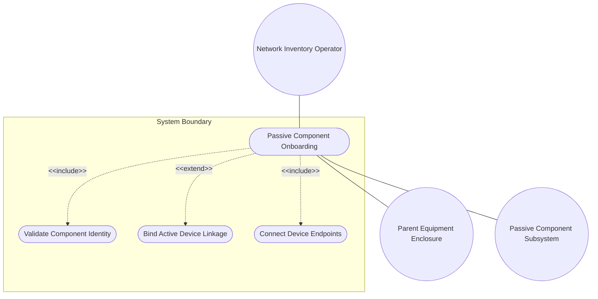
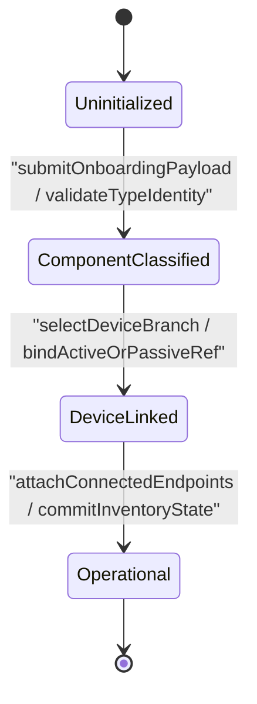

# Use Case: Passive Equipment Component Onboarding, Identity Classification, and Parent Enclosure Linkage

## Parent Epic
- [ ] #77 - [[ietf-nwi-passive-inventory]: Passive Network Inventory Management](https://github.com/gintatkinson/3dgs-037/blob/main/docs/epics/epic-06-ietf-nwi-passive-inventory.md) (Parent Epic defining passive network inventory augmentations)

## 1. Actors
- **Primary Actor:** Network Inventory Operator / Systems Engineer
- **Secondary Actors:** Parent Equipment Enclosure, Passive Component Inventory Subsystem

## 2. Preconditions
- Parent equipment enclosure exists under `/nwi:equipment/nwi:component` with a valid `component-id`.
- The `passive-component` presence container is instantiated to record non-powered physical assets or passive extensions.

## 3. Trigger
Network engineer issues component onboarding payload specifying `passive-component-type` (ODF, WDM, FAT, FDT, or ATB) and selecting the device branch (`passive-device` vs `active-device`).

## 4. Main Success Scenario (Basic Flow)
1. The Network Inventory Operator submits a component onboarding request targeting a parent equipment enclosure with `passive-component` presence container payload.
2. The Passive Component Inventory Subsystem validates the presence of the parent enclosure and verifies that `passive-component-type` matches an allowed identity (`odf`, `wdm`, `fat`, `fdt`, `atb`).
3. The Network Inventory Operator selects the target `device-ref` choice branch:
   - For standalone passive hardware, the operator provides `passive-device` with mandatory `device-type`.
   - For passive extensions embedded in active chassis, the operator provides `active-device` with mandatory `ne-ref` and optional `component-ref`.
4. The Passive Component Inventory Subsystem validates the `device-ref` branch parameters, confirming active network element existence if `active-device` is selected.
5. The Network Inventory Operator attaches endpoint connection references under `connected-device-ref`, mapping `a-end` (`device-name`, `port-ref`) and `z-end` (`device-name`, `port-ref`).
6. The Network Inventory Operator populates spatial location references (`location-ref`) and arbitrary classification tags (`custom-tags`).
7. The Passive Component Inventory Subsystem indexes the passive component under the parent enclosure, commits state changes to the inventory database, and returns an onboarding success acknowledgement.

## 5. Alternate and Exception Flows
- **5a. Missing Parent Equipment Enclosure (Branches from Basic Flow step 1):**
  1. The Passive Component Inventory Subsystem checks the inventory catalog and detects that the specified parent `component-id` does not exist under `/nwi:equipment/nwi:component`.
  2. The system aborts the transaction, returns HTTP 404 / RPC error `"Parent Enclosure Not Found"`, and leaves inventory state unchanged.
- **5b. Absent Passive Component Presence Container (Branches from Basic Flow step 1):**
  1. The Passive Component Inventory Subsystem receives an equipment update payload where the `passive-component` presence container is missing or uninstantiated.
  2. The system treats the component as an unaugmented active equipment component, bypasses passive classification processing, and returns read-only active component state.
- **5c. Invalid Passive Component Type Base Identity (Branches from Basic Flow step 2):**
  1. The Passive Component Inventory Subsystem validates `passive-component-type` against base identity `passive-component-type` and detects an unapproved identity hierarchy reference.
  2. The system aborts component classification, emits validation failure error `"Invalid Base Identity Reference"`, and rolls back transaction state.
- **5d. Unapproved Passive Component Type Enumeration (Branches from Basic Flow step 2):**
  1. The Passive Component Inventory Subsystem parses `passive-component-type` and detects a value outside approved identities (`odf`, `wdm`, `fat`, `fdt`, `atb`).
  2. The system flags validation failure, returns error `"Unsupported passive component type identity"`, and prevents component indexing.
- **5e. Exceeded Passive Component Type Multiplicity Bound (Branches from Basic Flow step 2):**
  1. The Passive Component Inventory Subsystem parses the payload and detects multiple `passive-component-type` leaf definitions violating `[0..1]` multiplicity.
  2. The system rejects the payload for multiplicity overflow, logs schema error, and halts configuration commit.
- **5f. Invalid Passive Component Path Binding (Branches from Basic Flow step 2):**
  1. The Passive Component Inventory Subsystem attempts to instantiate `passive-component` outside `/nwi:equipment/nwi:component/nwi-passive:passive-component`.
  2. The system rejects invalid structural placement, raises path violation error, and aborts schema augment application.
- **5g. Missing Mandatory Device Type in Passive Device Branch (Branches from Basic Flow step 3):**
  1. The Network Inventory Operator selects the `passive-device` choice branch but omits mandatory leaf `device-type`.
  2. The system detects missing mandatory leaf violation, rejects payload, and requests missing parameter completion.
- **5h. Invalid Identity Reference in Passive Device Branch (Branches from Basic Flow step 3):**
  1. The Network Inventory Operator provides a non-matching `device-type` identity in `passive-device` container.
  2. The system rejects mismatched identity reference, aborts branch assignment, and returns identity validation error.
- **5i. Simultaneous Selection of Passive and Active Device Branches (Branches from Basic Flow step 3):**
  1. The Network Inventory Operator submits both `passive-device` and `active-device` containers within `device-ref` choice.
  2. The system enforces YANG choice exclusivity, rejects dual-branch payload, and returns choice conflict error.
- **5j. Missing Mandatory NE-Ref in Active Device Branch (Branches from Basic Flow step 3):**
  1. The Network Inventory Operator selects `active-device` branch but fails to include mandatory `ne-ref` string.
  2. The system rejects transaction, emits error `"Mandatory active-device leaf 'ne-ref' missing"`, and rolls back.
- **5k. Unresolvable Network Element Reference in Active Device Branch (Branches from Basic Flow step 4):**
  1. The system attempts to resolve `ne-ref` against `/nwi:equipment/nwi:network-elements/nwi:network-element/nwi:ne-id` and finds no matching active element.
  2. The system flags reference error, highlights input field with error border styling, and halts cross-element linkage.
- **5l. Unresolvable Component Reference in Active Device Branch (Branches from Basic Flow step 4):**
  1. The system resolves `ne-ref` but fails to locate target `component-ref` within the specified host network element.
  2. The system emits warning `"Host component-ref unresolved"`, reverts `component-ref` mapping, and preserves parent NE link.
- **5m. Invalid Location Reference Target Path (Branches from Basic Flow step 6):**
  1. The Network Inventory Operator sets `location-ref` to an unmapped spatial inventory path.
  2. The system logs reference warning, flags invalid location target, and leaves location reference in unlinked state.
- **5n. Malformed Spatial Location Reference URI (Branches from Basic Flow step 6):**
  1. The Network Inventory Operator submits a syntactically invalid URI string in `location-ref`.
  2. The system rejects URI formatting error, displays validation alert, and prompts for valid location URI input.
- **5o. Invalid String Format in Custom Tags Leaf-List (Branches from Basic Flow step 6):**
  1. The Network Inventory Operator submits non-string or malformed characters inside `custom-tags` array.
  2. The system sanitizes tag payload, rejects invalid tag strings, and notifies operator of tag parsing error.
- **5p. Duplicate Operational Tags in Custom Tags Array (Branches from Basic Flow step 6):**
  1. The Network Inventory Operator passes duplicate string tags within `custom-tags` leaf-list payload.
  2. The system deduplicates tag entries, updates tag pill list, and notifies operator of automatic deduplication.
- **5q. Missing Endpoint Choice Selection in Connected Device List (Branches from Basic Flow step 5):**
  1. The Network Inventory Operator creates a `connected-device-ref` list item without defining either `a-end` or `z-end` choice case.
  2. The system detects missing choice selection, rejects list item creation, and returns choice requirement error.
- **5r. Missing Mandatory Device Name in A-End Endpoint Reference (Branches from Basic Flow step 5):**
  1. The Network Inventory Operator defines an `a-end` container but leaves `device-name` blank.
  2. The system detects mandatory leaf omission, aborts endpoint creation, and returns error `"a-end device-name mandatory"`.
- **5s. Missing Mandatory Device Name in Z-End Endpoint Reference (Branches from Basic Flow step 5):**
  1. The Network Inventory Operator defines a `z-end` container but leaves `device-name` blank.
  2. The system detects mandatory leaf omission, aborts endpoint creation, and returns error `"z-end device-name mandatory"`.
- **5t. Unresolvable Endpoint Port Reference String (Branches from Basic Flow step 5):**
  1. The Network Inventory Operator specifies `port-ref` targeting a non-existent physical port identifier.
  2. The system marks port reference as unverified, displays visual warning badge, and retains endpoint record.
- **5u. Invalid Endpoint Index Keying in Connected Device Ref List (Branches from Basic Flow step 5):**
  1. The Network Inventory Operator submits `connected-device-ref` list with duplicate or non-sequential uint32 `index` keys.
  2. The system re-indexes list items sequentially, commits corrected key indices, and logs auto-indexing notification.
- **5v. CSS Containment Violation on Scrollable Property Grid Panel (Branches from Basic Flow step 7):**
  1. The user interface engine detects `contain: content` or `contain: strict` CSS rules applied to scrollable PropertyGrid panels.
  2. The system overrides containment styles to preserve dynamic list virtualization, logging layout optimization event.
- **5w. Property Grid Icon Render Failure for Selected Passive Device (Branches from Basic Flow step 7):**
  1. PropertyGrid fails to load SVG icon asset corresponding to selected `passive-component-type` (e.g. ODF or FAT icon).
  2. The system falls back to default passive equipment icon, preserving layout integrity and property rendering.
- **5x. UI Input Error Border Highlight Triggered by Validation Rejection (Branches from Basic Flow step 7):**
  1. An invalid payload triggers validation error response from inventory subsystem backend.
  2. The PropertyGrid UI applies red error border (`var(--color-error-border)`), displays alert snippet, and focuses invalid field.

## 6. Postconditions (Guarantees)
- **Success Guarantee:** Passive component is classified and indexed under parent enclosure with verified device branch (`passive-device` or `active-device`), valid spatial location link, operational custom tags, and verified `connected-device-ref` A-end/Z-end endpoints.
- **Failure Guarantee:** System aborts transaction, reverts component classification, emits explicit validation error, and guarantees zero database mutation.

## UML Diagrams
### Use Case Diagram

### State Machine Diagram

## 7. Operational Context
> "Augments network equipment component with passive component classification and connected device reference attributes. Container for passive network component attributes, including device type classification (ODF, WDM, FAT, FDT, ATB), active/passive device reference, connected device end mappings (A-end, Z-end), location references, and custom tags. The model defines non-powered physical components across optical distribution networks including Central Offices / Hubs (ODF, WDM), feeder/distribution cabinets (FDT, FAT), and subscriber indoor outlets (ATB)."
>
> -- *draft-ygb-ivy-passive-network-inventory & ietf-nwi-passive-inventory.yang (Section 5 / Section 6.1)*

## 8. Realization Matrix
### Required User Stories
- [ ] #78 - [[ietf-nwi-passive-inventory]: Passive Component Identity Classification, Component Augment Initialization, and Parent Equipment Linkage](https://github.com/gintatkinson/3dgs-037/blob/main/docs/user-stories/us-28-passive-component-classification.md) (validates passive component onboarding, identity classification, and parent enclosure linkage)

### Required Features
- [ ] #73 - [[ietf-nwi-passive-inventory: Passive Component Classification & Extension Augment]](https://github.com/gintatkinson/3dgs-037/blob/main/docs/features/feat-21-passive-component-extension.md) (realizes passive component classification schema, device branch choices, and connected-device references)

## Source References
Structural Schema: https://github.com/aguoietf/draft-ygb-ivy-passive-network-inventory/blob/main/yang/ietf-nwi-passive-inventory.yang
Normative Specification: https://datatracker.ietf.org/doc/draft-ygb-ivy-passive-network-inventory/
