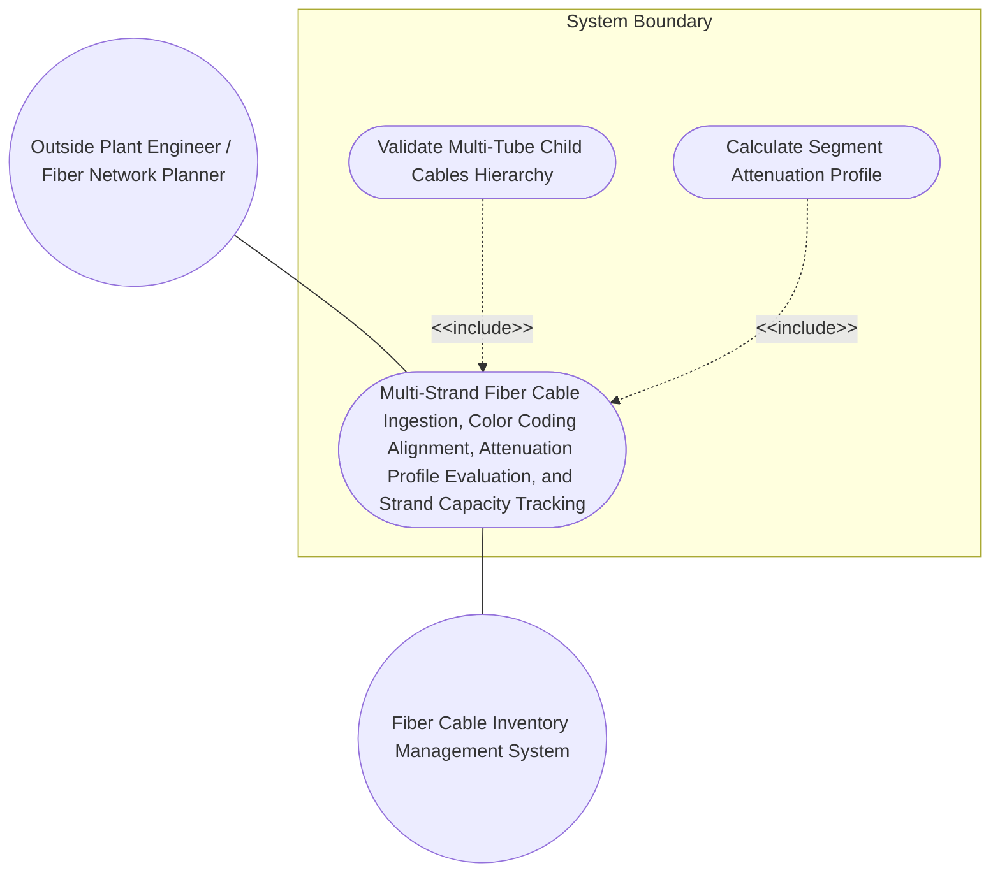
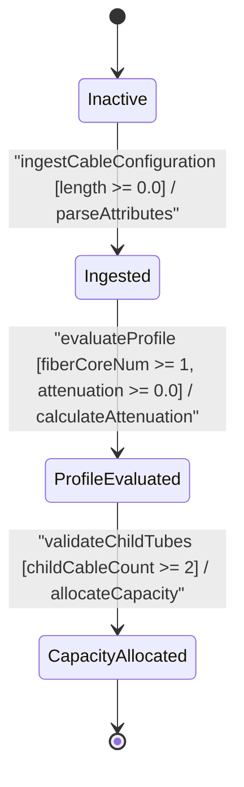

# Use Case: Multi-Strand Fiber Cable Ingestion, Color Coding Alignment, Attenuation Profile Evaluation, and Strand Capacity Tracking

## Parent Epic
- [ ] #77 - [[ietf-nwi-passive-inventory]: Passive Network Inventory Management](https://github.com/gintatkinson/3dgs-037/blob/main/docs/epics/epic-06-ietf-nwi-passive-inventory.md) (Parent Epic defining passive network inventory augmentations)

## 1. Actors
- **Primary Actor:** Outside Plant Engineer / Fiber Network Planner
- **Secondary Actors:** Fiber Cable Inventory Management System

## 2. Preconditions
- Passive component container exists under `/nwi:equipment/nwi:component/passive-component` and `fiber-cable` container is ready for ingestion.
- The inventory system is initialized with supported international optical fiber standards (`G652A`, `G652B`, `G652C`, `G652D`, `G653`, `G654`, `G655`, `G656`, `G657A1`, `G657A2`, `G657B`, `other`) and valid cable roles (`backbone`, `aggregation`, `access`, `trunk`, `distribution`, `branch`).

## 3. Trigger
Operator ingests multi-strand optical cable configuration with core counts, fiber standards (G.652 to G.657), attenuation coefficients (dB/km), and multi-tube `child-cables` hierarchy.

## 4. Main Success Scenario (Basic Flow)
1. Outside Plant Engineer submits an optical fiber cable ingestion payload containing length, cable role, fiber core count, fiber type standard, attenuation coefficient, and multi-tube child cable configuration.
2. Fiber Cable Inventory Management System validates the base physical properties (`length >= 0.0`, valid `cable-type` and `cable-role`).
3. System validates the optical cable attributes (`fiber-core-num >= 1`, valid optical fiber standard derived from `fiber-type` base identity, and `attenuation >= 0.0` dB/km).
4. System validates the multi-tube `child-cables` hierarchy, verifying that when `child-cables` is instantiated, the `child-cable` list contains at least 2 tube elements (`min-elements 2`).
5. System aligns the strand color-coding schema across individual tubes and strands, calculating total segment attenuation (`length * attenuation / 1000`).
6. System allocates strand capacity, catalogs the fiber cable and child tube records under `/nwi:equipment/nwi:component/passive-component/fiber-cable`, and sets state to `CapacityAllocated`.

## 5. Alternate and Exception Flows
- **5a. Single Child Cable min-elements Violation (Branches from Basic Flow step 4):**
  1. System detects that `child-cables` container is present but contains only 1 `child-cable` element (`index` 1).
  2. System rejects the payload, triggers a `min-elements 2` validation error alert (`"child-cables list requires at least 2 child-cable elements"`), aborts cable ingestion, and retains state in `Inactive`.
- **5b. Empty Child Cable Bundle Violation (Branches from Basic Flow step 4):**
  1. System encounters an empty `child-cables` container with 0 constituent `child-cable` list entries.
  2. System flags a `min-elements 2` constraint violation, prevents child tube initialization, rolls back composite structural allocation, and alerts the Outside Plant Engineer.
- **5c. Invalid Core Count Less Than 1 (Branches from Basic Flow step 3):**
  1. System detects that `fiber-core-num` is set to 0 or a negative integer.
  2. System rejects the payload, flags a `fiber-core-num >= 1` constraint violation, aborts strand allocation, and emits an invalid optical core count alert to the Outside Plant Engineer.
- **5d. Core Count Exceeding Capacity Bound (Branches from Basic Flow step 3):**
  1. System detects that `fiber-core-num` exceeds the maximum allowed physical core capacity limit for the target cable sheath.
  2. System halts parameter processing, rejects the excessive core allocation payload, and retains state in `Ingested`.
- **5e. Unrecognized Fiber Standard Identity (Branches from Basic Flow step 3):**
  1. System encounters an unverified `fiber-type` identity string that does not derive from base identity `fiber-type`.
  2. System halts optical profile evaluation, logs an unrecognized fiber specification error, rolls back transient attributes, and prompts the engineer for a valid international optical standard.
- **5f. Incompatible Fiber Type for Backbone Role (Branches from Basic Flow step 3):**
  1. System detects `fiber-type` set to an unsupported specification (`G652A`) for a `backbone` network `cable-role`.
  2. System rejects the operational profile combination, emits a role-compatibility warning, and aborts strand capacity assignment.
- **5g. Incompatible Fiber Type for Distribution Role (Branches from Basic Flow step 3):**
  1. System detects `fiber-type` set to `G652B` for a high-density `distribution` cable deployment.
  2. System flags an optical standard incompatibility, cancels profile validation, and rolls back allocated strand metadata.
- **5h. Non-Standard Fiber Type for Sub-Tube Assembly (Branches from Basic Flow step 4):**
  1. System detects a child sub-cable tube with `fiber-type` set to `G652C` while parent cable specifies `G652D`.
  2. System flags a sub-tube media mismatch error, aborts child cable structure validation, and notifies the Outside Plant Engineer.
- **5i. Restricted Dispersion-Shifted Fiber Identity (Branches from Basic Flow step 3):**
  1. System detects `fiber-type` set to `G653` (Dispersion-Shifted Fiber) in an amplified DWDM distribution context.
  2. System flags a fiber dispersion policy restriction, aborts transmission profile evaluation, and emits a configuration alert.
- **5j. Submarine Cut-Off Shifted Fiber Restriction (Branches from Basic Flow step 3):**
  1. System receives `fiber-type` set to `G654` for a terrestrial distribution cable assignment.
  2. System rejects the specialized media identity, cancels cable ingestion, and returns to `Inactive` state.
- **5k. Non-Zero Dispersion-Shifted Fiber Policy Violation (Branches from Basic Flow step 3):**
  1. System encounters `fiber-type` set to `G655` (NZDSF) for a passive access network feeder.
  2. System flags a network role policy mismatch, halts capacity cataloging, and alerts the operator.
- **5l. Wideband NZDSF Fiber Standard Exception (Branches from Basic Flow step 3):**
  1. System encounters `fiber-type` set to `G656` in an unsupported regional link segment.
  2. System aborts optical attribute assignment, logs a standard policy exception, and rolls back state.
- **5m. Extreme Bend Radius Violation for Sub-Cable (Branches from Basic Flow step 4):**
  1. System detects `fiber-type` set to `G657B` with incompatible mechanical bend radius specs inside a rigid child tube.
  2. System flags a physical installation constraint violation, aborts sub-tube structure validation, and notifies the engineer.
- **5n. Attenuation Coefficient Negative Out-of-Bounds (Branches from Basic Flow step 3):**
  1. System detects a negative `attenuation` coefficient (e.g., `-0.15` dB/km).
  2. System flags an optical attenuation parameter violation (`attenuation >= 0.0`), cancels link loss calculation, and emits a parameter out-of-bounds alert.
- **5o. Attenuation Coefficient Excessive Loss Bound (Branches from Basic Flow step 3):**
  1. System receives an `attenuation` coefficient exceeding maximum threshold (e.g., `> 5.0` dB/km).
  2. System flags excessive optical loss anomaly, halts transmission calculation, and requests attenuation coefficient re-measurement.
- **5p. Negative Segment Length Violation (Branches from Basic Flow step 2):**
  1. System detects a physical `length` attribute less than `0.0` meters.
  2. System aborts common attribute parsing, rejects the ingestion payload, and notifies the Outside Plant Engineer of the invalid physical segment length.
- **5q. Invalid Cable Media Type Identity (Branches from Basic Flow step 2):**
  1. System receives a non-optical `cable-type` identity (e.g., `electrical-cable`) for a `fiber-cable` container.
  2. System flags a media classification type conflict, aborts common attribute validation, and returns state to `Inactive`.

## 6. Postconditions (Guarantees)
- **Success Guarantee:** Fiber cable and strand capacity are cataloged with verified attenuation profiles and multi-tube hierarchy under `/nwi:equipment/nwi:component/passive-component/fiber-cable`.
- **Failure Guarantee:** System aborts cable ingestion, rolls back allocated strands, and emits constraint violation alert.

## UML Diagrams
### Use Case Diagram


### State Machine Diagram


## 7. Operational Context
```text
   The fiber-cable container models physical optical transmission media, strand allocations, color-coding standards, physical lengths, cable roles, and optical transmission parameters within the passive component equipment model (/nwi:equipment/nwi:component/passive-component/fiber-cable).

   Outside plant feeder and distribution cable infrastructure utilizes multi-strand loose-tube fiber cables. Each cable segment defines common physical attributes (length in meters, cable media type, and operational network role such as backbone, aggregation, access, trunk, distribution, or branch) and optical-specific parameters (fiber core count, international optical fiber standard identity such as G.652.D or G.657.A1/A2, and optical attenuation coefficient in dB/km).

   For composite multi-tube cables, the child-cables container specifies constituent sub-cable tubes indexed sequentially with mandatory structural integrity constraints (min-elements 2). Optical attenuation budgeting calculates cumulative loss across physical segment lengths, enabling precise capacity tracking and color-coded strand management across passive optical distribution networks.
```

## 8. Realization Matrix
### Required User Stories
- [ ] #79 - [[ietf-nwi-passive-inventory]: Fiber Cable Ingestion, Strand Count Allocation, Strand Color Code Schema Validation, and Attenuation Coefficient Calculation](https://github.com/gintatkinson/3dgs-037/blob/main/docs/user-stories/us-29-fiber-cable-and-strand-inventory.md) (validates fiber cable ingestion, strand count allocation, and attenuation calculation)

### Required Features
- [ ] #74 - [[ietf-nwi-passive-inventory: Fiber Cable & Strand Inventory Augment]](https://github.com/gintatkinson/3dgs-037/blob/main/docs/features/feat-22-fiber-cable-inventory.md) (realizes fiber cable container, core counts, fiber standards G.652 to G.657, attenuation dB/km, and child-cables hierarchy)

## Source References
Structural Schema: https://github.com/aguoietf/draft-ygb-ivy-passive-network-inventory/blob/main/yang/ietf-nwi-passive-inventory.yang
Normative Specification: https://datatracker.ietf.org/doc/draft-ygb-ivy-passive-network-inventory/
