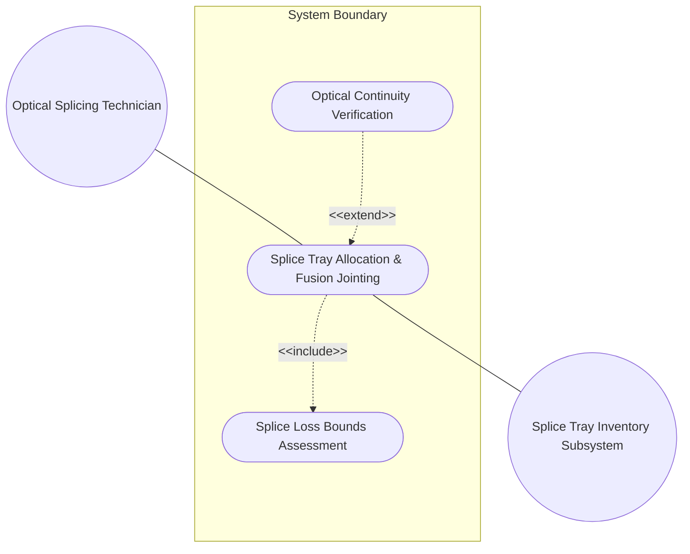
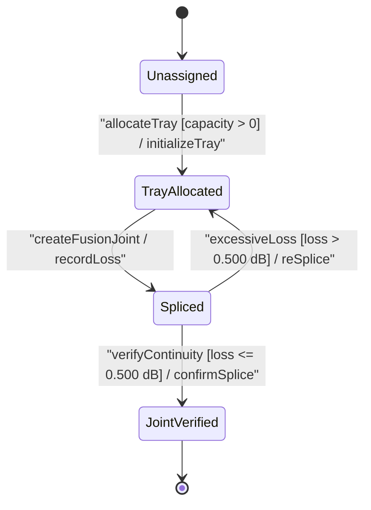

# Use Case: Splice Tray Allocation, Fusion Splice Jointing, Splice Loss Boundary Assessment, and Optical Continuity Verification

## Parent Epic
- [ ] #77 - [[ietf-nwi-passive-inventory]: Passive Network Inventory Management](https://github.com/gintatkinson/3dgs-037/blob/main/docs/epics/epic-06-ietf-nwi-passive-inventory.md) (Parent Epic defining passive network inventory augmentations)

## 1. Actors
- **Primary Actor:** Optical Splicing Technician / OSP Maintenance Engineer
- **Secondary Actors:** Splice Tray Inventory Subsystem

## 2. Preconditions
- Passive component contains `splice-tray` container initialized with tray capacity and splice count bounds.
- Incoming and outgoing optical fiber strands are routed into the passive component enclosure and ready for fusion jointing.

## 3. Trigger
Splicing technician registers fusion joint between incoming and outgoing fiber strands, recording splice loss in dB.

## 4. Main Success Scenario (Basic Flow)
1. Optical Splicing Technician requests splice tray allocation within the passive component enclosure.
2. Splice Tray Inventory Subsystem retrieves target `splice-tray` container and computes available tray capacity based on current `splice-count` and `tray-capacity`.
3. Technician aligns incoming and outgoing optical fiber strands within the allocated splice tray slot.
4. Technician selects the fusion splice type identity (`heat-shrink-splice`, `mechanical-splice`, or `ribbon-splice`) for the joint.
5. Technician performs fusion jointing and inputs the measured splice loss in decibels (dB) into the `fusion-joint` record.
6. Splice Tray Inventory Subsystem evaluates fusion joint loss against operational attenuation thresholds (0.000 to 5.000 dB schema limits, flagging warning if > 0.500 dB).
7. Splice Tray Inventory Subsystem increments active `splice-count`, validates count against `tray-capacity` limit, and registers the `fusion-joint` entry.
8. Technician conducts end-to-end optical continuity verification across the spliced circuit.

## 5. Alternate and Exception Flows
- **5a. Tray Identifier String Type Validation Failure (Branches from Basic Flow step 1):**
  1. System detects non-string value supplied for `tray-identifier`.
  2. System rejects request, logs schema type error, and prompts user for string input.
- **5b. Tray Identifier Missing Mandatory Key Leaf Failure (Branches from Basic Flow step 1):**
  1. System detects missing mandatory `tray-identifier` key leaf during tray creation.
  2. System aborts tray creation, flags mandatory leaf constraint failure, and returns to step 1.
- **5c. Tray Identifier Minimum Length Constraint Failure (Branches from Basic Flow step 1):**
  1. System detects `tray-identifier` length less than 1 character (empty string).
  2. System rejects input, displays length validation error, and prompts for valid identifier.
- **5d. Tray Identifier Maximum Length Constraint Failure (Branches from Basic Flow step 1):**
  1. System detects `tray-identifier` length exceeding 64 characters.
  2. System rejects input, flags string length overflow, and prompts for identifier <= 64 characters.
- **5e. Tray Identifier Character Pattern Mismatch Failure (Branches from Basic Flow step 1):**
  1. System detects `tray-identifier` containing invalid characters violating pattern `^[a-zA-Z0-9_-]+$`.
  2. System rejects input, highlights pattern error, and prompts for alphanumeric string with hyphens/underscores.
- **5f. Splice Count Integer Type Validation Failure (Branches from Basic Flow step 2):**
  1. System detects non-integer value supplied for `splice-count`.
  2. System rejects update, logs type error, and prompts for uint16 integer input.
- **5g. Splice Count Range Lower Bound Violation (Branches from Basic Flow step 2):**
  1. System detects `splice-count` input less than 0 (negative integer).
  2. System rejects update, flags uint16 lower bound error, and restores prior count.
- **5h. Splice Count Range Upper Bound Violation (Branches from Basic Flow step 2):**
  1. System detects `splice-count` input exceeding uint16 max value (65535).
  2. System rejects update, flags uint16 integer overflow, and prompts for valid range [0..65535].
- **5i. Splice Count Exceeding Tray Capacity Overflow (Branches from Basic Flow step 2):**
  1. System detects `splice-count` exceeding configured `tray-capacity` (e.g., count 28 > capacity 24).
  2. System rejects update, displays inline error `"Splice count cannot exceed tray capacity"`, and highlights field with error border.
- **5j. Tray Capacity Integer Type Validation Failure (Branches from Basic Flow step 2):**
  1. System detects non-integer value supplied for `tray-capacity`.
  2. System rejects configuration, logs type mismatch, and prompts for valid uint16 integer.
- **5k. Tray Capacity Range Lower Bound Violation (Branches from Basic Flow step 2):**
  1. System detects `tray-capacity` input less than 1 (zero or negative).
  2. System rejects configuration, flags range error [1..65535], and retains prior capacity setting.
- **5l. Tray Capacity Range Upper Bound Violation (Branches from Basic Flow step 2):**
  1. System detects `tray-capacity` input exceeding 65535.
  2. System rejects configuration, flags uint16 overflow, and prompts for valid capacity bound.
- **5m. Non-Standard Industry Tray Capacity Warning (Branches from Basic Flow step 2):**
  1. System detects `tray-capacity` set to non-standard value (not 12, 24, 48, 96, 144).
  2. System accepts capacity value, issues informational non-standard capacity notice, and proceeds to step 3.
- **5n. Fusion Joint Missing Mandatory Key Joint Identifier (Branches from Basic Flow step 5):**
  1. System detects missing `joint-id` key leaf during fusion joint creation.
  2. System rejects joint creation, flags missing key constraint, and returns to step 4.
- **5o. Joint Identifier String Type Validation Failure (Branches from Basic Flow step 5):**
  1. System detects non-string value for `joint-id`.
  2. System rejects joint entry, logs type mismatch, and prompts technician for valid string ID.
- **5p. Joint Identifier Duplicate Key Within Tray Conflict (Branches from Basic Flow step 5):**
  1. System detects existing `joint-id` matching proposed ID within the same splice tray.
  2. System rejects entry creation, flags duplicate key conflict, and prompts for unique `joint-id`.
- **5q. Splice Loss Decimal64 Type Validation Failure (Branches from Basic Flow step 5):**
  1. System detects non-numeric value for `splice-loss`.
  2. System rejects loss recording, logs decimal64 type mismatch, and prompts for numeric dB input.
- **5r. Splice Loss Fraction-Digits Precision Constraint Failure (Branches from Basic Flow step 5):**
  1. System detects `splice-loss` provided with more than 3 decimal fraction digits (e.g. 0.0245 dB).
  2. System rounds measurement to 3 decimal fraction digits (0.025 dB), logs precision notice, and proceeds to step 6.
- **5s. Splice Loss Range Lower Bound Violation (Branches from Basic Flow step 5):**
  1. System detects `splice-loss` value less than 0.000 dB (negative insertion loss).
  2. System rejects loss measurement, flags negative loss error, and prompts for non-negative measurement.
- **5t. Splice Loss Range Upper Bound Violation (Branches from Basic Flow step 6):**
  1. System detects `splice-loss` measurement exceeding 5.000 dB schema upper bound.
  2. System rejects joint payload, flags schema ceiling breach, and displays error highlight border.
- **5u. Splice Loss Operational Attenuation Warning Threshold Exceeded (Branches from Basic Flow step 6):**
  1. System detects `splice-loss` measurement between 0.500 dB and 5.000 dB (e.g. 0.750 dB).
  2. System accepts record, flags joint with attenuation warning badge (`splice-loss > 0.500 dB`), and notifies technician.
- **5v. Fusion Type Identityref Base Type Mismatch (Branches from Basic Flow step 4):**
  1. System detects `fusion-type` reference not derived from base identity `fusion-type`.
  2. System rejects identity assignment, flags base identity mismatch error, and prompts for valid fusion type identity.
- **5w. Fusion Type Unrecognized Identity String Resolution Failure (Branches from Basic Flow step 4):**
  1. System detects unrecognized identity string for `fusion-type` (not `heat-shrink-splice`, `mechanical-splice`, or `ribbon-splice`).
  2. System rejects selection, displays dropdown selection validation error, and returns to step 4.

## 6. Postconditions (Guarantees)
- **Success Guarantee:** Fusion splice joint is recorded in splice tray with verified loss boundary and updated splice count.
- **Failure Guarantee:** System rejects splice joint registration, rolls back splice tray state, and leaves existing optical circuit intact.

## UML Diagrams

### Use Case Diagram


### State Machine Diagram


## 7. Operational Context
```text
container splice-tray {
  description
    "Defines the optical fiber splice tray and fusion joint connection
     attributes within a passive optical component.";
  leaf tray-identifier {
    type string;
    description
      "Unique identifier for the optical splice tray within the passive component.";
  }
  leaf splice-count {
    type uint16;
    description
      "The current number of active splices contained in the tray.";
  }
  leaf tray-capacity {
    type uint16;
    description
      "The maximum splice capacity of the tray (e.g. 12, 24, 48, 96).";
  }
  list fusion-joint {
    key "joint-id";
    description
      "List of individual optical fusion joints inside the splice tray.";
    leaf joint-id {
      type string;
      description
        "Unique identifier for the fusion joint.";
    }
    leaf splice-loss {
      type decimal64 {
        fraction-digits 3;
      }
      units "dB";
      description
        "Measured optical insertion loss across the fusion joint in decibels.";
    }
    leaf fusion-type {
      type identityref {
        base fusion-type;
      }
      description
        "The technological classification of the optical fusion joint (e.g., heat-shrink, mechanical, ribbon).";
    }
  }
}
```

## 8. Realization Matrix

### Required User Stories
- [ ] #80 - [[ietf-nwi-passive-inventory]: Splice Tray Capacity Management, Fiber Strand Fusion Splicing Joint Creation, and Splice Loss Bounds Evaluation](https://github.com/gintatkinson/3dgs-037/blob/main/docs/user-stories/us-30-splice-tray-and-fusion-jointing.md) (validates splice tray capacity management and fusion joint loss evaluation)

### Required Features
- [ ] #75 - [[ietf-nwi-passive-inventory: Splice Tray & Fusion Joint Connection Augment]](https://github.com/gintatkinson/3dgs-037/blob/main/docs/features/feat-23-splice-tray-connection.md) (realizes splice-tray container, tray capacities, splice count tracking, and fusion joint loss dB)

## Source References
Structural Schema: https://github.com/aguoietf/draft-ygb-ivy-passive-network-inventory/blob/main/yang/ietf-nwi-passive-inventory.yang
Normative Specification: https://datatracker.ietf.org/doc/draft-ygb-ivy-passive-network-inventory/
