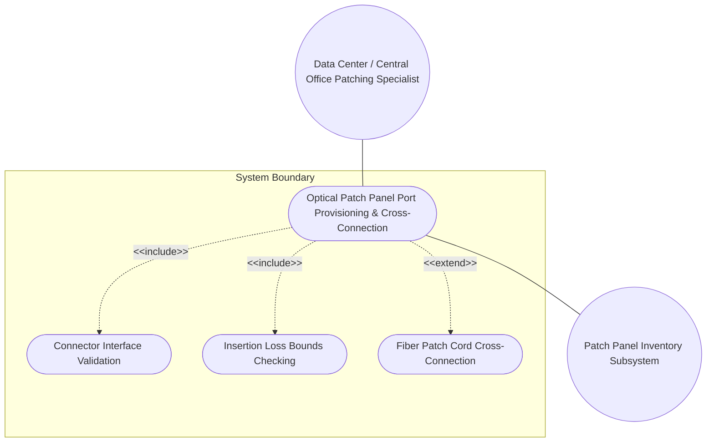
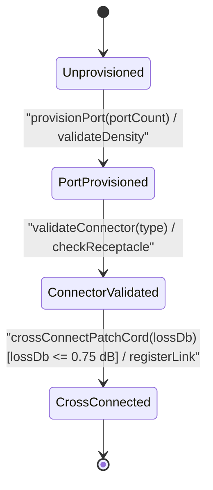

# Use Case: Optical Patch Panel Port Provisioning, Connector Interface Validation (LC/SC/MPO), Insertion Loss Bounds Checking, and Fiber Patch Cord Cross-Connection

## Parent Epic
- [ ] #77 - [[ietf-nwi-passive-inventory]: Passive Network Inventory Management](https://github.com/gintatkinson/3dgs-037/blob/main/docs/epics/epic-06-ietf-nwi-passive-inventory.md) (Parent Epic defining passive network inventory augmentations)

## 1. Actors
- **Primary Actor:** Data Center / Central Office Patching Specialist
- **Secondary Actors:** Patch Panel Inventory Subsystem

## 2. Preconditions
- `patch-panel` container is present under `/nwi:equipment/nwi:component/passive-component`.
- The physical network equipment chassis and component bay for the optical patch panel are instantiated in the network inventory system.

## 3. Trigger
Specialist provisions optical patch panel ports, specifying connector types (LC, SC, FC, ST, MPO, E2000), insertion loss values, and cross-connect patch cord links.

## 4. Main Success Scenario (Basic Flow)
1. Data Center / Central Office Patching Specialist selects the target network equipment component and initiates optical patch panel port provisioning.
2. Patch Panel Inventory Subsystem verifies the physical port count density (1 to 65535) against chassis port capacity limits.
3. Specialist specifies optical connector interface classification (LC, SC, FC, ST, MPO, E2000, LC-APC, SC-APC).
4. Subsystem performs optical insertion loss bounds checking (0.00 to 0.75 dB nominal operational threshold, up to 10.00 dB schema upper limit).
5. Specialist classifies passive port operational roles (service-port, input-port, output-port, p2mp-port) and assigns fiber core counts.
6. Subsystem validates port index assignment to ensure no duplicate port IDs exist within the patch panel inventory.
7. Specialist establishes fiber patch cord cross-connection linking ingress and egress passive ports.
8. Subsystem registers the cross-connect link, updates port operational state to cross-connected, and commits the patch panel inventory record.

## 5. Alternate and Exception Flows
- **5a. Missing Patch-Panel Presence Container Failure (Branches from Basic Flow step 1):**
  1. Patch Panel Inventory Subsystem detects missing `patch-panel` presence container under `/nwi:equipment/nwi:component/nwi-passive:passive-component`.
  2. Subsystem aborts optical patch panel port provisioning, flags missing container schema error, and preserves unprovisioned component state.
- **5b. Invalid Port-Count Range Lower Bound Failure (Branches from Basic Flow step 2):**
  1. Specialist enters `port-count` value less than 1 (e.g., 0 or negative integer).
  2. Subsystem rejects `port-count` update, flags uint16 lower bound range violation (`1..65535`), and retains prior port density setting.
- **5c. Invalid Port-Count Range Upper Bound Failure (Branches from Basic Flow step 2):**
  1. Specialist submits `port-count` value exceeding 65535 (e.g., 70000).
  2. Subsystem rejects input, flags uint16 upper bound range overflow (`1..65535`), and prompts specialist for valid port count.
- **5d. Missing Mandatory Port-Count Leaf Failure (Branches from Basic Flow step 2):**
  1. Subsystem detects missing mandatory `port-count` leaf during patch panel initialization.
  2. Subsystem aborts container provisioning, flags mandatory leaf constraint failure, and returns to step 1.
- **5e. Invalid Connector-Type Identity Format Failure (Branches from Basic Flow step 3):**
  1. Specialist specifies unrecognized string or malformed identity for `connector-type` (e.g., `"INVALID_CONN"`).
  2. Subsystem rejects specification, flags invalid identityref error, and prompts for valid connector identity.
- **5f. Unsupported Connector-Type Identity Base Mismatch (Branches from Basic Flow step 3):**
  1. Specialist specifies an identityref identity not derived from the `connector-type` base identity.
  2. Subsystem rejects connector setting, flags base identity derivation mismatch error, and returns to step 3.
- **5g. Missing Optional Connector-Type Identity Handling (Branches from Basic Flow step 3):**
  1. Specialist omits optional `connector-type` leaf during custom patch panel configuration.
  2. Subsystem sets `connector-type` to unassigned null state, issues informational notice, and proceeds to step 4.
- **5h. Insertion-Loss Range Lower Bound Violation (Branches from Basic Flow step 4):**
  1. Specialist inputs `insertion-loss` value less than 0.0 dB (e.g., -0.5 dB).
  2. Subsystem rejects insertion loss entry, flags decimal64 range lower bound error (`0.0..10.0`), and restores previous loss value.
- **5i. Insertion-Loss Range Upper Bound Violation (Branches from Basic Flow step 4):**
  1. Specialist inputs `insertion-loss` value exceeding 10.0 dB (e.g., 12.5 dB).
  2. Subsystem rejects insertion loss entry, flags decimal64 range upper bound error (`0.0..10.0`), and displays validation error border.
- **5j. Insertion-Loss Fraction Digits Precision Violation (Branches from Basic Flow step 4):**
  1. Specialist submits `insertion-loss` with more than 2 fraction digits (e.g., 0.354 dB).
  2. Subsystem rounds measurement to 2 fraction digits (0.35 dB), logs precision adjustment notice, and proceeds to step 5.
- **5k. Missing Passive-Device-Ports Container Handling (Branches from Basic Flow step 5):**
  1. Subsystem detects missing `passive-device-ports` container when querying port inventory.
  2. Subsystem initializes empty `passive-device-ports` container structure, logs missing container initialization, and proceeds to step 5.
- **5l. Duplicate Passive-Port List Key Collision (Branches from Basic Flow step 6):**
  1. Subsystem identifies a proposed `port-id` (e.g., "port-01") that collides with an existing list key in `passive-port`.
  2. Subsystem rejects list insertion, flags duplicate list key error, and returns to step 5 for unique port ID entry.
- **5m. Invalid Port-ID String Length Below Minimum (Branches from Basic Flow step 5):**
  1. Specialist submits an empty string ("") for `port-id`.
  2. Subsystem rejects input, flags string length lower bound violation (`1..64` characters), and prompts for valid port ID.
- **5n. Invalid Port-ID String Length Exceeding Maximum (Branches from Basic Flow step 5):**
  1. Specialist submits a `port-id` exceeding 64 characters in length.
  2. Subsystem rejects input, flags string length upper bound violation (`1..64` characters), and prompts for truncated port ID.
- **5o. Missing Mandatory Port-ID Key Leaf Failure (Branches from Basic Flow step 5):**
  1. Subsystem detects missing mandatory `port-id` key leaf during `passive-port` entry creation.
  2. Subsystem aborts port entry creation, flags missing mandatory key constraint failure, and returns to step 5.
- **5p. Invalid Port-Type Identityref Format Failure (Branches from Basic Flow step 5):**
  1. Specialist supplies an unresolvable or malformed identityref value for `port-type`.
  2. Subsystem rejects port type assignment, flags identityref resolution error, and prompts for valid port classification.
- **5q. Missing Mandatory Port-Type Leaf Failure (Branches from Basic Flow step 5):**
  1. Specialist omits mandatory `port-type` leaf during `passive-port` record creation.
  2. Subsystem rejects port record commit, flags missing mandatory leaf constraint failure, and returns to step 5.
- **5r. Unknown Port-Type Identity Base Derivation Failure (Branches from Basic Flow step 5):**
  1. Specialist assigns an identity not derived from the `passive-port-type` base identity.
  2. Subsystem rejects classification, flags identity inheritance hierarchy error, and returns to step 5.
- **5s. Fiber-Core-Num Range Lower Bound Violation (Branches from Basic Flow step 5):**
  1. Specialist enters `fiber-core-num` less than 1 (e.g., 0).
  2. Subsystem rejects assignment, flags uint16 range lower bound error (`1..144`), and prompts for valid core count.
- **5t. Fiber-Core-Num Range Upper Bound Violation (Branches from Basic Flow step 5):**
  1. Specialist enters `fiber-core-num` exceeding 144 (e.g., 288).
  2. Subsystem rejects assignment, flags uint16 range upper bound error (`1..144`), and prompts for core count <= 144.
- **5u. Fiber-Core-Num Exceeds Available Cable Capacity (Branches from Basic Flow step 5):**
  1. Subsystem detects requested `fiber-core-num` (e.g., 24 cores) exceeds connected optical cable capacity (e.g., 12 cores).
  2. Subsystem flags cable capacity overload exception, aborts port assignment, and returns to step 5.
- **5v. BEM Class Scoping Violation Handling (Branches from Basic Flow step 3):**
  1. Subsystem UI renderer detects invalid non-scoped CSS class override targeting `.patch-panel__header`.
  2. Subsystem UI component falls back to BEM scoped styling rules, logs class scoping warning, and renders view safely.
- **5w. CSS Containment Parameter Violation Handling (Branches from Basic Flow step 3):**
  1. UI Layout Subsystem detects `contain: content` or `contain: strict` applied to scrollable child panel element.
  2. Subsystem overrides CSS containment to `contain: layout style`, restores dynamic list virtualization, and logs layout violation.
- **5x. PropertyGrid Binding Error in properties_view (Branches from Basic Flow step 3):**
  1. PropertyGrid component fails to bind `patch-panel` schema parameters in `properties_view` container.
  2. Subsystem triggers PropertyGrid fallback renderer, logs component binding exception, and retains read-only view state.
- **5y. TableView Sorting Column Binding Failure in elements_view (Branches from Basic Flow step 6):**
  1. TableView component encounters column key mismatch when binding `passive-port` list in `elements_view`.
  2. Subsystem re-initializes TableView column definitions, logs sorting binding failure, and refreshes port list display.
- **5z. Empty State Rendering Error Recovery (Branches from Basic Flow step 5):**
  1. Subsystem encounters zero `passive-port` records and empty state placeholder rendering fails.
  2. Subsystem renders default fallback text `"No Passive Ports Configured"` with action button, clearing corrupted view state.
- **5aa. Loading State Skeleton Row Timeout (Branches from Basic Flow step 1):**
  1. Asynchronous inventory query exceeds time limit while rendering TableView skeleton loading rows.
  2. Subsystem cancels pending query, replaces skeleton rows with query timeout alert, and offers retry prompt.
- **5bb. Error State Red Border Highlight Rendering Fallback (Branches from Basic Flow step 4):**
  1. Validation engine fails to apply CSS variable `var(--color-error-border)` upon insertion loss validation failure.
  2. Subsystem applies fallback inline red border style (`#d32f2f`), logs theme variable resolution error, and highlights invalid input.
- **5cc. Insertion Loss Edit State Validation Failure (Branches from Basic Flow step 4):**
  1. Specialist submits edited insertion loss value during active edit state that fails schema constraints.
  2. Subsystem blocks form submission, locks edit form controls, displays validation error message, and retains edit state.
- **5dd. Duplicate Port-ID Edit State Submission Error (Branches from Basic Flow step 6):**
  1. Specialist attempts to commit duplicate `port-id` value while editing existing port records in TableView.
  2. Subsystem rejects edit submission, highlights colliding TableView row in red, and preserves prior port ID.
- **5ee. Unhandled Passive-Port List Mutation Exception (Branches from Basic Flow step 8):**
  1. Subsystem encounters unhandled state exception during concurrent list mutation of `passive-port` entries.
  2. Subsystem rolls back list mutation transaction, restores previous consistent inventory state, and logs unhandled exception.

## 6. Postconditions (Guarantees)
- **Success Guarantee:** Optical patch panel port is provisioned, connector loss is verified, and patch cord cross-connection is registered.
- **Failure Guarantee:** System rejects port provisioning, revokes cross-connect request, and preserves existing port mapping.

## UML Diagrams
### Use Case Diagram


### State Machine Diagram


## 7. Operational Context
```text
augment "/nwi:equipment/nwi:component/nwi-passive:passive-component" {
  description
    "Augments passive component with patch panel inventory attributes.";
  container patch-panel {
    description
      "Attributes specific to optical patch panels and interconnect bays.";
    leaf port-count {
      type uint16;
      description
        "Total number of physical optical ports on the patch panel.";
    }
    leaf connector-type {
      type identityref {
        base connector-type;
      }
      description
        "Standard optical connector interface identity (e.g., LC, SC, MPO).";
    }
    leaf insertion-loss {
      type decimal64 {
        fraction-digits 2;
        range "0.0 .. 10.0";
      }
      units "dB";
      description
        "Maximum insertion loss per connection across the patch panel in decibels.";
    }
    container passive-device-ports {
      description
        "Enclosing container for passive device port instances.";
      list passive-port {
        key "port-id";
        description
          "List of passive ports residing on the patch panel.";
        leaf port-id {
          type string;
          description
            "Unique identifier for the passive port.";
        }
        leaf port-type {
          type identityref {
            base passive-port-type;
          }
          description
            "Functional port type identity (service-port, input-port, output-port, p2mp-port).";
        }
        leaf fiber-core-num {
          type uint16;
          description
            "Number of optical fiber cores terminated or routed through this port.";
        }
      }
    }
  }
}
```

## 8. Realization Matrix
### Required User Stories
- [ ] #81 - [[ietf-nwi-passive-inventory]: Optical Patch Panel Port Provisioning, Connector Type Validation (LC/SC/MPO), Insertion Loss Limits, and Fiber Patch Cord Cross-Connection](https://github.com/gintatkinson/3dgs-037/blob/main/docs/user-stories/us-31-patch-panel-connector-cross-connect.md) (validates optical patch panel port provisioning and connector loss tracking)

### Required Features
- [ ] #76 - [[ietf-nwi-passive-inventory: Connector & Patch Panel Inventory Augment]](https://github.com/gintatkinson/3dgs-037/blob/main/docs/features/feat-24-connector-patch-panel.md) (realizes patch-panel container, port count, connector types, insertion loss dB, and passive port classifications)

## Source References
Structural Schema: https://github.com/aguoietf/draft-ygb-ivy-passive-network-inventory/blob/main/yang/ietf-nwi-passive-inventory.yang
Normative Specification: https://datatracker.ietf.org/doc/draft-ygb-ivy-passive-network-inventory/
