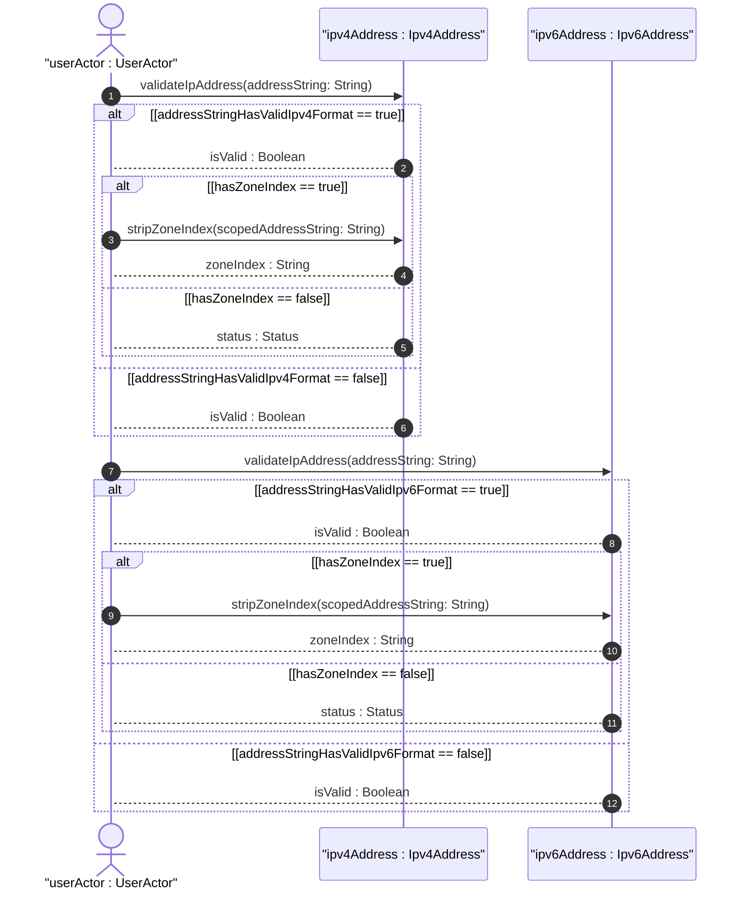
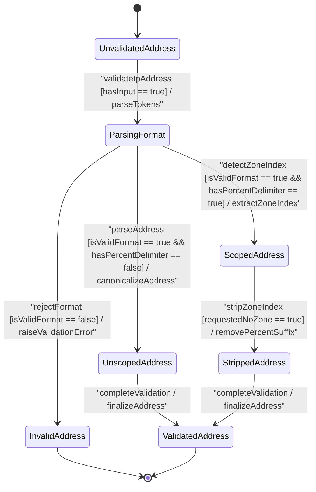

# User Story: [ietf-inet-types]: IPv4 and IPv6 Address Format Validation, Zone Index Parsing, and Hex Normalization

## Parent Epic
- [ ] #24 - [ietf-inet-types: Common Internet Data Types](https://github.com/gintatkinson/3dgs-037/blob/main/docs/epics/epic-02-ietf-inet-types.md) (Parent Epic specification)

## Domain Object Mapping
- **Primary Domain Objects:** `Ipv4Address`, `Ipv6Address`, `IpAddress`, `IpAddressNoZone`, `Ipv4AddressNoZone`, `Ipv6AddressNoZone`
- **Actor/Role:** `userActor : UserActor`

## BDD Scenario (OOA/OOD Realization)

### Scenario 1: Validation and Zone Index Extraction for IPv4 Scoped Address
**Given** an IPv4 address string with a zone identifier `"169.254.1.1%eth0"`
**When** `validateIpAddress(addressString: String)` is invoked on `Ipv4Address`
**Then** format validation returns `isValid : Boolean` as `true` and extracts `zoneIndex : String` as `"eth0"`.

### Scenario 2: Stripping Zone Index from Scoped IPv4 Address
**Given** a valid scoped IPv4 address string `"169.254.1.1%eth0"`
**When** `stripZoneIndex(scopedAddressString: String)` is invoked on `Ipv4Address`
**Then** the percent-delimited zone index is removed, returning `unscopedAddress : String` as `"169.254.1.1"`.

### Scenario 3: Rejection of Disallowed Zone Index on `Ipv4AddressNoZone`
**Given** an IPv4 address string containing a zone index `"169.254.1.1%eth0"` target for `Ipv4AddressNoZone`
**When** `validateIpAddress(addressString: String)` is invoked on `Ipv4AddressNoZone`
**Then** validation fails with `isValid : Boolean` as `false` due to the presence of the percent delimiter.

### Scenario 4: Validation, Zone Index Parsing, and Hex Normalization for IPv6 Scoped Address
**Given** a scoped IPv6 address string `"fe80::1ff:fe23:4567:890a%eth0"`
**When** `validateIpAddress(addressString: String)` is invoked on `Ipv6Address`
**Then** format validation returns `isValid : Boolean` as `true`, extracts `zoneIndex : String` as `"eth0"`, and normalizes canonical zero-compression and hex character formatting.

### Scenario 5: Stripping Zone Index from Scoped IPv6 Address
**Given** a valid scoped IPv6 address string `"fe80::1ff:fe23:4567:890a%eth0"`
**When** `stripZoneIndex(scopedAddressString: String)` is invoked on `Ipv6Address`
**Then** the percent-delimited zone index is removed, returning `unscopedAddress : String` as `"fe80::1ff:fe23:4567:890a"`.

## UML Sequence Diagram

## UML State Machine Diagram

## Operational Context
> "The ipv4-address type represents an IPv4 address in dotted-quad notation. The IPv4 address may include a zone index, separated by a % sign. The zone index is used to disambiguate identical address values. For link-local addresses, the zone index will typically be the interface index number or the name of an interface. If the zone index is not present, the default zone of the device will be used. The canonical format for the zone index is the numerical format."
> — RFC 6021 Section 3 / ietf-inet-types@2013-07-15.yang

> "The ipv6-address type represents an IPv6 address in full, mixed, shortened, and shortened-mixed notation. The IPv6 address may include a zone index, separated by a % sign. The zone index is used to disambiguate identical address values. For link-local addresses, the zone index will typically be the interface index number or the name of an interface. If the zone index is not present, the default zone of the device will be used. The canonical format of IPv6 addresses uses the textual representation defined in Section 4 of RFC 5952. The canonical format for the zone index is the numerical format as described in Section 11.2 of RFC 4007."
> — RFC 6021 Section 3 / ietf-inet-types@2013-07-15.yang

## Required Features Matrix
- [ ] #20 - [ietf-inet-types: IP Address Data Types](https://github.com/gintatkinson/3dgs-037/blob/main/docs/features/feat-05-ip-address-types.md) (Validates IPv4/v6 address format rules, zone index percent-delimiter extraction, and no-zone restriction enforcement)

## Source References
Structural Schema: https://github.com/YangModels/yang/blob/main/standard/ietf/RFC/ietf-inet-types%402013-07-15.yang
Normative Specification: https://datatracker.ietf.org/doc/rfc6021/
