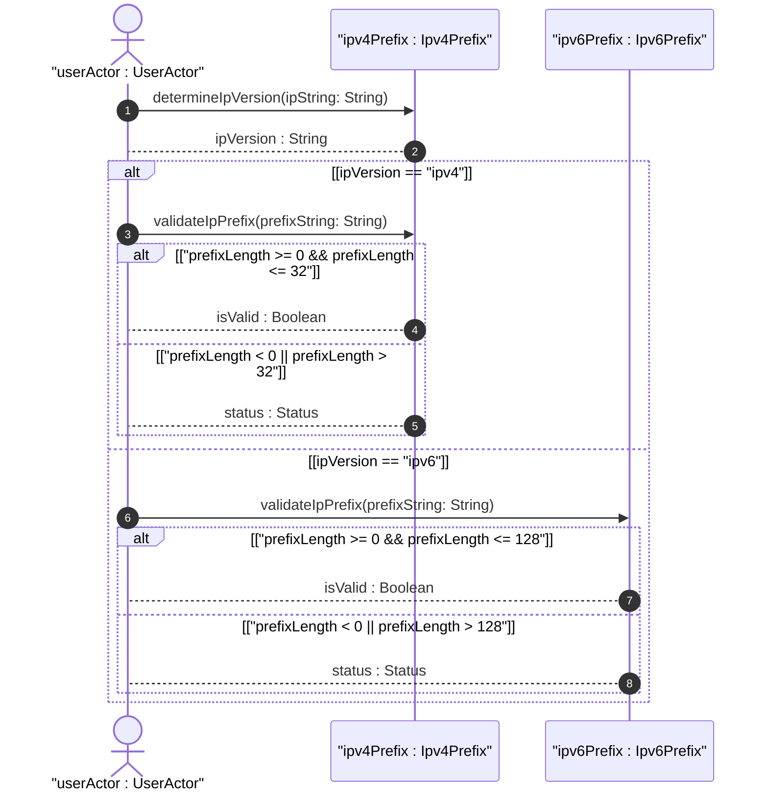
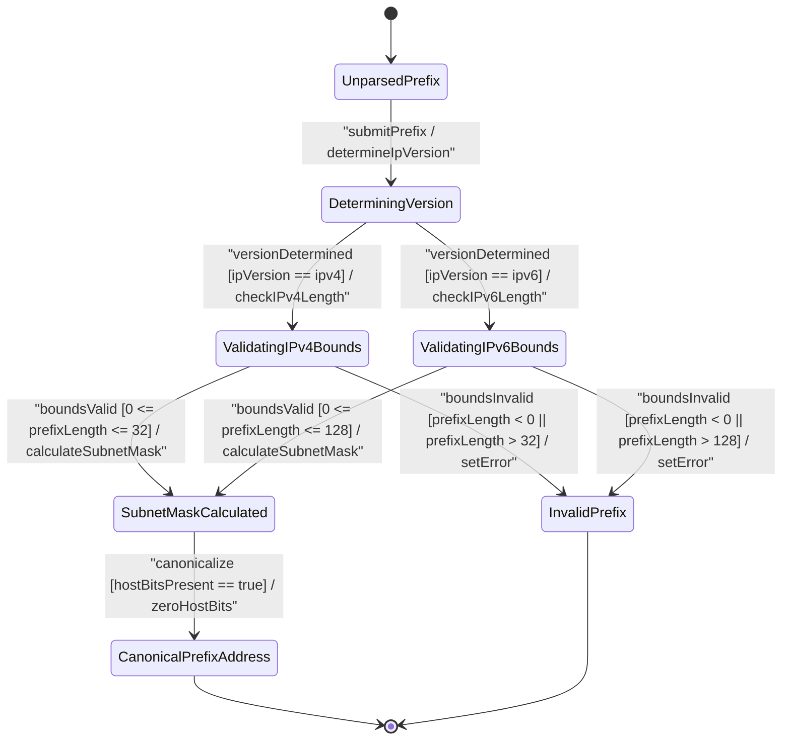

# User Story: [ietf-inet-types]: IPv4 and IPv6 Prefix Notation Parsing, Subnet Mask Calculation, and Prefix-Length Bound Enforcement

## Parent Epic
- [ ] #24 - [ietf-inet-types: Common Internet Data Types](https://github.com/gintatkinson/3dgs-037/blob/main/docs/epics/epic-02-ietf-inet-types.md) (Validates prefix length boundaries, subnet mask derivations, and canonical network address formatting across IPv4 and IPv6 address families)

## Domain Object Mapping
- **Primary Domain Objects:** `IpPrefix`, `Ipv4Prefix`, `Ipv6Prefix`, `IpVersion`
- **Actor/Role:** `userActor : UserActor`

## BDD Scenario (OOA/OOD Realization)
**Given** an unparsed IP prefix string in CIDR notation (IPv4 or IPv6)
**When** `userActor` submits `prefixString` to `ipv4Prefix` or `ipv6Prefix` for validation and subnet mask calculation
**Then** `ipv4Prefix` or `ipv6Prefix` validates prefix length bounds (0..32 for IPv4, 0..128 for IPv6), determines the IP version, calculates the subnet mask bitmask from the prefix length, and zeroes out host bits to canonicalize the network prefix address.

## UML Sequence Diagram


## UML State Machine Diagram


## Operational Context
> "The ip-prefix type represents an IP prefix and is IP version-neutral. The format of the ip-prefix string is identical to the format of the ipv4-prefix or ipv6-prefix string."
> — RFC 6021 Section 3 (`ip-prefix`)

> "The ipv4-prefix type represents an IPv4 prefix. The normalized format is an IPv4 address (dotted-quad notation) followed by a slash ('/') and a decimal number between 0 and 32 that specifies the number of significant bits."
> — RFC 6021 Section 3 (`ipv4-prefix`)

> "The ipv6-prefix type represents an IPv6 prefix. The normalized format is an IPv6 address (hexadecimal colon-separated notation) followed by a slash ('/') and a decimal number between 0 and 128 that specifies the number of significant bits."
> — RFC 6021 Section 3 (`ipv6-prefix`)

## Required Features Matrix
- [ ] #20 - [ietf-inet-types: IP Address Data Types](https://github.com/gintatkinson/3dgs-037/blob/main/docs/features/feat-05-ip-address-types.md) (Validates IPv4/v6 prefix length bounds 0..32 and 0..128, subnet mask MSB calculation, and zero-host-bits canonicalization)

## Source References
Structural Schema: https://github.com/YangModels/yang/blob/main/standard/ietf/RFC/ietf-inet-types%402013-07-15.yang
Normative Specification: https://datatracker.ietf.org/doc/rfc6021/

> [!WARNING]
> **Mermaid Block Closing Constraints & Code Fence Integrity:**
> - Every Mermaid diagram MUST be strictly closed with ```` ``` ```` on a new line. Leaking Mermaid blocks or stray/unclosed code fences will fail downstream validation checks.
> - Ensure there are no stray backticks or unmatched code fences in the document.
> - **All Mermaid syntax constraints are defined in `rules/platform-independence.md` and MUST be observed in full** — including the prohibition on semicolons in `Note` and message text, colons in class members and note strings, stereotypes on relationship lines, and curly braces in class member lines.
