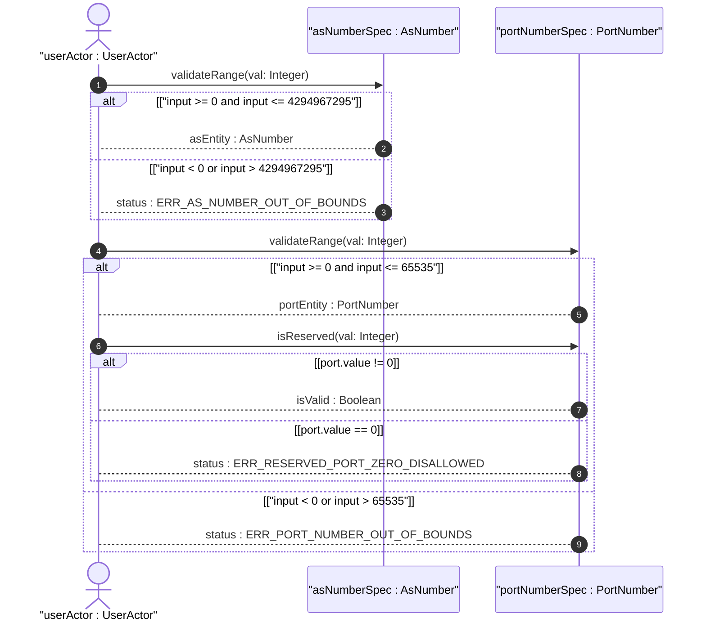
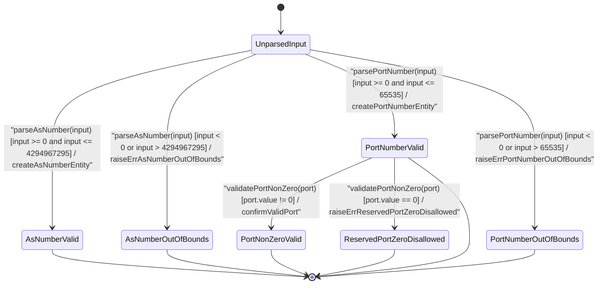

# User Story: [ietf-inet-types]: Autonomous System (AS) Number 2-Byte / 4-Byte Notation Parsing, AS Plain Conversions, and TCP/UDP Port Range Bounds (0..65535)

## Parent Epic
- [ ] #24 - [ietf-inet-types: Common Internet Data Types](https://github.com/gintatkinson/3dgs-037/blob/main/docs/epics/epic-02-ietf-inet-types.md) (Validates Autonomous System number notation conversions and TCP/UDP transport port range boundaries 0..65535)

## Domain Object Mapping
- **Primary Domain Objects:** `AsNumber`, `PortNumber`, `AutonomousSystemAndPortContainer`
- **Actor/Role:** `userActor : UserActor`

## BDD Scenario (OOA/OOD Realization)

### Scenario 1: Autonomous System (AS) Number Parsing and 32-Bit Unsigned Integer Range Validation
**Given** an AS number input provided as a 2-byte, 4-byte, or plain numeric string representation (e.g. `64512` or `4294967295`)  
**When** the `userActor` invokes `parseAsNumber(input: Any)` on `asNumberSpec`  
**Then** the input is parsed into an `AsNumber` entity and verified to fall within the inclusive 32-bit unsigned range `0..4294967295`.

### Scenario 2: Autonomous System (AS) Out-of-Bounds Exception
**Given** an AS number input outside the 32-bit unsigned integer range (e.g. `-1` or `4294967296`)  
**When** the `userActor` invokes `parseAsNumber(input: Any)` on `asNumberSpec`  
**Then** range validation fails and returns `status : ERR_AS_NUMBER_OUT_OF_BOUNDS`.

### Scenario 3: Transport Port Number Range Bounds Validation (0..65535)
**Given** a transport protocol port number input at boundary or standard values (e.g. `0`, `80`, `443`, or `65535`)  
**When** the `userActor` invokes `parsePortNumber(input: Any)` on `portNumberSpec`  
**Then** the input is parsed into a `PortNumber` entity and verified to fall within the inclusive 16-bit range `0..65535`.

### Scenario 4: Transport Port Out-of-Bounds Exception
**Given** a port number input outside the 16-bit unsigned integer range (e.g. `-1` or `65536`)  
**When** the `userActor` invokes `parsePortNumber(input: Any)` on `portNumberSpec`  
**Then** range validation fails and returns `status : ERR_PORT_NUMBER_OUT_OF_BOUNDS`.

### Scenario 5: Non-Zero Transport Port Subtyping Constraint Validation
**Given** a `PortNumber` instance evaluated in a context where reserved port zero is disallowed  
**When** the `userActor` invokes `validatePortNonZero(port: PortNumber)` on `portNumberSpec`  
**Then** if the port value is `0`, validation fails returning `status : ERR_RESERVED_PORT_ZERO_DISALLOWED`; otherwise returns `isValid : Boolean`.

## UML Sequence Diagram


## UML State Machine Diagram


## Operational Context
```
   typedef port-number {
     type uint16 {
       range "0..65535";
     }
     description
      "The port-number type represents a 16-bit port number of an
       Internet transport-layer protocol such as UDP, TCP, DCCP, or
       SCTP.  Port numbers are assigned by IANA.  A current list of
       all assignments is available from <http://www.iana.org/>.

       Note that the port number value zero is reserved by IANA.  In
       situations where the value zero does not make sense, it can
       be excluded by subtyping the port-number type.
       In the value set and its semantics, this type is equivalent
       to the InetPortNumber textual convention of the SMIv2.";
     reference
      "RFC  768: User Datagram Protocol
       RFC  793: Transmission Control Protocol
       RFC 4960: Stream Control Transmission Protocol
       RFC 4340: Datagram Congestion Control Protocol (DCCP)
       RFC 4001: Textual Conventions for Internet Network Addresses";
   }

   typedef as-number {
     type uint32;
     description
      "The as-number type represents autonomous system numbers
       which identify an Autonomous System (AS).  An AS is a set
       of routers under a single technical administration, using
       an interior gateway protocol and common metrics to route
       packets within the AS, and using an exterior gateway
       protocol to route packets to other ASes.  IANA maintains
       the AS number space and has delegated large parts to the
       regional registries.

       Autonomous system numbers were originally limited to 16
       bits.  BGP extensions have enlarged the autonomous system
       number space to 32 bits.  This type therefore uses an uint32
       base type without a range restriction in order to support
       a larger autonomous system number space.

       In the value set and its semantics, this type is equivalent
       to the InetAutonomousSystemNumber textual convention of
       the SMIv2.";
     reference
      "RFC 1930: Guidelines for creation, selection, and registration
                 of an Autonomous System (AS)
       RFC 4271: A Border Gateway Protocol 4 (BGP-4)
       RFC 4001: Textual Conventions for Internet Network Addresses
       RFC 6793: BGP Support for Four-Octet Autonomous System (AS)
                 Number Space";
   }
```

## Required Features Matrix
- [ ] #22 - [ietf-inet-types: Autonomous System and Port Number Data Types](https://github.com/gintatkinson/3dgs-037/blob/main/docs/features/feat-07-autonomous-system-and-port-types.md) (Validates 32-bit AS number range bounds 0..4294967295, 16-bit transport port bounds 0..65535, and subtyped non-zero port constraints)

## Source References
Structural Schema: https://github.com/YangModels/yang/blob/main/standard/ietf/RFC/ietf-inet-types%402013-07-15.yang
Normative Specification: https://datatracker.ietf.org/doc/rfc6021/
