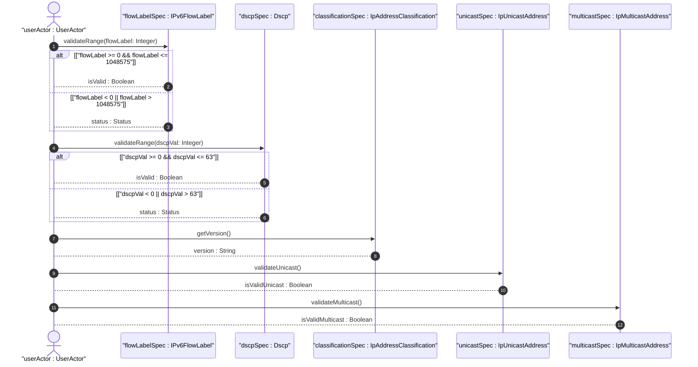
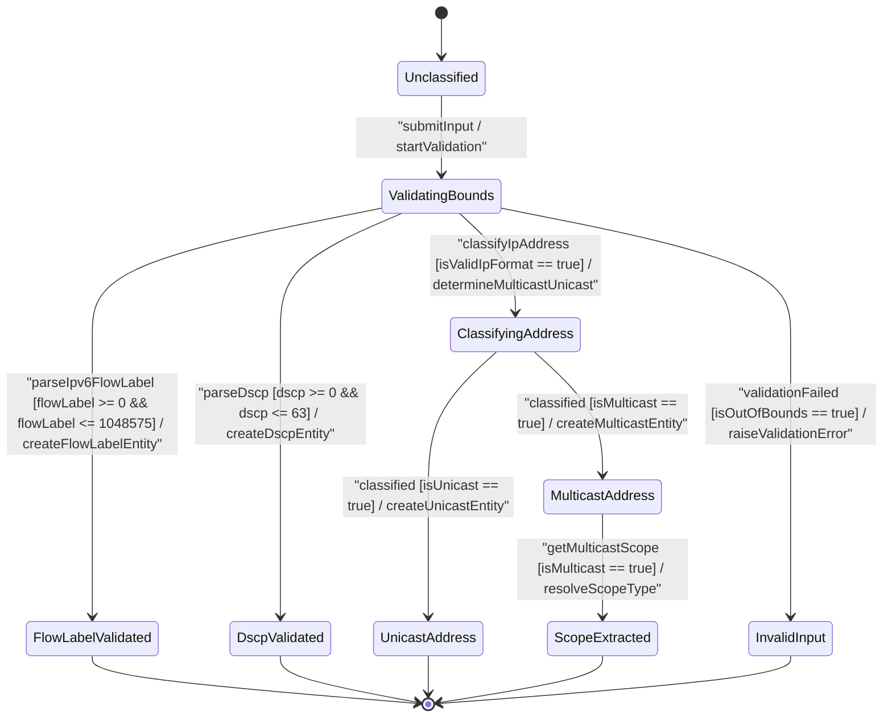

# User Story: [ietf-inet-types]: IP Unicast vs Multicast Address Classification, IPv6 Flow Label Generation, and DSCP Code Point Validation

## Parent Epic
- [ ] #24 - [ietf-inet-types: Common Internet Data Types](https://github.com/gintatkinson/3dgs-037/blob/main/docs/epics/epic-02-ietf-inet-types.md) (Parent Epic specification for common Internet data types)

## Compliance Table
| Verification Rule | Compliance Status | Rationale |
| --- | --- | --- |
| Lifeline Aliasing | Compliant | Lifelines explicitly aliased using `actor userActor as "userActor : UserActor"`, `participant flowLabelSpec as "flowLabelSpec : IPv6FlowLabel"`, `participant dscpSpec as "dscpSpec : Dscp"`, `participant classificationSpec as "classificationSpec : IpAddressClassification"`, `participant unicastSpec as "unicastSpec : IpUnicastAddress"`, and `participant multicastSpec as "multicastSpec : IpMulticastAddress"` |
| Open Return Arrows | Compliant | Return messages strictly use open arrowheads (`-->`) without closed arrowheads |
| Return Value Signatures | Compliant | Return messages represent assignment signatures (`isValid : Boolean`, `version : String`, `isValidUnicast : Boolean`, `isValidMulticast : Boolean`, `status : Status`) |
| BDD Scenarios | Compliant | Formatted with explicit Given-When-Then criteria matching OOA/OOD realization |

## Domain Object Mapping
- **Primary Domain Objects:** `IPv6FlowLabel`, `Dscp`, `IpAddressClassification`, `IpUnicastAddress`, `IpMulticastAddress`, `IpScopeType`
- **Actor/Role:** `userActor : UserActor`

## BDD Scenario (OOA/OOD Realization)
**Given** an IP classifier service initialized with `ietf-inet-types` validation schema rules
**When** a user submits an IPv6 flow label, DSCP code point, or IP address string for classification and validation
**Then** IPv6 flow labels in range `0..1048575` MUST be parsed into `IPv6FlowLabel` entities while out-of-bounds values MUST raise `ERR_IPV6_FLOW_LABEL_OUT_OF_BOUNDS`
**And** DSCP code points in range `0..63` MUST be parsed into `Dscp` entities while out-of-bounds values MUST raise `ERR_DSCP_OUT_OF_BOUNDS`
**And** IP address strings MUST be classified into `IpUnicastAddress` or `IpMulticastAddress` types based on prefix matching (`224.0.0.0/4` for IPv4 multicast, `ff00::/8` for IPv6 multicast)
**And** IPv6 multicast addresses MUST allow extraction of their architectural `IpScopeType` (e.g., `link-local` scope code 2 for `ff02::1`).

## UML Sequence Diagram


## UML State Machine Diagram


## Operational Context
> "The flow-label type represents flow identifier or Flow Label in an IPv6 packet header that may be used to discriminate traffic flows. In the value set and its semantics, this type is equivalent to the IPv6FlowLabel textual convention of the SMIv2."
> -- RFC 6021 Section 3 / `ietf-inet-types@2013-07-15.yang`
>
> "The dscp type represents a Differentiated Services Code-Point that may be used for marking packets in a traffic stream. In the value set and its semantics, this type is equivalent to the Dscp textual convention of the SMIv2."
> -- RFC 6021 Section 3 / `ietf-inet-types@2013-07-15.yang`
>
> "The ip-unicast-address type represents an IP unicast address. The ip-multicast-address type represents an IP multicast address."
> -- RFC 6021 Section 3 / `ietf-inet-types@2013-07-15.yang`

## Required Features Matrix
- [ ] #23 - [ietf-inet-types: IP Unicast, Multicast, and Scope Data Types](https://github.com/gintatkinson/3dgs-037/blob/main/docs/features/feat-08-ip-unicast-multicast-and-scope-types.md) (Validates 20-bit IPv6 flow label range 0..1048575, 6-bit DSCP range 0..63, IP unicast vs multicast address classification, and multicast scope extraction)

## Source References
Structural Schema: https://github.com/YangModels/yang/blob/main/standard/ietf/RFC/ietf-inet-types%402013-07-15.yang
Normative Specification: https://datatracker.ietf.org/doc/rfc6021/

> [!WARNING]
> **Mermaid Block Closing Constraints & Code Fence Integrity:**
> - Every Mermaid diagram MUST be strictly closed with ```` ``` ```` on a new line. Leaking Mermaid blocks (e.g. having headings like `##` inside an unclosed diagram) or stray/unclosed code fences will fail downstream validation checks.
> - Ensure there are no stray backticks or unmatched code fences in the document.
> - **All Mermaid syntax constraints are defined in `rules/platform-independence.md` and MUST be observed in full** — including the prohibition on semicolons in `Note` and message text, colons in class members and note strings, stereotypes on relationship lines, and curly braces in class member lines.
