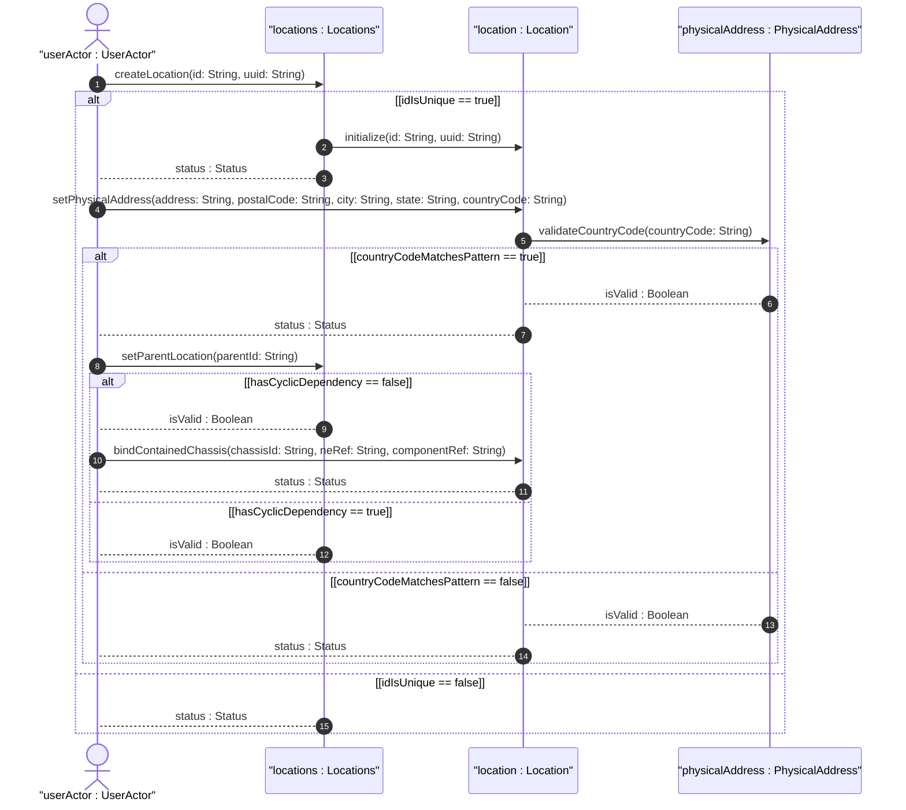
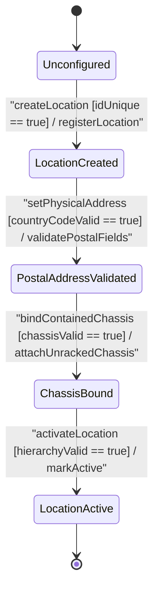

# User Story: [ietf-ni-location]: Facility Location Creation, Unique Identifier Generation, and Postal Address Formatting/Validation

## Parent Epic
- [ ] #51 - [[ietf-ni-location]: Network Inventory Location Management](https://github.com/gintatkinson/3dgs-037/blob/main/docs/epics/epic-04-ietf-ni-location.md) (Parent Epic for facility location management and network inventory placement)

## Domain Object Mapping
- **Primary Domain Objects:** `Locations`, `Location`, `PhysicalAddress`, `ContainedChassis`
- **Actor/Role:** `userActor : UserActor`

## BDD Scenario (OOA/OOD Realization)

### Scenario 1: Facility Location Creation and UUID Canonicalization
**Given** an initialized `Locations` registry  
**When** `createLocation(id: String, uuid: String)` is invoked by `UserActor` with a unique string `id` and optional canonical `uuid`  
**Then** a new `Location` entity is created, registered in `Locations`, and returns `status : Status` indicating successful onboarding.

### Scenario 2: Postal Address Validation and ISO 3166-1 Alpha-2 Pattern Match
**Given** an existing `Location` instance in `LocationCreated` state  
**When** `setPhysicalAddress(address: String, postalCode: String, city: String, state: String, countryCode: String)` is executed with `countryCode` matching pattern `'[A-Z]{2}'`  
**Then** `PhysicalAddress` validates all text fields, confirms ISO country code compliance, and returns `isValid : Boolean` as true.

### Scenario 3: Hierarchical Parent Location Reference and Cycle Prevention
**Given** two distinct `Location` instances (parent and child) registered in `Locations`  
**When** `setParentLocation(parentId: String)` is invoked for the child location  
**Then** `Locations` verifies that `parentId` exists, confirms no cyclic dependency path exists between parent and child, sets the leafref, and returns `isValid : Boolean` as true.

### Scenario 4: Direct Un-Racked Chassis Inventory Binding
**Given** a valid active `Location` entity in `PostalAddressValidated` state  
**When** `bindContainedChassis(chassisId: String, neRef: String, componentRef: String)` is called for an un-racked chassis  
**Then** `ContainedChassis` entry is instantiated and appended to the location's `contained-chassis` list, returning `status : Status` as active.

## UML Sequence Diagram

## UML State Machine Diagram

## Operational Context
> "The network inventory location module defines top-level locations container containing a list of location entries. Each location entry is uniquely identified by a string id, with optional UUID canonicalization for global uniqueness tracking. Locations can form hierarchical structures via parent location leafrefs, where a child location references its parent location entry. A physical address container within a location specifies postal address details including street address, postal code, city, state, and an ISO 3166-1 alpha-2 two-character uppercase country code matched against the regex pattern '[A-Z]{2}'. Un-racked network equipment stored at a facility location is represented via a contained-chassis list linking individual chassis instances by chassis-id, network element reference (ne-ref), and component reference (component-ref)."

## Required Features Matrix
- [ ] #47 - [[ietf-ni-location: Location Inventory Base and Postal Address]](https://github.com/gintatkinson/3dgs-037/blob/main/docs/features/feat-13-location-inventory-base-and-postal-address.md) (Provides base location list, id/uuid metadata, parent hierarchy, postal address container, and contained chassis specifications)
- [ ] #48 - [[ietf-ni-location: Building and Floor Position Specs]](https://github.com/gintatkinson/3dgs-037/blob/main/docs/features/feat-14-building-and-floor-position-specs.md) (Provides physical address fields including country-code ISO pattern validation and indoor building structure)

## Source References
Structural Schema: https://github.com/ietf-ivy-wg/network-inventory-location/blob/main/ietf-ni-location.yang
Normative Specification: https://datatracker.ietf.org/doc/html/draft-ietf-ivy-network-inventory-location
