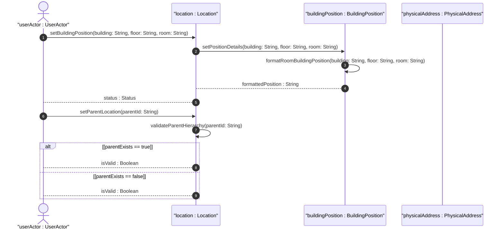
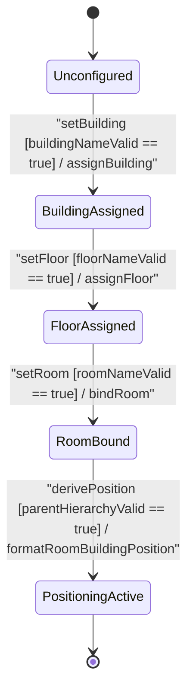

# User Story: [ietf-ni-location]: Building, Floor, and Room Spatial Hierarchy Navigation, Room Name Assignment, and Physical Access Bounds

## Parent Epic
- [ ] #51 - [[ietf-ni-location]: Network Inventory Location Management](https://github.com/gintatkinson/3dgs-037/blob/main/docs/epics/epic-04-ietf-ni-location.md) (Parent Epic for facility location management and network inventory placement)

## Domain Object Mapping
- **Primary Domain Objects:** `Location`, `PhysicalAddress`, `BuildingPosition`
- **Actor/Role:** `userActor : UserActor`

## BDD Scenario (OOA/OOD Realization)

### Scenario 1: Indoor building, floor, and room attribute specification
**Given** an existing `Location` instance in `Unconfigured` state  
**When** `setBuildingPosition(building: String, floor: String, room: String)` is invoked by `UserActor` with valid string parameters  
**Then** `BuildingPosition` sets the indoor attributes (`building`, `floor`, `room`) and transitions to `RoomBound` state.

### Scenario 2: Compound room-building-position string derivation and formatting
**Given** a `Location` instance with configured `building`, `floor`, and `room` attributes  
**When** `deriveRoomBuildingPosition()` is executed  
**Then** `BuildingPosition` concatenates the attributes into standard compound string `"Building B, Floor 3, Room 302"` and returns `formattedPosition : String`.

### Scenario 3: Spatial hierarchy navigation via parent leafref resolution
**Given** a nested hierarchy of locations (`Site` -> `Building` -> `Floor` -> `Room`)  
**When** `setParentLocation(parentId: String)` is called for a room or floor location entry  
**Then** `Location` resolves the `parent` leafref path to verify parent location existence and returns `isValid : Boolean` as true.

### Scenario 4: Non-existent parent location reference rejection
**Given** a room location specifying a parent building location ID  
**When** `setParentLocation(parentId: String)` is invoked with an un-registered or non-existent parent location ID  
**Then** `Location` detects the missing parent reference, rejects the operation, and returns `isValid : Boolean` as false.

## UML Sequence Diagram

## UML State Machine Diagram

## Operational Context
> "The network inventory location module defines indoor building position attributes within facility location entries. Locations can be nested to form a spatial hierarchy (e.g. Site -> Building -> Floor -> Room) using the parent leafref reference. Each level of the indoor position specifies building identifier, floor level, and room designation. A compound room-building-position descriptor is derived to represent the complete indoor position hierarchy (e.g. 'Building B, Floor 3, Room 302'). Location entries must validate parent leafrefs to prevent orphaned spatial nodes or invalid hierarchy paths."

## Required Features Matrix
- [ ] #48 - [[ietf-ni-location: Building and Floor Position Specs]](https://github.com/gintatkinson/3dgs-037/blob/main/docs/features/feat-14-building-and-floor-position-specs.md) (Provides schema containers and validation rules for building, floor, room, and room-building-position formatting)
- [ ] #47 - [[ietf-ni-location: Location Inventory Base and Postal Address]](https://github.com/gintatkinson/3dgs-037/blob/main/docs/features/feat-13-location-inventory-base-and-postal-address.md) (Provides parent leafref hierarchy mapping for nested facility locations)

## Source References
Structural Schema: https://github.com/ietf-ivy-wg/network-inventory-location/blob/main/ietf-ni-location.yang
Normative Specification: https://datatracker.ietf.org/doc/html/draft-ietf-ivy-network-inventory-location
