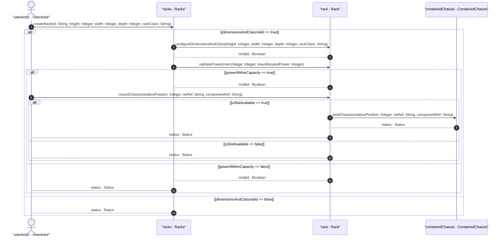
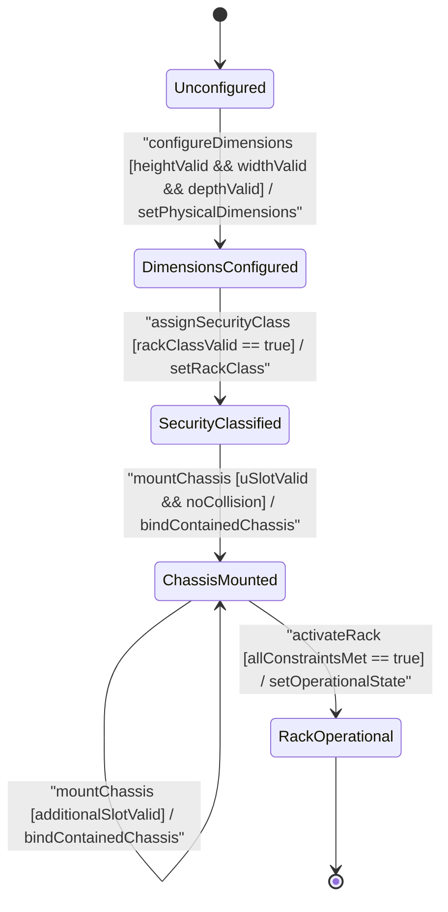

# User Story: [ietf-ni-location]: Rack Identification, Bay Position Assignment, U-Position Alignment (1U..48U), and Vertical Slot Constraint Enforcement

## Parent Epic
- [ ] #51 - [[ietf-ni-location]: Network Inventory Location Management](https://github.com/gintatkinson/3dgs-037/blob/main/docs/epics/epic-04-ietf-ni-location.md) (Provides top-level epic framework for managing datacenter physical locations and network equipment inventory containment)

## Domain Object Mapping
- **Primary Domain Objects:** `Racks`, `Rack`, `RackClass`, `ContainedChassis`, `RackLocation`
- **Actor/Role:** `userActor : UserActor` (Datacenter technician / network administrator)

## BDD Scenario (OOA/OOD Realization)

### Scenario 1: Equipment Rack Creation with Physical Dimensions and Security Classification
**Given** a datacenter technician initializing an equipment rack in the network inventory system  
**When** `createRack(id: String, height: Integer, width: Integer, depth: Integer, rackClass: String)` is executed with `height` 2200 mm, `width` 600 mm, `depth` 1000 mm, and `rackClass` `"ietf-ni-location:rack-secure-high"`  
**Then** the rack entity is instantiated with physical enclosure dimensions and security classification, returning `status : Status` as success.

### Scenario 2: Electrical Infrastructure Limits Evaluation and Capacity Validation
**Given** an existing rack configured with `max-voltage` 240 V and `max-allocated-power` 8000 W  
**When** `validatePower(maxVoltage: Integer, maxAllocatedPower: Integer)` is called to assess power allocation bounds  
**Then** the system verifies that `maxVoltage` and `maxAllocatedPower` do not exceed electrical infrastructure limits and returns `isValid : Boolean`.

### Scenario 3: Vertical U-Slot Relative Position Allocation and Collision Detection
**Given** a rack containing a chassis already mounted at `relative-position` 1  
**When** `mountChassis(relativePosition: Integer, neRef: String, componentRef: String)` attempts to assign `relative-position` 1 for a second chassis  
**Then** the system detects a U-slot collision, rejects the duplicate allocation, and returns `status : Status` with collision error details.

### Scenario 4: Contained Chassis Network Element Leafref Binding
**Given** a rack with open U-slots and a valid network element reference `"NE-CORE-ROUTER-01"`  
**When** `mountChassis(relativePosition: Integer, neRef: String, componentRef: String)` is called with `relativePosition` 5, `neRef` `"NE-CORE-ROUTER-01"`, and `componentRef` `"CHASSIS-SLOT-05"`  
**Then** the chassis is bound to the rack at U-slot 5 and linked to the target network element, returning `isValid : Boolean`.

## UML Sequence Diagram

## UML State Machine Diagram

## Operational Context
> "racks" represent physical equipment racks in which NEs can be installed, which facilitate device maintenance. Through "rack-location", each rack can be assigned to a site or a specific location within a site, such as an equipment room. Each rack is assigned a unique ID and a name in the context of a facility, e.g. a site. A rack may have some specific attributes, such as appearance-related attributes and electricity-related attributes. The height, depth and width are described by Figure 2 (please consider that the door of the rack is facing the user). The rack attributes include physical dimensions (`height`, `width`, `depth` in mm), security classification identityref (`rack-class` e.g. `rack-secure-high`), electrical limits (`max-voltage`, `max-allocated-power`), and vertical U-slot relative position allocations (`relative-position` uint8 [1..255]).

## Required Features Matrix
- [ ] #49 - [[ietf-ni-location: Rack and Bay Positioning]](https://github.com/gintatkinson/3dgs-037/blob/main/docs/features/feat-15-rack-and-bay-positioning.md) (Provides schema definitions for racks, rack dimensions, electrical limits, rack classification identityref hierarchy, and chassis U-positioning)
- [ ] #47 - [[ietf-ni-location: Location Inventory Base and Postal Address]](https://github.com/gintatkinson/3dgs-037/blob/main/docs/features/feat-13-location-inventory-base-and-postal-address.md) (Provides parent location and network element reference linkages for mounted chassis)

## Source References
Structural Schema: https://github.com/ietf-ivy-wg/network-inventory-location/blob/main/ietf-ni-location.yang
Normative Specification: https://datatracker.ietf.org/doc/html/draft-ietf-ivy-network-inventory-location
