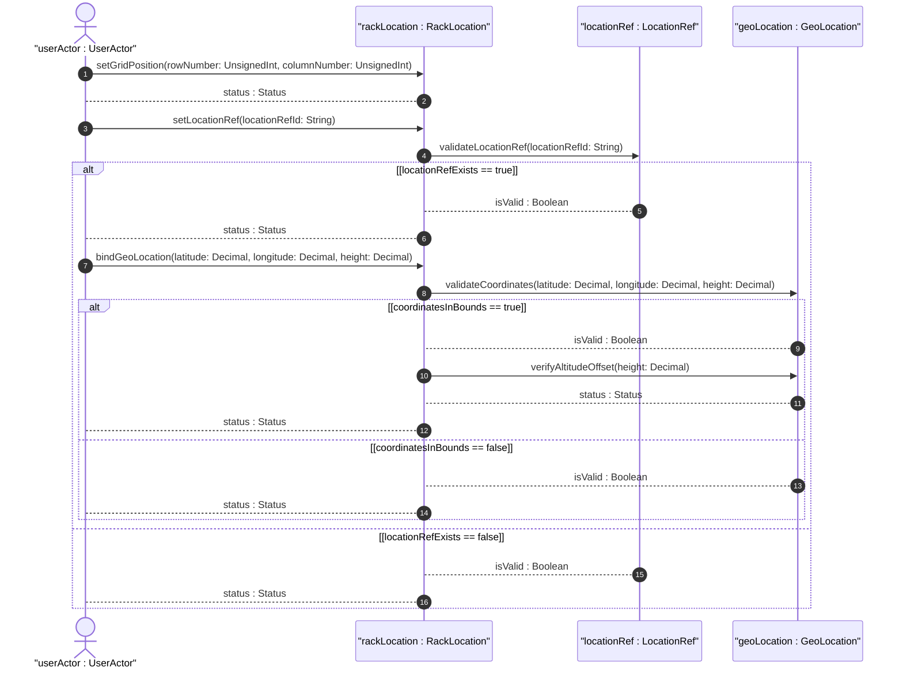
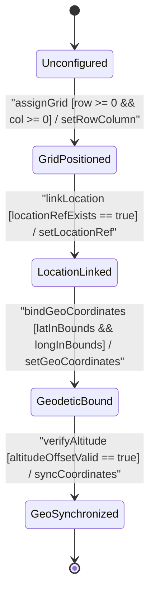

# User Story: [ietf-ni-location]: Geodetic Location Binding (ietf-geo-location augmentation), Spatial Coordinate Synchronization, and Altitude Offset Verification

## Parent Epic
- [ ] #51 - [[ietf-ni-location]: Network Inventory Location Management](https://github.com/gintatkinson/3dgs-037/blob/main/docs/epics/epic-04-ietf-ni-location.md) (Parent Epic defining physical site locations, rack placement, and geodetic coordinate binding within network inventories)

## Domain Object Mapping
- **Primary Domain Objects:** `RackLocation`, `LocationRef`, `GeoLocation`, `Rack`
- **Actor/Role:** `userActor : UserActor` (GIS engineer / infrastructure surveyor)

## BDD Scenario (OOA/OOD Realization)

### Scenario 1: Rack Floor Grid Row/Column Assignment and Facility Location Binding
**Given** a `RackLocation` instance associated with a physical `Rack` entity  
**When** `userActor` assigns `row-number` (`uint32`), `column-number` (`uint32`), and binds a valid facility `location-ref` (`leafref`)  
**Then** the rack floor grid positioning MUST be updated and return `status : Status` indicating successful grid placement.

### Scenario 2: Geodetic 3D Coordinate Binding via ietf-geo-location Augmentation
**Given** a `RackLocation` instance bound to a facility location reference  
**When** `userActor` provides 3D spatial coordinates (`latitude`, `longitude`, `height`) via the imported `ietf-geo-location` augmentation container  
**Then** the `GeoLocation` coordinates MUST be bound to the `RackLocation` and return `isValid : Boolean` as true.

### Scenario 3: Spatial Coordinate Synchronization and Ellipsoid Altitude Offset Verification
**Given** a `RackLocation` with geodetic coordinates bound  
**When** `userActor` initiates spatial coordinate synchronization and reference ellipsoid altitude offset verification  
**Then** altitude offset relative to the geodetic reference ellipsoid MUST be verified within valid operational thresholds and return `status : Status`.

### Scenario 4: Invalid Location Ref Failure and Spatial Coordinate Boundary Rejection
**Given** a `RackLocation` instance under configuration  
**When** `userActor` submits an unresolvable `location-ref` or spatial coordinates outside valid bounds (latitude outside [-90, 90] or longitude outside [-180, 180])  
**Then** resolution MUST fail, rejecting the invalid binding, and return `isValid : Boolean` as false.

## UML Sequence Diagram

## UML State Machine Diagram

## Operational Context
> "The network-inventory-location YANG module extends physical inventory management by integrating spatial and geodetic reference models. The rack-location container augmented on physical rack entities provides floor grid positioning through row-number and column-number leaves, as well as a location-ref leafref referencing standard facility location records. Furthermore, importing ietf-geo-location allows physical rack positioning to be directly bound to 3D geodetic coordinates (latitude, longitude, and height above reference ellipsoid), facilitating spatial indexing, GIS integration, and automated 3D topological visualization across distributed data center facilities."

## Required Features Matrix
- [ ] #50 - [[ietf-ni-location: Geo-Location Integration Augment]](https://github.com/gintatkinson/3dgs-037/blob/main/docs/features/feat-16-geo-location-integration-augment.md) (Provides rack-location container with row/column indices, location-ref leafref, and ietf-geo-location import bindings)
- [ ] #49 - [[ietf-ni-location: Rack and Bay Positioning]](https://github.com/gintatkinson/3dgs-037/blob/main/docs/features/feat-15-rack-and-bay-positioning.md) (Provides physical rack entity containing the rack-location structure)
- [ ] #36 - [[ietf-geo-location]: 3D Spatial Coordinates and Altitude](https://github.com/gintatkinson/3dgs-037/blob/main/docs/features/feat-11-coordinates-and-altitude.md) (Provides 3D spatial coordinate parsing and altitude offset bounds)

## Source References
Structural Schema: https://github.com/ietf-ivy-wg/network-inventory-location/blob/main/ietf-ni-location.yang
Normative Specification: https://datatracker.ietf.org/doc/html/draft-ietf-ivy-network-inventory-location
