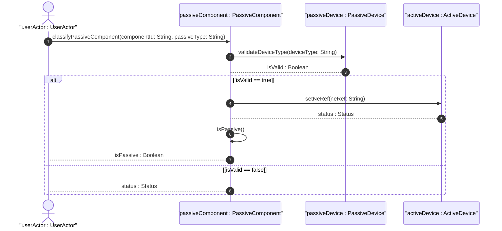
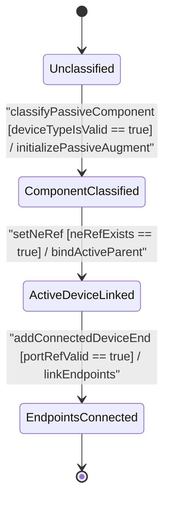

# User Story: [ietf-nwi-passive-inventory]: Passive Component Identity Classification, Component Augment Initialization, and Parent Equipment Linkage

## Parent Epic
- [ ] #77 - [[ietf-nwi-passive-inventory]: Passive Network Inventory Management](https://github.com/gintatkinson/3dgs-037/blob/main/docs/epics/epic-06-ietf-nwi-passive-inventory.md) (Parent Epic defining passive network inventory augmentations)

## Domain Object Mapping
- **Primary Domain Objects:** `Component`, `PassiveComponent`, `PassiveDevice`, `ActiveDevice`, `ConnectedDeviceRef`, `ConnectedDeviceEnd`, `ODF`, `WDM`, `FAT`, `FDT`, `ATB`
- **Actor/Role:** `userActor : UserActor` (network equipment inventory manager / network planner)

## BDD Scenario (OOA/OOD Realization)

### Scenario 1: Passive Component Identity Classification (ODF, WDM, FAT, FDT, ATB)
**Given** an unpowered physical component registered in the network equipment inventory,  
**When** `userActor` initiates classification by specifying `passiveComponentType` as `"odf"` (or `"wdm"`, `"fat"`, `"fdt"`, `"atb"`) and initializing `passiveDeviceType` to `"odf"`,  
**Then** `passiveComponent` MUST set `isPassive` to `true`, bind the target identity reference, and expose unpowered distribution frame properties in PropertyGrid.

### Scenario 2: Active Equipment Extension Linkage (`ne-ref` and `component-ref`)
**Given** a passive component attached to an active chassis host equipment element,  
**When** `userActor` selects the `active-device` choice branch and sets `ne-ref` to `"NE-OLT-01"` and `component-ref` to `"SLOT-2"`,  
**Then** `activeDevice` MUST store the parent network element reference and establish cross-element topology linkage within the inventory catalog.

### Scenario 3: Connected Device Endpoint Topology Mappings (`a-end` and `z-end`)
**Given** a passive optical distribution component routing optical signals between active and passive endpoints,  
**When** `userActor` adds `connected-device-ref` entries mapping `a-end` (`deviceName`: `"NE-OLT-01"`, `portRef`: `"port-1/1/1"`) and `z-end` (`deviceName`: `"FDT-NORTH-02"`, `portRef`: `"tray-2/port-12"`),  
**Then** `connectedDeviceRef` MUST encapsulate both origin and destination endpoints with their corresponding port references.

### Scenario 4: Location Reference and Custom Metadata Tags Binding
**Given** a passive access terminal box (`ATB`) component,  
**When** `userActor` sets `locationRef` to `"LOC-CO-01"` and attaches `customTags` `["optical-patch", "feeder-bay-4", "high-density"]`,  
**Then** `passiveComponent` MUST persist spatial location links and render operational tag pills in the user interface.

## UML Sequence Diagram

## UML State Machine Diagram

## Operational Context
> "Augments network equipment component with passive component classification and connected device reference attributes. Container for passive network component attributes, including device type classification (ODF, WDM, FAT, FDT, ATB), active/passive device reference, connected device end mappings (A-end, Z-end), location references, and custom tags."
> 
> -- *ietf-nwi-passive-inventory.yang (augment /nwi:equipment/nwi:component/nwi-passive:passive-component)*

## Required Features Matrix
- [ ] #73 - [[ietf-nwi-passive-inventory: Passive Component Classification & Extension Augment]](https://github.com/gintatkinson/3dgs-037/blob/main/docs/features/feat-21-passive-component-extension.md) (Provides passive-component presence container, ODF/WDM/FAT/FDT/ATB identity mapping, active device linkage, and endpoint references)

## Source References
Structural Schema: https://github.com/aguoietf/draft-ygb-ivy-passive-network-inventory/blob/main/yang/ietf-nwi-passive-inventory.yang
Normative Specification: https://datatracker.ietf.org/doc/draft-ygb-ivy-passive-network-inventory/
