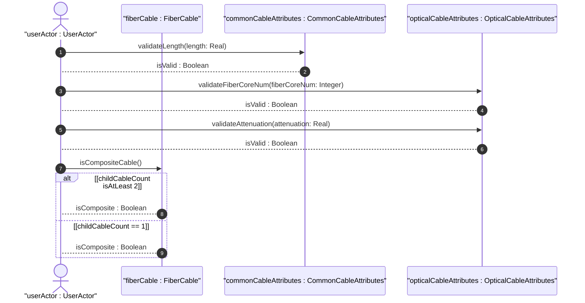
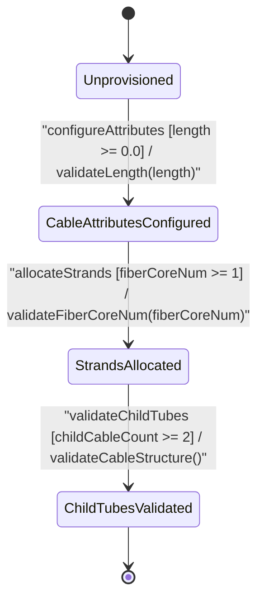

# User Story: [ietf-nwi-passive-inventory]: Fiber Cable Ingestion, Strand Count Allocation, Strand Color Code Schema Validation, and Attenuation Coefficient Calculation

## Parent Epic
- [ ] #77 - [[ietf-nwi-passive-inventory]: Passive Network Inventory Management](https://github.com/gintatkinson/3dgs-037/blob/main/docs/epics/epic-06-ietf-nwi-passive-inventory.md) (Parent Epic defining passive network inventory augmentations)

## Domain Object Mapping
- **Primary Domain Objects:** `PassiveComponent`, `Cables`, `Cable`, `FiberCable`, `CommonCableAttributes`, `OpticalCableAttributes`, `ChildCables`, `ChildCable`, `G652D`, `G657A1`
- **Actor/Role:** `userActor : UserActor` (optical cable plant engineer / inventory system)

## BDD Scenario (OOA/OOD Realization)

### Scenario 1: Standard Optical Fiber Cable Core Count and Standard Specification (G.652.D)
**Given** an unprovisioned optical passive equipment component,
**When** an optical cable plant engineer provisions a `fiber-cable` with `fiber-core-num` set to `144`, `fiber-type` set to `"G652D"`, `cable-role` set to `"backbone"`, and `attenuation` set to `0.22`,
**Then** `opticalCableAttributes : OpticalCableAttributes` MUST validate `validateFiberCoreNum(fiberCoreNum: Integer)` as `true`, record standard G.652.D optical properties, and set operational state to `StrandsAllocated`.

### Scenario 2: Multi-Tube Child Cable Structure Validation (`min-elements 2`)
**Given** a multi-tube fiber cable assembly with allocated optical strands,
**When** the engineer configures `child-cables` with 2 child sub-cable entries (`index` 1 and `index` 2),
**Then** `fiberCable : FiberCable` MUST evaluate `isCompositeCable()` as `true`, validate `min-elements 2`, transition state to `ChildTubesValidated`, and render sub-tube detail rows.

### Scenario 3: Single Child Sub-Cable Constraint Rejection
**Given** a composite fiber cable initialization request,
**When** an inventory system attempts to provision `child-cables` with only 1 `child-cable` element (`index` 1),
**Then** `fiberCable : FiberCable` MUST reject the payload, flag a `min-elements 2` validation error, prevent transition to `ChildTubesValidated`, and retain system state in `StrandsAllocated`.

### Scenario 4: Optical Attenuation Coefficient (dB/km) Calculation and Length Profiling
**Given** a G.657.A1 bend-insensitive fiber cable segment of `length` `1500.50` meters,
**When** an engineer inputs an `attenuation` coefficient of `0.250` dB/km and triggers total link loss calculation (`length * attenuation / 1000`),
**Then** `opticalCableAttributes : OpticalCableAttributes` MUST validate `validateAttenuation(attenuation: Real)` as `true`, calculate the segment end-to-end attenuation as `0.375` dB, and record the profile in inventory.

## UML Sequence Diagram


## UML State Machine Diagram


## Operational Context
```text
  grouping common-cable-attributes {
    description
      "Attributes common to all cable types.";
    leaf length {
      type decimal64 {
        fraction-digits 2;
      }
      units "meters";
      description
        "Physical length of the cable segment.";
    }
    leaf cable-type {
      type identityref {
        base cable-type;
      }
      description
        "Classification of the cable media type (e.g., optical-fiber,
         electrical-cable, coaxial-cable).";
    }
    leaf cable-role {
      type identityref {
        base cable-role;
      }
      description
        "Operational role of the cable in the network (e.g., backbone,
         aggregation, access, trunk, distribution, branch).";
    }
  }

  grouping optical-cable-attributes {
    description
      "Attributes specific to optical cables.";
    leaf fiber-core-num {
      type uint32;
      description
        "Number of optical fiber cores/strands contained within the cable.";
    }
    leaf fiber-type {
      type identityref {
        base fiber-type;
      }
      description
        "international-standard optical fiber identity (e.g., G652A, G652B, G652C, G652D,
         G653, G654, G655, G656, G657A1, G657A2, G657B, other).";
    }
    leaf attenuation {
      type decimal64 {
        fraction-digits 3;
      }
      units "dB/km";
      description
        "Optical attenuation coefficient per kilometer.";
    }
  }

  container fiber-cable {
    description
      "Fiber cable equipment component inventory attributes.";
    uses common-cable-attributes;
    uses optical-cable-attributes;
    container child-cables {
      description
        "Container for composite sub-cables or fiber tubes.";
      list child-cable {
        key "index";
        min-elements 2;
        description
          "List of constituent child cables within a multi-tube assembly.";
        leaf index {
          type uint32;
          description
            "Sub-cable tube sequence index.";
        }
        leaf id {
          type string;
          description
            "Unique identifier string for the sub-cable strand or tube.";
        }
        uses common-cable-attributes;
        uses optical-cable-attributes;
      }
    }
  }
```

## Required Features Matrix
- [ ] #74 - [[ietf-nwi-passive-inventory: Fiber Cable & Strand Inventory Augment]](https://github.com/gintatkinson/3dgs-037/blob/main/docs/features/feat-22-fiber-cable-inventory.md) (Provides fiber-cable container, optical core count tracking, fiber standards G.652 to G.657, attenuation dB/km, and multi-tube sub-cables)

## Source References
Structural Schema: https://github.com/aguoietf/draft-ygb-ivy-passive-network-inventory/blob/main/yang/ietf-nwi-passive-inventory.yang
Normative Specification: https://datatracker.ietf.org/doc/draft-ygb-ivy-passive-network-inventory/
