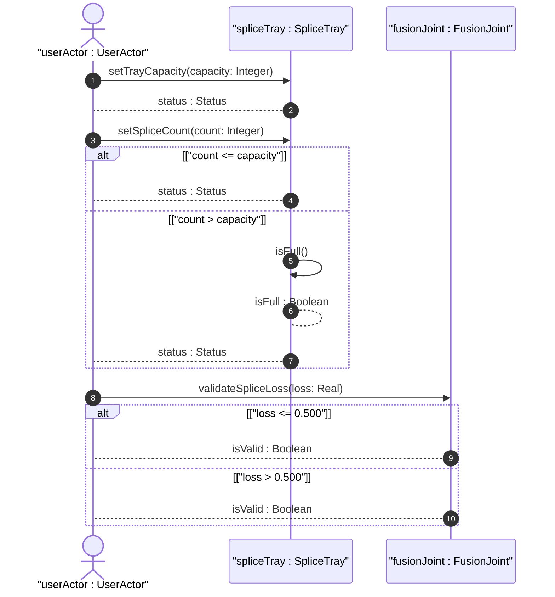
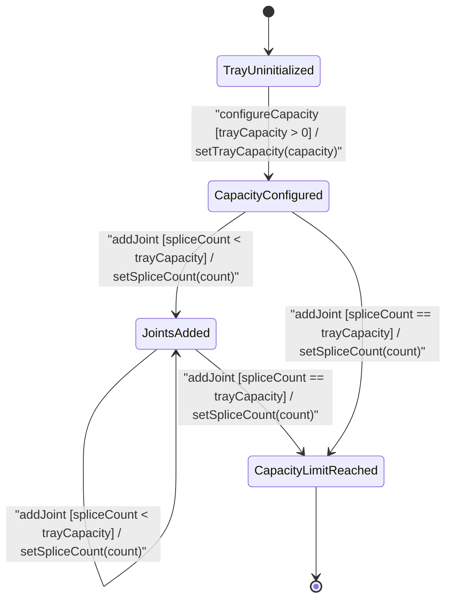

# User Story: [ietf-nwi-passive-inventory]: Splice Tray Capacity Management, Fiber Strand Fusion Splicing Joint Creation, and Splice Loss Bounds Evaluation

## Parent Epic
- [ ] #77 - [[ietf-nwi-passive-inventory]: Passive Network Inventory Management](https://github.com/gintatkinson/3dgs-037/blob/main/docs/epics/epic-06-ietf-nwi-passive-inventory.md) (Parent Epic defining passive network inventory augmentations)

## Domain Object Mapping
- **Primary Domain Objects:** `PassiveComponent`, `SpliceTray`, `FusionJoint`, `FusionType`, `HeatShrinkSplice`, `MechanicalSplice`, `RibbonSplice`
- **Actor/Role:** `userActor : UserActor` (outside plant technician / splice manager)

## BDD Scenario (OOA/OOD Realization)

### Scenario 1: Optical Splice Tray Capacity and Active Splice Count Provisioning
**Given** an uninitialized optical splice tray within a passive optical component enclosure,
**When** an outside plant technician sets `tray-identifier` to `"ST-FAC-01-A"`, configures `tray-capacity` to `24`, and provisions `splice-count` as `12`,
**Then** the `spliceTray : SpliceTray` instance MUST accept the configuration, verify that `splice-count <= tray-capacity`, set its operational status to `CapacityConfigured`, and render a 50% utilization capacity indicator.

### Scenario 2: Splice Count Exceeding Tray Capacity Rejection
**Given** an active optical splice tray with `tray-capacity` configured to `24` splices and current `splice-count` at `24`,
**When** an outside plant technician attempts to increase `splice-count` to `28` without increasing `tray-capacity`,
**Then** the `spliceTray : SpliceTray` instance MUST evaluate `isFull()` as `true`, reject the count modification with a validation error, maintain state in `CapacityLimitReached`, and display an inline warning indicating capacity overflow.

### Scenario 3: Optical Fusion Joint Insertion Loss (dB) Bounds Evaluation
**Given** an active optical fusion joint entry (`FJ-001`) within a splice tray,
**When** a technician inputs a measured optical insertion loss (`splice-loss`) of `0.750` dB into `fusionJoint : FusionJoint`,
**Then** `validateSpliceLoss(loss: Real)` MUST return `isValid : Boolean` as `true` for recording within the 0.000 to 5.000 dB schema bounds, but flag an optical attenuation warning indicator because the value exceeds the 0.500 dB operational threshold.

### Scenario 4: Fusion Type Technological Classification Assignment (Heat-Shrink / Mechanical / Ribbon)
**Given** a newly created fusion joint entry with `joint-id` `"FJ-002"` in `spliceTray : SpliceTray`,
**When** an administrator assigns the technological classification `fusion-type` to `heat-shrink-splice` (or `mechanical-splice` / `ribbon-splice`),
**Then** the domain model MUST validate the identity reference against base identity `fusion-type`, serialize the fully qualified identity string in payload output, and display the corresponding fusion classification badge.

## UML Sequence Diagram


## UML State Machine Diagram


## Operational Context
```text
container splice-tray {
  description
    "Defines the optical fiber splice tray and fusion joint connection
     attributes within a passive optical component.";
  leaf tray-identifier {
    type string;
    description
      "Unique identifier for the optical splice tray within the passive component.";
  }
  leaf splice-count {
    type uint16;
    description
      "The current number of active splices contained in the tray.";
  }
  leaf tray-capacity {
    type uint16;
    description
      "The maximum splice capacity of the tray (e.g. 12, 24, 48, 96).";
  }
  list fusion-joint {
    key "joint-id";
    description
      "List of individual optical fusion joints inside the splice tray.";
    leaf joint-id {
      type string;
      description
        "Unique identifier for the fusion joint.";
    }
    leaf splice-loss {
      type decimal64 {
        fraction-digits 3;
      }
      units "dB";
      description
        "Measured optical insertion loss across the fusion joint in decibels.";
    }
    leaf fusion-type {
      type identityref {
        base fusion-type;
      }
      description
        "The technological classification of the optical fusion joint (e.g., heat-shrink, mechanical, ribbon).";
    }
  }
}
```

## Required Features Matrix
- [ ] #75 - [[ietf-nwi-passive-inventory: Splice Tray & Fusion Joint Connection Augment]](https://github.com/gintatkinson/3dgs-037/blob/main/docs/features/feat-23-splice-tray-connection.md) (Provides splice-tray container, tray capacity tracking, splice count management, and fusion joint insertion loss dB)

## Source References
Structural Schema: https://github.com/aguoietf/draft-ygb-ivy-passive-network-inventory/blob/main/yang/ietf-nwi-passive-inventory.yang
Normative Specification: https://datatracker.ietf.org/doc/draft-ygb-ivy-passive-network-inventory/
