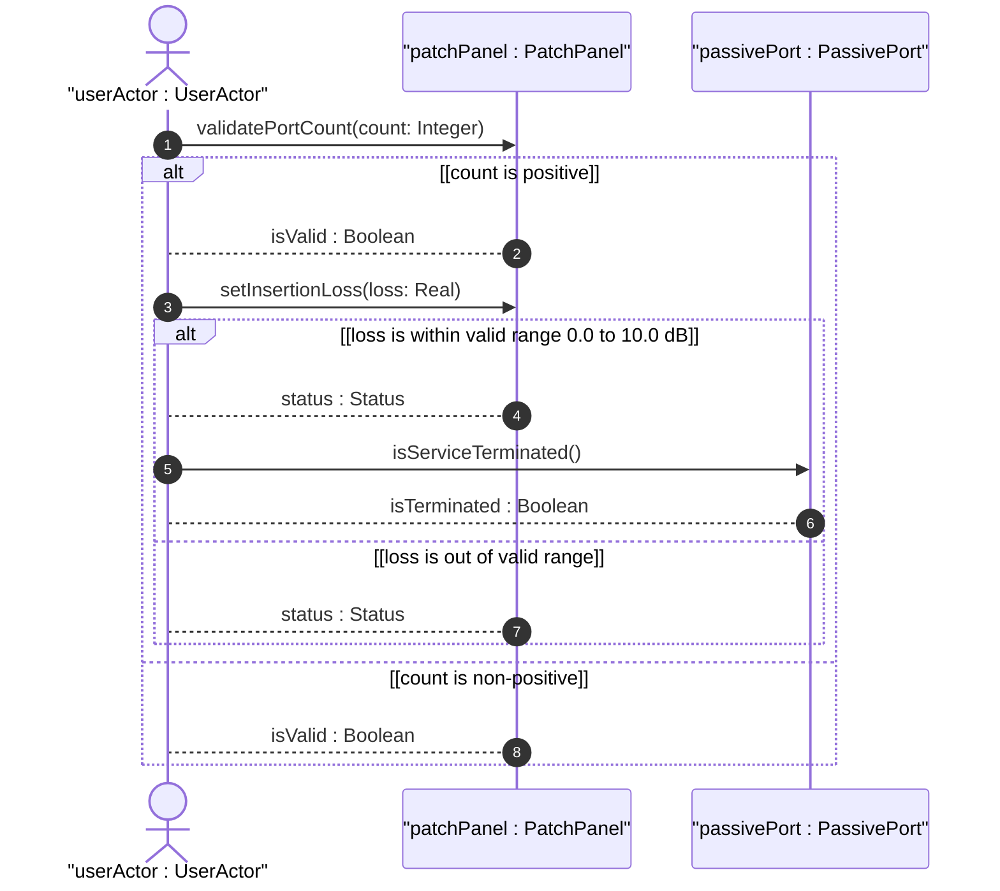
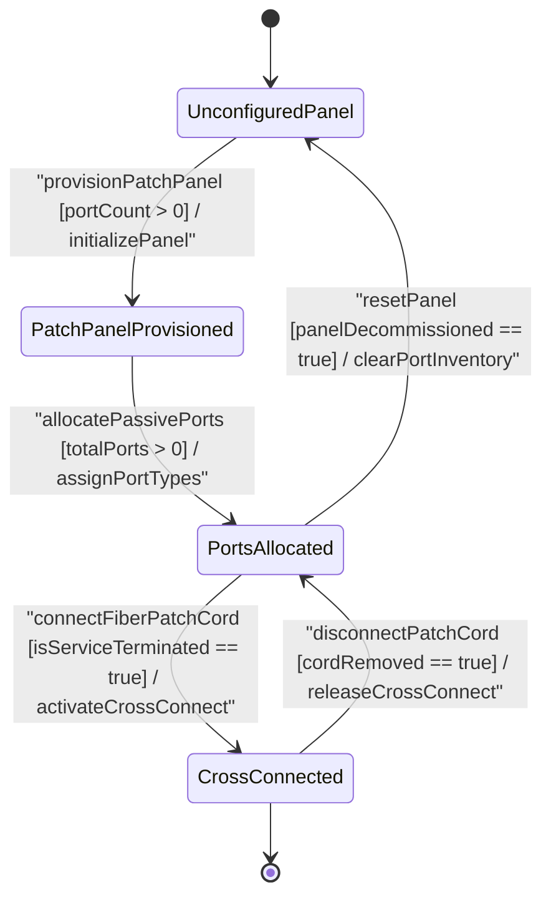

# User Story: [ietf-nwi-passive-inventory]: Optical Patch Panel Port Provisioning, Connector Type Validation (LC/SC/MPO), Insertion Loss Limits, and Fiber Patch Cord Cross-Connection

## Parent Epic
- [ ] #77 - [[ietf-nwi-passive-inventory]: Passive Network Inventory Management](https://github.com/gintatkinson/3dgs-037/blob/main/docs/epics/epic-06-ietf-nwi-passive-inventory.md) (Parent Epic defining passive network inventory augmentations)

## Domain Object Mapping
- **Primary Domain Objects:** `PassiveComponent`, `PatchPanel`, `PassiveDevicePorts`, `PassivePort`, `PassivePortType`, `ServicePort`, `InputPort`, `OutputPort`, `P2mpPort`
- **Actor/Role:** `userActor : UserActor` (central office engineer / optical cross-connect operator)

## BDD Scenario (OOA/OOD Realization)

### Scenario 1: Patch Panel Physical Port Density and Connector Standard Classification (LC-APC, SC-APC, MPO)
**Given** a passive network equipment component requiring optical interconnect configuration  
**When** `userActor` provisions a `PatchPanel` with `portCount` 24, `connectorType` `"lc-apc"`, and validates the physical port count  
**Then** `validatePortCount(24)` returns `true` and the patch panel port density is set to 24 with LC-APC interface standards.

### Scenario 2: Service Port Classification and Fiber Core Termination
**Given** a `PatchPanel` instance with allocated `PassiveDevicePorts`  
**When** `userActor` configures a `PassivePort` `"port-01"` as a `ServicePort` with `fiberCoreNum` 2 and checks termination status  
**Then** `isServiceTerminated()` returns `true` and the port is recorded as an active 2-core optical service termination.

### Scenario 3: Connector Insertion Loss (dB) Range Validation (0.0 to 10.0 dB)
**Given** an active `PatchPanel` instance subject to optical signal degradation monitoring  
**When** `userActor` sets `insertionLoss` to 0.35 dB within the valid range of 0.0 to 10.0 dB  
**Then** `setInsertionLoss(0.35)` returns `Status` ("SUCCESS") and the optical attenuation parameter is saved.

### Scenario 4: Dynamic Passive Device Port Allocation (Input / Output / Service / P2MP)
**Given** a `PatchPanel` managing an array of optical fibers across passive port identities  
**When** `userActor` assigns port types across `PassivePort` instances for `InputPort`, `OutputPort`, `ServicePort`, and `P2mpPort`  
**Then** `totalPorts` in `PassiveDevicePorts` reflects the total allocated port instances and each `PassivePort` resolves its derived `PassivePortType` identity.

## UML Sequence Diagram


## UML State Machine Diagram


## Operational Context
```text
augment "/nwi:equipment/nwi:component/nwi-passive:passive-component" {
  description
    "Augments passive component with patch panel inventory attributes.";
  container patch-panel {
    description
      "Attributes specific to optical patch panels and interconnect bays.";
    leaf port-count {
      type uint16;
      description
        "Total number of physical optical ports on the patch panel.";
    }
    leaf connector-type {
      type identityref {
        base connector-type;
      }
      description
        "Standard optical connector interface identity (e.g., LC, SC, MPO).";
    }
    leaf insertion-loss {
      type decimal64 {
        fraction-digits 2;
        range "0.0 .. 10.0";
      }
      units "dB";
      description
        "Maximum insertion loss per connection across the patch panel in decibels.";
    }
    container passive-device-ports {
      description
        "Enclosing container for passive device port instances.";
      list passive-port {
        key "port-id";
        description
          "List of passive ports residing on the patch panel.";
        leaf port-id {
          type string;
          description
            "Unique identifier for the passive port.";
        }
        leaf port-type {
          type identityref {
            base passive-port-type;
          }
          description
            "Functional port type identity (service-port, input-port, output-port, p2mp-port).";
        }
        leaf fiber-core-num {
          type uint16;
          description
            "Number of optical fiber cores terminated or routed through this port.";
        }
      }
    }
  }
}
```

## Required Features Matrix
- [ ] #76 - [[ietf-nwi-passive-inventory: Connector & Patch Panel Inventory Augment]](https://github.com/gintatkinson/3dgs-037/blob/main/docs/features/feat-24-connector-patch-panel.md) (Provides patch-panel container, port density, optical connector classifications LC/SC/MPO, insertion loss dB, and passive port roles)

## Source References
Structural Schema: https://github.com/aguoietf/draft-ygb-ivy-passive-network-inventory/blob/main/yang/ietf-nwi-passive-inventory.yang
Normative Specification: https://datatracker.ietf.org/doc/draft-ygb-ivy-passive-network-inventory/
