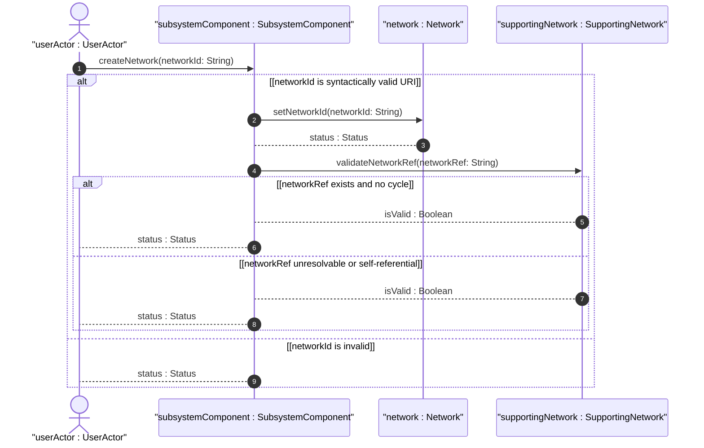
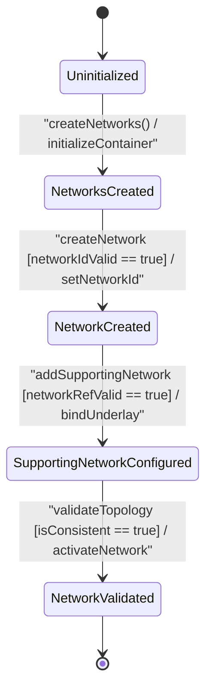

# User Story: [ietf-network]: Base Network Instance Onboarding, Network-ID String Syntax Checking, and Supporting Network Multi-Layer Overlay Hierarchy Resolution

## Parent Epic
- [ ] #90 - [[ietf-network-and-topology]: Network and Topology Base Models](https://github.com/gintatkinson/3dgs-037/blob/main/docs/epics/epic-07-ietf-network-and-topology.md) (Parent Epic defining base network and topology models)

## Domain Object Mapping
- **Primary Domain Objects:** `Networks`, `Network`, `NetworkTypes`, `SupportingNetwork`, `SubsystemComponent`
- **Actor/Role:** `userActor : UserActor` (network operations administrator)

## BDD Scenario (OOA/OOD Realization)

### Scenario 1: Base Network Instance Onboarding and URI Syntax Validation
**Given** an uninitialized network topology container  
**When** `userActor` creates a `Network` instance with `networkId` set to `"urn:ietf:params:xml:ns:yang:ietf-network?net=core-nw-01"`  
**Then** `createNetwork("urn:ietf:params:xml:ns:yang:ietf-network?net=core-nw-01")` returns `true` and the network instance is registered under `/networks/network`.

### Scenario 2: Network Types Presence Extension Configuration
**Given** an active base `Network` instance `"urn:ietf:params:xml:ns:yang:ietf-network?net=core-nw-01"`  
**When** `userActor` enables the `NetworkTypes` presence container  
**Then** the presence flag is registered and specialized topology extensions can be attached to the network.

### Scenario 3: Layered Supporting Network Mapping and Cycle Prevention
**Given** an existing underlay network `"urn:ietf:params:xml:ns:yang:ietf-network?net=underlay-optical-01"`  
**When** `userActor` attaches a `SupportingNetwork` reference with `networkRef` = `"urn:ietf:params:xml:ns:yang:ietf-network?net=underlay-optical-01"` to overlay network `"urn:ietf:params:xml:ns:yang:ietf-network?net=ip-overlay-01"`  
**Then** `validateNetworkRef("urn:ietf:params:xml:ns:yang:ietf-network?net=underlay-optical-01")` returns `isValid : Boolean` as `true` and the vertical underlay-overlay relationship is established.

## UML Sequence Diagram


## UML State Machine Diagram


## Operational Context
```text
Section 4.1. Base Network Model
The base network model is defined by the "ietf-network" YANG module. It defines networks and their components at a high level of abstraction.
The data model for a network is represented by a container "networks" holding a list of "network" entries. Each network is identified by a "network-id".
container networks {
  list network {
    key "network-id";
    leaf network-id {
      type network-id;
    }
    container network-types {}
    list supporting-network {
      key "network-ref";
      leaf network-ref {
        type leafref {
          path "/networks/network/network-id";
          require-instance false;
        }
      }
    }
  }
}
```

## Required Features Matrix
- [ ] #86 - [[ietf-network: Base Networks and Network Data Model]](https://github.com/gintatkinson/3dgs-037/blob/main/docs/features/feat-25-base-networks-and-network-data-model.md) (Provides base networks container, network-id URI key, network-types presence container, and supporting-network leafref hierarchy)

## Source References
Structural Schema: https://github.com/YangModels/yang/blob/main/standard/ietf/RFC/ietf-network%402018-02-26.yang
Normative Specification: https://datatracker.ietf.org/doc/rfc8345/
