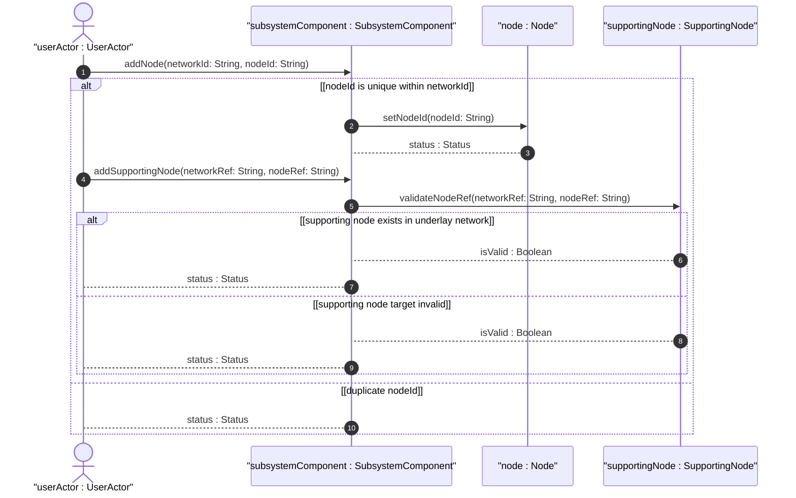
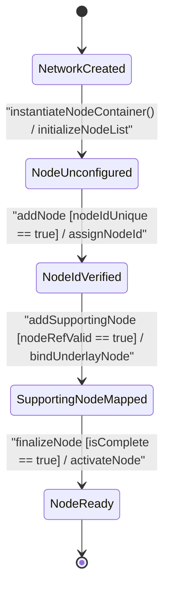

# User Story: [ietf-network]: Abstract and Physical Node Creation, Node-ID Uniqueness Verification, and Underlay Supporting Node Traversal

## Parent Epic
- [ ] #90 - [[ietf-network-and-topology]: Network and Topology Base Models](https://github.com/gintatkinson/3dgs-037/blob/main/docs/epics/epic-07-ietf-network-and-topology.md) (Parent Epic defining base network and topology models)

## Domain Object Mapping
- **Primary Domain Objects:** `Networks`, `Network`, `Node`, `SupportingNode`, `SubsystemComponent`
- **Actor/Role:** `userActor : UserActor` (topology engineer)

## BDD Scenario (OOA/OOD Realization)

### Scenario 1: Network Node Creation and Node-ID Scope Uniqueness
**Given** an active network instance `"overlay-nw-1"`  
**When** `userActor` creates a new `Node` with `nodeId` set to `"router-alpha"`  
**Then** `addNode("overlay-nw-1", "router-alpha")` returns `true` and the node is persisted within the containing network.

### Scenario 2: Underlay Supporting Node Mapping and Compound Key Validation
**Given** an overlay node `"router-alpha"` in network `"overlay-nw-1"` and an underlay node `"phys-switch-01"` in underlay network `"underlay-nw-01"`  
**When** `userActor` adds a `SupportingNode` entry with `networkRef` = `"underlay-nw-01"` and `nodeRef` = `"phys-switch-01"`  
**Then** `validateNodeRef("underlay-nw-01", "phys-switch-01")` returns `isValid : Boolean` as `true` and the vertical node mapping is bound.

### Scenario 3: Rejection of Unresolvable Supporting Node Leafrefs
**Given** an overlay node `"router-alpha"`  
**When** `userActor` attempts to attach a `SupportingNode` referencing a non-existent underlay node `"non-existent-node"`  
**Then** the leafref target validation fails and the system returns a validation error `Status`.

## UML Sequence Diagram


## UML State Machine Diagram


## Operational Context
```text
Section 4.2. Node Data Model
The node data model is defined by the "ietf-network" YANG module.
A node is identified by a node-id, which is unique within the containing network.
A node can be supported by lower-layer nodes. A supporting node is defined by a network-ref (which refers to the supporting network) and a node-ref (which refers to the supporting node in that network).
list node {
  key "node-id";
  leaf node-id {
    type node-id;
  }
  list supporting-node {
    key "network-ref node-ref";
    leaf network-ref {
      type leafref {
        path "/nw:networks/nw:network/nw:network-id";
        require-instance false;
      }
    }
    leaf node-ref {
      type leafref {
        path "/nw:networks/nw:network[nw:network-id=current()/../network-ref]/nw:node/nw:node-id";
        require-instance false;
      }
    }
  }
}
```

## Required Features Matrix
- [ ] #87 - [[ietf-network: Node Data Model and Supporting Nodes]](https://github.com/gintatkinson/3dgs-037/blob/main/docs/features/feat-26-node-data-model-and-supporting-nodes.md) (Provides node list, node-id key, and supporting-node compound leafref hierarchy)
- [ ] #86 - [[ietf-network: Base Networks and Network Data Model]](https://github.com/gintatkinson/3dgs-037/blob/main/docs/features/feat-25-base-networks-and-network-data-model.md) (Provides parent networks/network container context)

## Source References
Structural Schema: https://github.com/YangModels/yang/blob/main/standard/ietf/RFC/ietf-network%402018-02-26.yang
Normative Specification: https://datatracker.ietf.org/doc/rfc8345/
