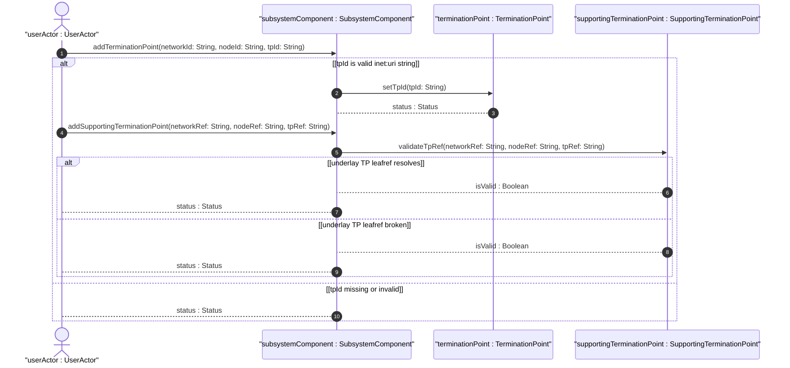
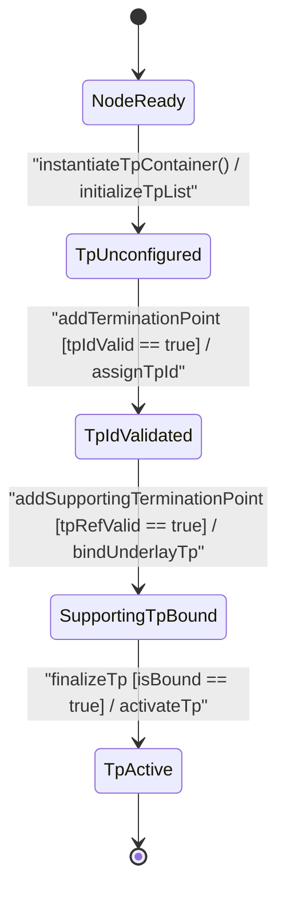

# User Story: [ietf-network-topology]: Directional Termination Point Provisioning, TP-ID Alignment, and Supporting Termination Point Cross-Layer Resolution

## Parent Epic
- [ ] #90 - [[ietf-network-and-topology]: Network and Topology Base Models](https://github.com/gintatkinson/3dgs-037/blob/main/docs/epics/epic-07-ietf-network-and-topology.md) (Parent Epic defining base network and topology models)

## Domain Object Mapping
- **Primary Domain Objects:** `Node`, `TerminationPoint`, `SupportingTerminationPoint`, `SubsystemComponent`
- **Actor/Role:** `userActor : UserActor` (interface provisioning engineer)

## BDD Scenario (OOA/OOD Realization)

### Scenario 1: Directional Termination Point Instantiation on Topological Node
**Given** an active node `"node-01"` in network `"overlay-net"`  
**When** `userActor` provisions a `TerminationPoint` with `tpId` set to `"urn:ietf:params:xml:ns:yang:ietf-network-topology?tp=tp-1"`  
**Then** `addTerminationPoint("overlay-net", "node-01", "urn:ietf:params:xml:ns:yang:ietf-network-topology?tp=tp-1")` returns `true` and the TP is bound to the node.

### Scenario 2: Supporting Termination Point Compound Key Binding (network-ref, node-ref, tp-ref)
**Given** an active overlay termination point `"tp-1"` on node `"node-01"` in network `"overlay-net"`  
**When** `userActor` attaches a `SupportingTerminationPoint` with `networkRef` = `"underlay-net"`, `nodeRef` = `"underlay-node"`, and `tpRef` = `"urn:ietf:params:xml:ns:yang:ietf-network-topology?tp=eth-0"`  
**Then** `validateTpRef("underlay-net", "underlay-node", "urn:ietf:params:xml:ns:yang:ietf-network-topology?tp=eth-0")` returns `isValid : Boolean` as `true` and cross-layer interface mapping is established.

### Scenario 3: Rejection of Missing Mandatory TP-ID Key Leaf
**Given** a request to add a termination point to node `"node-01"`  
**When** the request omits the mandatory `tpId` key leaf  
**Then** the datastore rejects the transaction with a schema validation error `Status`.

## UML Sequence Diagram


## UML State Machine Diagram


## Operational Context
```text
Section 4.4. Termination Points
A termination point can terminate a link. Depending on the type of topology, a termination point could, for example, refer to a port or an interface.
augment "/nw:networks/nw:network/nw:node" {
  list termination-point {
    key "tp-id";
    leaf tp-id {
      type tp-id;
    }
    list supporting-termination-point {
      key "network-ref node-ref tp-ref";
      leaf network-ref {
        type leafref {
          path "../../../nw:supporting-node/nw:network-ref";
          require-instance false;
        }
      }
      leaf node-ref {
        type leafref {
          path "../../../nw:supporting-node/nw:node-ref";
          require-instance false;
        }
      }
      leaf tp-ref {
        type leafref {
          path "/nw:networks/nw:network[nw:network-id=current()/../network-ref]/nw:node[nw:node-id=current()/../node-ref]/termination-point/tp-id";
          require-instance false;
        }
      }
    }
  }
}
```

## Required Features Matrix
- [ ] #88 - [[ietf-network-topology: Termination Point Data Model]](https://github.com/gintatkinson/3dgs-037/blob/main/docs/features/feat-27-termination-point-data-model.md) (Provides termination-point list, tp-id key, and supporting-termination-point compound leafref mapping)
- [ ] #87 - [[ietf-network: Node Data Model and Supporting Nodes]](https://github.com/gintatkinson/3dgs-037/blob/main/docs/features/feat-26-node-data-model-and-supporting-nodes.md) (Provides parent node context)

## Source References
Structural Schema: https://github.com/YangModels/yang/blob/main/standard/ietf/RFC/ietf-network-topology%402018-02-26.yang
Normative Specification: https://datatracker.ietf.org/doc/rfc8345/
