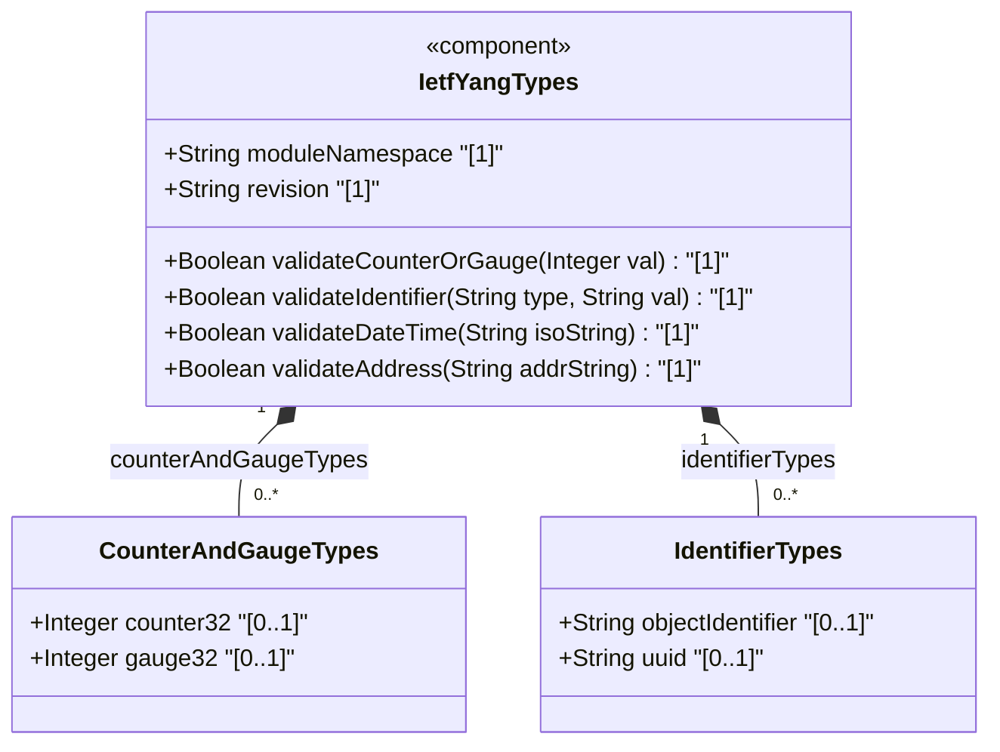
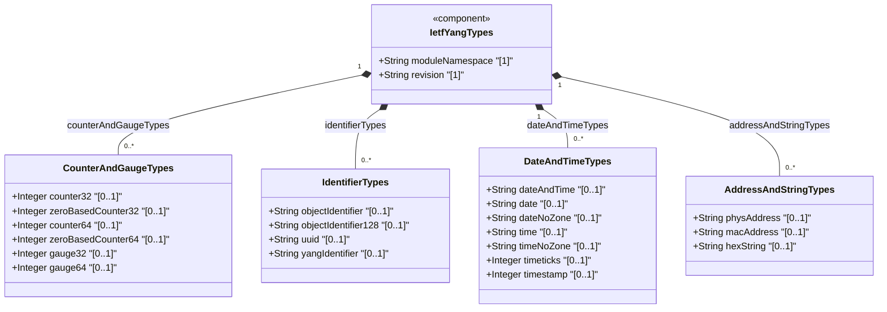
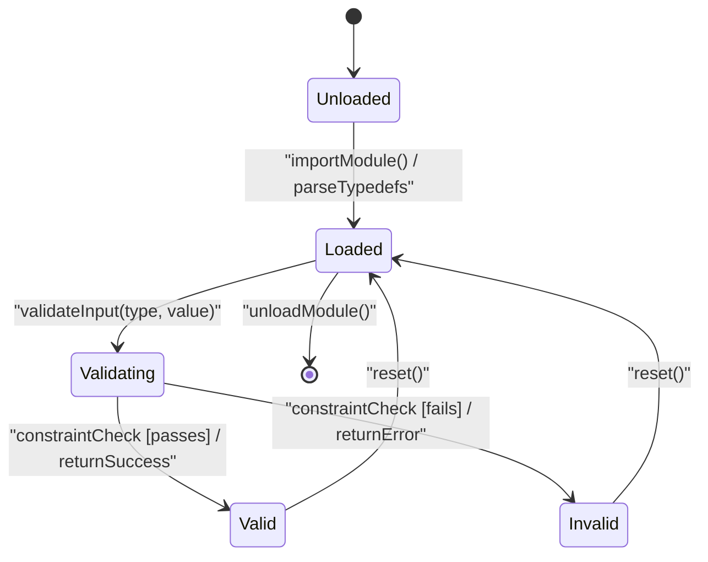

# Epic: [ietf-yang-types]: Common YANG Data Types

## 1. Context
This Epic covers the complete structural specification of the `ietf-yang-types` YANG module (`ietf-yang-types@2025-12-22.yang`) as defined in RFC 9911. The module provides a comprehensive, normative set of derived YANG typedef data types for use across IETF network management standards.

The `ietf-yang-types` module supersedes RFC 6991 (`ietf-yang-types@2013-07-15`) and is the canonical IETF source for common YANG data type definitions. It is organized into four functional type groupings:

1. **Counter and Gauge Types** — Non-negative integer types for network telemetry, monitoring, performance metrics, and operational state tracking. Includes `counter32`, `zero-based-counter32`, `counter64`, `zero-based-counter64`, `gauge32`, and `gauge64`.
2. **Identifier Types** — Structured string types for ASN.1 registration hierarchies (OIDs), RFC 9562 UUIDs, and YANG 1.1 language identifiers. Includes `object-identifier`, `object-identifier-128`, `uuid`, and `yang-identifier`.
3. **Date and Time Types** — ISO 8601 / RFC 3339 / RFC 9557 compliant temporal types covering calendar dates, recurring times, signed duration periods (hours through nanoseconds), and SMIv2-compatible timeticks/timestamp types. Covers 16 typedef definitions.
4. **Address and String Types** — Network address and string utility types, including `phys-address`, `mac-address`, `xpath1.0`, `hex-string`, and related format-constrained string types.

## 2. Requirements & Checklist
- [ ] #1 - [Counter and Gauge Data Types](https://github.com/gintatkinson/3dgs-037/blob/main/docs/features/feat-01-counter-and-gauge-types.md) (counter32, zero-based-counter32, counter64, zero-based-counter64, gauge32, gauge64 — RFC 9911 §§3.1–3.6)
- [ ] #2 - [Identifier Data Types](https://github.com/gintatkinson/3dgs-037/blob/main/docs/features/feat-02-identifier-types.md) (object-identifier, object-identifier-128, uuid, yang-identifier — RFC 9911 §§3.7–3.10)
- [ ] #3 - [Date and Time Data Types](https://github.com/gintatkinson/3dgs-037/blob/main/docs/features/feat-03-date-and-time-types.md) (date-and-time, date, date-no-zone, time, time-no-zone, duration types, timeticks, timestamp — RFC 9911 §§3.11–3.26)
- [ ] #4 - [Address and String Data Types](https://github.com/gintatkinson/3dgs-037/blob/main/docs/features/feat-04-address-and-string-types.md) (phys-address, mac-address, xpath1.0, hex-string, and string utility types — RFC 9911 §§3.27+)

### Associated Use Cases & User Stories

#### Associated Use Cases
*To be populated after Phase 3*

#### Associated User Stories
*To be populated after Phase 3*

## 3. Architecture

### Subsystem Component Definition
The `ietf-yang-types` module acts as a shared type library subsystem, providing primitive derived type definitions consumed by all network management modules. Its provided interface is the set of canonical typedef names; its required interfaces are the IETF base YANG type system and the referenced external specifications (SMIv2, ASN.1, RFC 3339, RFC 9557, RFC 9562, RFC 7950).

## System-Level UML Class Diagram

## State Machine Definitions

## System State Machine Diagram

## 4. Operational Considerations
- **Module Import**: Consuming YANG modules MUST import `ietf-yang-types` using the `yang-types` prefix per the module's `prefix` statement.
- **Backward Compatibility**: `ietf-yang-types@2025-12-22` is backward-compatible with RFC 6991 for the overlapping typedef names. New typedefs (e.g., `date`, `date-no-zone`, `time`, `time-no-zone`, duration types) are additive.
- **Counter Discontinuities**: Management systems MUST handle discontinuity timestamps when counter32/counter64 nodes reset. Polling intervals MUST be shorter than the minimum wrap time to avoid delta calculation invalidation.
- **Leap Second Handling**: Implementations supporting `date-and-time`, `time`, and `time-no-zone` MUST permit the seconds value `60` only during valid leap second intervals.
- **RFC 9557 Timezone Semantics**: Offset `Z` vs `+00:00` carry distinct semantics per RFC 9557 §2. Applications MUST treat them differently when tracking local time zone reference points.

## 5. Security & Governance
- **No Write/Config Nodes**: `counter32` and `counter64` MUST NOT be used in `config true` schema nodes. Violations are design errors detectable at compile time.
- **Input Validation**: All typedef values received from external systems (management stations, northbound APIs) MUST be validated against the normative regex patterns before use to prevent injection or parsing errors.
- **OID Sub-Identifier Overflow**: Sub-identifiers exceeding $2^{32}-1$ MUST be rejected to prevent integer overflow in OID processing engines.
- **UUID Canonicalization**: UUID values SHOULD be normalized to lowercase canonical form to prevent duplicate-key attacks in UUID-indexed data stores.
- **YANG Identifier Safety**: `yang-identifier` values received from untrusted sources MUST be validated against the RFC 7950 §14 pattern before use as schema node names to prevent schema injection.

## Specification Context
The `ietf-yang-types` YANG module (RFC 9911) provides common derived type definitions for use in YANG data models. It supersedes `ietf-yang-types` as defined in RFC 6991. The module namespace is `urn:ietf:params:xml:ns:yang:ietf-yang-types` with prefix `yang`. This revision (`2025-12-22`) adds new temporal types (`date`, `date-no-zone`, `time`, `time-no-zone`), duration types (`hours32` through `nanoseconds64`), and aligns timezone offset semantics with RFC 9557.

## 6. Source References
Structural Schema: https://github.com/gintatkinson/3dgs-037/blob/main/standard/ietf/RFC/ietf-yang-types%402025-12-22.yang
Normative Specification: https://datatracker.ietf.org/doc/rfc9911/
