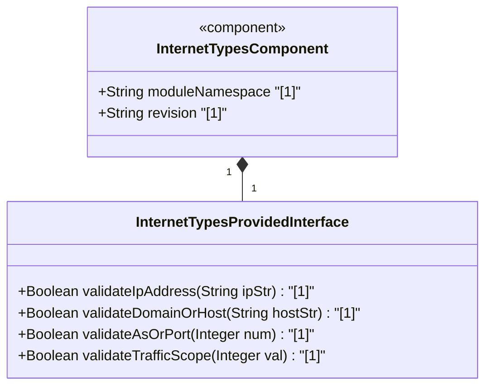
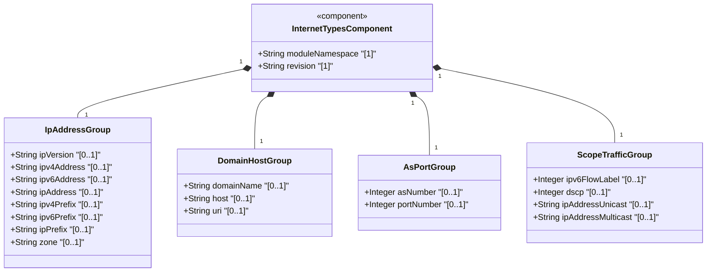
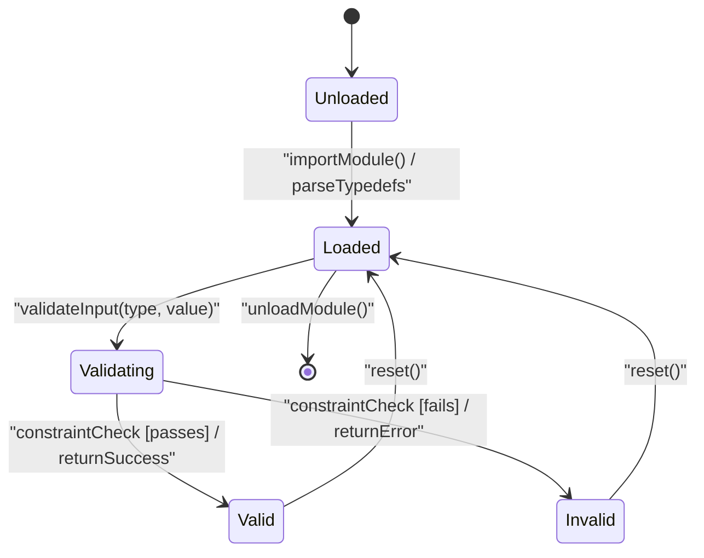

# Epic: [ietf-inet-types]: Common Internet Data Types

## 1. Context
This Epic covers the full structural specification of the `ietf-inet-types` YANG module (`ietf-inet-types@2013-07-15.yang`) defined in RFC 6021 and RFC 6991. The module defines a standardized, reusable set of Internet protocol data types for use across all IETF network management models.

The `ietf-inet-types` module forms a foundational data type library that standardizes representation of core network address schemas, naming identifiers, transport protocol ports, traffic classification marks, and routing system identifiers across four distinct functional categories:

1. **IP Address Data Types** — Scalar types, unions, prefixes, and zone-scoped variants for IPv4 and IPv6 network addressing. Includes `ip-version`, `ipv4-address`, `ipv6-address`, `ip-address`, `ipv4-prefix`, `ipv6-prefix`, `ip-prefix`, zone variants (`ipv4-address-no-zone`, `ipv6-address-no-zone`, `ip-address-no-zone`, `ipv4-prefix-no-zone`, `ipv6-prefix-no-zone`, `ip-prefix-no-zone`), and `zone`.
2. **Domain Name and Host Data Types** — Fully Qualified Domain Names (FQDN), host address unions, and URI formats. Includes `domain-name`, `host` (union of `ip-address` and `domain-name`), and `uri` (RFC 3986 format).
3. **Autonomous System and Port Number Data Types** — BGP routing autonomous system numbers and transport layer port numbers. Includes `as-number` (32-bit unsigned integer representation for AS numbers) and `port-number` (16-bit transport port 0..65535).
4. **IP Unicast, Multicast, and Scope Data Types** — Quality-of-service, flow identification, traffic class, and address scope classification data types. Includes `ipv6-flow-label` (20-bit integer 0..1048575), `dscp` (Differentiated Services Code Point 0..63), `ip-address-unicast`, `ip-address-multicast`, and `ip-scope`.

## 2. Requirements & Checklist
- [ ] #20 - [ietf-inet-types: IP Address Data Types](https://github.com/gintatkinson/3dgs-037/blob/main/docs/features/feat-05-ip-address-types.md) (IP version, IPv4/v6 addresses, prefixes, zone variants)
- [ ] #21 - [ietf-inet-types: Domain Name and Host Data Types](https://github.com/gintatkinson/3dgs-037/blob/main/docs/features/feat-06-domain-name-and-host-types.md) (DNS domain names, host union, URI syntax)
- [ ] #22 - [ietf-inet-types: Autonomous System and Port Number Data Types](https://github.com/gintatkinson/3dgs-037/blob/main/docs/features/feat-07-autonomous-system-and-port-types.md) (AS numbers 32-bit, transport port numbers 16-bit)
- [ ] #23 - [ietf-inet-types: IP Unicast, Multicast, and Scope Data Types](https://github.com/gintatkinson/3dgs-037/blob/main/docs/features/feat-08-ip-unicast-multicast-and-scope-types.md) (IPv6 flow label, DSCP traffic class, address scope classifications)

### Associated Use Cases & User Stories

#### Associated Use Cases
- [ ] #TBD - [IP Address Parsing and Zone Identifier Scoping](https://github.com/gintatkinson/3dgs-037/blob/main/docs/use-cases/uc-05-ip-address-parsing.md) (Validates IPv4/v6 address and prefix syntax, zone index resolution, and CIDR prefix bounds)
- [ ] #TBD - [DNS Domain Name and URI Format Validation](https://github.com/gintatkinson/3dgs-037/blob/main/docs/use-cases/uc-06-domain-and-uri-validation.md) (Validates FQDN syntax rules, host union parsing, and RFC 3986 URI structure)
- [ ] #TBD - [Autonomous System and Transport Port Validation](https://github.com/gintatkinson/3dgs-037/blob/main/docs/use-cases/uc-07-as-and-port-validation.md) (Validates 32-bit AS number representation and 16-bit transport port bounds)
- [ ] #TBD - [Traffic Classification and Scope Identification](https://github.com/gintatkinson/3dgs-037/blob/main/docs/use-cases/uc-08-traffic-classification.md) (Validates IPv6 flow labels, DSCP marking, and address scope classification)

#### Associated User Stories
- [ ] #TBD - [IPv4 and IPv6 Textual Notation Representation](https://github.com/gintatkinson/3dgs-037/blob/main/docs/user-stories/us-11-ip-textual-representation.md) (Validates canonical dot-decimal IPv4 and zero-compressed hex IPv6 formatting)
- [ ] #TBD - [IPv4 and IPv6 Prefix Length Bounds Enforcement](https://github.com/gintatkinson/3dgs-037/blob/main/docs/user-stories/us-12-ip-prefix-bounds.md) (Validates CIDR prefix length bounds 0..32 for IPv4 and 0..128 for IPv6)
- [ ] #TBD - [Zone-Scoped IPv6 Interface Index Disambiguation](https://github.com/gintatkinson/3dgs-037/blob/main/docs/user-stories/us-13-zone-scoped-ipv6.md) (Validates percent-delimited interface zone indices on link-local IPv6 addresses)
- [ ] #TBD - [DNS FQDN Subdomain Label Length Enforcement](https://github.com/gintatkinson/3dgs-037/blob/main/docs/user-stories/us-14-dns-label-length.md) (Validates max 63 octets per DNS label and max 253 octets total domain length)
- [ ] #TBD - [Host Union Resolution Strategy](https://github.com/gintatkinson/3dgs-037/blob/main/docs/user-stories/us-15-host-union-resolution.md) (Validates union discrimination between literal IP addresses and DNS domain names)
- [ ] #TBD - [RFC 3986 URI Syntax and Scheme Validation](https://github.com/gintatkinson/3dgs-037/blob/main/docs/user-stories/us-16-uri-syntax-validation.md) (Validates scheme, authority, path, query, and fragment parsing of URI values)
- [ ] #TBD - [32-Bit AS Number Plaintext Representation](https://github.com/gintatkinson/3dgs-037/blob/main/docs/user-stories/us-17-as-number-representation.md) (Validates 32-bit unsigned integer range 0..4294967295 for autonomous system numbers)
- [ ] #TBD - [Transport Layer Port Number 16-Bit Range Validation](https://github.com/gintatkinson/3dgs-037/blob/main/docs/user-stories/us-18-port-number-range.md) (Validates 16-bit port number boundaries 0..65535)
- [ ] #TBD - [IPv6 20-Bit Flow Label Range Enforcement](https://github.com/gintatkinson/3dgs-037/blob/main/docs/user-stories/us-19-ipv6-flow-label-range.md) (Validates IPv6 flow label values within 0..1048575)
- [ ] #TBD - [Differentiated Services Code Point (DSCP) 6-Bit Range Validation](https://github.com/gintatkinson/3dgs-037/blob/main/docs/user-stories/us-20-dscp-code-point-range.md) (Validates 6-bit DSCP values within range 0..63)

## 3. Architecture

### Subsystem Component Definition
The `ietf-inet-types` module functions as an autonomous internet data type library component providing derived types for IP networks, domain names, URI schemes, routing identifiers, and traffic markers.

## System-Level UML Class Diagram

## State Machine Definitions

## System State Machine Diagram

## 4. Operational Considerations
- **Module Import & Prefixing**: Consuming YANG modules MUST import `ietf-inet-types` using prefix `inet` per the module's `prefix` statement.
- **Zone Disambiguation**: Link-local IPv6 address parsing MUST support zone identifiers delimited by `%` (e.g. `fe80::1%eth0`) when using zone-aware variants, while no-zone typedefs MUST reject zone indices.
- **Canonical Formatting**: IPv6 addresses SHOULD be normalized to canonical RFC 5952 representation (lowercase hexadecimal, zero-compression using `::` for the longest run of zero blocks).
- **URI Encoding**: Implementations MUST validate `uri` strings against RFC 3986 syntax rules and ensure percent-encoding (`%XX`) compliance.
- **AS Number Range**: AS numbers span 32-bit unsigned integers (`0..4294967295`), covering both 16-bit legacy AS numbers and 32-bit expanded AS numbers in decimal notation.

## 5. Security & Governance
- **Injection Prevention**: Domain names and URIs received from untrusted inputs MUST be validated against their respective syntax regular expressions before passing to system resolvers or shell execution boundaries.
- **Port Bound Enforcement**: Transport port numbers MUST be constrained to `0..65535`. Systems configuring firewall rules or socket bindings MUST reject negative or out-of-range port values.
- **Flow Label Isolation**: The `ipv6-flow-label` typedef MUST enforce the 20-bit boundary (`0..1048575`). Values outside this range MUST be rejected to prevent packet header corruption.
- **DSCP Boundary**: The `dscp` typedef MUST restrict values to 6 bits (`0..63`), matching RFC 2474 Quality of Service field limits.

## Specification Context
The `ietf-inet-types` YANG module (RFC 6021 / RFC 6991) defines a collection of derived data types for Internet addresses and related parameters. The module namespace is `urn:ietf:params:xml:ns:yang:ietf-inet-types` with prefix `inet`. It provides standardized typedefs for IPv4 and IPv6 addresses, prefixes, domain names, URIs, autonomous system numbers, port numbers, IPv6 flow labels, and DSCP traffic markers for use across IETF data models.

## 6. Source References
Structural Schema: https://github.com/YangModels/yang/blob/main/standard/ietf/RFC/ietf-inet-types%402013-07-15.yang
Normative Specification: https://datatracker.ietf.org/doc/rfc6021/
