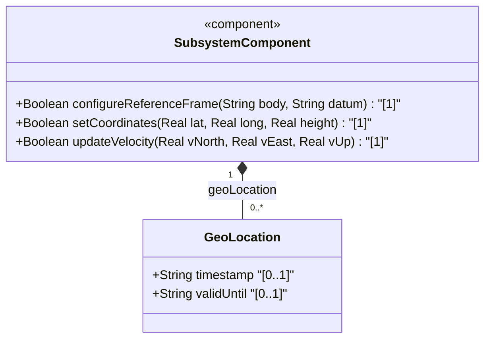
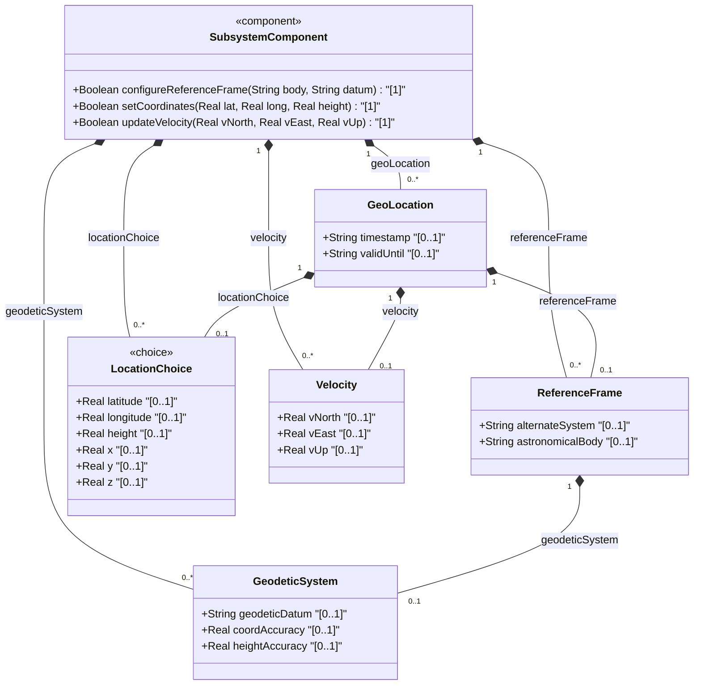
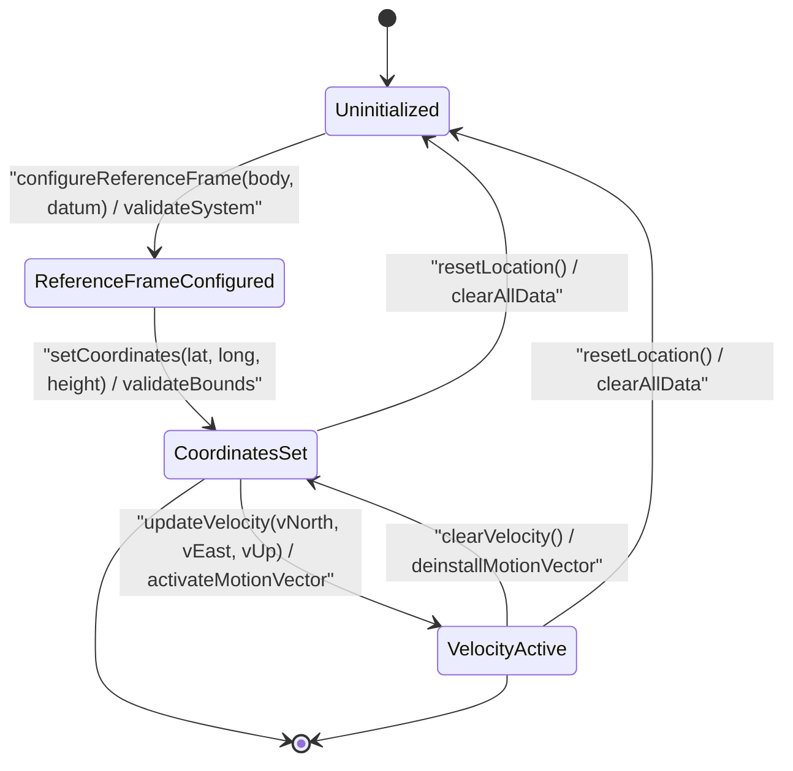

# Epic: [ietf-geo-location]: Geographic Location Management

## 1. Context
This Epic encompasses the complete geographic location management capabilities defined in RFC 9179 (`ietf-geo-location@2022-02-11.yang`). It establishes a reusable, platform-independent YANG grouping for specifying geographical locations on Earth or any celestial astronomical body (such as Mars, the Moon, or asteroids).

The `ietf-geo-location` module models reference frames, geodetic systems, spatial coordinate choices (ellipsoid vs. Cartesian), motion vectors, and temporal validity bounds. It serves as a core location infrastructure provider for physical network inventories, device placement tracking, fiber endpoints, and spatial topology visualization.

**Parent Epic**: [Epic #38: [ietf-geo-location]: Geographic Location Management](https://github.com/gintatkinson/3dgs-037/blob/main/docs/epics/epic-03-ietf-geo-location.md)

## 2. Requirements & Checklist
- [x] #34 - [ietf-geo-location: Geodetic Reference Frame](https://github.com/gintatkinson/3dgs-037/blob/main/docs/features/feat-09-geodetic-reference-frame.md) (reference-frame, alternate-system, astronomical-body)
- [x] #35 - [ietf-geo-location: Geodetic System and Accuracy Bounds](https://github.com/gintatkinson/3dgs-037/blob/main/docs/features/feat-10-geodetic-system-and-accuracy.md) (geodetic-system, geodetic-datum, coord-accuracy, height-accuracy)
- [x] #36 - [ietf-geo-location: Geographic Coordinates and Altitude](https://github.com/gintatkinson/3dgs-037/blob/main/docs/features/feat-11-coordinates-and-altitude.md) (geo-location, latitude, longitude, height, x, y, z, timestamp, valid-until)
- [x] #37 - [ietf-geo-location: Motion and Velocity Vectors](https://github.com/gintatkinson/3dgs-037/blob/main/docs/features/feat-12-motion-and-velocity-vectors.md) (velocity, v-north, v-east, v-up)

### Associated Use Cases & User Stories

#### Associated Use Cases
- [ ] #44 - [[ietf-geo-location]: Geodetic Reference Frame Configuration](https://github.com/gintatkinson/3dgs-037/blob/main/docs/use-cases/uc-09-geodetic-reference-frame-configuration.md) (Configures astronomical body assignment, geodetic reference frame, and optional alternate coordinate systems)
- [ ] #45 - [[ietf-geo-location]: Geodetic System and Accuracy Assessment](https://github.com/gintatkinson/3dgs-037/blob/main/docs/use-cases/uc-10-geodetic-system-and-accuracy-assessment.md) (Selects geodetic datum and evaluates horizontal coordinate and vertical height accuracy precision bounds)
- [ ] #43 - [[ietf-geo-location]: Geographic Coordinates and Altitude Ingestion](https://github.com/gintatkinson/3dgs-037/blob/main/docs/use-cases/uc-11-geographic-coordinates-and-altitude-ingestion.md) (Ingests 3D geodetic or Cartesian coordinates, parses ellipsoidal height, and tracks temporal validity)
- [ ] #46 - [[ietf-geo-location]: Motion and Velocity Telemetry Processing](https://github.com/gintatkinson/3dgs-037/blob/main/docs/use-cases/uc-12-motion-and-velocity-telemetry-processing.md) (Processes 3D velocity vectors, calculates scalar speed, and derives 2D heading angle)
- [ ] #59 - [Facility Geodetic Coordinate Binding, Spatial Coordinate Synchronization, and Altitude Offset Mapping](https://github.com/gintatkinson/3dgs-037/blob/main/docs/use-cases/uc-16-geodetic-location-synchronization-and-mapping.md) (Binds physical network inventory rack installations to 3D geodetic coordinates, spatial coordinate synchronization, and reference ellipsoid altitude offsets via ietf-geo-location augmentation)

#### Associated User Stories
- [ ] #39 - [[ietf-geo-location]: Geodetic Reference Frame Validation](https://github.com/gintatkinson/3dgs-037/blob/main/docs/user-stories/us-16-geodetic-reference-frame-validation.md) (Validates reference frame datum selection and ellipsoid parameters)
- [ ] #40 - [[ietf-geo-location]: 3D Coordinates and Altitude Parsing](https://github.com/gintatkinson/3dgs-037/blob/main/docs/user-stories/us-17-3d-coordinates-and-altitude-parsing.md) (Validates latitude, longitude, and height coordinate bounds)
- [ ] #41 - [[ietf-geo-location]: Motion Vector Velocity Calculation](https://github.com/gintatkinson/3dgs-037/blob/main/docs/user-stories/us-18-motion-vector-velocity-calculation.md) (Validates motion vectors, speed, and heading calculations)
- [ ] #42 - [[ietf-geo-location]: Location Uncertainty Ellipse Bounds](https://github.com/gintatkinson/3dgs-037/blob/main/docs/user-stories/us-19-location-uncertainty-ellipse-bounds.md) (Validates coordinate and height accuracy uncertainty bounds)
- [ ] #55 - [[ietf-ni-location]: Geodetic Location Binding (ietf-geo-location augmentation), Spatial Coordinate Synchronization, and Altitude Offset Verification](https://github.com/gintatkinson/3dgs-037/blob/main/docs/user-stories/us-23-geodetic-location-augment-binding.md) (Validates geodetic location binding for network inventory racks via ietf-geo-location augmentation)
## 3. Architecture

### Subsystem Component Definition
The `ietf-geo-location` subsystem component exposes operational management interfaces to set, update, and evaluate geographic coordinates, geodetic reference frames, and velocity vectors.

## System-Level UML Class Diagram

## State Machine Definitions
The lifecycle of geographic location management transitions through four primary operational states:
1. **Uninitialized**: Location data is unconfigured or cleared.
2. **ReferenceFrameConfigured**: Astronomical body, geodetic datum, and optional alternate system parameters have been established.
3. **CoordinatesSet**: Valid 2D/3D geodetic (latitude/longitude/height) or 3D Cartesian (x/y/z) coordinates are assigned to the entity.
4. **VelocityActive**: Motion vector parameters (`v-north`, `v-east`, `v-up`) are actively tracked alongside coordinate position.

## System State Machine Diagram

## 4. Operational Considerations
- **Astronomical Body Alignment**: By default, `astronomical-body` defaults to `earth`. External systems configuring non-terrestrial locations MUST provide valid IAU-recognized celestial body identifiers.
- **Datum Resolution**: The default geodetic datum is `wgs-84`. Coordinates MUST be interpreted according to the active geodetic datum's origin and ellipsoid definition.
- **Accuracy Overrides**: Optional `coord-accuracy` and `height-accuracy` values override default uncertainty bounds specified by the geodetic datum.
- **Temporal Validity**: Location instances MAY include `timestamp` and `valid-until` properties to bound temporal freshness and support historical tracking or dynamic expiry.

## 5. Security & Governance
- **Access Control & Privacy**: Geographic location data can reveal physical locations of sensitive data centers, network facilities, and personal devices. Access to read or modify location objects MUST be restricted using role-based access controls.
- **Coordinate Bound Validation**: Input coordinates MUST be strictly validated against physical bounds (e.g. latitude within $[-90, 90]$ degrees, longitude within $[-180, 180]$ degrees for standard ellipsoidal models) to prevent database integrity issues.
- **Sanitization of Alternate Systems**: When `alternate-system` is utilized for simulation or virtual coordinate systems, system boundaries MUST ensure virtual coordinates are isolated from production physical asset tracking systems.

## Specification Context
1. Introduction

   In many applications, we would like to specify the location of
   something geographically. Some examples of locations in networking
   might be the location of data centers, a rack in an Internet exchange
   point, a router, a firewall, a port on some device, or it could be
   the endpoints of a fiber, or perhaps the failure point along a fiber.

   Additionally, while this location is typically relative to Earth, it
   does not need to be. Indeed, it is easy to imagine a network or
   device located on the Moon, on Mars, on Enceladus (the moon of
   Saturn), or even on a comet (e.g., 67p/churyumov-gerasimenko).

   Finally, one can imagine defining locations using different frames of
   reference or even alternate systems (e.g., simulations or virtual
   realities).

   This document defines a 'geo-location' YANG grouping that allows for
   all the above data to be captured.

   This specification conforms to [ISO.6709.2008].

   The YANG data model described in this document conforms to the
   Network Management Datastore Architecture (NMDA) defined in
   [RFC8342].

1.1. Terminology

   The key words "MUST", "MUST NOT", "REQUIRED", "SHALL", "SHALL NOT",
   "SHOULD", "SHOULD NOT", "RECOMMENDED", "NOT RECOMMENDED", "MAY", and
   "OPTIONAL" in this document are to be interpreted as described in
   BCP 14 [RFC2119] [RFC8174] when, and only when, they appear in all
   capitals, as shown here.

2. The Geolocation Object

2.1. Frame of Reference

   The frame of reference ('reference-frame') defines what the location
   values refer to and their meaning. The referred-to object can be any
   astronomical body. It could be a planet such as Earth or Mars, a
   moon such as Enceladus, an asteroid such as Ceres, or even a comet
   such as 1P/Halley. This value is specified in 'astronomical-body'
   and is defined by the International Astronomical Union
   <http://www.iau.org>. The default 'astronomical-body' value is
   'earth'.

   In addition to identifying the astronomical body, we also need to
   define the meaning of the coordinates (e.g., latitude and longitude)
   and the definition of 0-height. This is done with a 'geodetic-datum'
   value. The default value for 'geodetic-datum' is 'wgs-84' (i.e., the
   World Geodetic System [WGS84]), which is used by the Global
   Positioning System (GPS) among many others. We define an IANA
   registry for specifying standard values for the 'geodetic-datum'.

   In addition to the 'geodetic-datum' value, we allow overriding the
   coordinate and height accuracy using 'coord-accuracy' and 'height-
   accuracy', respectively. When specified, these values override the
   defaults implied by the 'geodetic-datum' value.

   Finally, we define an optional feature that allows for changing the
   system for which the above values are defined. This optional feature
   adds an 'alternate-system' value to the reference frame. This value
   is normally not present, which implies the natural universe is the
   system. The use of this value is intended to allow for creating
   virtual realities or perhaps alternate coordinate systems. The
   definition of alternate systems is outside the scope of this
   document.

2.2. Location

   This is the location on, or relative to, the astronomical object. It
   is specified using two or three coordinate values. These values are
   given either as 'latitude', 'longitude', and an optional 'height', or
   as Cartesian coordinates of 'x', 'y', and 'z'. For the standard
   location choice, 'latitude' and 'longitude' are specified as decimal
   degrees, and the 'height' value is in fractions of meters. For the
   Cartesian choice, 'x', 'y', and 'z' are in fractions of meters. In
   both choices, the exact meanings of all the values are defined by the
   'geodetic-datum' value in Section 2.1.

2.3. Motion

   Support is added for objects in relatively stable motion. For
   objects in relatively stable motion, the grouping provides a three-
   dimensional vector value. The components of the vector are
   'v-north', 'v-east', and 'v-up', which are all given in fractional
   meters per second. The values 'v-north' and 'v-east' are relative to
   true north as defined by the reference frame for the astronomical
   body; 'v-up' is perpendicular to the plane defined by 'v-north' and
   'v-east', and is pointed away from the center of mass.

   To derive the two-dimensional heading and speed, one would use the
   following formulas:

                 ,------------------------------
       speed =  V  v_{north}^{2} + v_{east}^{2}

       heading = arctan(v_{east} / v_{north})

   For some applications that demand high accuracy and where the data is
   infrequently updated, this velocity vector can track very slow
   movement such as continental drift.

   Tracking more complex forms of motion is outside the scope of this
   work. The intent of the grouping being defined here is to identify
   where something is located, and generally this is expected to be
   somewhere on, or relative to, Earth (or another astronomical body).
   At least two options are available to YANG data models that wish to
   use this grouping with objects that are changing location frequently
   in non-simple ways. A data model can either add additional motion
   data to its model directly, or if the application allows, it can
   require more frequent queries to keep the location data current.

2.4. Nested Locations

   When locations are nested (e.g., a building may have a location that
   houses routers that also have locations), the module using this
   grouping is free to indicate in its definition that the 'reference-
   frame' is inherited from the containing object so that the
   'reference-frame' need not be repeated in every instance of location
   data.

2.5. Non-location Attributes

   During the development of this module, the question of whether it
   would support data such as orientation arose. These types of
   attributes are outside the scope of this grouping because they do not
   deal with a location but rather describe something more about the
   object that is at the location. Module authors are free to add these
   non-location attributes along with their use of this location
   grouping.

2.6. Tree

   The following is the YANG tree diagram [RFC8340] for the geo-location
   grouping.

     module: ietf-geo-location
       grouping geo-location:
         +-- geo-location
            +-- reference-frame
            |  +-- alternate-system?    string {alternate-systems}?
            |  +-- astronomical-body?   string
            |  +-- geodetic-system
            |     +-- geodetic-datum?    string
            |     +-- coord-accuracy?    decimal64
            |     +-- height-accuracy?   decimal64
            +-- (location)?
            |  +--:(ellipsoid)
            |  |  +-- latitude?    decimal64
            |  |  +-- longitude?   decimal64
            |  |  +-- height?      decimal64
            |  +--:(cartesian)
            |     +-- x?           decimal64
            |     +-- y?           decimal64
            |     +-- z?           decimal64
            +-- velocity
            |  +-- v-north?   decimal64
            |  +-- v-east?    decimal64
            |  +-- v-up?      decimal64
            +-- timestamp?         yang:date-and-time
            +-- valid-until?       yang:date-and-time

## 6. Source References
Structural Schema: https://github.com/gintatkinson/3dgs-037/blob/main/standard/ietf/RFC/ietf-geo-location%402022-02-11.yang
Normative Specification: https://datatracker.ietf.org/doc/rfc9179/
