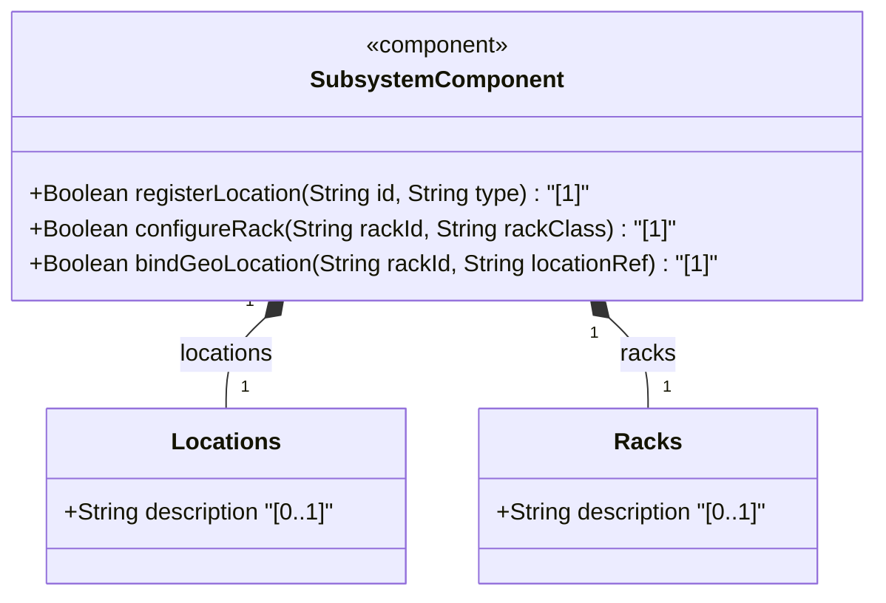
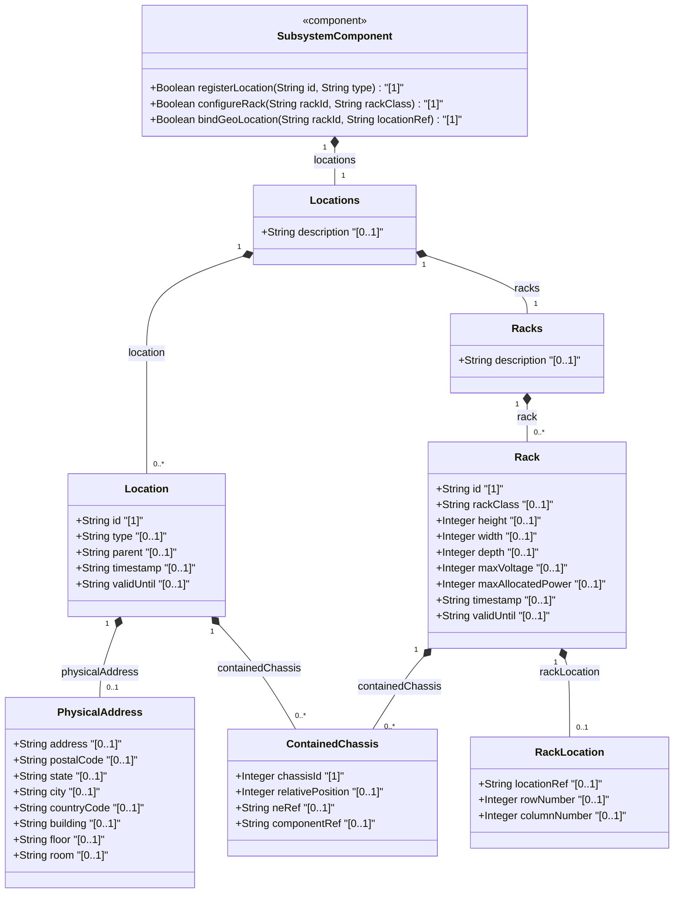
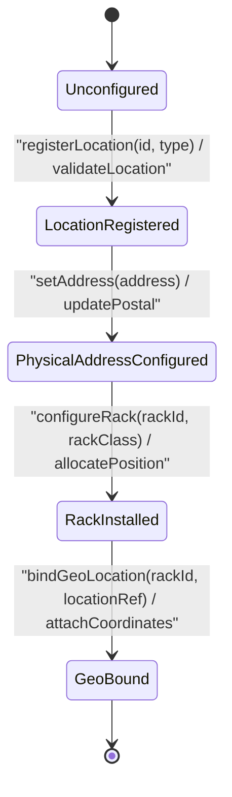

# Epic: [ietf-ni-location]: Network Inventory Location Management

## 1. Context
This Epic establishes the network inventory location management specification defined in `draft-ietf-ivy-network-inventory-location` and its corresponding YANG module `ietf-ni-location.yang`. It specifies the structured modeling of physical locations, postal addresses, building and floor positioning, rack and bay placement, and geo-location binding within network equipment inventories.

The `ietf-ni-location` model extends standard inventory management paradigms by providing a hierarchical and composable location framework. It enables physical network equipment (such as chassis, line cards, and transceivers) to be mapped to precise physical locations—ranging from macro-level postal and civic addresses down to micro-level rack units, bays, rooms, and row/column coordinates. Furthermore, it integrates with `ietf-geo-location` to support 3D coordinate mapping and spatial indexing across multi-site network infrastructure.

## 2. Requirements & Checklist
- [ ] #47 - [ietf-ni-location: Location Inventory Base and Postal Address](https://github.com/gintatkinson/3dgs-037/blob/main/docs/features/feat-13-location-inventory-base-and-postal-address.md) (locations, location, id, type, parent, timestamp, valid-until, physical-address)
- [ ] #48 - [ietf-ni-location: Building and Floor Position Specs](https://github.com/gintatkinson/3dgs-037/blob/main/docs/features/feat-14-building-and-floor-position-specs.md) (room-building-position, building, floor, room, address, postal-code, state, city, country-code)
- [ ] #49 - [ietf-ni-location: Rack and Bay Positioning](https://github.com/gintatkinson/3dgs-037/blob/main/docs/features/feat-15-rack-and-bay-positioning.md) (racks, rack, rack-class, height, width, depth, max-voltage, max-allocated-power, contained-chassis, relative-position)
- [ ] #50 - [ietf-ni-location: Geo-Location Integration Augment](https://github.com/gintatkinson/3dgs-037/blob/main/docs/features/feat-16-geo-location-integration-augment.md) (rack-location, location-ref, row-number, column-number, ietf-geo-location import & binding)

### Associated Use Cases & User Stories

#### Associated Use Cases
*To be populated after Phase 3*
(Leave placeholder list if none yet created)

#### Associated User Stories
- [ ] #52 - [[ietf-ni-location]: Facility Location Creation, Unique Identifier Generation, and Postal Address Formatting/Validation](https://github.com/gintatkinson/3dgs-037/blob/main/docs/user-stories/us-20-location-inventory-onboarding.md) (Validates facility location creation, unique identifier generation, postal address formatting, ISO country code regex, parent hierarchy, and contained chassis assignment)
- [ ] #53 - [[ietf-ni-location]: Building, Floor, and Room Spatial Hierarchy Navigation, Room Name Assignment, and Physical Access Bounds](https://github.com/gintatkinson/3dgs-037/blob/main/docs/user-stories/us-21-building-floor-room-positioning.md) (Validates indoor building, floor, room spatial hierarchy navigation, room name assignment, compound position formatting, and parent access bounds)
- [ ] #54 - [[ietf-ni-location]: Rack Identification, Bay Position Assignment, U-Position Alignment (1U..48U), and Vertical Slot Constraint Enforcement](https://github.com/gintatkinson/3dgs-037/blob/main/docs/user-stories/us-22-rack-unit-bay-positioning-bounds.md) (Validates equipment rack identification, physical dimensions, security classification identityrefs, electrical limits, vertical U-slot relative position alignment, and collision detection)
- [ ] #55 - [[ietf-ni-location]: Geodetic Location Binding (ietf-geo-location augmentation), Spatial Coordinate Synchronization, and Altitude Offset Verification](https://github.com/gintatkinson/3dgs-037/blob/main/docs/user-stories/us-23-geodetic-location-augment-binding.md) (Validates rack-location row/column grid positioning, location-ref leafref binding, geodetic 3D coordinate binding via ietf-geo-location, and altitude offset verification)

## 3. Architecture

### Subsystem Component Definition

## System-Level UML Class Diagram

## State Machine Definitions
Describe operational transitions for locations and racks. Location instances move from `Unconfigured` through `LocationRegistered` and `PhysicalAddressConfigured` as physical and postal attributes are provisioned. Racks progress into `RackInstalled` upon physical dimension and power specification, and finally reach `GeoBound` when linked to geographic coordinate references (`ietf-geo-location`).

## System State Machine Diagram

## 4. Operational Considerations
The network inventory location management model provides operational flexibility across multi-tenant data centers, central offices, and remote PoPs. Key operational aspects include:
- **Location Hierarchy & Parent References**: Recursive parent-child relationships (`parent` leaf) enable arbitrary depth in location nesting (e.g. Region -> City -> Central Office -> Floor -> Room).
- **Physical Rack Placement & Spatial Density**: Racks define physical envelopes (`height`, `width`, `depth`) and power limits (`max-voltage`, `max-allocated-power`) to prevent power/thermal overloading.
- **Chassis Allocation**: `contained-chassis` mappings track chassis positioning within racks (`relative-position`) and link chassis elements to network elements (`ne-ref`) and components (`component-ref`).
- **Temporal Validity & Timestamps**: Timestamps (`timestamp`, `valid-until`) maintain historical auditing and valid operational lifespans for location entries and rack installations.

## 5. Security & Governance
Physical location information and rack positioning are sensitive operational assets subject to enterprise security controls:
- **Role-Based Access Control (RBAC)**: Modifications to location records, physical addresses, and rack allocations must be restricted to authorized network inventory administrators and facility management roles.
- **Physical Address Privacy & Compliance**: Physical street addresses, building access details, and floor plans must be protected against unauthorized data export to satisfy privacy regulations and site physical security mandates.
- **Geo-Location & Rack Placement Confidentiality**: Precision spatial coordinates and row/column rack configurations reveal physical layout details of critical infrastructure. Read and write access should be audited and encrypted in transit and at rest.

## Specification Context
The Network Inventory Location model (`ietf-ni-location`) extends the IETF Network Inventory base hierarchy to represent physical site locations, postal addresses, and rack structures. It standardizes containers for location registries (`locations`) and rack inventories (`racks`).

Locations represent physical points of presence, facilities, or customer premises. Each location record contains an identifier, type classifier, optional parent reference, temporal validity parameters, and postal address fields (street, city, state, postal code, country code, building, floor, room). Racks represent physical mounting frameworks, specifying dimensional parameters, electrical supply capacity, relative row/column layout within a facility, and contained network chassis assignments. Integration with `ietf-geo-location` links physical rack installations to precise 3D geodetic or Cartesian coordinate systems.

## 6. Source References
Structural Schema: https://github.com/gintatkinson/3dgs-037/blob/main/ietf-ni-location.yang (Clause: module ietf-ni-location)
Normative Specification: https://datatracker.ietf.org/doc/html/draft-ietf-ivy-network-inventory-location (Clause: Section 1-5)
