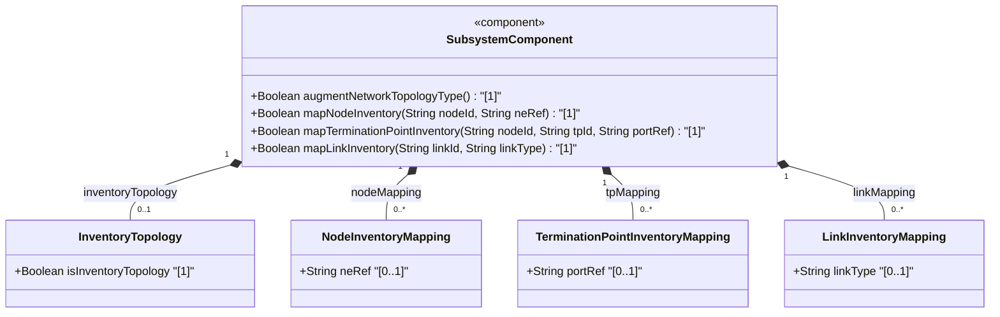
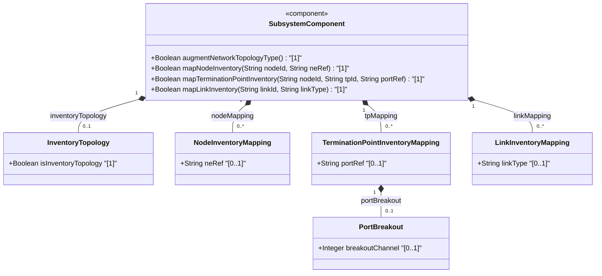
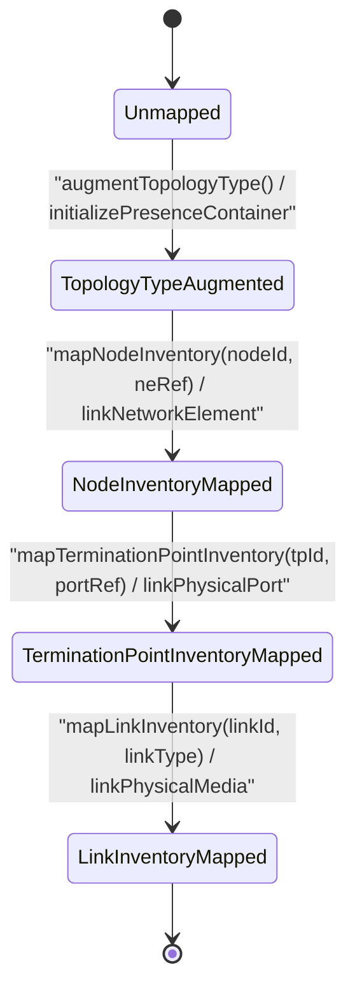

# Epic: [ietf-network-inventory-topology]: Network Inventory Topology Mapping

## 1. Context
This Epic establishes the network inventory topology mapping specification defined in the standard network inventory topology specification and its corresponding YANG module `ietf-network-inventory-topology.yang`. It specifies the structured mapping between logical network topology entities defined in `ietf-network` and `ietf-network-topology` (network topology base model) and physical network inventory entities defined in `ietf-network-inventory`.

The `ietf-network-inventory-topology` model extends standard logical network topology representations by providing explicit augmentations across four key structural dimensions:
1. **Network Topology Type Augmentation**: Introduces the `inventory-topology` presence container under `/nw:networks/nw:network/nw:network-types` to explicitly identify networks that carry physical inventory mapping metadata.
2. **Node Inventory Mapping**: Augments `/nw:networks/nw:network/nw:node` with `inventory-mapping-attributes` containing an `ne-ref` leafref to associate logical nodes with physical network elements in the inventory.
3. **Termination Point Inventory Mapping**: Augments `/nw:networks/nw:network/nw:node/nt:termination-point` with `inventory-mapping-attributes` containing a `port-ref` leafref and a `port-breakout` container with `breakout-channel` assignments to map logical interface endpoints to physical hardware ports and breakout channels.
4. **Link Inventory Mapping**: Augments `/nw:networks/nw:network/nt:link` with `inventory-mapping-attributes` containing a `link-type` leaf to represent the underlying physical transmission media or connectivity classification.

## 2. Requirements & Checklist
- [ ] #60 - [ietf-network-inventory-topology: Network Inventory Topology Type Augment](https://github.com/gintatkinson/3dgs-037/blob/main/docs/features/feat-17-network-inventory-topology-type-augment.md) (inventory-topology presence container)
- [ ] #61 - [ietf-network-inventory-topology: Node Inventory Mapping Augment](https://github.com/gintatkinson/3dgs-037/blob/main/docs/features/feat-18-node-inventory-mapping-augment.md) (inventory-mapping-attributes, ne-ref)
- [ ] #62 - [ietf-network-inventory-topology: Termination Point Inventory Mapping Augment](https://github.com/gintatkinson/3dgs-037/blob/main/docs/features/feat-19-termination-point-inventory-mapping-augment.md) (inventory-mapping-attributes, port-ref, port-breakout, breakout-channel)
- [ ] #63 - [ietf-network-inventory-topology: Link Inventory Mapping Augment](https://github.com/gintatkinson/3dgs-037/blob/main/docs/features/feat-20-link-inventory-mapping-augment.md) (inventory-mapping-attributes, link-type)

### Associated Use Cases & User Stories

#### Associated Use Cases
*To be populated after Phase 3*

#### Associated User Stories
*To be populated after Phase 3*

## 3. Architecture

### Subsystem Component Definition

## System-Level UML Class Diagram

## State Machine Definitions
Describe operational transitions for mapping logical network topology objects to physical network inventory assets. The subsystem begins in the `Unmapped` state. Calling `augmentNetworkTopologyType()` transitions the network to `TopologyTypeAugmented` when the presence container `inventory-topology` is present. Nodes are linked to physical network elements (`ne-ref`) transitioning to `NodeInventoryMapped`. Termination points map to component ports (`port-ref`) and optional breakout channels (`breakout-channel`) reaching `TerminationPointInventoryMapped`. Finally, logical links associate with physical link types (`link-type`) transitioning to `LinkInventoryMapped`.

## System State Machine Diagram

## 4. Operational Considerations
The network inventory topology mapping model provides unified correlation between logical abstraction models (such as TE topologies, L2/L3 VPN topologies, or optical transport topologies) and concrete physical hardware assets:
- **Cross-Layer Traceability**: `ne-ref` and `port-ref` leafrefs establish direct cross-layer pointer relationships between logical topology nodes/termination points and physical network element/component instances in the `ietf-network-inventory` database.
- **Channelization & Port Breakouts**: `port-breakout` and `breakout-channel` attributes support multi-channel optical interfaces (e.g. 400G interfaces broken down into 4x100G breakout channels), ensuring fine-grained mapping down to individual sub-ports.
- **Physical Link Media Classification**: `link-type` attributes distinguish physical interconnect types (e.g., single-mode fiber, multi-mode fiber, DAC copper, or virtual cross-connects) to aid physical path computation and optical impairment calculation.

## 5. Security & Governance
Topology mapping data bridges abstract logical networks with physical facility hardware and cable plant layouts, making it subject to strict security policies:
- **Access Control & Integrity**: Modifications to `inventory-mapping-attributes` must be restricted to authorized topology controllers and inventory management engines to prevent physical route manipulation.
- **Cross-Domain Privacy & Confidentiality**: Multi-tenant virtual network topologies must not expose physical inventory reference details (`ne-ref`, `port-ref`) to external tenants where hardware location or co-location sharing could compromise physical security.

## Specification Context
The Network Inventory Topology model (`ietf-network-inventory-topology`) extends generic network topology data models (`ietf-network` and `ietf-network-topology`, network topology base model) to anchor abstract network topology elements onto physical inventory assets.

The model defines four augmentations:
1. `augment "/nw:networks/nw:network/nw:network-types"` adds `inventory-topology`, indicating that a network instance contains physical inventory mapping attributes.
2. `augment "/nw:networks/nw:network/nw:node"` adds `inventory-mapping-attributes` with `ne-ref`, referencing a network element in `ietf-network-inventory`.
3. `augment "/nw:networks/nw:network/nw:node/nt:termination-point"` adds `inventory-mapping-attributes` with `port-ref` and optional `port-breakout/breakout-channel`, referencing a physical port component.
4. `augment "/nw:networks/nw:network/nt:link"` adds `inventory-mapping-attributes` with `link-type`, indicating the physical link media type.

## 6. Source References
Structural Schema: https://github.com/gintatkinson/3dgs-037/blob/main/yang/ietf-network-inventory-topology.yang (Clause: Section 5)
Normative Specification: https://datatracker.ietf.org/doc/html/draft-ietf-ivy-network-inventory-topology (Clause: Section 4)
