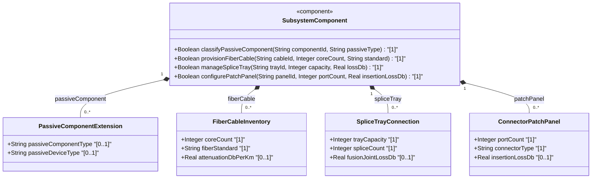
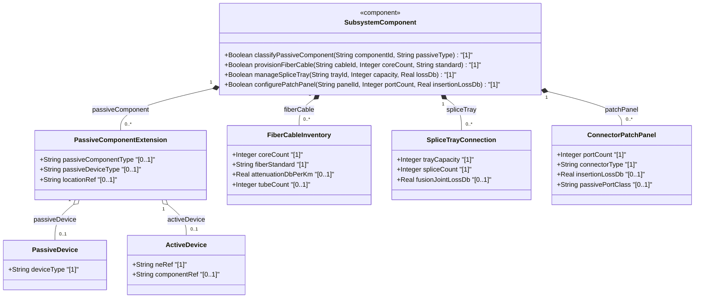
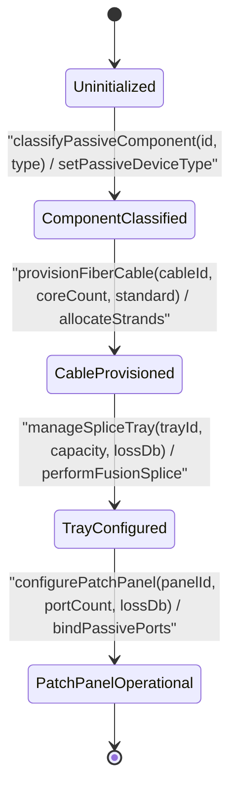

# Epic: [ietf-nwi-passive-inventory]: Passive Network Inventory Management

## 1. Context
This Epic establishes the passive network inventory management specification defined in the IETF Passive Network Inventory YANG model `ietf-nwi-passive-inventory.yang` and its normative specification `draft-ygb-ivy-passive-network-inventory`. It specifies the structured modeling of non-powered physical components, optical cable plant, splice trays, and patch panel interconnections within telecommunications access and transport networks.

The `ietf-nwi-passive-inventory` model extends the base network equipment inventory schema (`ietf-network-inventory`) by providing explicit augmentations across four key structural dimensions:
1. **Passive Component Classification & Extension Augment**: Augments network equipment components (`/nwi:equipment/nwi:component`) with a `passive-component` presence container to classify unpowered equipment (such as ODF, WDM, FAT, FDT, and ATB) or attach passive extension attributes to active network elements.
2. **Fiber Cable & Strand Inventory Augment**: Defines optical cable and strand inventory models (`fiber-cable`), capturing optical core counts, optical fiber standards (G.652 to G.657), optical attenuation coefficients (dB/km), and multi-tube loose-tube cable hierarchies.
3. **Splice Tray & Fusion Joint Connection Augment**: Models optical splice tray containers (`splice-tray`), tray capacities, splice count tracking, and individual fusion joint insertion loss in dB.
4. **Connector & Patch Panel Inventory Augment**: Models optical patch panels (`patch-panel`), port density, connector classifications (LC, SC, FC, ST, MPO, E2000), optical insertion loss in dB, and passive port operational classifications.

## 2. Requirements & Checklist
- [ ] #73 - [ietf-nwi-passive-inventory: Passive Component Classification & Extension Augment](https://github.com/gintatkinson/3dgs-037/blob/main/docs/features/feat-21-passive-component-extension.md) (passive-component presence container, ODF, WDM, FAT, FDT, ATB classification)
- [ ] #74 - [ietf-nwi-passive-inventory: Fiber Cable & Strand Inventory Augment](https://github.com/gintatkinson/3dgs-037/blob/main/docs/features/feat-22-fiber-cable-inventory.md) (fiber-cable container, optical core counts, fiber standards G.652 to G.657, attenuation dB/km, multi-tube child-cables min-elements 2)
- [ ] #75 - [ietf-nwi-passive-inventory: Splice Tray & Fusion Joint Connection Augment](https://github.com/gintatkinson/3dgs-037/blob/main/docs/features/feat-23-splice-tray-connection.md) (splice-tray container, tray capacities, splice count tracking, fusion joint loss dB)
- [ ] #76 - [ietf-nwi-passive-inventory: Connector & Patch Panel Inventory Augment](https://github.com/gintatkinson/3dgs-037/blob/main/docs/features/feat-24-connector-patch-panel.md) (patch-panel container, port count, connector types, insertion loss dB, passive port classifications)

### Associated Use Cases & User Stories

#### Associated Use Cases
- [ ] #82 - [Passive Equipment Component Onboarding, Identity Classification, and Parent Enclosure Linkage](https://github.com/gintatkinson/3dgs-037/blob/main/docs/use-cases/uc-21-passive-component-classification-and-onboarding.md) (Provides passive component onboarding, identity classification, and parent enclosure linkage)
- [ ] #83 - [Multi-Strand Fiber Cable Ingestion, Color Coding Alignment, Attenuation Profile Evaluation, and Strand Capacity Tracking](https://github.com/gintatkinson/3dgs-037/blob/main/docs/use-cases/uc-22-optical-fiber-cable-and-strand-capacity-management.md) (Provides multi-strand fiber cable ingestion, color coding alignment, attenuation profiling, and strand capacity tracking)
- [ ] #84 - [Splice Tray Allocation, Fusion Splice Jointing, Splice Loss Boundary Assessment, and Optical Continuity Verification](https://github.com/gintatkinson/3dgs-037/blob/main/docs/use-cases/uc-23-fusion-splice-tray-and-optical-joint-assembly.md) (Provides splice tray allocation, fusion splice jointing, splice loss assessment, and optical continuity verification)
- [ ] #85 - [Optical Patch Panel Port Provisioning, Connector Interface Validation (LC/SC/MPO), Insertion Loss Bounds Checking, and Fiber Patch Cord Cross-Connection](https://github.com/gintatkinson/3dgs-037/blob/main/docs/use-cases/uc-24-optical-patch-panel-and-connector-cross-connection.md) (Provides optical patch panel port provisioning, connector interface validation, insertion loss bounds checking, and patch cord cross-connection)

#### Associated User Stories
- [ ] #78 - [[ietf-nwi-passive-inventory]: Passive Component Classification, ODF/WDM/FAT/FDT/ATB Identity Mapping, and Connected Device End Reference Discovery](https://github.com/gintatkinson/3dgs-037/blob/main/docs/user-stories/us-28-passive-component-classification.md) (Provides passive component classification and connected device end reference discovery)
- [ ] #79 - [[ietf-nwi-passive-inventory]: Fiber Cable Ingestion, Strand Count Allocation, Strand Color Code Schema Validation, and Attenuation Coefficient Calculation](https://github.com/gintatkinson/3dgs-037/blob/main/docs/user-stories/us-29-fiber-cable-and-strand-inventory.md) (Provides optical fiber cable ingestion, strand allocation, and attenuation calculation)
- [ ] #80 - [[ietf-nwi-passive-inventory]: Splice Tray Capacity Management, Fiber Strand Fusion Splicing Joint Creation, and Splice Loss Bounds Evaluation](https://github.com/gintatkinson/3dgs-037/blob/main/docs/user-stories/us-30-splice-tray-and-fusion-jointing.md) (Provides splice tray capacity management, fusion splicing joint creation, and loss bounds evaluation)
- [ ] #81 - [[ietf-nwi-passive-inventory]: Optical Patch Panel Port Provisioning, Connector Type Validation (LC/SC/MPO), Insertion Loss Limits, and Fiber Patch Cord Cross-Connection](https://github.com/gintatkinson/3dgs-037/blob/main/docs/user-stories/us-31-patch-panel-connector-cross-connect.md) (Provides optical patch panel port provisioning, connector validation, and cross-connection)

## 3. Architecture

### Subsystem Component Definition

## System-Level UML Class Diagram

## State Machine Definitions
Describe operational lifecycle transitions for passive network inventory entities. The subsystem initializes in the `Uninitialized` state. Invoking `classifyPassiveComponent()` transitions the component to `ComponentClassified` when `passive-component-type` and device branch references are established. Provisioning optical cables via `provisionFiberCable()` advances the state to `CableProvisioned` as strand counts and optical fiber standards (G.652 to G.657) are verified. Splice tray capacity management and fusion joint loss tracking transition the subsystem to `TrayConfigured`. Finally, binding patch panel ports and optical connectors via `configurePatchPanel()` moves the subsystem into `PatchPanelOperational`.

## System State Machine Diagram

## 4. Operational Considerations
The passive network inventory management model provides detailed inventory oversight and optical link budget calculation across unpowered physical assets:
- **Optical Link Attenuation Budgeting**: Aggregates physical fiber strand attenuation (dB/km across G.652-G.657 fiber standards), fusion joint splice loss (dB), and patch panel connector insertion loss (dB) to calculate end-to-end optical power budgets.
- **Outside Plant & Premise Inventory Management**: Supports physical distribution node management spanning Central Offices / Hubs (ODF, WDM), feeder/distribution cabinets (FDT, FAT), and subscriber indoor outlets (ATB).
- **Multi-Tube Cable Hierarchy & Strand Traceability**: Manages multi-tube cable structures (`child-cables` min-elements 2) and optical core counts, enabling precise physical fiber routing and strand capacity tracking.

## 5. Security & Governance
Passive network inventory data details critical physical plant layout, central office locations, outdoor cabinet positions, and subscriber optical drop cabling:
- **Physical Infrastructure Confidentiality**: Access to location references (`location-ref`), FAT/FDT cabinet coordinates, and physical cable routes must be strictly restricted to authorized network engineers to mitigate physical security risks.
- **Role-Based Edit Authorization**: Modifying passive component classifications, splice tray mappings, or connector insertion loss parameters must require authenticated operational permissions with full audit logging.

## Specification Context
The Passive Network Inventory model (`ietf-nwi-passive-inventory`) extends standard network equipment inventory models (`ietf-network-inventory`) to capture non-powered physical assets across optical distribution networks.

The model defines four primary structural augmentations:
1. `augment "/nwi:equipment/nwi:component"` adds `passive-component` (presence container) with `passive-component-type` (identities: `odf`, `wdm`, `fat`, `fdt`, `atb`), choice between `passive-device` and `active-device` (`ne-ref`, `component-ref`), and list `connected-device-ref` (`a-end`, `z-end`).
2. `augment "/nwi:equipment/nwi:component"` adds `fiber-cable` with core counts, fiber standards (G.652 to G.657), optical attenuation dB/km, and multi-tube `child-cables` (min-elements 2).
3. `augment "/nwi:equipment/nwi:component"` adds `splice-tray` with tray capacity, splice count tracking, and fusion joint insertion loss dB.
4. `augment "/nwi:equipment/nwi:component"` adds `patch-panel` with port count density, optical connector classifications (LC, SC, FC, ST, MPO, E2000), insertion loss dB, and passive port operational classifications.

## 6. Source References
Structural Schema: https://github.com/gintatkinson/3dgs-037/blob/main/yang/ietf-nwi-passive-inventory.yang (Clause: Section 5)
Normative Specification: https://datatracker.ietf.org/doc/draft-ygb-ivy-passive-network-inventory/ (Clause: Section 6.1)
