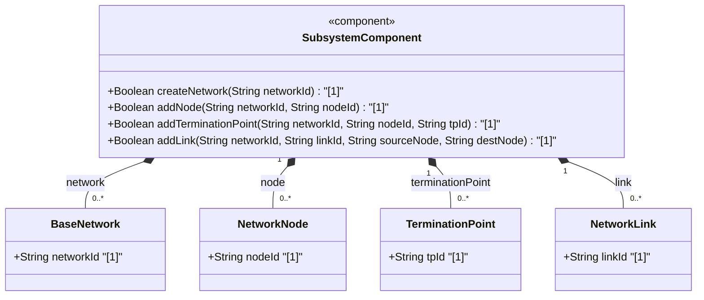
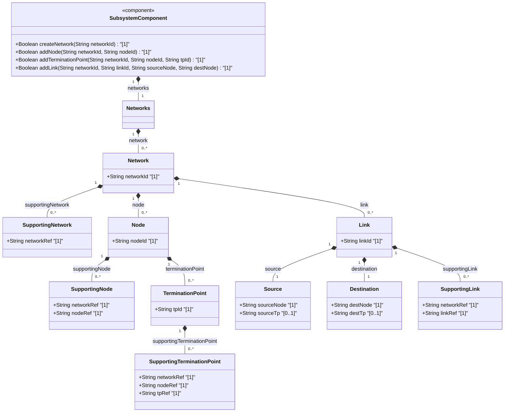
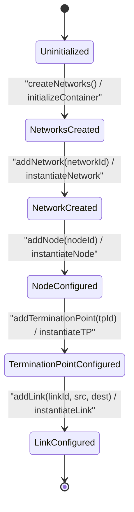

# Epic: [ietf-network-and-topology]: Network and Topology Base Models

## 1. Context
This Epic defines the foundational network and topology base models derived from IETF base network topology specifications (`ietf-network@2018-02-26.yang` and `ietf-network-topology@2018-02-26.yang`). It establishes generic, layer-agnostic representations for base networks, nodes, termination points (TPs), and topological links. These models support multi-layer network topology representation, vertical underlay/overlay network mapping (supporting-network, supporting-node, supporting-termination-point, supporting-link), and provide the core structural framework for specialized layer topologymodels (such as L0/L1/L2/L3 optical and packet topologies).

## 2. Requirements & Checklist
- [ ] #86 - [ietf-network: Base Networks and Network Data Model](https://github.com/gintatkinson/3dgs-037/blob/main/docs/features/feat-25-base-networks-and-network-data-model.md) (base networks and network-types data model)
- [ ] #87 - [ietf-network: Node Data Model and Supporting Nodes](https://github.com/gintatkinson/3dgs-037/blob/main/docs/features/feat-26-node-data-model-and-supporting-nodes.md) (node inventory and underlay supporting-node mapping)
- [ ] #88 - [ietf-network-topology: Termination Point Data Model](https://github.com/gintatkinson/3dgs-037/blob/main/docs/features/feat-27-termination-point-data-model.md) (node termination points and underlay supporting-termination-point mapping)
- [ ] #89 - [ietf-network-topology: Link Data Model and Supporting Links](https://github.com/gintatkinson/3dgs-037/blob/main/docs/features/feat-28-link-data-model-and-supporting-links.md) (topological links, source/destination endpoints, and underlay supporting-link mapping)

### Associated Use Cases & User Stories

#### Associated Use Cases
*To be populated after Phase 3*
- (To be linked upon Use Case generation)

#### Associated User Stories
*To be populated after Phase 3*
- (To be linked upon User Story generation)

## 3. Architecture

### Subsystem Component Definition

## System-Level UML Class Diagram

## State Machine Definitions
Describes operational lifecycle transitions for network topology construction. System starts in Uninitialized state. Initializing container creates Networks state. Adding network transitions to NetworkCreated state. Nodes and termination points are attached reaching NodeConfigured and TerminationPointConfigured. Topological links bind source and destination nodes reaching LinkConfigured.

## System State Machine Diagram

## 4. Operational Considerations
The network and topology base models enable abstract multi-layer network graph rendering and traversal. Vertical underlay references (`supporting-network`, `supporting-node`, `supporting-termination-point`, `supporting-link`) allow higher-layer logical topologies to bind directly to lower-layer physical or virtual infrastructure. Datastore persistence implementations must enforce structural key constraints and guard against circular underlay dependency loops.

## 5. Security & Governance
Access to network topology data nodes is governed by NETCONF Access Control Model (NACM) authorization rules. Sensitive topological infrastructure details—such as exact node names, link endpoints, and underlay mapping hierarchies—must be restricted to authorized network operations roles to prevent unauthorized network recon and information disclosure.

## Specification Context
The normative network topology specification defines a basic data model for network topologies and graph representations. The model is structured into two YANG modules: `ietf-network`, which defines base networks and nodes, and `ietf-network-topology`, which extends base networks and nodes with termination points and topological links. Together, these modules serve as the foundational base model for all standard IETF network topology data models.

## 6. Source References
Structural Schema: https://github.com/gintatkinson/3dgs-037/blob/main/standard/ietf/RFC/ietf-network%402018-02-26.yang and https://github.com/gintatkinson/3dgs-037/blob/main/standard/ietf/RFC/ietf-network-topology%402018-02-26.yang (Clause: Section 4)
Normative Specification: https://datatracker.ietf.org/doc/rfc8345/ (Clause: Section 4)
