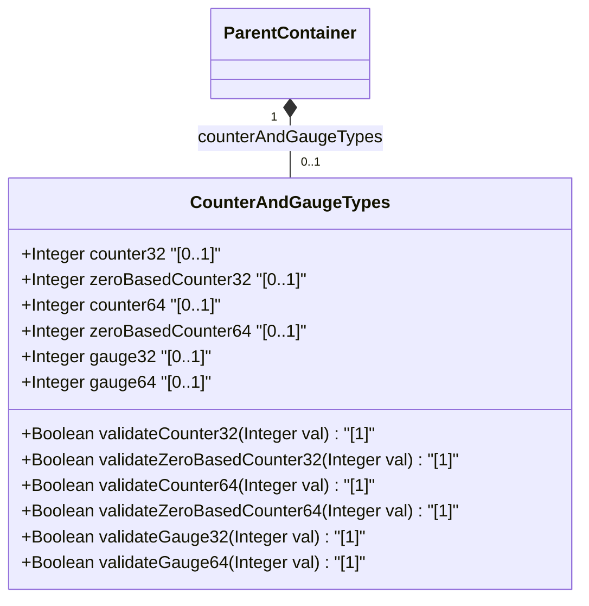

# Feature: [ietf-yang-types]: Counter and Gauge Data Types

## Parent Epic
- [ ] #5 - [[ietf-yang-types]: Common YANG Data Types](https://github.com/gintatkinson/3dgs-037/blob/main/docs/epics/epic-01-ietf-yang-types.md) (Parent Epic for common YANG data types)

## Description
This feature specifies the core quantitative numeric counter and gauge data types derived in the `ietf-yang-types` YANG module (RFC 9911). These data types provide standardized semantic representations for non-negative integers used in network telemetry, monitoring, performance metrics, and operational status tracking.

The feature covers six derived typedefs:
1. **counter32**: A 32-bit unsigned integer (`uint32`, range 0..4294967295) representing a non-negative counter that monotonically increases until it reaches $2^{32}-1$, when it wraps around to zero. Counters have no defined initial value. Discontinuities occur at system re-initialization or node instantiation. `counter32` SHOULD NOT be used for configuration schema nodes or with default statements.
2. **zero-based-counter32**: Derived from `counter32` with a defined initial value of `"0"`. Data tree nodes using this type are initialized to 0 upon creation, enabling management stations to calculate deltas immediately provided polling occurs within the minimum wrap time.
3. **counter64**: A 64-bit unsigned integer (`uint64`, range 0..18446744073709551615) for high-capacity counters that monotonically increase and wrap to zero at $2^{64}-1$. Like `counter32`, it has no defined initial value and SHOULD NOT be used for configuration or with default statements.
4. **zero-based-counter64**: Derived from `counter64` with a defined initial value of `"0"`. Set to 0 on node creation, monotonically increasing and wrapping at $2^{64}-1$.
5. **gauge32**: A 32-bit unsigned integer (`uint32`, range 0..4294967295) representing a non-negative value that can increase or decrease dynamically. It latches at maximum (4294967295) if the monitored quantity exceeds the maximum, and latches at minimum (0) if the quantity falls below 0.
6. **gauge64**: A 64-bit unsigned integer (`uint64`, range 0..18446744073709551615) representing a high-capacity non-negative gauge that can increase or decrease dynamically, latching at upper limit ($2^{64}-1$) and lower limit (0).

## UML Class Diagram


## Interface Requirements

### 1. Payload Schema
```json
{
  "counter32": 4294967290,
  "zeroBasedCounter32": 0,
  "counter64": 18446744073709551610,
  "zeroBasedCounter64": 0,
  "gauge32": 1000,
  "gauge64": 5000000
}
```

### 2. Validation & Constraints
- **counter32**: 32-bit unsigned integer ($0 \le v \le 4294967295$). Monotonically increasing, wraps to 0 upon reaching $2^{32}$. Read-only / state node usage only. Default statement SHOULD NOT be used.
- **zero-based-counter32**: 32-bit unsigned integer ($0 \le v \le 4294967295$). Monotonically increasing, wraps to 0 upon reaching $2^{32}$. Default value `"0"`. Initialized to 0 on node creation.
- **counter64**: 64-bit unsigned integer ($0 \le v \le 18446744073709551615$). Monotonically increasing, wraps to 0 upon reaching $2^{64}$. Read-only / state node usage only. Default statement SHOULD NOT be used.
- **zero-based-counter64**: 64-bit unsigned integer ($0 \le v \le 18446744073709551615$). Monotonically increasing, wraps to 0 upon reaching $2^{64}$. Default value `"0"`. Initialized to 0 on node creation.
- **gauge32**: 32-bit unsigned integer ($0 \le v \le 4294967295$). Can increase or decrease. Latches at max value (4294967295) if monitored value exceeds max, latches at min value (0) if monitored value drops below 0.
- **gauge64**: 64-bit unsigned integer ($0 \le v \le 18446744073709551615$). Can increase or decrease. Latches at max value (18446744073709551615) if monitored value exceeds max, latches at min value (0) if monitored value drops below 0.

### 3. Logical Operations & Interface Messages
- **Read Operation (GET / Telemetry Query)**: Retrieves the current value of counter and gauge leaves.
- **Counter Delta Processing**: Computes difference $\Delta = (V_{current} - V_{previous}) \pmod{2^{32}\text{ or } 2^{64}}$ for rate calculation.
- **Gauge Polling**: Returns instantaneous value of dynamic gauge metrics.
- **Discontinuity Handling**: Management system re-initialization or node re-instantiation events mark discontinuity timestamps for counter metrics.

### 4. Logical Exception States & Validation Failures
- **Negative Value Validation Failure**: Values $< 0$ MUST be rejected with validation error `INVALID_ARGUMENT` or `RANGE_ERROR`.
- **Overflow / Out-of-Range Failure**: Values exceeding $2^{32}-1$ (for 32-bit types) or $2^{64}-1$ (for 64-bit types) MUST fail payload validation.
- **Configuration Usage Violation**: Attempting to use `counter32` or `counter64` in a writable `config true` schema node MUST be flagged as a schema design error.
- **Discontinuity Gap Failure**: Polling interval exceeding minimum wrap time causes counter delta calculation invalidation.

## Given-When-Then Acceptance Criteria

### Scenario 1: Counter32 Monotonic Increase and Wraparound
- **Given** a schema node defined with type `yang:counter32` currently holding a value of 4294967290
- **When** 10 increment events occur
- **Then** the value MUST monotonically increase to 4294967295 and wrap around to 4 on the 10th event.

### Scenario 2: Zero-Based Counter32 Default Initialization
- **Given** a new data tree node instantiated with type `yang:zero-based-counter32`
- **When** the node is created without an explicit initial value
- **Then** the node value MUST be set to 0.

### Scenario 3: Counter64 High-Capacity Monotonic Increment
- **Given** a telemetry node defined with type `yang:counter64` initialized to 18446744073709551610
- **When** 10 byte-counter increment events are processed
- **Then** the counter MUST wrap around to 4 after reaching maximum capacity 18446744073709551615.

### Scenario 4: Zero-Based Counter64 Initial Delta Computation
- **Given** a management station discovering a newly created `yang:zero-based-counter64` node
- **When** the initial poll reads a value of 1500 within minimum wrap time
- **Then** the application MUST use the default initial value of 0 to calculate an initial delta of 1500.

### Scenario 5: Gauge32 Dynamic Variation and Upper Limit Latching
- **Given** a system resource metric modeled as `yang:gauge32` currently at 4294967200
- **When** monitored resource load increases by 200 units
- **Then** the gauge value MUST latch at the maximum permitted limit of 4294967295 rather than overflowing or wrapping around.

### Scenario 6: Gauge64 Dynamic Decrease and Lower Limit Latching
- **Given** a memory pool metric modeled as `yang:gauge64` currently at 50 units
- **When** a allocation deallocation reduces the metric by 100 units
- **Then** the gauge value MUST latch at the minimum permitted limit of 0.

### Scenario 7: Rejection of Invalid Negative Values
- **Given** an API request or telemetry payload containing a value of -1 for a leaf of type `yang:counter32` or `yang:gauge32`
- **When** schema validation is executed
- **Then** validation MUST fail with an out-of-range exception `INVALID_ARGUMENT`.

## Specification Context (Verbatim)

```yang
  typedef counter32 {
    type uint32;
    description
      "The counter32 type represents a non-negative integer
       that monotonically increases until it reaches a
       maximum value of 2^32-1 (4294967295 decimal), when it
       wraps around and starts increasing again from zero.

       Counters have no defined 'initial' value, and thus, a
       single value of a counter has (in general) no information
       content.  Discontinuities in the monotonically increasing
       value normally occur at re-initialization of the
       management system and at other times as specified in the
       description of a schema node using this type.  If
       discontinuities occur at times other than re-initialization
       (for example, at the instantiation of a schema node of type
       counter32), then a corresponding schema node should be
       defined, with an appropriate type, to indicate the last
       discontinuity.

       The counter32 type should not be used for configuration
       schema nodes.  A default statement SHOULD NOT be used in
       combination with the type counter32.

       In the value set and its semantics, this type is equivalent
       to the Counter32 type of the SMIv2.";
    reference
      "RFC 2578: Structure of Management Information Version 2
                 (SMIv2)";
  }

  typedef zero-based-counter32 {
    type counter32;
    default "0";
    description
      "The zero-based-counter32 type represents a counter32
       that has the defined 'initial' value zero.

       A data tree node using this type will be set to zero (0)
       on creation and will thereafter increase monotonically until
       it reaches a maximum value of 2^32-1 (4294967295 decimal),
       when it wraps around and starts increasing again from zero.

       Provided that an application discovers a new data tree node
       using this type within the minimum time to wrap, it can use
       the 'initial' value as a delta.  It is important for a
       management station to be aware of this minimum time and the
       actual time between polls, and to discard data if the actual
       time is too long or there is no defined minimum time.

       In the value set and its semantics, this type is equivalent
       to the ZeroBasedCounter32 textual convention of the SMIv2.";
    reference
      "RFC 4502: Remote Network Monitoring Management Information
                 Base Version 2";
  }

  typedef counter64 {
    type uint64;
    description
      "The counter64 type represents a non-negative integer
       that monotonically increases until it reaches a
       maximum value of 2^64-1 (18446744073709551615 decimal),
       when it wraps around and starts increasing again from zero.

       Counters have no defined 'initial' value, and thus, a
       single value of a counter has (in general) no information
       content.  Discontinuities in the monotonically increasing
       value normally occur at re-initialization of the
       management system and at other times as specified in the
       description of a schema node using this type.  If
       discontinuities occur at times other than re-initialization
       (for example, at the instantiation of a schema node of type
       counter64), then a corresponding schema node should be
       defined, with an appropriate type, to indicate the last
       discontinuity.

       The counter64 type should not be used for configuration
       schema nodes.  A default statement SHOULD NOT be used in
       combination with the type counter64.

       In the value set and its semantics, this type is equivalent
       to the Counter64 type of the SMIv2.";
    reference
      "RFC 2578: Structure of Management Information Version 2
                 (SMIv2)";
  }

  typedef zero-based-counter64 {
    type counter64;
    default "0";
    description
      "The zero-based-counter64 type represents a counter64 that
       has the defined 'initial' value zero.

       A data tree node using this type will be set to zero (0)
       on creation and will thereafter increase monotonically until
       it reaches a maximum value of 2^64-1 (18446744073709551615
       decimal), when it wraps around and starts increasing again
       from zero.

       Provided that an application discovers a new data tree node
       using this type within the minimum time to wrap, it can use
       the 'initial' value as a delta.  It is important for a
       management station to be aware of this minimum time and the
       actual time between polls, and to discard data if the actual
       time is too long or there is no defined minimum time.

       In the value set and its semantics, this type is equivalent
       to the ZeroBasedCounter64 textual convention of the SMIv2.";
    reference
      "RFC 2856: Textual Conventions for Additional High Capacity
                 Data Types";
  }

  typedef gauge32 {
    type uint32;
    description
      "The gauge32 type represents a non-negative integer, which
       may increase or decrease, but shall never exceed a maximum
       value, nor fall below a minimum value.  The maximum value
       cannot be greater than 2^32-1 (4294967295 decimal), and
       the minimum value cannot be smaller than 0.  The value of
       a gauge32 has its maximum value whenever the information
       being modeled is greater than or equal to its maximum
       value, and has its minimum value whenever the information
       being modeled is smaller than or equal to its minimum value.
       If the information being modeled subsequently decreases below
       the maximum value, the gauge32 also decreases; likewise, if
       the information increases above the minimum value, the
       gauge32 also increases.

       In the value set and its semantics, this type is equivalent
       to the Gauge32 type of the SMIv2.";
    reference
      "RFC 2578: Structure of Management Information Version 2
                 (SMIv2)";
  }

  typedef gauge64 {
    type uint64;
    description
      "The gauge64 type represents a non-negative integer, which
       may increase or decrease, but shall never exceed a maximum
       value, nor fall below a minimum value.  The maximum value
       cannot be greater than 2^64-1 (18446744073709551615), and
       the minimum value cannot be smaller than 0.  The value of
       a gauge64 has its maximum value whenever the information
       being modeled is greater than or equal to its maximum
       value, and has its minimum value whenever the information
       being modeled is smaller than or equal to its minimum value.
       If the information being modeled subsequently decreases
       below (increases above) the maximum (minimum) value, the
       gauge64 also decreases (increases).

       In the value set and its semantics, this type is equivalent
       to the CounterBasedGauge64 SMIv2 textual convention defined
       in RFC 2856";
    reference
      "RFC 2856: Textual Conventions for Additional High Capacity
                 Data Types";
  }
```

## Source References
Structural Schema: https://github.com/YangModels/yang/blob/main/standard/ietf/RFC/ietf-yang-types%402025-12-22.yang
Normative Specification: https://datatracker.ietf.org/doc/rfc9911/

## Logical UI & Layout Bindings
- **Target LUI Component:** PropertyGrid
- **Target Layout Container ID:** properties_view
- **Data Source Bindings:** /yang:counter-and-gauge-types
