# Feature: [ietf-yang-types]: Date and Time Data Types

## Parent Epic
- [ ] #5 - [[ietf-yang-types]: Common YANG Data Types](https://github.com/gintatkinson/3dgs-037/blob/main/docs/epics/epic-01-ietf-yang-types.md) (Parent Epic for common YANG data types)

## Description
This feature defines the date and time data types specified in `ietf-yang-types@2025-12-22.yang` (RFC 9911). It encompasses 16 derived YANG typedefs used to represent calendar dates, recurring daily times, timestamps, timeticks, and fine-grained time durations ranging from hours down to nanoseconds.

### Covered Typedefs
1. `date-and-time`: ISO 8601 / RFC 3339 / RFC 9557 profile representing date, time, fractional seconds, and optional time zone offset. Supports leap seconds (seconds value `60`).
2. `date`: Calendar date (`YYYY-MM-DD`) with an optional time zone offset.
3. `date-no-zone`: Calendar date (`YYYY-MM-DD`) strictly without time zone offset.
4. `time`: Recurring daily time (`hh:mm:ss[.fff]`) with an optional time zone offset. Supports leap seconds (seconds value `60`).
5. `time-no-zone`: Recurring daily time (`hh:mm:ss[.fff]`) strictly without time zone offset.
6. `hours32`: Period of time measured in hours (signed 32-bit integer, range `[-89478485 days 08:00:00 to 89478485 days 07:00:00]`).
7. `minutes32`: Period of time measured in minutes (signed 32-bit integer, range `[-1491308 days 2:08:00 to 1491308 days 2:07:00]`).
8. `seconds32`: Period of time measured in seconds (signed 32-bit integer, range `[-24855 days 03:14:08 to 24855 days 03:14:07]`).
9. `centiseconds32`: Period of time measured in 10^-2 seconds (signed 32-bit integer, range `[-248 days 13:13:56 to 248 days 13:13:56]`).
10. `milliseconds32`: Period of time measured in 10^-3 seconds (signed 32-bit integer, range `[-24 days 20:31:23 to 24 days 20:31:23]`).
11. `microseconds32`: Period of time measured in 10^-6 seconds (signed 32-bit integer, range `[-00:35:47 to 00:35:47]`).
12. `microseconds64`: Period of time measured in 10^-6 seconds (signed 64-bit integer, range `[-106751991 days 04:00:54 to 106751991 days 04:00:54]`).
13. `nanoseconds32`: Period of time measured in 10^-9 seconds (signed 32-bit integer, range `[-00:00:02 to 00:00:02]`).
14. `nanoseconds64`: Period of time measured in 10^-9 seconds (signed 64-bit integer, range `[-106753 days 23:12:44 to 106752 days 0:47:16]`).
15. `timeticks`: Non-negative 32-bit integer representing time modulo 2^32 (4294967296 decimal) in hundredths of a second between two reference epochs.
16. `timestamp`: Value of an associated `timeticks` schema node at which a specific occurrence happened. Resets to zero whenever the associated `timeticks` instance wraps around to zero after ~497 days.

### Standard Profiles & Timezone Semantics
- **ISO 8601 / RFC 3339 / RFC 9557 Compliance**: Values follow Gregorian calendar rules and RFC 3339 dateTime productions updated by RFC 9557. Negative years are strictly prohibited.
- **Time Zone Offset Interpretation**:
  - Offset `Z` indicates UTC representation where local time zone reference point is unknown.
  - Offset `+00:00` indicates UTC representation where local time zone reference point is explicitly UTC (per Section 2 of RFC 9557).
- **Leap Seconds**: Seconds value of `60` is permitted exclusively during designated leap second intervals for `date-and-time`, `time`, and `time-no-zone`.

## Compliance Table
| Verification Rule | Compliance Status | Rationale |
| --- | --- | --- |
| UML Standard Primitives | Compliant | Primitive types map to standard `String`, `Integer`, `Boolean` |
| Return Multiplicities | Compliant | Multiplicities specified on attributes and relationship lines |
| No Curly Braces in Mermaid | Compliant | All member annotations use standard parentheses/brackets; no `{}` used |
| No Isolated Classes | Compliant | Root container `DateAndTimeTypes` aggregates all date/time DTOs |
| No Colons in Member Lines | Compliant | Standard member syntax `+Type name "[mult]"` without member colons |

## UML Class Diagram

```mermaid
classDiagram
    class DateAndTimeTypes {
        +String containerId "[1]"
    }
    class DateAndTimeType {
        +String dateAndTimeValue "[1]"
        +Boolean supportsLeapSeconds "[1]"
        +Boolean hasKnownTimezone "[0..1]"
    }
    class DateType {
        +String dateValue "[1]"
        +Boolean hasTimezoneOffset "[0..1]"
    }
    class DateNoZoneType {
        +String dateNoZoneValue "[1]"
    }
    class TimeType {
        +String timeValue "[1]"
        +Boolean supportsLeapSeconds "[1]"
        +Boolean hasTimezoneOffset "[0..1]"
    }
    class TimeNoZoneType {
        +String timeNoZoneValue "[1]"
        +Boolean supportsLeapSeconds "[1]"
    }
    class TimeDurationTypes {
        +Integer hours32Value "[0..1]"
        +Integer minutes32Value "[0..1]"
        +Integer seconds32Value "[0..1]"
        +Integer centiseconds32Value "[0..1]"
        +Integer milliseconds32Value "[0..1]"
        +Integer microseconds32Value "[0..1]"
        +Integer microseconds64Value "[0..1]"
        +Integer nanoseconds32Value "[0..1]"
        +Integer nanoseconds64Value "[0..1]"
    }
    class TimeticksType {
        +Integer timeticksValue "[1]"
        +Integer moduloValue "[1]"
    }
    class TimestampType {
        +Integer timestampValue "[1]"
        +Integer associatedTimeticksRef "[1]"
        +Boolean isResetOnWrap "[1]"
    }

    DateAndTimeTypes "1" *-- "0..1" DateAndTimeType : dateAndTime
    DateAndTimeTypes "1" *-- "0..1" DateType : date
    DateAndTimeTypes "1" *-- "0..1" DateNoZoneType : dateNoZone
    DateAndTimeTypes "1" *-- "0..1" TimeType : time
    DateAndTimeTypes "1" *-- "0..1" TimeNoZoneType : timeNoZone
    DateAndTimeTypes "1" *-- "0..1" TimeDurationTypes : timeDuration
    DateAndTimeTypes "1" *-- "0..1" TimeticksType : timeticks
    DateAndTimeTypes "1" *-- "0..1" TimestampType : timestamp
```


## Interface Requirements

### 1. Payload Schema
```json
{
  "$schema": "https://json-schema.org/draft/2020-12/schema",
  "title": "DateAndTimeTypesPayload",
  "type": "object",
  "properties": {
    "dateAndTime": {
      "type": "string",
      "pattern": "^[0-9]{4}-(1[0-2]|0[1-9])-(0[1-9]|[1-2][0-9]|3[0-1])T(0[0-9]|1[0-9]|2[0-3]):[0-5][0-9]:([0-5][0-9]|60)(\\.[0-9]+)?(Z|[\\+\\-]((1[0-3]|0[0-9]):([0-5][0-9])|14:00))?$"
    },
    "date": {
      "type": "string",
      "pattern": "^[0-9]{4}-(1[0-2]|0[1-9])-(0[1-9]|[1-2][0-9]|3[0-1])(Z|[\\+\\-]((1[0-3]|0[0-9]):([0-5][0-9])|14:00))?$"
    },
    "dateNoZone": {
      "type": "string",
      "pattern": "^[0-9]{4}-(1[0-2]|0[1-9])-(0[1-9]|[1-2][0-9]|3[0-1])$"
    },
    "time": {
      "type": "string",
      "pattern": "^(0[0-9]|1[0-9]|2[0-3]):[0-5][0-9]:([0-5][0-9]|60)(\\.[0-9]+)?(Z|[\\+\\-]((1[0-3]|0[0-9]):([0-5][0-9])|14:00))?$"
    },
    "timeNoZone": {
      "type": "string",
      "pattern": "^(0[0-9]|1[0-9]|2[0-3]):[0-5][0-9]:([0-5][0-9]|60)(\\.[0-9]+)?$"
    },
    "hours32": {
      "type": "integer",
      "minimum": -2147483648,
      "maximum": 2147483647
    },
    "minutes32": {
      "type": "integer",
      "minimum": -2147483648,
      "maximum": 2147483647
    },
    "seconds32": {
      "type": "integer",
      "minimum": -2147483648,
      "maximum": 2147483647
    },
    "centiseconds32": {
      "type": "integer",
      "minimum": -2147483648,
      "maximum": 2147483647
    },
    "milliseconds32": {
      "type": "integer",
      "minimum": -2147483648,
      "maximum": 2147483647
    },
    "microseconds32": {
      "type": "integer",
      "minimum": -2147483648,
      "maximum": 2147483647
    },
    "microseconds64": {
      "type": "integer",
      "minimum": -9223372036854775808,
      "maximum": 9223372036854775807
    },
    "nanoseconds32": {
      "type": "integer",
      "minimum": -2147483648,
      "maximum": 2147483647
    },
    "nanoseconds64": {
      "type": "integer",
      "minimum": -9223372036854775808,
      "maximum": 9223372036854775807
    },
    "timeticks": {
      "type": "integer",
      "minimum": 0,
      "maximum": 4294967295
    },
    "timestamp": {
      "type": "integer",
      "minimum": 0,
      "maximum": 4294967295
    }
  }
}
```

### 2. Validation & Constraints
- **Pattern Matching**:
  - `date-and-time`: Must match regex `[0-9]{4}-(1[0-2]|0[1-9])-(0[1-9]|[1-2][0-9]|3[0-1])T(0[0-9]|1[0-9]|2[0-3]):[0-5][0-9]:([0-5][0-9]|60)(\.[0-9]+)?(Z|[\+\-]((1[0-3]|0[0-9]):([0-5][0-9])|14:00))?`.
  - `date`: Must match regex `[0-9]{4}-(1[0-2]|0[1-9])-(0[1-9]|[1-2][0-9]|3[0-1])(Z|[\+\-]((1[0-3]|0[0-9]):([0-5][0-9])|14:00))?`.
  - `date-no-zone`: Must match regex `[0-9]{4}-(1[0-2]|0[1-9])-(0[1-9]|[1-2][0-9]|3[0-1])`.
  - `time`: Must match regex `(0[0-9]|1[0-9]|2[0-3]):[0-5][0-9]:([0-5][0-9]|60)(\.[0-9]+)?(Z|[\+\-]((1[0-3]|0[0-9]):([0-5][0-9])|14:00))?`.
  - `time-no-zone`: Must match regex `(0[0-9]|1[0-9]|2[0-3]):[0-5][0-9]:([0-5][0-9]|60)(\.[0-9]+)?`.
- **Range Constraints**:
  - Signed 32-bit types (`hours32`, `minutes32`, `seconds32`, `centiseconds32`, `milliseconds32`, `microseconds32`, `nanoseconds32`): Range `[-2147483648..2147483647]`.
  - Signed 64-bit types (`microseconds64`, `nanoseconds64`): Range `[-9223372036854775808..9223372036854775807]`.
  - Unsigned 32-bit types (`timeticks`, `timestamp`): Range `[0..4294967295]` (modulo 2^32).
- **Time Offset Boundaries**: Time zone offsets must be in the range `-13:59` to `+14:00`.
- **Leap Seconds**: Seconds value `60` is allowed only in `date-and-time`, `time`, and `time-no-zone`.

### 3. Logical Operations & Interface Messages
- `encodeDateAndTime(timestamp, tzOffset) -> String`: Formats an epoch timestamp into an ISO 8601 string per RFC 3339 / RFC 9557.
- `parseDateAndTime(isoString) -> DateAndTimeStruct`: Parses and validates an ISO 8601 string, extracting calendar components, fraction, and offset.
- `computeTimeOffset(deviceTzConfig) -> String`: Computes canonical time zone offset string based on system DST rules.
- `wrapTimeticks(ticksCount) -> Integer`: Applies modulo 2^32 arithmetic to incrementing timeticks count (`ticksCount % 4294967296`).
- `evaluateTimestampReset(timeticksInstance, eventTime) -> Integer`: Computes timestamp value, resetting to `0` if event occurred before the last timeticks wrap-around reset.

### 4. Logical Exception States & Validation Failures
- `INVALID_DATE_TIME_FORMAT`: Raised when a string fails regex validation or contains an invalid calendar date (e.g. February 30).
- `NEGATIVE_YEAR_NOT_ALLOWED`: Raised when a date/time string specifies a negative year.
- `TIMEZONE_OUT_OF_RANGE`: Raised when a time zone offset exceeds `-13:59` or `+14:00`.
- `INVALID_LEAP_SECOND`: Raised when seconds value `60` is used outside of valid leap second contexts.
- `TIMETICKS_OUT_OF_BOUNDS`: Raised when timeticks or timestamp value is negative or exceeds 2^32-1.
- `DURATION_OVERFLOW`: Raised when integer duration value exceeds 32-bit or 64-bit boundaries.

## Given-When-Then Acceptance Criteria

### Scenario 1: Valid date-and-time Parsing with Timezone Offset and Fractional Seconds
- **Given** a client submits a payload containing a `date-and-time` string `"2026-08-04T00:23:12.123456+08:00"`.
- **When** the schema validation pipeline processes the input.
- **Then** the value is parsed successfully without errors.
- **And** the local time zone offset is recorded as `+08:00`.

### Scenario 2: Distinction Between Timezone Offset Z and +00:00 (RFC 9557)
- **Given** two `date-and-time` values `"2026-08-04T00:00:00Z"` and `"2026-08-04T00:00:00+00:00"`.
- **When** the system evaluates local time zone reference points per RFC 9557.
- **Then** `"2026-08-04T00:00:00Z"` is recognized as UTC with an unknown local time zone reference point.
- **And** `"2026-08-04T00:00:00+00:00"` is recognized as UTC with local time zone reference point explicitly set to UTC.

### Scenario 3: Permitted Leap Second Representation
- **Given** a client submits a `date-and-time` string `"2023-12-31T23:59:60Z"`.
- **When** the parser checks for valid leap second representation.
- **Then** the value with seconds `60` is accepted as valid.

### Scenario 4: Rejection of Date-No-Zone with Timezone Offset
- **Given** a client provides a `date-no-zone` field set to `"2026-08-04+08:00"`.
- **When** the input is validated against the `date-no-zone` pattern.
- **Then** validation fails with exception `INVALID_DATE_TIME_FORMAT`.

### Scenario 5: Timeticks Modulo 2^32 Wrap-around and Associated Timestamp Reset
- **Given** an active `timeticks` node at value `4294967290` (near max 2^32-1).
- **And** an associated `timestamp` instance tracking an event occurrence.
- **When** 10 hundredths of a second elapse causing `timeticks` to wrap around to `4`.
- **Then** `timeticks` wraps modulo 2^32.
- **And** the associated `timestamp` resets to `0` for events prior to the wrap-around.

### Scenario 6: Signed Duration Range Validation for Microseconds32 vs Microseconds64
- **Given** a period of 40 minutes measured in microseconds (`2,400,000,000` microseconds).
- **When** attempting to fit this value into `microseconds32` (max capacity 35m 47s).
- **Then** range validation fails with `DURATION_OVERFLOW`.
- **When** the value is assigned to `microseconds64`.
- **Then** validation succeeds as `microseconds64` supports up to ~106 million days.

## Specification Context (Verbatim)

```yang
  typedef date-and-time {
    type string {
      pattern
        '[0-9]{4}-(1[0-2]|0[1-9])-(0[1-9]|[1-2][0-9]|3[0-1])'
      + 'T(0[0-9]|1[0-9]|2[0-3]):[0-5][0-9]:([0-5][0-9]|60)'
      + '(\.[0-9]+)?'
      + '(Z|[\+\-]((1[0-3]|0[0-9]):([0-5][0-9])|14:00))?';
    }
    description
      "The date-and-time type is a profile of the ISO 8601
       standard for representation of dates and times using the
       Gregorian calendar.  The profile is defined by the
       date-time production in Section 5.6 of RFC 3339 and the
       update defined in Section 2 of RFC 9557.  The value of
       60 for seconds is allowed only in the case of leap seconds.

       The date-and-time type is compatible with the dateTime XML
       schema dateTime type with the following notable exceptions:

       (a) The date-and-time type does not allow negative years.

       (b) The time-offset Z indicates that the date-and-time
           value is reported in UTC and that the local time zone
           reference point is unknown.  The time-offset +00:00
           indicates that the date-and-time value is reported in
           UTC and that the local time zone reference point is UTC
           (see Section 2 of RFC 9557).

       This type is not equivalent to the DateAndTime textual
       convention of the SMIv2 since RFC 3339 uses a different
       separator between full-date and full-time and provides
       higher resolution of time-secfrac.

       The canonical format for date-and-time values with a known
       time zone uses a numeric time zone offset that is calculated
       using the device's configured known offset to UTC time.  A
       change of the device's offset to UTC time will cause
       date-and-time values to change accordingly.  Such changes
       might happen periodically if a server automatically follows
       daylight saving time (DST) time zone offset changes.  The
       canonical format for date-and-time values reported in UTC
       with an unknown local time zone offset SHOULD use the
       time-offset Z and MAY use -00:00 for backwards
       compatibility.";
    reference
      "ISO 8601: Data elements and interchange formats -- Information
                 interchange -- Representation of dates and times
       RFC 3339: Date and Time on the Internet: Timestamps
       RFC 9557: Date and Time on the Internet: Timestamps
                 with Additional Information
       RFC 2579: Textual Conventions for SMIv2
       XSD-TYPES: XML Schema Definition Language (XSD) 1.1
                  Part 2: Datatypes";
  }

  typedef date {
    type string {
      pattern '[0-9]{4}-(1[0-2]|0[1-9])-(0[1-9]|[1-2][0-9]|3[0-1])'
            + '(Z|[\+\-]((1[0-3]|0[0-9]):([0-5][0-9])|14:00))?';
    }
    description
      "The date type represents a time-interval of the length
       of a day, i.e., 24 hours.  It includes an optional time
       zone offset.

       The date type is compatible with the XML schema date
       type with the following notable exceptions:

       (a) The date type does not allow negative years.

       (b) The time-offset Z indicates that the date value is
           reported in UTC and that the local time zone reference
           point is unknown.  The time-offset +00:00 indicates that
           the date value is reported in UTC and that the local
           time zone reference point is UTC (see Section 2 of
           RFC 9557).

       The canonical format for date values with a known time
       zone uses a numeric time zone offset that is calculated using
       the device's configured known offset to UTC time.  A change of
       the device's offset to UTC time will cause date values
       to change accordingly.  Such changes might happen periodically
       if a server automatically follows daylight saving time
       (DST) time zone offset changes.  The canonical format for
       date values reported in UTC with an unknown local time zone
       offset uses the time-offset Z.";
    reference
      "RFC 3339: Date and Time on the Internet: Timestamps
       RFC 9557: Date and Time on the Internet: Timestamps
                 with Additional Information
       XSD-TYPES: XML Schema Definition Language (XSD) 1.1
                  Part 2: Datatypes";
  }

  typedef date-no-zone {
    type date {
      pattern '[0-9]{4}-(1[0-2]|0[1-9])-(0[1-9]|[1-2][0-9]|3[0-1])';
    }
    description
      "The date-no-zone type represents a date without the optional
       time zone offset information.";
  }

  typedef time {
    type string {
      pattern
        '(0[0-9]|1[0-9]|2[0-3]):[0-5][0-9]:([0-5][0-9]|60)'
      + '(\.[0-9]+)?'
      + '(Z|[\+\-]((1[0-3]|0[0-9]):([0-5][0-9])|14:00))?';
    }
    description
      "The time type represents an instance of time of zero duration
       that recurs every day.  It includes an optional time zone
       offset.  The value of 60 for seconds is allowed only in the
       case of leap seconds.

       The time type is compatible with the XML schema time
       type with the following notable exception:

       (a) The time-offset Z indicates that the time value is
           reported in UTC and that the local time zone reference
           point is unknown.  The time-offset +00:00 indicates that
           the time value is reported in UTC and that the local
           time zone reference point is UTC (see Section 2 of
           RFC 9557).

       The canonical format for time values with a known time
       zone uses a numeric time zone offset that is calculated using
       the device's configured known offset to UTC time.  A change of
       the device's offset to UTC time will cause time values
       to change accordingly.  Such changes might happen periodically
       if a server automatically follows daylight saving time
       (DST) time zone offset changes.  The canonical format for
       time values reported in UTC with an unknown local time zone
       offset uses the time-offset Z.";
    reference
      "RFC 3339: Date and Time on the Internet: Timestamps
       RFC 9557: Date and Time on the Internet: Timestamps
                 with Additional Information
       XSD-TYPES: XML Schema Definition Language (XSD) 1.1
                  Part 2: Datatypes";
  }

  typedef time-no-zone {
    type time {
      pattern
        '(0[0-9]|1[0-9]|2[0-3]):[0-5][0-9]:([0-5][0-9]|60)'
      + '(\.[0-9]+)?';
    }
    description
      "The time-no-zone type represents a time without the optional
       time zone offset information.";
  }

  typedef hours32 {
    type int32;
    units "hours";
    description
      "A period of time measured in units of hours.

       The maximum time period that can be expressed is in the
       range [-89478485 days 08:00:00 to 89478485 days 07:00:00].

       This type should be range-restricted in situations
       where only non-negative time periods are desirable
       (i.e., range '0..max').";
  }

  typedef minutes32 {
    type int32;
    units "minutes";
    description
      "A period of time measured in units of minutes.

       The maximum time period that can be expressed is in the
       range [-1491308 days 2:08:00 to 1491308 days 2:07:00].

       This type should be range-restricted in situations
       where only non-negative time periods are desirable
       (i.e., range '0..max').";
  }

  typedef seconds32 {
    type int32;
    units "seconds";
    description
      "A period of time measured in units of seconds.

       The maximum time period that can be expressed is in the
       range [-24855 days 03:14:08 to 24855 days 03:14:07].

       This type should be range-restricted in situations
       where only non-negative time periods are desirable
       (i.e., range '0..max').";
  }

  typedef centiseconds32 {
    type int32;
    units "centiseconds";
    description
      "A period of time measured in units of 10^-2 seconds.

       The maximum time period that can be expressed is in the
       range [-248 days 13:13:56 to 248 days 13:13:56].

       This type should be range-restricted in situations
       where only non-negative time periods are desirable
       (i.e., range '0..max').";
  }

  typedef milliseconds32 {
    type int32;
    units "milliseconds";
    description
      "A period of time measured in units of 10^-3 seconds.

       The maximum time period that can be expressed is in the
       range [-24 days 20:31:23 to 24 days 20:31:23].

       This type should be range-restricted in situations
       where only non-negative time periods are desirable
       (i.e., range '0..max').";
  }

  typedef microseconds32 {
    type int32;
    units "microseconds";
    description
      "A period of time measured in units of 10^-6 seconds.

       The maximum time period that can be expressed is in the
       range [-00:35:47 to 00:35:47].

       This type should be range-restricted in situations
       where only non-negative time periods are desirable
       (i.e., range '0..max').";
  }

  typedef microseconds64 {
    type int64;
    units "microseconds";
    description
      "A period of time measured in units of 10^-6 seconds.

       The maximum time period that can be expressed is in the
       range [-106751991 days 04:00:54 to 106751991 days 04:00:54].

       This type should be range-restricted in situations
       where only non-negative time periods are desirable
       (i.e., range '0..max').";
  }

  typedef nanoseconds32 {
    type int32;
    units "nanoseconds";
    description
      "A period of time measured in units of 10^-9 seconds.

       The maximum time period that can be expressed is in the
       range [-00:00:02 to 00:00:02].

       This type should be range-restricted in situations
       where only non-negative time periods are desirable
       (i.e., range '0..max').";
  }

  typedef nanoseconds64 {
    type int64;
    units "nanoseconds";
    description
      "A period of time measured in units of 10^-9 seconds.

       The maximum time period that can be expressed is in the
       range [-106753 days 23:12:44 to 106752 days 0:47:16].

       This type should be range-restricted in situations
       where only non-negative time periods are desirable
       (i.e., range '0..max').";
  }

  typedef timeticks {
    type uint32;
    description
      "The timeticks type represents a non-negative integer that
       represents the time, modulo 2^32 (4294967296 decimal), in
       hundredths of a second between two epochs.  When a schema
       node is defined that uses this type, the description of
       the schema node identifies both of the reference epochs.

       In the value set and its semantics, this type is equivalent
       to the TimeTicks type of the SMIv2.";
    reference
      "RFC 2578: Structure of Management Information Version 2
                 (SMIv2)";
  }

  typedef timestamp {
    type timeticks;
    description
      "The timestamp type represents the value of an associated
       timeticks schema node instance at which a specific occurrence
       happened.  The specific occurrence must be defined in the
       description of any schema node defined using this type.  When
       the specific occurrence occurred prior to the last time the
       associated timeticks schema node instance was zero, then the
       timestamp value is zero.

       Note that this requires all timestamp values to be reset to
       zero when the value of the associated timeticks schema node
       instance reaches 497+ days and wraps around to zero.

       The associated timeticks schema node must be specified
       in the description of any schema node using this type.

       In the value set and its semantics, this type is equivalent
       to the TimeStamp textual convention of the SMIv2.";
    reference
      "RFC 2579: Textual Conventions for SMIv2";
  }
```

## Source References
Structural Schema: https://github.com/YangModels/yang/blob/main/standard/ietf/RFC/ietf-yang-types%402025-12-22.yang
Normative Specification: https://datatracker.ietf.org/doc/rfc9911/

## Logical UI & Layout Bindings
- **Target LUI Component:** PropertyGrid
- **Target Layout Container ID:** properties_view
- **Data Source Bindings:** /yang:date-and-time-types
