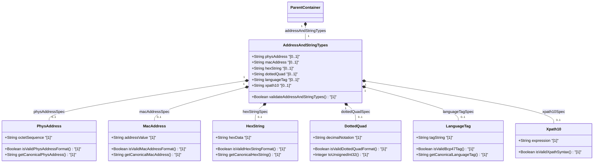

# [ietf-yang-types]: Address and String Data Types

## Parent Epic
- [ ] #5 - [[ietf-yang-types]: Common YANG Data Types](https://github.com/gintatkinson/3dgs-037/blob/main/docs/epics/epic-01-ietf-yang-types.md) (Parent Epic for common YANG data types)

## Description
This feature specifies the address and generic string data types defined in the `ietf-yang-types` module (RFC 9911). These derived types provide standardized semantic representations and validation constraints for physical media addresses, IEEE 802 MAC addresses, colon-separated hexadecimal octet strings, dotted-quad decimal notation, RFC 5646 language tags, and XPath 1.0 expression strings.

The specific typedefs covered by this feature specification are:
- **`phys-address`**: Represents media- or physical-level addresses formatted as a sequence of hexadecimal octets separated by colons (e.g., `00:00:5e:00:53:01`). The canonical representation uses lowercase characters. Supports variable-length octet sequences.
- **`mac-address`**: Represents a 48-bit IEEE 802 Media Access Control (MAC) address consisting of exactly six hexadecimal octets separated by colons (e.g., `08:00:27:00:a1:4c`). The canonical representation uses lowercase characters.
- **`hex-string`**: Represents an arbitrary hexadecimal binary string encoded as colon-separated hex digit pairs. Canonical form uses lowercase characters.
- **`dotted-quad`**: Represents an unsigned 32-bit integer expressed in dotted-quad decimal notation, i.e., four decimal octets (0 to 255) separated by full stop (`.`) characters (e.g., `192.0.2.1`).
- **`language-tag`**: Represents a language tag according to RFC 5646 (BCP 47). The canonical representation uses lowercase characters.
- **`xpath1.0`**: Represents an XML Path Language (XPath) Version 1.0 expression string evaluated within a specified schema context.

## UML Class Diagram


## Interface Requirements

### 1. Payload Schema
```json
{
  "phys-address": "00:00:5e:00:53:01",
  "mac-address": "08:00:27:00:a1:4c",
  "hex-string": "a1:b2:c3:d4",
  "dotted-quad": "192.0.2.1",
  "language-tag": "en-US",
  "xpath1.0": "/ietf-yang-types:address-and-string-types/mac-address"
}
```

### 2. Validation & Constraints
- **`phys-address`**:
  - Base Type: `string`
  - Pattern: `([0-9a-fA-F]{2}(:[0-9a-fA-F]{2})*)?`
  - Constraints: Represents a sequence of octets where each octet is represented by two hexadecimal characters separated by colons. The string MAY be empty. Canonical representation MUST use lowercase characters.
- **`mac-address`**:
  - Base Type: `string`
  - Pattern: `[0-9a-fA-F]{2}(:[0-9a-fA-F]{2}){5}`
  - Constraints: Exactly 6 octets (48-bit IEEE 802 MAC address) separated by colons. Canonical representation MUST use lowercase characters. Upper-case characters MUST be lowercased during processing.
- **`hex-string`**:
  - Base Type: `string`
  - Pattern: `([0-9a-fA-F]{2}(:[0-9a-fA-F]{2})*)?`
  - Constraints: Hexadecimal string with octets represented as hex digit pairs separated by colons. The string MAY be empty. Canonical representation MUST use lowercase characters.
- **`dotted-quad`**:
  - Base Type: `string`
  - Pattern: `(([0-9]|[1-9][0-9]|1[0-9][0-9]|2[0-4][0-9]|25[0-5])\.){3}([0-9]|[1-9][0-9]|1[0-9][0-9]|2[0-4][0-9]|25[0-5])`
  - Constraints: Represents an unsigned 32-bit integer in dotted-quad decimal notation (four octets, each 0 to 255, separated by full stops).
- **`language-tag`**:
  - Base Type: `string`
  - Constraints: Must be a well-formed language tag according to RFC 5646 (BCP 47). Canonical representation MUST use lowercase characters.
- **`xpath1.0`**:
  - Base Type: `string`
  - Constraints: Must represent a valid XPath 1.0 expression according to W3C XPath 1.0 recommendation. Must be evaluated in the specified schema node context.

### 3. Logical Operations & Interface Messages
- **`ValidateAddressAndStringPayload(payload: JSON)` -> `Boolean`**: Parses and validates all provided address and string fields against their YANG pattern regexes and semantic rules.
- **`CanonicalizeMacAddress(macAddress: String)` -> `String`**: Transforms valid MAC address input to canonical lowercase representation (e.g. `08:00:27:00:A1:4C` -> `08:00:27:00:a1:4c`).
- **`CanonicalizePhysAddress(physAddress: String)` -> `String`**: Transforms valid physical address input to canonical lowercase representation.
- **`CanonicalizeHexString(hexString: String)` -> `String`**: Transforms valid hex string input to canonical lowercase representation.
- **`CanonicalizeLanguageTag(languageTag: String)` -> `String`**: Transforms valid language tag to canonical lowercase representation.
- **`ParseDottedQuadToUint32(dottedQuad: String)` -> `Integer`**: Decodes a dotted-quad decimal string into an unsigned 32-bit integer representation.
- **`ValidateXpath10Syntax(xpathExpr: String)` -> `Boolean`**: Validates whether the given string is a syntactically valid XPath 1.0 expression.

### 4. Logical Exception States & Validation Failures
- **`INVALID_MAC_ADDRESS_FORMAT`**: Triggered when a `mac-address` field fails pattern `[0-9a-fA-F]{2}(:[0-9a-fA-F]{2}){5}` (e.g., incorrect number of octets or invalid characters).
- **`INVALID_PHYS_ADDRESS_FORMAT`**: Triggered when a `phys-address` field contains invalid character pairs or malformed colon separators.
- **`INVALID_HEX_STRING_PATTERN`**: Triggered when a `hex-string` field fails pattern `([0-9a-fA-F]{2}(:[0-9a-fA-F]{2})*)?`.
- **`INVALID_DOTTED_QUAD_BOUNDS`**: Triggered when a `dotted-quad` string contains decimal numbers exceeding 255 or invalid full stop placements.
- **`INVALID_LANGUAGE_TAG_BCP47`**: Triggered when a `language-tag` string fails BCP 47 structural validation.
- **`INVALID_XPATH10_SYNTAX`**: Triggered when an `xpath1.0` string fails grammar parsing for XPath 1.0 syntax.

## Given-When-Then Acceptance Criteria

### Scenario 1: Valid MAC Address Validation and Canonicalization
- **Given** a data payload containing `mac-address` with value `"08:00:27:00:A1:4C"`
- **When** `ValidateAddressAndStringPayload` and `CanonicalizeMacAddress` are executed
- **Then** validation succeeds and the canonical output returned is `"08:00:27:00:a1:4c"`.

### Scenario 2: Invalid MAC Address Rejection
- **Given** a data payload containing `mac-address` with value `"08:00:27:00:a1"` (only 5 octets)
- **When** `ValidateAddressAndStringPayload` is executed
- **Then** validation fails with error state `INVALID_MAC_ADDRESS_FORMAT`.

### Scenario 3: Valid Physical Address Variable Octet Sequence
- **Given** a data payload containing `phys-address` with value `"00:11:22:33:44:55:66:77"` (8 octets)
- **When** `ValidateAddressAndStringPayload` is executed
- **Then** validation succeeds and the string is recognized as a valid physical address.

### Scenario 4: Valid Dotted-Quad Decimal Parsing
- **Given** a data payload containing `dotted-quad` with value `"192.0.2.1"`
- **When** `ValidateAddressAndStringPayload` and `ParseDottedQuadToUint32` are executed
- **Then** validation succeeds and the 32-bit integer value `3221225985` is produced.

### Scenario 5: Out-of-Bounds Dotted-Quad Rejection
- **Given** a data payload containing `dotted-quad` with value `"256.0.0.1"`
- **When** `ValidateAddressAndStringPayload` is executed
- **Then** validation fails with error state `INVALID_DOTTED_QUAD_BOUNDS`.

### Scenario 6: Valid Language Tag Lowercasing
- **Given** a data payload containing `language-tag` with value `"en-US"`
- **When** `ValidateAddressAndStringPayload` and `CanonicalizeLanguageTag` are executed
- **Then** validation succeeds and the canonical output returned is `"en-us"`.

### Scenario 7: Valid XPath 1.0 Expression Evaluation
- **Given** a data payload containing `xpath1.0` with value `"/ietf-yang-types:address-and-string-types/mac-address"`
- **When** `ValidateXpath10Syntax` is executed
- **Then** validation succeeds confirming valid XPath 1.0 expression syntax.

## Specification Context (Verbatim)

```yang
  typedef phys-address {
    type string {
      pattern '([0-9a-fA-F]{2}(:[0-9a-fA-F]{2})*)?';
    }
    description
      "Represents media- or physical-level addresses represented
       as a sequence of octets, each octet represented by two
       hexadecimal numbers.  Octets are separated by colons.  The
       canonical representation uses lowercase characters.

       In the value set and its semantics, this type is equivalent
       to the PhysAddress textual convention of the SMIv2.";
    reference
      "RFC 2579: Textual Conventions for SMIv2";
  }

  typedef mac-address {
    type string {
      pattern '[0-9a-fA-F]{2}(:[0-9a-fA-F]{2}){5}';
    }
    description
      "The mac-address type represents a 48-bit IEEE 802 Media
       Access Control (MAC) address.  The canonical representation
       uses lowercase characters.  Note that there are IEEE 802 MAC
       addresses with a different length that this type cannot
       represent.  The phys-address type may be used to represent
       physical addresses of varying length.

       In the value set and its semantics, this type is equivalent
       to the MacAddress textual convention of the SMIv2.";
    reference
      "IEEE 802: IEEE Standard for Local and Metropolitan Area
                 Networks: Overview and Architecture
       RFC 2579: Textual Conventions for SMIv2";
  }

  typedef xpath1.0 {
    type string;
    description
      "This type represents an XPATH 1.0 expression.

       When a schema node is defined that uses this type, the
       description of the schema node MUST specify the XPath
       context in which the XPath expression is evaluated.";
    reference
      "XPATH: XML Path Language (XPath) Version 1.0";
  }

  typedef hex-string {
    type string {
      pattern '([0-9a-fA-F]{2}(:[0-9a-fA-F]{2})*)?';
    }
    description
      "A hexadecimal string with octets represented as hex digits
       separated by colons.  The canonical representation uses
       lowercase characters.";
  }

  typedef dotted-quad {
    type string {
      pattern
        '(([0-9]|[1-9][0-9]|1[0-9][0-9]|2[0-4][0-9]|25[0-5])\.){3}'
      + '([0-9]|[1-9][0-9]|1[0-9][0-9]|2[0-4][0-9]|25[0-5])';
    }
    description
      "An unsigned 32-bit number expressed in the dotted-quad
       notation, i.e., four octets written as decimal numbers
       and separated with the '.' (full stop) character.";
  }

  typedef language-tag {
    type string;
    description
      "A language tag according to RFC 5646 (BCP 47).  The
       canonical representation uses lowercase characters.

       Values of this type must be well-formed language tags,
       in conformance with the definition of well-formed tags
       in BCP 47.  Implementations MAY further limit the values
       they accept to those permitted by a 'validating'
       processor, as defined in BCP 47.

       The canonical representation of values of this type is
       aligned with the SMIv2 LangTag textual convention for
       language tags fitting the length constraints imposed
       by the LangTag textual convention.";
    reference
      "RFC 5646: Tags for Identifying Languages
       RFC 5131: A MIB Textual Convention for Language Tags";
  }
```

## Source References
Structural Schema: https://github.com/YangModels/yang/blob/main/standard/ietf/RFC/ietf-yang-types%402025-12-22.yang
Normative Specification: https://datatracker.ietf.org/doc/rfc9911/

## Logical UI & Layout Bindings
- **Target LUI Component:** PropertyGrid
- **Target Layout Container ID:** properties_view
- **Data Source Bindings:** /yang:address-and-string-types
