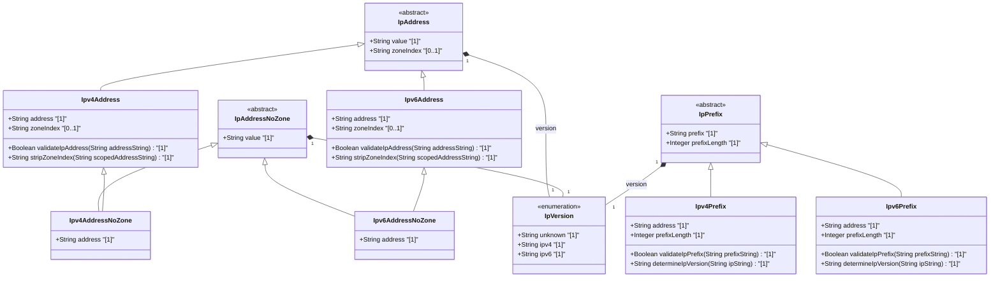

# Feature: [ietf-inet-types]: IP Address Data Types

## Parent Epic
- [ ] #24 - [ietf-inet-types: Common Internet Data Types](https://github.com/gintatkinson/3dgs-037/blob/main/docs/epics/epic-02-ietf-inet-types.md) (Parent Epic specification)

## Description
This Feature specifies the core set of IP address textual conventions and data types defined in the `ietf-inet-types` YANG module (RFC 6021 / RFC 6991). These data types provide standardized, IP-version-neutral and IP-version-specific representations for host IP addresses, scoped IP addresses with zone indices, non-scoped IP addresses, and IP address prefix definitions (CIDR block notation).

The feature covers ten distinct schema typedefs:
1. `ip-version`: Enumeration representing IP protocol versions (`unknown`, `ipv4`, `ipv6`).
2. `ip-address`: IP-version-neutral union of `ipv4-address` and `ipv6-address`, supporting zone identifiers.
3. `ipv4-address`: Textual representation of an IPv4 address in dotted-quad notation, with an optional `%`-separated zone index.
4. `ipv6-address`: Textual representation of an IPv6 address in full, mixed, or compressed notation, with an optional `%`-separated zone index.
5. `ip-prefix`: IP-version-neutral union of `ipv4-prefix` and `ipv6-prefix`.
6. `ipv4-prefix`: IPv4 network prefix string in dotted-quad notation followed by a slash `/` and a prefix length (0 to 32).
7. `ipv6-prefix`: IPv6 network prefix string in colon-hex notation followed by a slash `/` and a prefix length (0 to 128).
8. `ip-address-no-zone`: IP-version-neutral union of `ipv4-address-no-zone` and `ipv6-address-no-zone` prohibiting zone indices.
9. `ipv4-address-no-zone`: Derived IPv4 address type explicitly excluding zone indices.
10. `ipv6-address-no-zone`: Derived IPv6 address type explicitly excluding zone indices.

## UML Class Diagram


## Interface Requirements

### 1. Payload Schema
```json
{
  "$schema": "http://json-schema.org/draft-07/schema#",
  "title": "IPAddressDataTypesPayload",
  "type": "object",
  "properties": {
    "ipVersion": {
      "type": "string",
      "enum": ["unknown", "ipv4", "ipv6"]
    },
    "ipAddress": {
      "type": "string",
      "description": "IP-version neutral address (IPv4 or IPv6 with optional zone index)"
    },
    "ipv4Address": {
      "type": "string",
      "pattern": "^(([0-9]|[1-9][0-9]|1[0-9][0-9]|2[0-4][0-9]|25[0-5])\\.){3}([0-9]|[1-9][0-9]|1[0-9][0-9]|2[0-4][0-9]|25[0-5])(%[\\pN\\pL]+)?$"
    },
    "ipv6Address": {
      "type": "string",
      "description": "IPv6 address in full, shortened, or mixed notation with optional zone index"
    },
    "ipPrefix": {
      "type": "string",
      "description": "IP prefix (IPv4 /0..32 or IPv6 /0..128)"
    },
    "ipv4Prefix": {
      "type": "string",
      "pattern": "^(([0-9]|[1-9][0-9]|1[0-9][0-9]|2[0-4][0-9]|25[0-5])\\.){3}([0-9]|[1-9][0-9]|1[0-9][0-9]|2[0-4][0-9]|25[0-5])/(([0-9])|([1-2][0-9])|(3[0-2]))$"
    },
    "ipv6Prefix": {
      "type": "string",
      "description": "IPv6 network prefix string with prefix length between 0 and 128"
    },
    "ipAddressNoZone": {
      "type": "string",
      "description": "IP-version neutral address strictly without zone index"
    },
    "ipv4AddressNoZone": {
      "type": "string",
      "pattern": "^(([0-9]|[1-9][0-9]|1[0-9][0-9]|2[0-4][0-9]|25[0-5])\\.){3}([0-9]|[1-9][0-9]|1[0-9][0-9]|2[0-4][0-9]|25[0-5])$"
    },
    "ipv6AddressNoZone": {
      "type": "string",
      "description": "IPv6 address strictly without zone index"
    }
  },
  "required": ["ipVersion", "ipAddress", "ipPrefix"]
}
```

### 2. Validation & Constraints
- **`ip-version` Validation:**
  - Enum value MUST be one of: `unknown` (value 0), `ipv4` (value 1), or `ipv6` (value 2).
- **`ipv4-address` Pattern Matching:**
  - Dotted-quad format: 4 octets separated by dots, each in range 0 to 255.
  - Optional zone index delimited by `%`, containing Unicode letters or numbers (`%[\p{N}\p{L}]+`).
- **`ipv6-address` Pattern Matching:**
  - Colon-hex format supporting full (8 hex blocks), shortened (`::` double colon compression), and IPv4-mapped/mixed notation.
  - Optional zone index delimited by `%`.
- **`ipv4-address-no-zone` Constraint:**
  - Derived from `ipv4-address` with restrictive pattern `[0-9\.]*` preventing the presence of `%` and zone identifiers.
- **`ipv6-address-no-zone` Constraint:**
  - Derived from `ipv6-address` with restrictive pattern `[0-9a-fA-F:\.]*` preventing the presence of `%` and zone identifiers.
- **`ipv4-prefix` Range & Format:**
  - IPv4 dotted-quad address followed by slash `/` and integer prefix length `n` in range `0 <= n <= 32`.
- **`ipv6-prefix` Range & Format:**
  - IPv6 colon-hex address followed by slash `/` and integer prefix length `m` in range `0 <= m <= 128`.

### 3. Logical Operations & Interface Messages
- **`validateIpAddress(addressString)`**: Parses input string and returns validation result indicating if address is valid IPv4 or IPv6, whether zone index is present, and canonical textual form.
- **`validateIpPrefix(prefixString)`**: Validates IP network prefix formatting, parses address component and mask length (0..32 for IPv4, 0..128 for IPv6), and checks canonical zero-host-bits representation.
- **`stripZoneIndex(scopedAddressString)`**: Converts a scoped IP address (`ipv4-address` or `ipv6-address`) into its corresponding non-scoped variant (`ipv4-address-no-zone` or `ipv6-address-no-zone`).
- **`determineIpVersion(ipString)`**: Evaluates address/prefix string and returns enum value `ipv4` (1), `ipv6` (2), or `unknown` (0).

### 4. Logical Exception States & Validation Failures
- **`ERR_INVALID_IP_VERSION`**: Triggered when integer/enum version value is outside defined enumeration `{unknown(0), ipv4(1), ipv6(2)}`.
- **`ERR_INVALID_IPV4_FORMAT`**: Triggered when IPv4 address string octets exceed 255, contain leading zeros beyond single zero, or contain malformed dot placement.
- **`ERR_INVALID_IPV6_FORMAT`**: Triggered when IPv6 address string contains multiple `::` compressions, invalid hex characters, or illegal group counts.
- **`ERR_ZONE_INDEX_DISALLOWED`**: Triggered when a zone index (% delimited) is supplied to `ipv4-address-no-zone`, `ipv6-address-no-zone`, or `ip-address-no-zone`.
- **`ERR_IPV4_PREFIX_LENGTH_OUT_OF_BOUNDS`**: Triggered when IPv4 prefix length is negative or exceeds 32 (e.g. `/33`).
- **`ERR_IPV6_PREFIX_LENGTH_OUT_OF_BOUNDS`**: Triggered when IPv6 prefix length is negative or exceeds 128 (e.g. `/129`).

## Given-When-Then Acceptance Criteria

### Scenario 1: Validation of Valid IPv4 Addresses With and Without Zone Indices
- **Given** an API endpoint processing `ipv4-address` inputs
- **When** a client provides IPv4 address strings `"192.168.1.1"`, `"10.0.0.254"`, and `"169.254.1.1%eth0"`
- **Then** all three input strings MUST pass schema validation successfully
- **And** `"169.254.1.1%eth0"` MUST be recognized as having a zone index `"eth0"`.

### Scenario 2: Rejection of Zone Indices on `ipv4-address-no-zone` Data Types
- **Given** an API field defined with data type `ipv4-address-no-zone`
- **When** a client submits the string `"169.254.1.1%eth0"`
- **Then** validation MUST fail with exception code `ERR_ZONE_INDEX_DISALLOWED`
- **And** input `"169.254.1.1"` without zone index MUST pass validation successfully.

### Scenario 3: Validation of Compressed and Scoped IPv6 Addresses
- **Given** an API payload validator for `ipv6-address`
- **When** a client submits valid IPv6 addresses `"2001:db8::1"`, `"::1"`, `"fe80::1ff:fe23:4567:890a%eth0"`, and `"2001:db8:85a3:0:0:8a2e:0370:7334"`
- **Then** validation MUST accept all submitted strings
- **And** identify `"fe80::1ff:fe23:4567:890a%eth0"` as having zone index `"eth0"`.

### Scenario 4: Rejection of Zone Indices on `ipv6-address-no-zone` Data Types
- **Given** an API field defined with data type `ipv6-address-no-zone`
- **When** a client submits `"fe80::1%eth0"` or `"fe80::1%1"`
- **Then** validation MUST fail with exception code `ERR_ZONE_INDEX_DISALLOWED`
- **And** input `"fe80::1"` MUST pass validation successfully.

### Scenario 5: Exhaustive IPv4 Prefix Length Boundary Checking
- **Given** a network configuration interface expecting `ipv4-prefix` strings
- **When** prefixes with boundary lengths `"10.0.0.0/0"`, `"192.168.1.0/24"`, and `"172.16.0.1/32"` are evaluated
- **Then** all three MUST be accepted as valid IPv4 prefixes
- **When** prefixes with invalid lengths `"10.0.0.0/33"` or `"10.0.0.0/-1"` are submitted
- **Then** validation MUST fail with exception code `ERR_IPV4_PREFIX_LENGTH_OUT_OF_BOUNDS`.

### Scenario 6: Exhaustive IPv6 Prefix Length Boundary Checking
- **Given** a routing interface expecting `ipv6-prefix` strings
- **When** prefixes with boundary lengths `"2001:db8::/0"`, `"2001:db8:1234::/64"`, and `"2001:db8::1/128"` are evaluated
- **Then** all three MUST be accepted as valid IPv6 prefixes
- **When** prefix `"2001:db8::/129"` is submitted
- **Then** validation MUST fail with exception code `ERR_IPV6_PREFIX_LENGTH_OUT_OF_BOUNDS`.

### Scenario 7: IP Version Enumeration Mapping
- **Given** a schema leaf defined with data type `ip-version`
- **When** valid enumeration tokens `"unknown"`, `"ipv4"`, or `"ipv6"` (or integer values 0, 1, 2 respectively) are provided
- **Then** system MUST accept the enumeration value
- **When** invalid token `"ipv8"` or integer value `4` is provided
- **Then** validation MUST fail with exception code `ERR_INVALID_IP_VERSION`.

## Specification Context (Verbatim)

```yang
  /*** collection of types related to protocol fields ***/

  typedef ip-version {
    type enumeration {
      enum unknown {
        value "0";
        description
         "An unknown or unspecified version of the Internet
          protocol.";
      }
      enum ipv4 {
        value "1";
        description
         "The IPv4 protocol as defined in RFC 791.";
      }
      enum ipv6 {
        value "2";
        description
         "The IPv6 protocol as defined in RFC 2460.";
      }
    }
    description
     "This value represents the version of the IP protocol.

      In the value set and its semantics, this type is equivalent
      to the InetVersion textual convention of the SMIv2.";
    reference
     "RFC  791: Internet Protocol
      RFC 2460: Internet Protocol, Version 6 (IPv6) Specification
      RFC 4001: Textual Conventions for Internet Network Addresses";
  }

  /*** collection of types related to IP addresses and hostnames ***/

  typedef ip-address {
    type union {
      type inet:ipv4-address;
      type inet:ipv6-address;
    }
    description
     "The ip-address type represents an IP address and is IP
      version neutral.  The format of the textual representation
      implies the IP version.  This type supports scoped addresses
      by allowing zone identifiers in the address format.";
    reference
     "RFC 4007: IPv6 Scoped Address Architecture";
  }

  typedef ipv4-address {
    type string {
      pattern
        '(([0-9]|[1-9][0-9]|1[0-9][0-9]|2[0-4][0-9]|25[0-5])\.){3}'
      +  '([0-9]|[1-9][0-9]|1[0-9][0-9]|2[0-4][0-9]|25[0-5])'
      + '(%[\p{N}\p{L}]+)?';
    }
    description
      "The ipv4-address type represents an IPv4 address in
       dotted-quad notation.  The IPv4 address may include a zone
       index, separated by a % sign.

       The zone index is used to disambiguate identical address
       values.  For link-local addresses, the zone index will
       typically be the interface index number or the name of an
       interface.  If the zone index is not present, the default
       zone of the device will be used.

       The canonical format for the zone index is the numerical
       format";
  }

  typedef ipv6-address {
    type string {
      pattern '((:|[0-9a-fA-F]{0,4}):)([0-9a-fA-F]{0,4}:){0,5}'
            + '((([0-9a-fA-F]{0,4}:)?(:|[0-9a-fA-F]{0,4}))|'
            + '(((25[0-5]|2[0-4][0-9]|[01]?[0-9]?[0-9])\.){3}'
            + '(25[0-5]|2[0-4][0-9]|[01]?[0-9]?[0-9])))'
            + '(%[\p{N}\p{L}]+)?';
      pattern '(([^:]+:){6}(([^:]+:[^:]+)|(.*\..*)))|'
            + '((([^:]+:)*[^:]+)?::(([^:]+:)*[^:]+)?)'
            + '(%.+)?';
    }
    description
     "The ipv6-address type represents an IPv6 address in full,
      mixed, shortened, and shortened-mixed notation.  The IPv6
      address may include a zone index, separated by a % sign.

      The zone index is used to disambiguate identical address
      values.  For link-local addresses, the zone index will
      typically be the interface index number or the name of an
      interface.  If the zone index is not present, the default
      zone of the device will be used.

      The canonical format of IPv6 addresses uses the textual
      representation defined in Section 4 of RFC 5952.  The
      canonical format for the zone index is the numerical
      format as described in Section 11.2 of RFC 4007.";
    reference
     "RFC 4291: IP Version 6 Addressing Architecture
      RFC 4007: IPv6 Scoped Address Architecture
      RFC 5952: A Recommendation for IPv6 Address Text
                Representation";
  }

  typedef ip-address-no-zone {
    type union {
      type inet:ipv4-address-no-zone;
      type inet:ipv6-address-no-zone;
    }
    description
     "The ip-address-no-zone type represents an IP address and is
      IP version neutral.  The format of the textual representation
      implies the IP version.  This type does not support scoped
      addresses since it does not allow zone identifiers in the
      address format.";
    reference
     "RFC 4007: IPv6 Scoped Address Architecture";
  }

  typedef ipv4-address-no-zone {
    type inet:ipv4-address {
      pattern '[0-9\.]*';
    }
    description
      "An IPv4 address without a zone index.  This type, derived from
       ipv4-address, may be used in situations where the zone is
       known from the context and hence no zone index is needed.";
  }

  typedef ipv6-address-no-zone {
    type inet:ipv6-address {
      pattern '[0-9a-fA-F:\.]*';
    }
    description
      "An IPv6 address without a zone index.  This type, derived from
       ipv6-address, may be used in situations where the zone is
       known from the context and hence no zone index is needed.";
    reference
     "RFC 4291: IP Version 6 Addressing Architecture
      RFC 4007: IPv6 Scoped Address Architecture
      RFC 5952: A Recommendation for IPv6 Address Text
                Representation";
  }

  typedef ip-prefix {
    type union {
      type inet:ipv4-prefix;
      type inet:ipv6-prefix;
    }
    description
     "The ip-prefix type represents an IP prefix and is IP
      version neutral.  The format of the textual representations
      implies the IP version.";
  }

  typedef ipv4-prefix {
    type string {
      pattern
         '(([0-9]|[1-9][0-9]|1[0-9][0-9]|2[0-4][0-9]|25[0-5])\.){3}'
       +  '([0-9]|[1-9][0-9]|1[0-9][0-9]|2[0-4][0-9]|25[0-5])'
       + '/(([0-9])|([1-2][0-9])|(3[0-2]))';
    }
    description
     "The ipv4-prefix type represents an IPv4 address prefix.
      The prefix length is given by the number following the
      slash character and must be less than or equal to 32.

      A prefix length value of n corresponds to an IP address
      mask that has n contiguous 1-bits from the most
      significant bit (MSB) and all other bits set to 0.

      The canonical format of an IPv4 prefix has all bits of
      the IPv4 address set to zero that are not part of the
      IPv4 prefix.";
  }

  typedef ipv6-prefix {
    type string {
      pattern '((:|[0-9a-fA-F]{0,4}):)([0-9a-fA-F]{0,4}:){0,5}'
            + '((([0-9a-fA-F]{0,4}:)?(:|[0-9a-fA-F]{0,4}))|'
            + '(((25[0-5]|2[0-4][0-9]|[01]?[0-9]?[0-9])\.){3}'
            + '(25[0-5]|2[0-4][0-9]|[01]?[0-9]?[0-9])))'
            + '(/(([0-9])|([0-9]{2})|(1[0-1][0-9])|(12[0-8])))';
      pattern '(([^:]+:){6}(([^:]+:[^:]+)|(.*\..*)))|'
            + '((([^:]+:)*[^:]+)?::(([^:]+:)*[^:]+)?)'
            + '(/.+)';
    }

    description
     "The ipv6-prefix type represents an IPv6 address prefix.
      The prefix length is given by the number following the
      slash character and must be less than or equal to 128.

      A prefix length value of n corresponds to an IP address
      mask that has n contiguous 1-bits from the most
      significant bit (MSB) and all other bits set to 0.

      The IPv6 address should have all bits that do not belong
      to the prefix set to zero.

      The canonical format of an IPv6 prefix has all bits of
      the IPv6 address set to zero that are not part of the
      IPv6 prefix.  Furthermore, the IPv6 address is represented
      as defined in Section 4 of RFC 5952.";
    reference
     "RFC 5952: A Recommendation for IPv6 Address Text
                Representation";
  }
```

## User Stories
- [ ] #25 - [[ietf-inet-types]: IPv4 and IPv6 Address Format Validation, Zone Index Parsing, and Hex Normalization](https://github.com/gintatkinson/3dgs-037/blob/main/docs/user-stories/us-11-ip-address-zone-index-validation.md) (Validates IPv4/v6 address format rules, zone index percent-delimiter extraction, and no-zone restriction enforcement)
- [ ] #26 - [[ietf-inet-types]: IPv4 and IPv6 Prefix Notation Parsing, Subnet Mask Calculation, and Prefix-Length Bound Enforcement](https://github.com/gintatkinson/3dgs-037/blob/main/docs/user-stories/us-12-ip-prefix-and-subnet-range-calculation.md) (Validates IPv4/v6 prefix length bounds 0..32 and 0..128, subnet mask MSB calculation, and zero-host-bits canonicalization)

## Source References
Structural Schema: https://github.com/YangModels/yang/blob/main/standard/ietf/RFC/ietf-inet-types%402013-07-15.yang
Normative Specification: https://datatracker.ietf.org/doc/rfc6021/

## Logical UI & Layout Bindings
- **Target LUI Component:** N/A
- **Target Layout Container ID:** N/A
- **Data Source Bindings:** N/A
