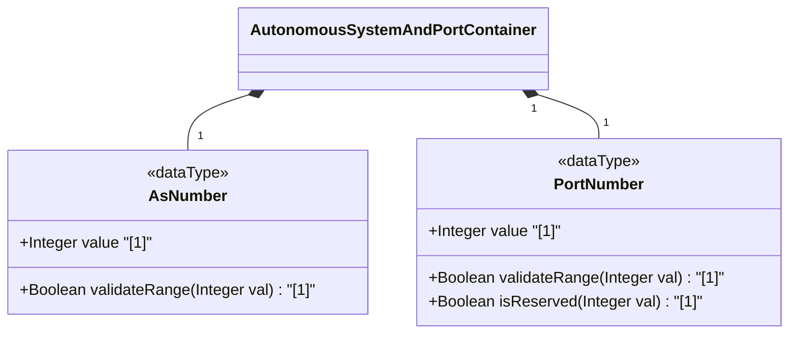

# Feature: [ietf-inet-types]: Autonomous System and Port Number Data Types

## Parent Epic
- [ ] #24 - [ietf-inet-types: Common Internet Data Types](https://github.com/gintatkinson/3dgs-037/blob/main/docs/epics/epic-02-ietf-inet-types.md) (Parent Epic specification)

## Description
This feature specifies the data types for Autonomous System numbers (`as-number`) and transport-layer port numbers (`port-number`) defined in the `ietf-inet-types` YANG module (RFC 6021). The `as-number` type represents a 32-bit unsigned integer (`uint32`) identifying an Autonomous System under single technical administration, supporting the expanded 4-octet AS number space defined by BGP extensions (RFC 6793). The `port-number` type represents a 16-bit unsigned integer (`uint16`) in the range 0 to 65535 assigned by IANA for transport-layer protocols (such as TCP, UDP, SCTP, DCCP), noting that port zero is reserved by IANA and may be excluded via subtyping.

## UML Class Diagram


## Interface Requirements

### 1. Payload Schema
```json
{
  "$schema": "http://json-schema.org/draft-07/schema#",
  "title": "AutonomousSystemAndPortTypesPayload",
  "type": "object",
  "properties": {
    "asNumber": {
      "type": "integer",
      "minimum": 0,
      "maximum": 4294967295,
      "description": "32-bit Autonomous System number (uint32)."
    },
    "portNumber": {
      "type": "integer",
      "minimum": 0,
      "maximum": 65535,
      "description": "16-bit transport protocol port number (uint16)."
    }
  },
  "required": [
    "asNumber",
    "portNumber"
  ]
}
```

### 2. Validation & Constraints
- `as-number` MUST be a valid 32-bit unsigned integer within the inclusive range `0` to `4294967295` ($2^{32} - 1$).
- `port-number` MUST be a valid 16-bit unsigned integer within the inclusive range `0` to `65535` ($2^{16} - 1$).
- Port `0` is defined as a valid 16-bit value in the base `port-number` type, but is marked as reserved by IANA. Interfaces requiring valid non-zero transport ports MUST enforce subtyping constraints excluding `0`.

### 3. Logical Operations & Interface Messages
- `parseAsNumber(input: Any) -> AsNumber`: Parses input into a 32-bit unsigned integer AS number entity.
- `parsePortNumber(input: Any) -> PortNumber`: Parses input into a 16-bit unsigned integer transport port entity.
- `validatePortNonZero(port: PortNumber) -> Boolean`: Evaluates whether a port number is non-zero when subtyping restrictions apply.

### 4. Logical Exception States & Validation Failures
- `ERR_AS_NUMBER_OUT_OF_BOUNDS`: Raised when an AS number is less than 0 or exceeds 4294967295.
- `ERR_PORT_NUMBER_OUT_OF_BOUNDS`: Raised when a port number is less than 0 or exceeds 65535.
- `ERR_RESERVED_PORT_ZERO_DISALLOWED`: Raised when port zero is supplied in a context where zero is excluded by subtyping.

## Given-When-Then Acceptance Criteria

### Scenario 1: Valid 32-Bit Autonomous System Number Validation
- **Given** an AS number input within the range 0 to 4294967295 (e.g. `64512` or `4294967295`)
- **When** the `as-number` parser and range validator evaluate the value
- **Then** the value is accepted as a valid 32-bit Autonomous System number entity without error.

### Scenario 2: Invalid Out-of-Bounds Autonomous System Number
- **Given** an AS number input outside the 32-bit unsigned integer range (e.g. `-1` or `4294967296`)
- **When** the `as-number` parser and range validator evaluate the value
- **Then** validation fails and raises `ERR_AS_NUMBER_OUT_OF_BOUNDS`.

### Scenario 3: Valid 16-Bit Port Number Boundary Validation
- **Given** a port number input at boundary values 0, 80, 443, or 65535
- **When** the `port-number` parser evaluates the value
- **Then** the value is accepted as a valid 16-bit transport layer port number entity.

### Scenario 4: Invalid Out-of-Bounds Port Number Validation
- **Given** a port number input outside the 16-bit unsigned integer range (e.g. `-1` or `655636`)
- **When** the `port-number` parser evaluates the value
- **Then** validation fails and raises `ERR_PORT_NUMBER_OUT_OF_BOUNDS`.

### Scenario 5: Reserved Port Zero Subtyping Constraint Enforcement
- **Given** a port number input of `0` in a subtyped context excluding reserved port zero
- **When** `validatePortNonZero` evaluates the port entity
- **Then** validation fails and raises `ERR_RESERVED_PORT_ZERO_DISALLOWED`.

## Specification Context (Verbatim)

```
   typedef port-number {
     type uint16 {
       range "0..65535";
     }
     description
      "The port-number type represents a 16-bit port number of an
       Internet transport-layer protocol such as UDP, TCP, DCCP, or
       SCTP.  Port numbers are assigned by IANA.  A current list of
       all assignments is available from <http://www.iana.org/>.

       Note that the port number value zero is reserved by IANA.  In
       situations where the value zero does not make sense, it can
       be excluded by subtyping the port-number type.
       In the value set and its semantics, this type is equivalent
       to the InetPortNumber textual convention of the SMIv2.";
     reference
      "RFC  768: User Datagram Protocol
       RFC  793: Transmission Control Protocol
       RFC 4960: Stream Control Transmission Protocol
       RFC 4340: Datagram Congestion Control Protocol (DCCP)
       RFC 4001: Textual Conventions for Internet Network Addresses";
   }

   typedef as-number {
     type uint32;
     description
      "The as-number type represents autonomous system numbers
       which identify an Autonomous System (AS).  An AS is a set
       of routers under a single technical administration, using
       an interior gateway protocol and common metrics to route
       packets within the AS, and using an exterior gateway
       protocol to route packets to other ASes.  IANA maintains
       the AS number space and has delegated large parts to the
       regional registries.

       Autonomous system numbers were originally limited to 16
       bits.  BGP extensions have enlarged the autonomous system
       number space to 32 bits.  This type therefore uses an uint32
       base type without a range restriction in order to support
       a larger autonomous system number space.

       In the value set and its semantics, this type is equivalent
       to the InetAutonomousSystemNumber textual convention of
       the SMIv2.";
     reference
      "RFC 1930: Guidelines for creation, selection, and registration
                 of an Autonomous System (AS)
       RFC 4271: A Border Gateway Protocol 4 (BGP-4)
       RFC 4001: Textual Conventions for Internet Network Addresses
       RFC 6793: BGP Support for Four-Octet Autonomous System (AS)
                 Number Space";
   }
```

## User Stories
- [ ] #28 - [[ietf-inet-types]: Autonomous System (AS) Number 2-Byte / 4-Byte Notation Parsing, AS Plain Conversions, and TCP/UDP Port Range Bounds (0..65535)](https://github.com/gintatkinson/3dgs-037/blob/main/docs/user-stories/us-14-as-number-and-port-range-validation.md) (Validates 32-bit AS number range bounds 0..4294967295, 16-bit transport port bounds 0..65535, and subtyped non-zero port constraints)

## Source References
Structural Schema: https://github.com/YangModels/yang/blob/main/standard/ietf/RFC/ietf-inet-types%402013-07-15.yang
Normative Specification: https://datatracker.ietf.org/doc/rfc6021/

## Logical UI & Layout Bindings
- **Target LUI Component:** N/A
- **Target Layout Container ID:** N/A
- **Data Source Bindings:** N/A
