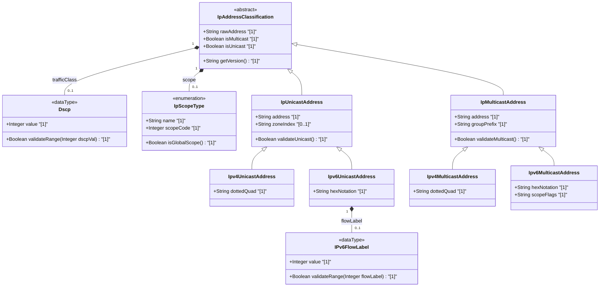

# Feature: [ietf-inet-types]: IP Unicast, Multicast, and Scope Data Types

## Parent Epic
- [ ] #24 - [ietf-inet-types: Common Internet Data Types](https://github.com/gintatkinson/3dgs-037/blob/main/docs/epics/epic-02-ietf-inet-types.md) (Parent Epic specification)

## Description
This feature specifies the data types for IPv6 Flow Labels (`ipv6-flow-label`), Differentiated Services Code Points (`dscp`), IP Unicast and Multicast address classifications (`ip-unicast-address`, `ipv4-unicast-address`, `ipv6-unicast-address`, `ip-multicast-address`, `ipv4-multicast-address`, `ipv6-multicast-address`), and Scope Data Types defined in the `ietf-inet-types` YANG module (RFC 6021 / RFC 6991). The `ipv6-flow-label` type represents a 20-bit unsigned integer (`uint32`) in the range `0` to `1048575` used to identify and discriminate packet flows in IPv6 headers (RFC 3595). The `dscp` type represents a 6-bit unsigned integer (`uint8`) in the range `0` to `63` used for marking packets in traffic streams within the Differentiated Services architecture (RFC 2474). In addition, this feature formalizes structural classifications distinguishing unicast (point-to-point) and multicast (group-destination) addresses across IPv4 (`224.0.0.0/4`) and IPv6 (`ff00::/8`), as well as scope types (`interface-local`, `link-local`, `admin-local`, `site-local`, `organization-local`, `global`) for scoped IP address architecture (RFC 4007, RFC 4291).

## UML Class Diagram


## Interface Requirements

### 1. Payload Schema
```json
{
  "$schema": "http://json-schema.org/draft-07/schema#",
  "title": "IpUnicastMulticastAndScopeTypesPayload",
  "type": "object",
  "properties": {
    "ipv6FlowLabel": {
      "type": "integer",
      "minimum": 0,
      "maximum": 1048575,
      "description": "20-bit IPv6 flow label identifier (uint32)."
    },
    "dscp": {
      "type": "integer",
      "minimum": 0,
      "maximum": 63,
      "description": "6-bit Differentiated Services Code Point (uint8)."
    },
    "ipUnicastAddress": {
      "type": "string",
      "description": "IP unicast address (IPv4 dotted-quad or IPv6 hex notation without multicast prefix)."
    },
    "ipv4UnicastAddress": {
      "type": "string",
      "format": "ipv4",
      "description": "IPv4 unicast address excluding 224.0.0.0/4."
    },
    "ipv6UnicastAddress": {
      "type": "string",
      "format": "ipv6",
      "description": "IPv6 unicast address excluding ff00::/8."
    },
    "ipMulticastAddress": {
      "type": "string",
      "description": "IP multicast group address."
    },
    "ipv4MulticastAddress": {
      "type": "string",
      "pattern": "^(22[4-9]|23[0-9])\\.(\\d{1,3})\\.(\\d{1,3})\\.(\\d{1,3})$",
      "description": "IPv4 multicast address within range 224.0.0.0/4."
    },
    "ipv6MulticastAddress": {
      "type": "string",
      "pattern": "^[fF][fF][0-9a-fA-F]{2}:.*$",
      "description": "IPv6 multicast address with prefix ff00::/8."
    },
    "scopeType": {
      "type": "string",
      "enum": [
        "interface-local",
        "link-local",
        "admin-local",
        "site-local",
        "organization-local",
        "global"
      ],
      "description": "Architectural scope identifier for scoped addresses."
    }
  },
  "required": [
    "ipv6FlowLabel",
    "dscp"
  ]
}
```

### 2. Validation & Constraints
- `ipv6-flow-label` MUST be an unsigned 32-bit integer within the inclusive range `0` to `1048575` ($2^{20} - 1$). Values less than `0` or greater than `1048575` MUST be rejected.
- `dscp` MUST be an unsigned 8-bit integer within the inclusive range `0` to `63` ($2^6 - 1$). Values less than `0` or greater than `63` MUST be rejected.
- `ip-unicast-address` MUST represent a valid point-to-point IP address and MUST NOT fall within defined multicast address ranges (`224.0.0.0/4` for IPv4 or `ff00::/8` for IPv6).
- `ipv4-unicast-address` MUST be a valid IPv4 address in dotted-quad notation excluding the multicast block `224.0.0.0` through `239.255.255.255`.
- `ipv6-unicast-address` MUST be a valid IPv6 address in canonical or shortened notation excluding the multicast prefix `ff00::/8`.
- `ip-multicast-address` MUST represent a valid group destination IP address belonging to either the IPv4 multicast block (`224.0.0.0/4`) or IPv6 multicast block (`ff00::/8`).
- `ipv4-multicast-address` MUST be within the IPv4 multicast range `224.0.0.0` to `239.255.255.255`.
- `ipv6-multicast-address` MUST begin with the 8-bit multicast prefix `ff00::/8` (`FF00::/8`).
- `scope-type` MUST be one of the defined architectural scope identifiers: `interface-local` (code 1), `link-local` (code 2), `admin-local` (code 4), `site-local` (code 5), `organization-local` (code 8), or `global` (code 14).

### 3. Logical Operations & Interface Messages
- `parseIpv6FlowLabel(input: Any) -> IPv6FlowLabel`: Evaluates and returns a 20-bit IPv6 flow label entity.
- `parseDscp(input: Any) -> Dscp`: Evaluates and returns a 6-bit DSCP entity.
- `classifyIpAddress(address: String) -> IpAddressClassification`: Analyzes an IP address string and returns its version (IPv4/IPv6), mode (Unicast/Multicast), and scope level.
- `validateUnicastAddress(address: String) -> Boolean`: Verifies that an IP address is valid and non-multicast.
- `validateMulticastAddress(address: String) -> Boolean`: Verifies that an IP address falls inside the designated multicast space.
- `getMulticastScope(address: String) -> IpScopeType`: Extracts the 4-bit scope field from an IPv6 multicast header or maps an IPv4 multicast group to its scope.

### 4. Logical Exception States & Validation Failures
- `ERR_IPV6_FLOW_LABEL_OUT_OF_BOUNDS`: Raised when an IPv6 flow label value is negative or exceeds `1048575`.
- `ERR_DSCP_OUT_OF_BOUNDS`: Raised when a DSCP value is negative or exceeds `63`.
- `ERR_INVALID_UNICAST_ADDRESS`: Raised when a multicast address is provided in a context expecting a unicast address.
- `ERR_INVALID_MULTICAST_ADDRESS`: Raised when a unicast address or invalid IP string is provided where a multicast address is required.
- `ERR_UNRESOLVABLE_SCOPE_TYPE`: Raised when an unknown or invalid scope identifier is supplied for a scoped address operation.

## Given-When-Then Acceptance Criteria

### Scenario 1: Valid 20-Bit IPv6 Flow Label Range Boundary Validation
- **Given** an IPv6 flow label input at boundary or intermediate values `0`, `524287`, or `1048575`
- **When** the `ipv6-flow-label` parser and validator process the input
- **Then** the value is accepted as a valid 20-bit IPv6 flow label entity without error.

### Scenario 2: Invalid Out-of-Bounds IPv6 Flow Label Rejection
- **Given** an IPv6 flow label input outside the 20-bit unsigned range (e.g. `-1` or `1048576`)
- **When** the `ipv6-flow-label` parser and validator process the input
- **Then** validation fails and raises `ERR_IPV6_FLOW_LABEL_OUT_OF_BOUNDS`.

### Scenario 3: Valid 6-Bit DSCP Value Validation
- **Given** a DSCP input value within the 6-bit range `0` to `63` (e.g. `0` for CS0, `46` for EF, `63`)
- **When** the `dscp` parser and validator process the input
- **Then** the value is accepted as a valid Differentiated Services Code Point entity.

### Scenario 4: Invalid Out-of-Bounds DSCP Rejection
- **Given** a DSCP input value outside the range 0 to 63 (e.g. `-1` or `64`)
- **When** the `dscp` parser and validator process the input
- **Then** validation fails and raises `ERR_DSCP_OUT_OF_BOUNDS`.

### Scenario 5: IPv4 Unicast vs Multicast Address Classification
- **Given** an IPv4 address string `192.168.1.1` (unicast) and `224.0.0.1` (multicast)
- **When** `classifyIpAddress` evaluates both addresses
- **Then** `192.168.1.1` is classified as `IpUnicastAddress` and `224.0.0.1` is classified as `IpMulticastAddress`.

### Scenario 6: IPv6 Unicast vs Multicast Address Classification
- **Given** an IPv6 address string `2001:db8::1` (unicast) and `ff02::1` (multicast)
- **When** `classifyIpAddress` evaluates both addresses
- **Then** `2001:db8::1` is classified as `IpUnicastAddress` and `ff02::1` is classified as `IpMulticastAddress`.

### Scenario 7: Multicast Scope Extraction and Validation
- **Given** an IPv6 link-local multicast address `ff02::1`
- **When** `getMulticastScope` extracts the scope field
- **Then** the extracted scope code is `2` corresponding to `link-local`.

## Specification Context (Verbatim)

```
   typedef dscp {
     type uint8 {
       range "0..63";
     }
     description
      "The dscp type represents a Differentiated Services Code-Point
       that may be used for marking packets in a traffic stream.

       In the value set and its semantics, this type is equivalent
       to the Dscp textual convention of the SMIv2.";
     reference
      "RFC 3289: Management Information Base for the Differentiated
                 Services Architecture
       RFC 2474: Definition of the Differentiated Services Field
                 (DS Field) in the IPv4 and IPv6 Headers
       RFC 2780: IANA Allocation Guidelines For Values In
                 the Internet Protocol and Related Headers";
   }

   typedef ipv6-flow-label {
     type uint32 {
       range "0..1048575";
     }
     description
      "The flow-label type represents flow identifier or Flow Label
       in an IPv6 packet header that may be used to discriminate
       traffic flows.

       In the value set and its semantics, this type is equivalent
       to the IPv6FlowLabel textual convention of the SMIv2.";
     reference
      "RFC 3595: Textual Conventions for IPv6 Flow Label
       RFC 2460: Internet Protocol, Version 6 (IPv6) Specification";
   }
```

## User Stories
- [ ] #29 - [[ietf-inet-types]: IP Unicast vs Multicast Address Classification, IPv6 Flow Label Generation, and DSCP Code Point Validation](https://github.com/gintatkinson/3dgs-037/blob/main/docs/user-stories/us-15-ip-unicast-multicast-flow-label-classification.md) (Validates 20-bit IPv6 flow label range 0..1048575, 6-bit DSCP range 0..63, IP unicast vs multicast address classification, and multicast scope extraction)

## Source References
Structural Schema: https://github.com/YangModels/yang/blob/main/standard/ietf/RFC/ietf-inet-types%402013-07-15.yang
Normative Specification: https://datatracker.ietf.org/doc/rfc6021/

## Logical UI & Layout Bindings
- **Target LUI Component:** PropertyGrid
- **Target Layout Container ID:** properties_view
- **Data Source Bindings:** /ietf-inet-types:ip-multicast-scope
