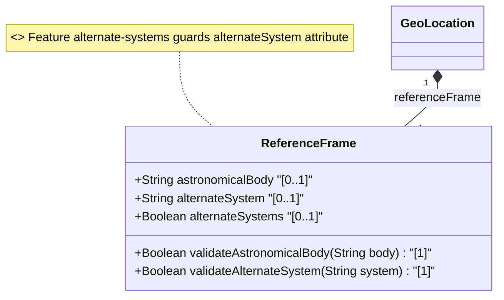

# Feature: [ietf-geo-location]: Geodetic Reference Frame

## Parent Epic
- [ ] #38 - [[ietf-geo-location]: Geographic Location Management](https://github.com/gintatkinson/3dgs-037/blob/main/docs/epics/epic-03-ietf-geo-location.md) (Parent Epic specification)

## Description
This feature specifies the geodetic reference frame container (`reference-frame`) defined in the `ietf-geo-location` YANG module (RFC 9179). The reference frame establishes the spatial origin and contextual interpretation for geographical coordinates and height values.

The `reference-frame` container is a core component of the `geo-location` root structure and contains the following attributes and conditional guards:
1. **astronomical-body**: A string leaf defining the astronomical body (such as Earth, Mars, Enceladus, Ceres, or 1P/Halley) for which the spatial location applies, as standardized by the International Astronomical Union (IAU). Defaults to `"earth"`. Restricted by the ASCII character pattern `'[ -@\[-\^_-~]*'`.
2. **alternate-system**: An optional string leaf defining an alternate coordinate reference system when the conditional feature `alternate-systems` is active. When absent, the coordinate system defaults to the natural universe.
3. **Feature Guard (`alternate-systems`)**: A YANG `if-feature "alternate-systems"` conditional guard governing the availability of the `alternate-system` leaf node.

## UML Class Diagram


## Interface Requirements

### 1. Payload Schema
```json
{
  "ietf-geo-location:geo-location": {
    "reference-frame": {
      "astronomical-body": "earth",
      "alternate-system": "wgs84-3d"
    }
  }
}
```

### 2. Validation & Constraints
- **astronomical-body**:
  - Type: `String` (YANG type `string`).
  - Default: `"earth"`.
  - Pattern: `'[ -@\[-\^_-~]*'` (Restricted to printable ASCII characters excluding control characters).
  - Multiplicity: `[0..1]` in wire payload; logically evaluates to `"earth"` when unassigned.
  - Source: International Astronomical Union (IAU) naming standards (<http://www.iau.org>).
- **alternate-system**:
  - Type: `String` (YANG type `string`).
  - Multiplicity: `[0..1]`.
  - Conditional Access: Guarded by `if-feature "alternate-systems"`.
  - Default Behavior: When omitted/absent, the reference frame system defaults to the natural universe.
- **Encoding & Schema Constraints**:
  - Valid UTF-8 string encoding without unescaped control characters.
  - Sub-tree location MUST resolve under `/nwi:network-inventory/nil:locations/nil:location/nil:geo-location/nil:reference-frame`.

### 3. Logical Operations & Interface Messages
- **GET /nwi:network-inventory/nil:locations/nil:location/nil:geo-location/nil:reference-frame**:
  - Retrieves the current geodetic reference frame configuration including `astronomical-body` and active `alternate-system` (if feature enabled).
- **PUT / Patch / Update reference-frame**:
  - Updates the `astronomical-body` identifier or `alternate-system` mapping.
  - Validates `astronomical-body` string against the defined regex pattern `'[ -@\[-\^_-~]*'`.
- **Feature Capability Query**:
  - Returns whether the device implementation supports the `alternate-systems` YANG feature.

### 4. Logical Exception States & Validation Failures
- **ERR_INVALID_ASTRONOMICAL_BODY (Validation Failure)**:
  - Triggered when `astronomical-body` contains characters outside the allowed pattern `'[ -@\[-\^_-~]*'`.
- **ERR_FEATURE_DISABLED_ALTERNATE_SYSTEM (Validation Failure)**:
  - Triggered when a payload contains the `alternate-system` field, but the underlying system has not enabled the `alternate-systems` feature capability.
- **ERR_REFERENCE_FRAME_NOT_FOUND (Entity Not Found)**:
  - Triggered when querying or attempting to modify a reference frame for a non-existent parent `geo-location` entity.

## Given-When-Then Acceptance Criteria
### Scenario 1: Default astronomical-body initialization
- **Given** a newly instantiated `geo-location` container without explicit reference-frame parameters,
- **When** the `reference-frame` payload is evaluated or queried,
- **Then** the system MUST report `astronomical-body` as `"earth"`.

### Scenario 2: Valid custom astronomical body assignment
- **Given** a valid `geo-location` reference frame configuration request,
- **When** `astronomical-body` is updated to a valid string such as `"mars"`, `"Enceladus"`, or `"1P/Halley"`,
- **Then** the system MUST accept the configuration change and update the `astronomical-body` property accordingly.

### Scenario 3: Invalid astronomical-body pattern validation failure
- **Given** an API request to modify `astronomical-body`,
- **When** the payload provides a string containing invalid control characters failing pattern `'[ -@\[-\^_-~]*'`,
- **Then** the request MUST be rejected with error `ERR_INVALID_ASTRONOMICAL_BODY`.

### Scenario 4: Setting alternate-system when alternate-systems feature is enabled
- **Given** the device supports and has activated the `alternate-systems` YANG feature,
- **When** a client provides a valid `alternate-system` value (e.g. `"wgs84-3d"`),
- **Then** the system MUST persist the `alternate-system` setting alongside `astronomical-body`.

### Scenario 5: Rejecting alternate-system payload when alternate-systems feature is disabled
- **Given** the `alternate-systems` YANG feature is disabled on the target node,
- **When** a client sends a payload containing an `alternate-system` leaf,
- **Then** the system MUST reject the operation with error `ERR_FEATURE_DISABLED_ALTERNATE_SYSTEM`.


### Associated User Stories
- [ ] #39 - [[ietf-geo-location]: Geodetic Reference Frame Validation](https://github.com/gintatkinson/3dgs-037/blob/main/docs/user-stories/us-16-geodetic-reference-frame-validation.md) (Validates geodetic reference frame datum selection and ellipsoid parameters)

## Specification Context (Verbatim)
The frame of reference ('reference-frame') defines what the location values refer to and their meaning. The referred-to object can be any astronomical body. It could be a planet such as Earth or Mars, a moon such as Enceladus, an asteroid such as Ceres, or even a comet such as 1P/Halley. This value is specified in 'astronomical-body' and is defined by the International Astronomical Union <http://www.iau.org>. The default 'astronomical-body' value is 'earth'.
In addition to identifying the astronomical body, we also need to define the meaning of the coordinates (e.g., latitude and longitude) and the definition of 0-height. This is done with a 'geodetic-datum' value.
Finally, we define an optional feature that allows for changing the system for which the above values are defined. This optional feature adds an 'alternate-system' value to the reference frame. This value is normally not present, which implies the natural universe is the system.

## Source References
Structural Schema: [ietf-geo-location@2022-02-11.yang](https://github.com/YangModels/yang/blob/main/standard/ietf/RFC/ietf-geo-location%402022-02-11.yang) (Clause: reference-frame)
Normative Specification: [RFC 9179 - A YANG Data Model for Geographic Location](https://datatracker.ietf.org/doc/rfc9179/) (Clause: Section 2.1)

## Logical UI & Layout Bindings
- **Target LUI Component:** PropertyGrid
- **Target Layout Container ID:** properties_view
- **Data Source Bindings:** /nwi:network-inventory/nil:locations/nil:location/nil:geo-location/nil:reference-frame
