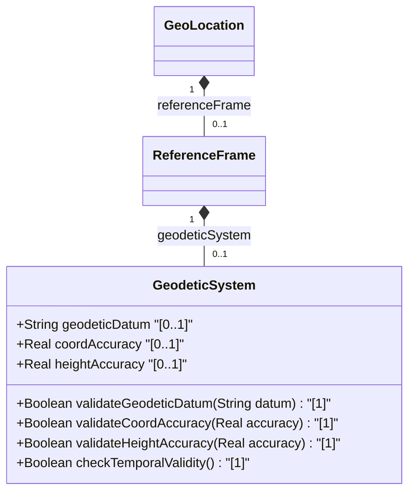

# Feature: [ietf-geo-location]: Geodetic System and Accuracy Bounds

## Parent Epic
- [ ] #38 - [[ietf-geo-location]: Geographic Location Management](https://github.com/gintatkinson/3dgs-037/blob/main/docs/epics/epic-03-ietf-geo-location.md) (Parent Epic for geographic location management)

## Description
This feature specifies the `geodetic-system` container within the geographic reference frame of the `ietf-geo-location` YANG module (RFC 9179). The geodetic system defines the spatial reference datum for geographic coordinates (latitude, longitude, and height reference) and establishes precision parameters for coordinate and vertical height accuracy.

The feature captures three core schema leaf attributes:
1. **geodetic-datum**: Specifies the reference datum string used to interpret geographic coordinates (e.g., `"wgs-84"`, `"nad83"`). Defaults to `"wgs-84"` when the associated astronomical body is Earth. Restricted by pattern `'[ -@\[-\^_-~]*'`.
2. **coord-accuracy**: A `decimal64` value with 6 fraction digits specifying horizontal coordinate accuracy, overriding the default accuracy implied by the geodetic datum.
3. **height-accuracy**: A `decimal64` value with 6 fraction digits specifying vertical height accuracy in units of `"meters"`, overriding the default height accuracy implied by the geodetic datum.

## UML Class Diagram


## Interface Requirements

### 1. Payload Schema
```json
{
  "geodeticDatum": "wgs-84",
  "coordAccuracy": 0.000001,
  "heightAccuracy": 0.050000
}
```

### 2. Validation & Constraints
- **geodeticDatum**: String type matching pattern `[ -@\[-\^_-~]*`. Default value is `"wgs-84"` when the parent reference frame's `astronomical-body` is `"earth"`. Registered via IANA geodetic datum registry.
- **coordAccuracy**: `decimal64` with `fraction-digits 6`. Must be non-negative ($\ge 0.0$). Overrides default coordinate precision derived from `geodeticDatum`.
- **heightAccuracy**: `decimal64` with `fraction-digits 6` in units of `"meters"`. Must be non-negative ($\ge 0.0$). Overrides default vertical precision derived from `geodeticDatum`.

### 3. Logical Operations & Interface Messages
- **Configure Geodetic System (PUT / POST / MERGE)**: Accepts configuration or update payloads containing `geodeticDatum`, `coordAccuracy`, and `heightAccuracy`.
- **Retrieve Geodetic System (GET)**: Returns the active geodetic system definition for a reference frame. Resolves default datum `"wgs-84"` when unasserted for Earth coordinates.
- **Accuracy Override Evaluation**: Resolves coordinate and height error bounds using explicit `coordAccuracy` and `heightAccuracy` values when present, falling back to datum defaults when omitted.
- **Pattern Validation**: Validates all incoming `geodeticDatum` string inputs against pattern `[ -@\[-\^_-~]*`.

### 4. Logical Exception States & Validation Failures
- **INVALID_GEODETIC_DATUM**: Raised if `geodeticDatum` contains invalid characters violating pattern `[ -@\[-\^_-~]*`.
- **INVALID_ACCURACY_PRECISION**: Raised if `coordAccuracy` or `heightAccuracy` exceeds 6 fraction digits of decimal precision.
- **NEGATIVE_ACCURACY_VALUE**: Raised if `coordAccuracy` or `heightAccuracy` is negative ($< 0.0$).
- **UNSUPPORTED_DATUM_REGISTRY**: Raised if `geodeticDatum` fails verification against an enforced IANA geodetic datum registry.

## Given-When-Then Acceptance Criteria

### Scenario 1: Default Geodetic Datum Resolution for Earth Coordinates
- **Given** a geographic location configured with an `astronomical-body` of `"earth"` and no explicit `geodetic-datum`
- **When** the `geodetic-system` parameters are retrieved or evaluated
- **Then** the `geodetic-datum` MUST default to `"wgs-84"`.

### Scenario 2: Valid Custom Geodetic Datum Configuration
- **Given** a request to configure `geodetic-datum` with value `"nad83"`
- **When** the datum string is validated against pattern `[ -@\[-\^_-~]*`
- **Then** the datum MUST be accepted and saved to the `geodetic-system` instance.

### Scenario 3: Coordinate Accuracy Override Enforcement
- **Given** a `geodetic-system` instance with `geodetic-datum` `"wgs-84"`
- **When** a payload provides an explicit `coord-accuracy` of `0.000005`
- **Then** the explicit value `0.000005` MUST override the default horizontal accuracy implied by `"wgs-84"`.

### Scenario 4: Height Accuracy Specification in Meters
- **Given** a `geodetic-system` instance requiring explicit vertical precision
- **When** `height-accuracy` is configured as `0.100000`
- **Then** the value MUST be interpreted as `0.100000` meters with fraction-digits 6 precision.

### Scenario 5: Rejection of Invalid Geodetic Datum Pattern
- **Given** a payload attempting to set `geodetic-datum` with prohibited control characters or non-matching pattern strings
- **When** input validation is executed
- **Then** the operation MUST fail with exception state `INVALID_GEODETIC_DATUM`.


### Associated User Stories
- [ ] #39 - [[ietf-geo-location]: Geodetic Reference Frame Validation](https://github.com/gintatkinson/3dgs-037/blob/main/docs/user-stories/us-16-geodetic-reference-frame-validation.md) (Validates geodetic datum reference system)
- [ ] #40 - [[ietf-geo-location]: 3D Coordinates and Altitude Parsing](https://github.com/gintatkinson/3dgs-037/blob/main/docs/user-stories/us-17-3d-coordinates-and-altitude-parsing.md) (Validates geodetic system precision bounds)
- [ ] #42 - [[ietf-geo-location]: Location Uncertainty Ellipse Bounds](https://github.com/gintatkinson/3dgs-037/blob/main/docs/user-stories/us-19-location-uncertainty-ellipse-bounds.md) (Validates coordinate and height accuracy override bounds)

## Specification Context (Verbatim)
In addition to identifying the astronomical body, we also need to define the meaning of the coordinates (e.g., latitude and longitude) and the definition of 0-height. This is done with a 'geodetic-datum' value. The default value for 'geodetic-datum' is 'wgs-84' (i.e., the World Geodetic System [WGS84]), which is used by the Global Positioning System (GPS) among many others. We define an IANA registry for specifying standard values for the 'geodetic-datum'.
In addition to the 'geodetic-datum' value, we allow overriding the coordinate and height accuracy using 'coord-accuracy' and 'height-accuracy', respectively. When specified, these values override the defaults implied by the 'geodetic-datum' value.

## Source References
Structural Schema: https://github.com/YangModels/yang/blob/main/standard/ietf/RFC/ietf-geo-location%402022-02-11.yang
Normative Specification: https://datatracker.ietf.org/doc/rfc9179/

## Logical UI & Layout Bindings
- **Target LUI Component:** PropertyGrid
- **Target Layout Container ID:** properties_view
- **Data Source Bindings:** /nwi:network-inventory/nil:locations/nil:location/nil:geo-location/nil:reference-frame/nil:geodetic-system
