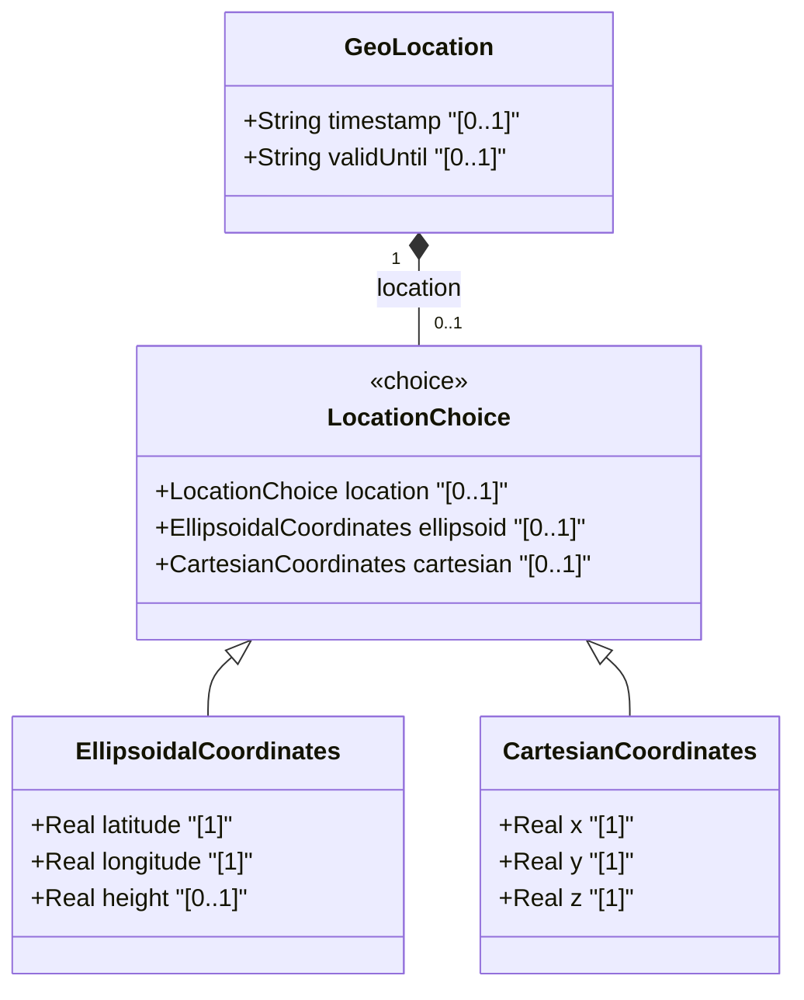

# Feature: [ietf-geo-location]: Geographic Coordinates and Altitude

## Parent Epic
- [ ] #38 - [[ietf-geo-location]: Geographic Location Management](https://github.com/gintatkinson/3dgs-037/blob/main/docs/epics/epic-03-ietf-geo-location.md) (Parent Epic reference)

## Description
This feature specifies the geographic coordinate and altitude representations within the `ietf-geo-location` YANG module container (RFC 9179). The `geo-location` container provides spatial position specifications on or relative to an astronomical body. Position information is specified via a mutually exclusive `location` choice, offering either geodetic ellipsoidal coordinates (`EllipsoidalCoordinates` case) or 3D Cartesian coordinates (`CartesianCoordinates` case).

Under the ellipsoidal coordinate representation, position is defined by `latitude` (decimal degrees in range [-90.0, 90.0] with up to 16 fraction digits), `longitude` (decimal degrees in range [-180.0, 180.0] with up to 16 fraction digits), and an optional `height` (meters relative to the reference ellipsoid with up to 6 fraction digits). Under the Cartesian coordinate representation, position is defined in 3-space by `x`, `y`, and `z` coordinates expressed in meters relative to the geocentric origin with up to 6 fraction digits. Additionally, `GeoLocation` includes temporal validity metadata via `timestamp` (the UTC date-and-time when coordinates were measured) and `valid-until` (the UTC date-and-time until which coordinates remain valid).

## UML Class Diagram


## Interface Requirements

### 1. Payload Schema
```json
{
  "$schema": "http://json-schema.org/draft-07/schema#",
  "title": "GeoLocationCoordinatesAndAltitudePayload",
  "type": "object",
  "properties": {
    "geo-location": {
      "type": "object",
      "properties": {
        "timestamp": {
          "type": "string",
          "format": "date-time",
          "description": "Timestamp when location was determined (RFC 6991 date-and-time)."
        },
        "valid-until": {
          "type": "string",
          "format": "date-time",
          "description": "Timestamp until which location remains valid (RFC 6991 date-and-time)."
        },
        "ellipsoid": {
          "type": "object",
          "properties": {
            "latitude": {
              "type": "number",
              "minimum": -90.0,
              "maximum": 90.0,
              "description": "Latitude in decimal degrees."
            },
            "longitude": {
              "type": "number",
              "minimum": -180.0,
              "maximum": 180.0,
              "description": "Longitude in decimal degrees."
            },
            "height": {
              "type": "number",
              "description": "Height in meters relative to reference ellipsoid."
            }
          },
          "required": ["latitude", "longitude"],
          "additionalProperties": false
        },
        "cartesian": {
          "type": "object",
          "properties": {
            "x": {
              "type": "number",
              "description": "X coordinate in meters."
            },
            "y": {
              "type": "number",
              "description": "Y coordinate in meters."
            },
            "z": {
              "type": "number",
              "description": "Z coordinate in meters."
            }
          },
          "required": ["x", "y", "z"],
          "additionalProperties": false
        }
      },
      "oneOf": [
        { "required": ["ellipsoid"] },
        { "required": ["cartesian"] }
      ],
      "additionalProperties": false
    }
  },
  "required": ["geo-location"]
}
```

### 2. Validation & Constraints
- **Latitude Range Constraint**: `latitude` MUST be a real number in decimal degrees bounded strictly between `-90.0000000000000000` and `+90.0000000000000000` (fraction-digits 16).
- **Longitude Range Constraint**: `longitude` MUST be a real number in decimal degrees bounded strictly between `-180.0000000000000000` and `+180.0000000000000000` (fraction-digits 16).
- **Height Precision**: `height` (if present) MUST be a real number representing meters with up to 6 fraction digits.
- **Cartesian Coordinate Precision**: `x`, `y`, and `z` MUST be real numbers representing meters relative to the geocentric origin with up to 6 fraction digits.
- **Mutual Exclusivity (Location Choice)**: A `geo-location` instance MUST contain either the `ellipsoid` choice branch OR the `cartesian` choice branch, but NEVER both simultaneously.
- **Date-Time Format Constraints**: `timestamp` and `valid-until` MUST conform to standard ISO 8601 / RFC 6991 `yang:date-and-time` string representations (e.g., `2026-08-04T14:00:00Z`).
- **Temporal Consistency Constraint**: If both `timestamp` and `valid-until` are provided, `valid-until` MUST be chronologically equal to or later than `timestamp`.

### 3. Logical Operations & Interface Messages
- **Create/Update GeoLocation Record (`set-geo-location`)**: Accepts a full or partial payload to set or update `geo-location` coordinates, enforcing choice mutual exclusivity and field range constraints.
- **Read GeoLocation Record (`get-geo-location`)**: Returns the current `geo-location` container payload including active coordinate branch and temporal metadata.
- **Validate Coordinate Constraints (`validate-coordinates`)**: Executes validation checks on latitude, longitude, height, or Cartesian values without committing changes.
- **Evaluate Temporal Validity (`check-temporal-validity`)**: Evaluates whether the current system time falls within the window `[timestamp, valid-until]`.

### 4. Logical Exception States & Validation Failures
- **`ERR_INVALID_LATITUDE_OUT_OF_BOUNDS`**: Raised when `latitude` is less than -90.0 or greater than +90.0 decimal degrees.
- **`ERR_INVALID_LONGITUDE_OUT_OF_BOUNDS`**: Raised when `longitude` is less than -180.0 or greater than +180.0 decimal degrees.
- **`ERR_MUTUAL_EXCLUSIVITY_VIOLATION`**: Raised when a request payload contains both `ellipsoid` and `cartesian` branches under `geo-location`.
- **`ERR_MISSING_MANDATORY_COORDINATES`**: Raised when the `ellipsoid` branch is selected without providing both `latitude` and `longitude`, or when the `cartesian` branch is selected without providing all three of `x`, `y`, and `z`.
- **`ERR_INVALID_DATE_TIME_FORMAT`**: Raised when `timestamp` or `valid-until` fails RFC 6991 `date-and-time` regex format validation.
- **`ERR_INVALID_TEMPORAL_WINDOW`**: Raised when `valid-until` precedes `timestamp`.

## Given-When-Then Acceptance Criteria

### Scenario 1: Valid Ellipsoidal Coordinate Creation with Altitude
- **Given** a valid request to create a `geo-location` record
- **When** the payload provides `ellipsoid` coordinates with `latitude = 37.7749`, `longitude = -122.4194`, and `height = 15.5` meters
- **Then** the `GeoLocation` instance is initialized with `EllipsoidalCoordinates`
- **And** `latitude`, `longitude`, and `height` are successfully validated and stored.

### Scenario 2: Valid Cartesian Coordinate Creation
- **Given** a valid request to create a `geo-location` record
- **When** the payload provides `cartesian` coordinates with `x = -2696667.123456`, `y = -4294025.654321`, and `z = 3887802.987654` meters
- **Then** the `GeoLocation` instance is initialized with `CartesianCoordinates`
- **And** all three Cartesian axes are validated and stored.

### Scenario 3: Rejection of Out-of-Bounds Latitude
- **Given** an incoming `geo-location` configuration request using the `ellipsoid` branch
- **When** `latitude` is set to `95.1234` decimal degrees
- **Then** the validation engine rejects the payload
- **And** returns error code `ERR_INVALID_LATITUDE_OUT_OF_BOUNDS`.

### Scenario 4: Rejection of Conflicting Location Choice Branches
- **Given** an incoming `geo-location` configuration request
- **When** the payload includes both `ellipsoid` and `cartesian` coordinate objects
- **Then** the validation engine rejects the transaction
- **And** returns error code `ERR_MUTUAL_EXCLUSIVITY_VIOLATION`.

### Scenario 5: Temporal Window Validation
- **Given** a `geo-location` record with `timestamp = "2026-08-04T12:00:00Z"` and `valid-until = "2026-08-04T18:00:00Z"`
- **When** a query evaluates `check-temporal-validity` at system time `"2026-08-04T14:00:00Z"`
- **Then** the result returns true indicating the location data is active and valid.

## Specification Context (Verbatim)
This is the location on, or relative to, the astronomical object. It is specified using two or three coordinate values. These values are given either as 'latitude', 'longitude', and an optional 'height', or as Cartesian coordinates of 'x', 'y', and 'z'. For the standard location choice, 'latitude' and 'longitude' are specified as decimal degrees, and the 'height' value is in fractions of meters. For the Cartesian choice, 'x', 'y', and 'z' are in fractions of meters. In both choices, the exact meanings of all the values are defined by the 'geodetic-datum' value in Section 2.1.

## Source References
Structural Schema: https://github.com/YangModels/yang/blob/main/standard/ietf/RFC/ietf-geo-location%402022-02-11.yang
Normative Specification: https://datatracker.ietf.org/doc/rfc9179/

## Logical UI & Layout Bindings
- **Target LUI Component:** PropertyGrid
- **Target Layout Container ID:** properties_view
- **Data Source Bindings:** /nwi:network-inventory/nil:locations/nil:location/nil:geo-location
