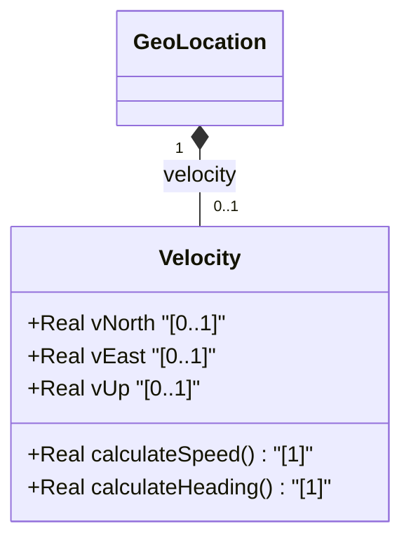

# Feature: [ietf-geo-location]: Motion and Velocity Vectors

## Parent Epic
- [ ] #38 - [[ietf-geo-location]: Geographic Location Management](https://github.com/gintatkinson/3dgs-037/blob/main/docs/epics/epic-03-ietf-geo-location.md) (Parent Epic specification for geographic location management subsystem)

## Description
This feature specifies the motion and velocity vector grouping defined in the `ietf-geo-location` YANG schema container (`/geo-location/velocity`) as standardized in RFC 9179. It provides a standardized semantic structure to represent objects in relatively stable motion using a three-dimensional vector representation.

The vector components consist of three fractional velocity elements:
1. **v-north**: Rate of change towards true north in fractional meters per second (`decimal64`, 12 fraction digits).
2. **v-east**: Rate of change perpendicular to and to the right of true north in fractional meters per second (`decimal64`, 12 fraction digits).
3. **v-up**: Rate of change perpendicular to the plane defined by `v-north` and `v-east`, pointed away from the center of mass in fractional meters per second (`decimal64`, 12 fraction digits).

From these 3D velocity vector components, two-dimensional speed ($speed = \sqrt{v_{north}^2 + v_{east}^2}$) and heading ($heading = \arctan(v_{east} / v_{north})$) can be derived for navigation, tracking, and spatial analytics.

## UML Class Diagram


## Interface Requirements

### 1. Payload Schema
```json
{
  "$schema": "https://json-schema.org/draft/2020-12/schema",
  "title": "VelocityVector",
  "type": "object",
  "properties": {
    "ietf-geo-location:velocity": {
      "type": "object",
      "properties": {
        "v-north": {
          "type": "number",
          "multipleOf": 0.000000000001,
          "description": "Rate of change towards true north in meters per second."
        },
        "v-east": {
          "type": "number",
          "multipleOf": 0.000000000001,
          "description": "Rate of change perpendicular and to the right of true north in meters per second."
        },
        "v-up": {
          "type": "number",
          "multipleOf": 0.000000000001,
          "description": "Rate of change perpendicular to the v-north/v-east plane, away from center of mass in meters per second."
        }
      },
      "additionalProperties": false
    }
  }
}
```

### 2. Validation & Constraints
- **Data Type & Precision**: All velocity fields (`v-north`, `v-east`, `v-up`) MUST be encoded as `decimal64` values with up to 12 fraction digits (`fraction-digits 12`).
- **Units**: Values MUST represent rate of change in units of fractional meters per second (m/s).
- **Coordinate Reference Frames**:
  - `v-north`: Aligned relative to true north defined by the reference frame for the astronomical body.
  - `v-east`: Aligned perpendicular to `v-north` pointing to the right of true north.
  - `v-up`: Aligned perpendicular to the plane formed by `v-north` and `v-east`, pointing away from the center of mass of the astronomical body.
- **Derived Values**:
  - 2D Speed: $speed = \sqrt{v\_north^2 + v\_east^2}$
  - 2D Heading: $heading = \arctan(v\_east / v\_north)$ expressed in radians or degrees relative to true north.

### 3. Logical Operations & Interface Messages
- **GET /nwi:network-inventory/nil:locations/nil:location/nil:geo-location/nil:velocity**: Retrieve current 3D velocity vector attributes for a target location object.
- **PUT / PATCH /nwi:network-inventory/nil:locations/nil:location/nil:geo-location/nil:velocity**: Configure or update the velocity vector attributes.
- **calculateSpeed()**: Logical operation executing $speed = \sqrt{v\_north^2 + v\_east^2}$.
- **calculateHeading()**: Logical operation executing $heading = \arctan2(v\_east, v\_north)$.

### 4. Logical Exception States & Validation Failures
- **ERR-VEL-001 (Invalid Precision)**: Occurs when a velocity component exceeds 12 fraction digits of precision.
- **ERR-VEL-002 (Non-Numeric Value)**: Occurs when `v-north`, `v-east`, or `v-up` payload elements contain invalid string or non-numeric types.
- **ERR-VEL-003 (Undefined Heading Angle)**: Special mathematical exception state when both `v-north = 0` and `v-east = 0`, yielding an undefined 2D heading angle ($0/0$). System MUST handle this state without crashing and report speed as 0.0 m/s with heading as undefined or zero.

## Given-When-Then Acceptance Criteria

### Scenario 1: Valid Ingestion of 3D Motion and Velocity Vector
- **Given** a valid `ietf-geo-location:velocity` payload with `v-north = 15.123456789012`, `v-east = 8.654321098765`, and `v-up = 0.500000000000`
- **When** the payload is parsed and validated against the `Velocity` schema classifier
- **Then** all three components are stored as `decimal64` numbers with 12 fraction digits
- **And** no validation errors are raised.

### Scenario 2: Derivation of 2D Heading and Speed
- **Given** an ingested velocity container with `v-north = 3.0` m/s and `v-east = 4.0` m/s
- **When** `calculateSpeed()` and `calculateHeading()` logical operations are invoked
- **Then** `calculateSpeed()` returns `5.0` m/s
- **And** `calculateHeading()` returns approximately `0.927295218` radians (or 53.13 degrees east of north).

### Scenario 3: Precision Validation Failure
- **Given** a velocity payload specifying `v-north` with 15 fraction digits (e.g. `10.123456789012345`)
- **When** schema validation is executed
- **Then** the validation engine rejects the message with error code `ERR-VEL-001` indicating fraction-digits constraint violation.

### Scenario 4: Zero Vector Heading Handling
- **Given** a velocity container with `v-north = 0.0` m/s and `v-east = 0.0` m/s
- **When** the system computes 2D speed and heading
- **Then** speed is calculated as `0.0` m/s
- **And** heading calculation handles division by zero gracefully without throwing an exception, reporting zero or undefined heading.

## Specification Context (Verbatim)
Support is added for objects in relatively stable motion. For objects in relatively stable motion, the grouping provides a three-dimensional vector value. The components of the vector are 'v-north', 'v-east', and 'v-up', which are all given in fractional meters per second. The values 'v-north' and 'v-east' are relative to true north as defined by the reference frame for the astronomical body; 'v-up' is perpendicular to the plane defined by 'v-north' and 'v-east', and is pointed away from the center of mass.
To derive the two-dimensional heading and speed: speed = sqrt(v_north^2 + v_east^2), heading = arctan(v_east / v_north).

## Source References
Structural Schema: https://github.com/YangModels/yang/blob/main/standard/ietf/RFC/ietf-geo-location%402022-02-11.yang
Normative Specification: https://datatracker.ietf.org/doc/rfc9179/

## Logical UI & Layout Bindings
- **Target LUI Component:** PropertyGrid
- **Target Layout Container ID:** properties_view
- **Data Source Bindings:** /nwi:network-inventory/nil:locations/nil:location/nil:geo-location/nil:velocity
