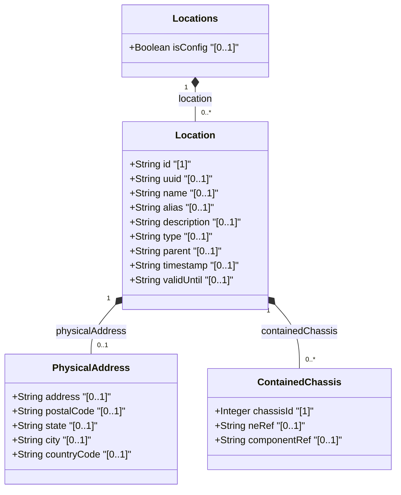

# Feature: [ietf-ni-location: Location Inventory Base and Postal Address]

## Parent Epic
- [ ] #51 - [ietf-ni-location: Network Inventory Location Management](https://github.com/gintatkinson/3dgs-037/blob/main/docs/epics/epic-04-ietf-ni-location.md)

## Description
This feature specifies the base network inventory location management and physical address model as defined in `ietf-ni-location.yang`. It provides structural representations for network inventory locations (`locations`, `location`), location metadata (`id`, `uuid`, `name`, `alias`, `description`, `type`), hierarchical nesting relationships via `parent` references (using `ni-location-ref`, the leafref typedef defined in `ietf-ni-location.yang` pointing to `/ietf-ni-location:locations/location/id`), temporal validity (`timestamp`, `valid-until`), structured physical mailing address details (`physical-address` grouping with `address`, `postal-code`, `state`, `city`, and ISO 3166-1 alpha-2 `country-code`), and chassis directly deployed in a location without a rack (`contained-chassis` list with `chassis-id`, `ne-ref`, and `component-ref`).

## UML Class Diagram


## Interface Requirements

### 1. Test Data Shape
```json
{
  "ietf-ni-location:locations": {
    "location": [
      {
        "id": "loc-site-sfo-01",
        "uuid": "f47ac10b-58cc-4372-a567-0e02b2c3d479",
        "name": "San Francisco Primary Data Center",
        "alias": "SFO-DC1",
        "description": "Main West Coast regional data center site",
        "type": "site",
        "timestamp": "2026-07-06T10:00:00Z",
        "valid-until": "2030-12-31T23:59:59Z",
        "physical-address": {
          "address": "500 Howard Street, Suite 400",
          "postal-code": "94105",
          "state": "California",
          "city": "San Francisco",
          "country-code": "US"
        },
        "contained-chassis": [
          {
            "chassis-id": 101,
            "ne-ref": "/nwi:network-inventory/nwi:network-elements/nwi:network-element[nwi:ne-id='router-sfo-core-01']",
            "component-ref": "/nwi:network-inventory/nwi:network-elements/nwi:network-element[nwi:ne-id='router-sfo-core-01']/nwi:components/nwi:component[nwi:component-id='chassis-main']"
          }
        ]
      },
      {
        "id": "loc-room-101",
        "uuid": "e38bd09a-47bb-3261-9456-fdf1a1b2c368",
        "name": "Server Room 101",
        "alias": "SR-101",
        "description": "Primary server room inside SFO Data Center",
        "type": "equipment-room",
        "parent": "loc-site-sfo-01",
        "timestamp": "2026-07-06T10:30:00Z",
        "physical-address": {
          "address": "500 Howard Street, Suite 400, 1st Floor",
          "postal-code": "94105",
          "state": "California",
          "city": "San Francisco",
          "country-code": "US"
        }
      }
    ]
  }
}
```

### 2. Validation & Constraints
- **Key Uniqueness**: `id` leaf MUST be unique within `/ietf-ni-location:locations/location`.
- **ISO 3166-1 Alpha-2 Country Code**: `country-code` MUST strictly adhere to the regex pattern `'[A-Z]{2}'` (e.g. `'US'`, `'DE'`, `'FR'`, `'JP'`). Lowercase or invalid length values must fail validation.
- **Parent Leafref Path**: `parent` leaf uses the `ni-location-ref` typedef (the leafref typedef defined in `ietf-ni-location.yang`) and MUST reference a valid target `/ietf-ni-location:locations/location/id`. Self-referential or cyclic parent references MUST be rejected.
- **Date-Time Format**: `timestamp` and `valid-until` MUST follow `yang:date-and-time` syntax (ISO 8601 / RFC 3339 standard with offset).
- **Contained Chassis Key**: `chassis-id` MUST be a non-negative 32-bit integer (`uint32`) and unique within its host `location`.
- **Leafref Bindings**: `ne-ref` MUST point to a valid `/nwi:network-inventory/nwi:network-elements/nwi:network-element/nwi:ne-id` path. `component-ref` MUST point to a valid network element component path.

### 3. Visual Layout & Arrangement
- **CSS Resets & Scoping**: Layout containers MUST apply global `box-sizing: border-box` resets and use CSS Modules / BEM naming (`.location-inventory`, `.location-card`, `.address-grid`) to prevent specificity conflicts.
- **Layout Containment Rules**: Restrict CSS `contain` parameters (`contain: layout style`) strictly to outer layout splitters (`#properties_view`). Layout containment MUST NOT be applied to scrollable child panels to avoid clip or scroll calculation defects.
- **Hierarchical List Nesting**: Render parent/child location structures using valid semantically nested DOM elements (`<ul class="location-tree"><li class="location-item">...<ul class="nested-locations">...</ul></li></ul>`).
- **Property Grid Presentation**: Display physical address fields in a 2-column key-value grid (`address`, `postal-code`, `city`, `state`, `country-code`).

### 4. Interactive Flow & States
- **Read-Only State**: Render location metadata, postal address, and contained chassis items in a locked, high-contrast PropertyGrid view (`#properties_view`).
- **Edit State**: Highlight editable input fields with subtle focus rings and inline validation messages for `country-code` regex mismatches.
- **Empty State**: When no location entities exist in the inventory, present a descriptive empty-state illustration with an "Add Location" call-to-action button.
- **Loading State**: Display skeleton shimmer placeholders over the PropertyGrid while fetching `/nwi:network-inventory/nil:locations/nil:location`.
- **Error Highlighting**: Indicate validation failures (such as invalid ISO country code or missing mandatory key) with accessible error borders (`#d32f2f`), aria-invalid attributes, and tooltip error messages.

## Given-When-Then Acceptance Criteria

### Scenario 1: Successful Retrieval and Rendering of Location Base and Postal Address (Positive)
- **Given** the network inventory backend contains a valid location entry with `id` set to `"loc-site-sfo-01"` and `country-code` set to `"US"`
- **When** the user opens the `properties_view` pane to view location details
- **Then** the `PropertyGrid` component displays the location attributes (`id`, `name`, `type`, `timestamp`) and physical address fields (`address`, `postal-code`, `city`, `state`, `country-code`) accurately without layout distortion.

### Scenario 2: Validation Failure on Invalid Country Code Format (Negative Boundary)
- **Given** an operator attempts to set the `country-code` leaf to `"USA"` or `"us"` for location `"loc-site-sfo-01"`
- **When** the validation rules are executed on input submission
- **Then** the system rejects the update with an explicit error indicating that `country-code` must match the pattern `'[A-Z]{2}'`.

### Scenario 3: Hierarchical Parent Location Reference Verification (Positive Boundary)
- **Given** a child location `"loc-room-101"` configured with `parent` pointing to `"loc-site-sfo-01"`
- **When** the location tree hierarchy is compiled
- **Then** `"loc-room-101"` is correctly rendered nested under `"loc-site-sfo-01"` in the UI view, and `parent` references resolve to an existing location `id`.

### Scenario 4: Handling Contained Chassis List Entries (Positive)
- **Given** a location entry `"loc-site-sfo-01"` containing a `contained-chassis` list item with `chassis-id` `101` and valid `ne-ref`
- **When** the location details are rendered in `properties_view`
- **Then** the contained chassis table displays `chassis-id` `101` alongside active hyperlink references to the referenced Network Element.

### Scenario 5: Cyclic Parent Reference Prevention (Negative)
- **Given** a location `"loc-A"` having `parent` set to `"loc-B"`
- **When** an operator attempts to update `"loc-B"` to set its `parent` to `"loc-A"`
- **Then** the inventory validator flags a cyclic dependency exception and prevents saving the state.

## Specification Context (Verbatim)

```text
2. Hierarchical Locations of Network Inventory

The "location" list is generalized to support a variety of geographic location, such as sites, rooms, buildings.

A site represents a general geographic location to group a set of NEs and corresponding inventory components. NEs, racks, equipment rooms, and buildings can be grouped within a site.

A room is a facility, a space for network elements and other equipment (such as servers, storage) with power supply systems, air conditioning system, etc.

Locations can be nested to form a hierarchy. For example, buildings may be within a site, and a room may be within a building.

The "location-type" is defined as a YANG identity to identify the type of an inventory location, which may be site, equipment room, building, etc.

YANG Subtree of Location:
+--ro locations
   +--ro location* [id]
      +--ro id                   string
      +--ro uuid?                yang:uuid
      +--ro name?                string
      +--ro alias?               string
      +--ro description?         string
      +--ro type?                string
      +--ro parent?              -> ../../location/id
      +--ro timestamp?           yang:date-and-time
      +--ro valid-until?         yang:date-and-time
      +--ro physical-address
      |  +--ro address?        string
      |  +--ro postal-code?    string
      |  +--ro state?          string
      |  +--ro city?           string
      |  +--ro country-code?   string
      +--ro contained-chassis* [chassis-id]
         +--ro chassis-id       uint32
         +--ro ne-ref?          leafref
         +--ro component-ref?   leafref

YANG Module Groupings (ietf-ni-location.yang):
  grouping physical-address {
    description
      "Grouping for physical address information.";
    container physical-address {
      description
        "Top-level container for the physical address.";
      leaf address {
        type string;
        description
          "Specifies an address (number and street).";
      }
      leaf postal-code {
        type string;
        description
          "Specifies a postal code.";
      }
      leaf state {
        type string;
        description
          "Specifies a state. This leaf can also be
           used to describe a region for a country that
           does not have states.";
      }
      leaf city {
        type string;
        description
          "Specifies a city.";
      }
      leaf country-code {
        type string {
          pattern '[A-Z]{2}';
        }
        description
          "Specifies a country.
           Expressed as ISO ALPHA-2 code.";
      }
    }
  }

  grouping locations {
    description
      "Grouping for locations.";
    container locations {
      config false;
      description
        "Container for the location information.";
      list location {
        key "id";
        description
          "List of locations within the network.";
        leaf id {
          type string;
          description
            "An identifier of the location.";
        }
        uses nwi:basic-common-entity-attributes;
        leaf type {
          type string;
          description
            "The type of network inventory location, e.g.
             equipment room, building, or site.";
        }
        leaf parent {
          type leafref {
            path "../../location/id";
          }
          description
            "The identifier of the location that physically contains
             this location.";
        }
        leaf timestamp {
          type yang:date-and-time;
        }
        leaf valid-until {
          type yang:date-and-time;
        }
        uses physical-address;
        uses geo:geo-location;
        list contained-chassis {
          key "chassis-id";
          description
            "Chassis directly deployed in this location without rack.";
          leaf chassis-id {
            type uint32;
          }
          leaf ne-ref {
            type leafref {
              path "/nwi:network-inventory/nwi:network-elements"
                 + "/nwi:network-element/nwi:ne-id";
            }
          }
          leaf component-ref {
            type leafref {
              path "/nwi:network-inventory/nwi:network-elements"
                 + "/nwi:network-element[nwi:ne-id=current()/../ne-ref]"
                 + "/nwi:components/nwi:component/nwi:component-id";
            }
          }
        }
      }
    }
  }
```

## Source References
Structural Schema: https://github.com/ietf-ivy-wg/network-inventory-location/blob/main/ietf-ni-location.yang (Clause: grouping locations & physical-address)
Normative Specification: https://datatracker.ietf.org/doc/html/draft-ietf-ivy-network-inventory-location (Clause: Section 3 & 4)

## Logical UI & Layout Bindings
- **Target LUI Component:** PropertyGrid
- **Target Layout Container ID:** properties_view
- **Data Source Bindings:** /nwi:network-inventory/nil:locations/nil:location
