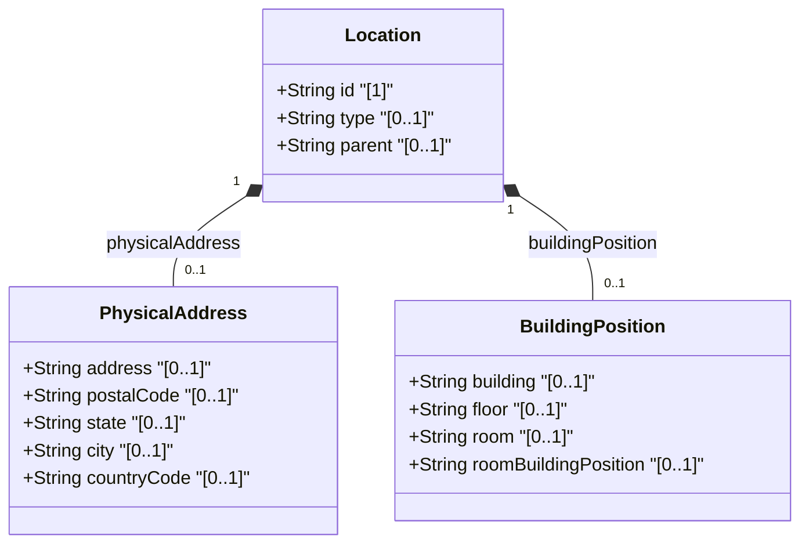

# Feature: [ietf-ni-location: Building and Floor Position Specs]

## Parent Epic
- [ ] #51 - [ietf-ni-location: Network Inventory Location Management](https://github.com/gintatkinson/3dgs-037/blob/main/docs/epics/epic-04-ietf-ni-location.md)

## Description
This feature specifies the physical address, building, and floor position model for network inventory location management within the `ietf-ni-location` YANG module. Physical address attributes provide standardized spatial and regional identification for facility structures hosting network elements (NEs) and chassis components.

The feature models both street-level physical addresses and fine-grained indoor building position attributes:
1. **street address (`address`)**: Specifies street number and street name details.
2. **postal code (`postal-code`)**: Identifies standard postal sorting and delivery codes.
3. **state/province (`state`)**: Specifies state or regional administrative district.
4. **city (`city`)**: Specifies municipality or city locality.
5. **country code (`country-code`)**: ISO ALPHA-2 standard country code matching pattern `'[A-Z]{2}'`.
6. **building (`building`)**: Identifier for specific building structure within a site facility.
7. **floor (`floor`)**: Level or floor designation within the target building.
8. **room (`room`)**: Specific equipment room, suite, or rack hall designation.
9. **room building position (`room-building-position`)**: Formatted positioning descriptor combining room, floor, and building hierarchy.

## UML Class Diagram


## Interface Requirements

### 1. Test Data Shape
```json
{
  "ietf-ni-location:locations": {
    "location": [
      {
        "id": "loc-bldg-402",
        "type": "building",
        "parent": "site-sunnyvale-01",
        "physical-address": {
          "address": "100 Technology Drive",
          "postal-code": "94089",
          "state": "California",
          "city": "Sunnyvale",
          "country-code": "US"
        },
        "room-building-position": "Building B, Floor 3, Room 302",
        "building": "Building B",
        "floor": "Floor 3",
        "room": "Room 302"
      }
    ]
  }
}
```

### 2. Validation & Constraints
- **country-code**:
  - Format: ISO ALPHA-2 standard country code.
  - Regex pattern: `'[A-Z]{2}'` (exactly 2 uppercase ASCII letters).
  - Validation failure: Values non-matching or longer/shorter than 2 characters MUST be rejected.
- **postal-code**:
  - Type: `String` (1 to 20 characters).
  - Format: Standard alphanumeric or dash-separated postal identifier.
- **address**, **city**, **state**:
  - Type: `String` (UTF-8 encoded string up to 256 characters).
  - Validation: Free-form text without unescaped ASCII control characters.
- **building**, **floor**, **room**:
  - Type: `String` (1 to 64 characters).
  - Identifiers for indoor building hierarchy elements.
- **room-building-position**:
  - Type: `String` (1 to 128 characters).
  - Formatted compound location string representing position in facility.
- **Hierarchical Containment**:
  - Sub-tree path resolves under `/nwi:network-inventory/nil:locations/nil:location/nil:physical-address`.
  - Parent location references MUST point to existing `location` entries within the network inventory.

### 3. Visual Layout & Arrangement
- **Layout Reset & Scoping**:
  - Apply global CSS resets (`box-sizing: border-box`, `margin: 0`, `padding: 0`).
  - Use CSS Modules / BEM naming (`.property-grid__container`, `.property-grid__row`, `.property-grid__label`, `.property-grid__value`) to avoid specificity collisions.
- **Layout Containment**:
  - Restrict layout containment parameters (`contain: layout style`) to outer layout splitters and panel wrappers.
  - Forbid `contain: strict` or `contain: paint` on scrollable child panels to ensure proper overflow display.
- **DOM Structure & Hierarchy**:
  - Render physical address and indoor position properties inside a structured `PropertyGrid` component placed within the `properties_view` layout panel.
  - Represent nested building/floor/room trees using valid, semantic DOM nesting (`<ul>` lists containing `<li>` list items with child `<ul>` lists for sub-levels).

### 4. Interactive Flow & States
- **Read-Only Mode**:
  - Displays address, postal code, state, city, country code, building, floor, room, and position in structured key-value property rows.
- **Edit Mode**:
  - Inline input controls for string properties (`address`, `city`, `state`, `postal-code`, `building`, `floor`, `room`).
  - Uppercase formatted dropdown or text input for 2-letter `country-code`.
- **Empty State**:
  - Displays `"No physical address configured"` placeholder when `physical-address` object is null or unassigned.
- **Loading State**:
  - Render animated skeleton loader rows while fetching location data from inventory store.
- **Error State**:
  - Highlight invalid fields (e.g. non-matching `country-code`) in red border with accessible error hint tooltip.

## Given-When-Then Acceptance Criteria

### Scenario 1: Valid physical address and building position specification
- **Given** a network inventory location record for a building or equipment room,
- **When** valid `address`, `postal-code`, `state`, `city`, `country-code` (`"US"`), `building`, `floor`, and `room` fields are submitted,
- **Then** the system MUST validate the payload against the `ietf-ni-location:locations/location/physical-address` schema container and display the properties in the `PropertyGrid`.

### Scenario 2: Invalid ISO country-code pattern validation failure
- **Given** a physical address creation or update request,
- **When** the `country-code` field contains an invalid string such as `"USA"`, `"us"`, or `"12"`,
- **Then** the validation engine MUST reject the payload and raise pattern validation error for `'[A-Z]{2}'`.

### Scenario 3: Valid indoor room and floor position resolution
- **Given** a location entry representing an equipment room on floor 3 of Building B,
- **When** `building` is set to `"Building B"`, `floor` is set to `"Floor 3"`, and `room` is set to `"Room 302"`,
- **Then** the property grid MUST render the complete indoor position hierarchy and update `room-building-position` to `"Building B, Floor 3, Room 302"`.

### Scenario 4: Rejection of invalid room position or orphaned hierarchy reference
- **Given** a room location specifying a parent building location ID,
- **When** the specified parent location ID does not exist in the location inventory list,
- **Then** the system MUST reject the reference with an invalid parent location reference error.

### Scenario 5: Interactive PropertyGrid view mode toggling
- **Given** the `PropertyGrid` bound to `/nwi:network-inventory/nil:locations/nil:location/nil:physical-address`,
- **When** the user toggles between Read-Only and Edit modes,
- **Then** the UI MUST seamlessly switch between static field labels and editable form controls while preserving current form values.

## Specification Context (Verbatim)
The "location" list is generalized to support a variety of geographic location, such as sites, rooms, buildings.
A site represents a general geographic location to group a set of NEs and corresponding inventory components. NEs, racks, equipment rooms, and buildings can be grouped within a site.
A room is a facility, a space for network elements and other equipment (such as servers, storage) with power supply systems, air conditioning system, etc.
Locations can be nested to form a hierarchy. For example, buildings may be within a site, and a room may be within a building.
The "location-type" is defined as a YANG identity to identify the type of an inventory location, which may be site, equipment room, building, etc.
Grouping for physical address information:
container physical-address {
  description "Top-level container for the physical address.";
  leaf address { type string; description "Specifies an address (number and street)."; }
  leaf postal-code { type string; description "Specifies a postal code."; }
  leaf state { type string; description "Specifies a state. This leaf can also be used to describe a region for a country that does not have states."; }
  leaf city { type string; description "Specifies a city."; }
  leaf country-code { type string { pattern '[A-Z]{2}'; } description "Specifies a country. Expressed as ISO ALPHA-2 code."; }
}

## Source References
Structural Schema: https://github.com/ietf-ivy-wg/network-inventory-location/blob/main/ietf-ni-location.yang (Clause: grouping physical-address)
Normative Specification: https://datatracker.ietf.org/doc/html/draft-ietf-ivy-network-inventory-location (Clause: Section 3 & 4)

## Logical UI & Layout Bindings
- **Target LUI Component:** PropertyGrid
- **Target Layout Container ID:** properties_view
- **Data Source Bindings:** /nwi:network-inventory/nil:locations/nil:location/nil:physical-address
