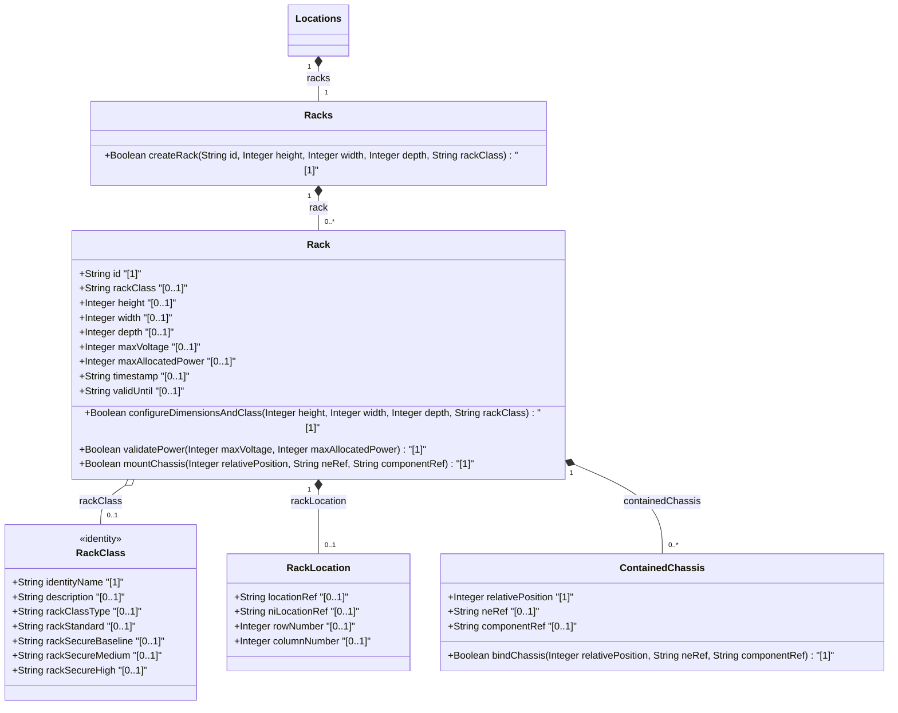

# Feature: [ietf-ni-location: Rack and Bay Positioning]

## Parent Epic
- [ ] #51 - [ietf-ni-location: Network Inventory Location Management](https://github.com/gintatkinson/3dgs-037/blob/main/docs/epics/epic-04-ietf-ni-location.md)

## Description
This feature specifies the physical rack containment, rack location, bay positioning, and chassis U-slot location model for network inventory defined in `ietf-ni-location.yang`. It provides comprehensive structural modeling for physical equipment racks (`racks`, `rack`), physical security classifications (`rack-class-type`, `rack-standard`, `rack-secure-baseline`, `rack-secure-medium`, `rack-secure-high`), spatial rack location attributes (`rack-location`, `location-ref` typed as `ni-location-ref`, `row-number`, `column-number`), physical enclosure dimensions (`height`, `width`, `depth` measured in millimeters), electrical infrastructure limits (`max-voltage` in volts, `max-allocated-power` in watts), contained chassis vertical placement (`contained-chassis`, `relative-position` uint8 U-slot, `ne-ref`, `component-ref`), operational validity timestamps (`timestamp`, `valid-until`), and bay positioning specifications (`rack-bay-positioning`, `rack-id`, `bay-id`, `u-position`).

### Rack Classification Identity Hierarchy
The rack classification identity hierarchy in `ietf-ni-location.yang` defines physical security levels for equipment enclosures derived from a common base identity:

| Identity Token | Base Identity | Description |
| --- | --- | --- |
| `rack-class-type` | None (Base Identity) | Base identity for generic rack classification based on physical security characteristics |
| `rack-standard` | `rack-class-type` | Standard general-purpose rack without physical locking mechanisms |
| `rack-secure-baseline` | `rack-class-type` | Baseline secure lockable rack |
| `rack-secure-medium` | `rack-class-type` | Medium security lockable rack |
| `rack-secure-high` | `rack-class-type` | High security lockable rack |

## UML Class Diagram


## Interface Requirements

### 1. Test Data Shape
```json
{
  "ietf-ni-location:racks": {
    "rack": [
      {
        "id": "RACK-ROOM2-A01",
        "rack-class": "ietf-ni-location:rack-secure-high",
        "rack-location": {
          "location-ref": "LOC-DATACENTER-MAIN",
          "row-number": 2,
          "column-number": 1
        },
        "height": 2200,
        "width": 600,
        "depth": 1000,
        "max-voltage": 240,
        "max-allocated-power": 8000,
        "contained-chassis": [
          {
            "relative-position": 1,
            "ne-ref": "NE-CORE-ROUTER-01",
            "component-ref": "CHASSIS-SLOT-01"
          },
          {
            "relative-position": 5,
            "ne-ref": "NE-AGG-SWITCH-02",
            "component-ref": "CHASSIS-SLOT-05"
          }
        ],
        "timestamp": "2026-08-04T12:00:00Z",
        "valid-until": "2030-12-31T23:59:59Z"
      }
    ]
  }
}
```

### 2. Validation & Constraints
- **Physical Dimension Constraints**: `height`, `width`, and `depth` must be `uint16` values expressed in millimeters (mm), where valid ranges are strictly positive integers `[1..65535]`. Standard 42U equipment racks measure 600mm x 1000mm x 2200mm.
- **Electrical Infrastructure Bounds**: `max-voltage` (`uint16` in Volts) must fall within `[0..65535]` V (typical datacenter operational range 110V-480V). `max-allocated-power` (`uint16` in Watts) must be bounded within `[0..65535]` W (typical cabinet allocation 1000W-20000W).
- **Rack Location & Row/Column Bounds**: `location-ref` in `rack-location` must be a valid leafref of typedef `ni-location-ref` (`ni_location_ref`) pointing to a registered location. `row-number` (`row_number`) and `column-number` (`column_number`) are `uint32` values bounded within `[0..4294967295]`.
- **Chassis U-Slot Relative Positioning**: `relative-position` in `contained-chassis` must be a `uint8` U-slot index within `[1..255]`. Two chassis entries in the same rack MUST NOT share the same `relative-position` (collision validation).
- **Identityref Security Classification**: `rack-class` MUST reference a valid derived identity of base identity `rack-class-type` (`rack_class_type`), including `rack-standard` (`rack_standard`), `rack-secure-baseline` (`rack_secure_baseline`), `rack-secure-medium` (`rack_secure_medium`), and `rack-secure-high` (`rack_secure_high`).
- **Entity Reference Integrity**: `ne-ref` and `component-ref` inside `contained-chassis` must resolve to valid network elements and chassis component identifiers registered in `/nwi:network-inventory/nwi:network-elements`.

### 3. Visual Layout & Arrangement
- **Layout Reset & Scoping**: Enforce CSS resets (`box-sizing: border-box`, `margin: 0`, `padding: 0`) and CSS Modules / BEM naming (`.rack-positioning-view`, `.rack-positioning-view__table`) to eliminate specificity leakage.
- **Layout Containment Rules**: Strict layout containment parameterization restricting containment to outer layout splitters and explicitly forbidding CSS layout containment on scrollable child panels.
- **Data Table Hierarchy**: A responsive `TableView` component displaying the list of racks, physical dimensions, electrical capacity badges, and expandable nested rows showing U-slot relative position allocations for mounted chassis components.

### 4. Interactive Flow & States
- **Read-Only State**: Present rack details, physical dimensions, power allocations, and mounted chassis U-positioning in a structured view-only layout (`config false`).
- **Edit / Selection State**: Highlight selected rack rows with smooth active border highlights and display child chassis slots with exact U-slot alignment markers.
- **Empty State**: Display clear visual indicators ("No racks configured for this location") when the `rack` list is empty.
- **Loading State**: Show non-blocking skeleton shimmer rows during asynchronous fetch of location rack data.
- **Error Highlighting State**: Display inline error badges and alert banners when referenced network elements or chassis components fail leafref validation.

## Given-When-Then Acceptance Criteria

### Scenario 1: Valid Rack Placement and Dimension Configuration
- **Given** a valid network inventory location "LOC-DATACENTER-MAIN" exists in the system
- **When** an operator queries the rack positioning container `/nwi:network-inventory/nil:locations/nil:racks/nil:rack[id='RACK-ROOM2-A01']`
- **Then** the system returns height `2200` mm, width `600` mm, depth `1000` mm, max-voltage `240` V, and max-allocated-power `8000` W
- **And** the visual `TableView` renders the physical specifications alongside electrical capacity badges.

### Scenario 2: U-Slot Collision Detection During Chassis Mounting
- **Given** a rack "RACK-ROOM2-A01" containing a chassis mounted at `relative-position` 1
- **When** an inventory update attempts to place a second chassis at `relative-position` 1 within the same rack
- **Then** the validation engine rejects the transaction with a U-slot positioning collision constraint error
- **And** highlights the duplicate U-slot index 1 in the interface error state.

### Scenario 3: Maximum Voltage and Power Capacity Validation
- **Given** a rack entry configured with `max-voltage` 240 V and `max-allocated-power` 8000 W
- **When** the system evaluates total chassis power allocations against `max-allocated-power`
- **Then** power allocations exceeding 8000 W trigger a high-capacity validation warning indicator
- **And** values exceeding uint16 limits (>65535) are rejected at the schema input boundary.

### Scenario 4: Identityref Security Class Validation
- **Given** a set of predefined rack classification identities derived from `rack-class-type` (`rack-standard`, `rack-secure-baseline`, `rack-secure-medium`, `rack-secure-high`)
- **When** a rack "RACK-ROOM2-A01" is assigned `rack-class` identityref `ietf-ni-location:rack-secure-high`
- **Then** the system validates that `rack-secure-high` derives from `rack-class-type`
- **And** displays the high-security lockable enclosure badge in the UI.

## Specification Context (Verbatim)

```text
3. Rack

"racks" represent physical equipment racks in which NEs can be
installed, which facilitate device maintenance. Through "rack-
location", each rack can be assigned to a site or a specific location
within a site, such as an equipment room.

Each rack is assigned a unique ID and a name in the context of a
facility, e.g. a site. A rack may have some specific attributes,
such as appearance-related attributes and electricity-related
attributes. The height, depth and width are described by Figure 2
(please consider that the door of the rack is facing the user).

Note: Further discussion is needed to decide whether to separate
"racks" from the list of "location".

The rack attributes include:

 +--ro racks
    +--ro rack* [id]
       +--ro id                     string
       +--ro rack-class?            identityref
       +--ro uuid?                  yang:uuid
       +--ro name?                  string
       +--ro alias?                 string
       +--ro description?           string
       +--ro rack-location
       |     ...
       +--ro height?                uint16
       +--ro width?                 uint16
       +--ro depth?                 uint16
       +--ro max-voltage?           uint16
       +--ro max-allocated-power?   uint16
       +--ro contained-chassis* [relative-position]
       |     ...
       +--ro timestamp?             yang:date-and-time
       +--ro valid-until?           yang:date-and-time

Max-voltage: the maximum voltage supported by the rack.

/* Identities for rack classification */

identity rack-class-type {
  description
    "Base identity for generic rack classification based on
     physical security characteristics.
     This identity is designed to be extended by regional
     or vendor-specific rack classes.";
}

identity rack-standard {
  base rack-class-type;
  description
    "Standard general-purpose rack without physical locking
     mechanisms.";
}

identity rack-secure-baseline {
  base rack-class-type;
  description
    "Baseline secure lockable rack.";
}

identity rack-secure-medium {
  base rack-class-type;
  description
    "Medium security lockable rack.";
}

identity rack-secure-high {
  base rack-class-type;
  description
    "High security lockable rack.";
}
```

## Source References
Structural Schema: https://github.com/ietf-ivy-wg/network-inventory-location/blob/main/ietf-ni-location.yang (Clause: grouping racks & identities)
Normative Specification: https://datatracker.ietf.org/doc/html/draft-ietf-ivy-network-inventory-location (Clause: Section 3 & 4)

## Logical UI & Layout Bindings
- **Target LUI Component:** TableView
- **Target Layout Container ID:** elements_view
- **Data Source Bindings:** /nwi:network-inventory/nil:locations/nil:racks/nil:rack
