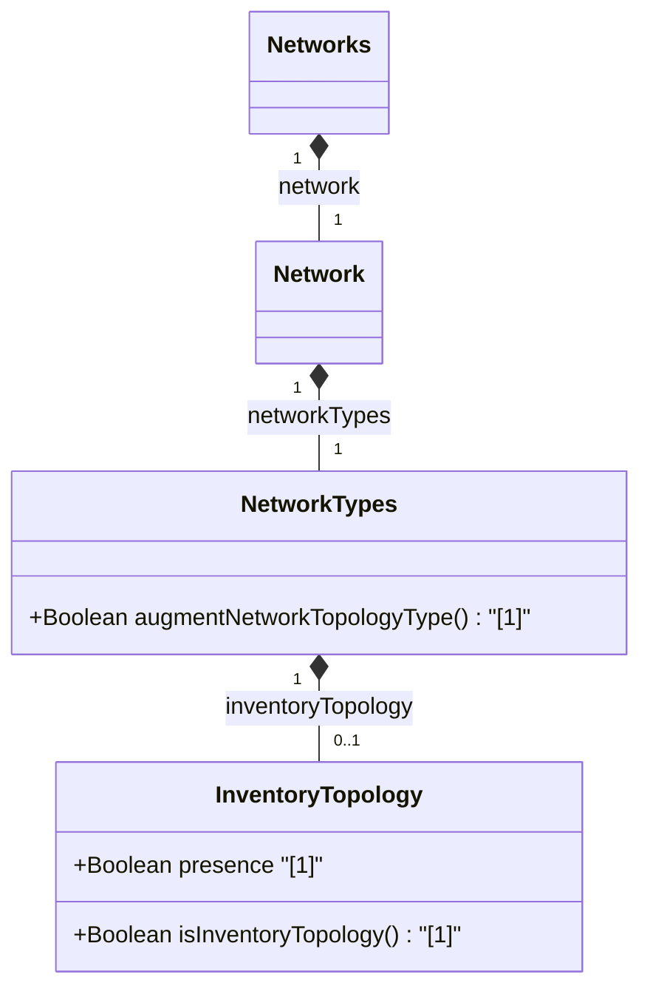

# Feature: [ietf-network-inventory-topology: Network Inventory Topology Type Augment]

## Parent Epic
- [ ] #64 - [[ietf-network-inventory-topology]: Network Inventory Topology Mapping](https://github.com/gintatkinson/3dgs-037/blob/main/docs/epics/epic-05-ietf-network-inventory-topology.md)

## Description
This feature specifies the augment to the standard `ietf-network` model's `network-types` container. It introduces the `inventory-topology` presence container under `/nw:networks/nw:network/nw:network-types/nwit:inventory-topology`. When present, this container designates a network instance as representing a network inventory topology, enabling inventory management tools and UI components to recognize, filter, and render network inventory topology elements.

## UML Class Diagram


## Interface Requirements

### 1. Test Data Shape
```json
{
  "ietf-network:networks": {
    "network": [
      {
        "network-id": "inv-net-01",
        "network-types": {
          "ietf-network-inventory-topology:inventory-topology": {}
        }
      }
    ]
  }
}
```

### 2. Validation & Constraints
- **Presence Container Constraint:** The `inventory-topology` container is a presence node. Its existence (even when empty) signifies that the parent network is a network inventory topology.
- **Node Parent Hierarchy:** Must be anchored under `/nw:networks/nw:network/nw:network-types`.
- **Read-Only / Configuration:** May be configured during network creation or reported in operational state.

### 3. Visual Layout & Arrangement
- **Layout Container:** Rendered inside the PropertyGrid panel (`properties_view`).
- **Visual Hierarchy:** Displayed as a boolean flag or tagged entry under the Network Classification / Types property section.
- **CSS Resets & Scoping:** Standard CSS resets (`box-sizing: border-box`) applied; styles scoped via component CSS Modules / BEM naming.
- **Layout Containment:** Restricted to outer layout splitters; containment is forbidden on scrollable child panels. Tree structures use valid DOM nesting.

### 4. Interactive Flow & States
- **Active / Present State:** Displays an active badge or checked flag labeled "Inventory Topology" in the `PropertyGrid`.
- **Inactive / Absent State:** Displays unselected or hidden tag when the container is not present.
- **Selection Assertion:** Computed-style assertions (verifying highlight colors and scroll dimensions) are required in UI test guidelines.

## Given-When-Then Acceptance Criteria

### Scenario 1: Render Present Inventory Topology Network Type
- **Given** a network instance with `/nw:networks/nw:network/nw:network-types/nwit:inventory-topology` defined
- **When** the network properties are loaded into the `properties_view` container
- **Then** the `PropertyGrid` component displays the "Inventory Topology" type flag as active.

### Scenario 2: Handle Non-Inventory Network Type
- **Given** a standard network instance without the `inventory-topology` presence container
- **When** the network properties are inspected in the `properties_view` container
- **Then** the `PropertyGrid` component does not display the active "Inventory Topology" flag.

## Specification Context (Verbatim)

```yang
  augment "/nw:networks/nw:network/nw:network-types" {
    description:
      "Introduces new network type for network-inventory-topology.";
    container inventory-topology {
      presence "Indicates network inventory topology type.";
      description:
        "Identifies the network inventory topology type.";
    }
  }
```

Section 4.1 Network Inventory Topology Type:
"This module augments the 'ietf-network' module by adding the 'inventory-topology' presence container to '/networks/network/network-types'. The presence of this container identifies a network as representing a network inventory topology."

## Source References
Structural Schema: [ietf-network-inventory-topology.yang](https://github.com/ietf-ivy-wg/network-inventory-topology/blob/main/yang/ietf-network-inventory-topology.yang) (Clause: Section 5 / line 132-152)
Normative Specification: [draft-ietf-ivy-network-inventory-topology](https://datatracker.ietf.org/doc/html/draft-ietf-ivy-network-inventory-topology) (Clause: Section 4.1)

## Logical UI & Layout Bindings
- **Target LUI Component:** PropertyGrid
- **Target Layout Container ID:** properties_view
- **Data Source Bindings:** /nw:networks/nw:network/nw:network-types/nwit:inventory-topology
