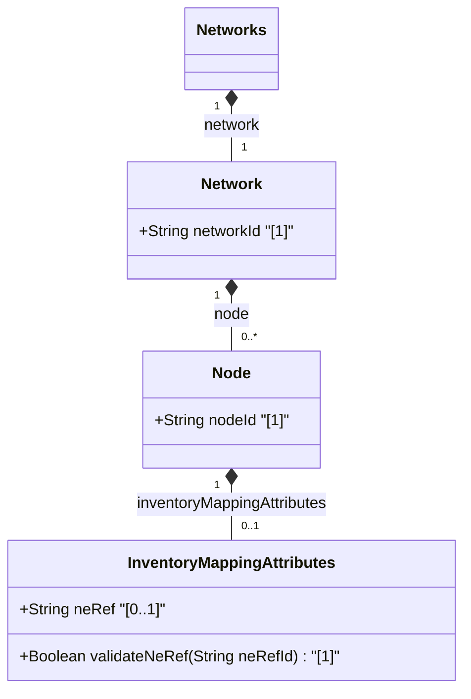

# Feature: [ietf-network-inventory-topology: Node Inventory Mapping Augment]

## Parent Epic
- [ ] #64 - [[ietf-network-inventory-topology]: Network Inventory Topology Mapping](https://github.com/gintatkinson/3dgs-037/blob/main/docs/epics/epic-05-ietf-network-inventory-topology.md)

## Description
This feature specifies the `inventory-mapping-attributes` container augment to the standard `ietf-network` model's `node` container defined in the `ietf-network-inventory-topology` YANG module. It maps abstract topology nodes under `/nw:networks/nw:network/nw:node` to concrete physical or logical network elements in the network inventory data store via the `ne-ref` leafref attribute.

The `inventory-mapping-attributes` container comprises:
1. **ne-ref**: A leaf attribute of type `leafref` pointing to `/nwi:network-inventory/nwi:network-elements/nwi:network-element/nwi:ne-id`. This establishes an explicit mapping between a topology node and its corresponding physical/logical network element managed within the network inventory subsystem.

## UML Class Diagram


## Interface Requirements

### 1. Test Data Shape
```json
{
  "ietf-network:networks": {
    "network": [
      {
        "network-id": "core-net-01",
        "node": [
          {
            "node-id": "node-core-router-01",
            "ietf-network-inventory-topology:inventory-mapping-attributes": {
              "ne-ref": "ne-router-csr-9000-a"
            }
          }
        ]
      }
    ]
  }
}
```

### 2. Validation & Constraints
- **ne-ref Attribute Constraints:**
  - Type: `String` (YANG type `leafref`).
  - Target Path: `/nwi:network-inventory/nwi:network-elements/nwi:network-element/nwi:ne-id`.
  - Multiplicity: `[0..1]`.
  - Leafref Resolution: When populated, `ne-ref` MUST resolve to an existing network element ID (`ne-id`) present in the network inventory data store.
- **Node Container Anchoring:**
  - Must be anchored under `/nw:networks/nw:network/nw:node/nwit:inventory-mapping-attributes`.

### 3. Visual Layout & Arrangement
- **Layout Container:** Rendered inside the PropertyGrid panel (`properties_view`).
- **Visual Hierarchy:** Rendered within the Inventory Mapping section of the selected Node's properties display, showing the mapped Network Element reference with a clickable hyperlink to the Network Element detail view.
- **CSS Modules & BEM Scoping:** Standard CSS resets (`box-sizing: border-box`) applied; scoped styling using BEM class names (`.node-inventory-mapping`, `.node-inventory-mapping__property-row`, `.node-inventory-mapping__ne-link`).
- **Layout Containment Rules:** Restricted strictly to outer layout splitters (`properties_view`); containment parameters (`contain: content` or `contain: strict`) are forbidden on scrollable child panels to preserve smooth virtualization. Tree structures adhere to valid DOM nesting rules (lists nested inside parent list-items).

### 4. Interactive Flow & States
- **Mapped / Active State:** Displays `ne-ref` as an active hyperlink (e.g. `"ne-router-csr-9000-a"`) that navigates to the associated network element when clicked.
- **Unmapped / Empty State:** Displays `"Unmapped"` or `"No Network Element Assigned"` placeholder text with an edit trigger to select an inventory element.
- **Edit State:** Displays a searchable auto-complete picker or dropdown selector listing available network elements from `/nwi:network-inventory/nwi:network-elements/nwi:network-element`.
- **Loading State:** Animated skeleton loading indicator in `properties_view` while resolving the `ne-ref` leafref target.
- **Error State:** Red border highlight (`var(--color-error-border)`) and inline message when an invalid or unresolvable `ne-ref` is specified.
- **Test Guidelines Assertion:** Computed-style assertions (verifying highlight colors and scroll dimensions) are required in UI test suites for visual error and selection states.

## Given-When-Then Acceptance Criteria

### Scenario 1: Valid Network Element Mapping
- **Given** a valid network element `"ne-router-csr-9000-a"` exists in the network inventory,
- **When** an administrator sets `ne-ref` to `"ne-router-csr-9000-a"` for topology node `"node-core-router-01"`,
- **Then** the leafref validator MUST accept the reference and display the mapped network element hyperlink in the `PropertyGrid` within `properties_view`.

### Scenario 2: Rejection of Invalid Network Element Reference
- **Given** a non-existent network element ID `"ne-invalid-999"`,
- **When** an application attempts to save `ne-ref` as `"ne-invalid-999"`,
- **Then** the system MUST reject the update with a leafref validation failure and preserve the previous node configuration state.

### Scenario 3: Rendering Unmapped Node State
- **Given** a topology node with no `inventory-mapping-attributes` or an empty `ne-ref`,
- **When** the node attributes are rendered in `properties_view`,
- **Then** the `PropertyGrid` component MUST display the unmapped status placeholder and present a control to associate a network element.

## Specification Context (Verbatim)

```yang
  augment "/nw:networks/nw:network/nw:node" {
    description:
      "Augments network inventory topology node attributes.";
    container inventory-mapping-attributes {
      description:
        "Inventory mapping attributes for node.";
      leaf ne-ref {
        type leafref {
          path "/nwi:network-inventory/nwi:network-elements/nwi:network-element/nwi:ne-id";
        }
        description:
          "Reference to the network element mapped to this node.";
      }
    }
  }
```

Section 4.2 Node Inventory Mapping:
"This module augments '/networks/network/node' by adding the 'inventory-mapping-attributes' container. The 'ne-ref' leaf within this container references the network element in the network inventory module that corresponds to the node in the network topology."

## Source References
Structural Schema: https://github.com/ietf-ivy-wg/network-inventory-topology/blob/main/yang/ietf-network-inventory-topology.yang (Clause: Section 5 / line 154-177)
Normative Specification: https://datatracker.ietf.org/doc/html/draft-ietf-ivy-network-inventory-topology (Clause: Section 4.2)

## Logical UI & Layout Bindings
- **Target LUI Component:** PropertyGrid
- **Target Layout Container ID:** properties_view
- **Data Source Bindings:** /nw:networks/nw:network/nw:node/nwit:inventory-mapping-attributes
