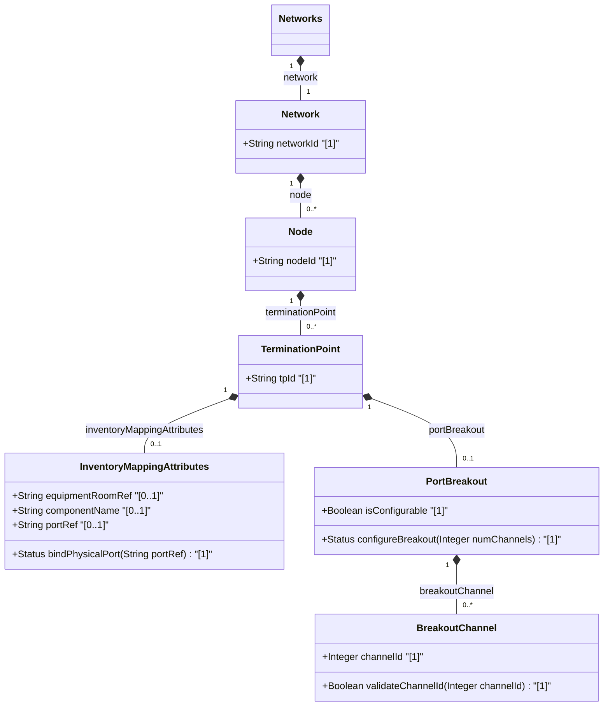

# Feature: [ietf-network-inventory-topology: Termination Point Inventory Mapping Augment]

## Parent Epic
- [ ] #64 - [[ietf-network-inventory-topology]: Network Inventory Topology Mapping](https://github.com/gintatkinson/3dgs-037/blob/main/docs/epics/epic-05-ietf-network-inventory-topology.md)

## Description
This feature specifies the termination point inventory mapping augment (`inventory-mapping-attributes`) and port breakout capability structure (`port-breakout`) defined in the `ietf-network-inventory-topology` YANG module. The `inventory-mapping-attributes` container establishes a 1:1 mapping between a logical termination point (TP) in the topology model and a physical port component in the network inventory, while `port-breakout` models operational channelization when hardware ports are partitioned into independent channel sub-ports.

The feature encompasses four primary schema concepts and containers:
1. **inventory-mapping-attributes**: A presence container on a topology termination point. When present, it marks the termination point as a physical TP mapped to a physical port component via `port-ref` (imported from `nwi:port-ref`). When absent, the termination point is classified as a logical or virtual TP.
2. **port-breakout**: A read-only (`config false`) presence container under the termination point augment indicating that the physical port supports channel breakout (e.g., partitioning a 400G interface into 4x100G channels).
3. **breakout-channel**: A list of independent channel lanes or sub-ports available on the physical port, keyed by `channel-id`.
4. **channel-id**: A 16-bit unsigned integer (`uint16`, range `0..65535`) leaf uniquely identifying each breakout channel sub-port within the scope of the parent port.

## UML Class Diagram


## Interface Requirements

### 1. Test Data Shape
```json
{
  "ietf-network-inventory-topology:termination-point": {
    "tp-id": "tp-eth-0-1",
    "inventory-mapping-attributes": {
      "port-ref": "/nwi:network-inventory/nil:equipment/nil:component[name='shelf1/slot0/port1']"
    },
    "port-breakout": {
      "breakout-channel": [
        {
          "channel-id": 1
        },
        {
          "channel-id": 2
        },
        {
          "channel-id": 3
        },
        {
          "channel-id": 4
        }
      ]
    }
  }
}
```

### 2. Validation & Constraints
- **inventory-mapping-attributes**:
  - Presence container indicating physical TP mapping.
  - `port-ref`: Type `String` (YANG `leafref` pointing to physical port component in network inventory). Establishes a 1:1 mapping between logical TP and physical port component.
- **port-breakout**:
  - Presence container indicating port supports channel breakout. `config false` (operational state).
  - Present only when underlying hardware supports partitioning physical port into independent channels (e.g., 400G to 4x100G).
- **breakout-channel**:
  - List of breakout channels available on the physical port, keyed by `channel-id`.
  - Multiplicity: `[0..*]`.
- **channel-id**:
  - Type: `Integer` (YANG `uint16`, range `0` to `65535`).
  - Key leaf identifying the sub-port / lane. Unique identifier within the scope of the parent port.

### 3. Visual Layout & Arrangement
- **CSS Modules & BEM Scoping**:
  - Component reset using `box-sizing: border-box`.
  - Class naming convention following BEM patterns (`.tp-inventory-table`, `.tp-inventory-table__header`, `.tp-inventory-table__row`, `.tp-inventory-table__cell`, `.tp-inventory-table__breakout-badge`).
- **Layout Containment Rules**:
  - Layout containment MUST be restricted to outer layout splitters (`components_table`).
  - Strict prohibition on CSS containment parameters (`contain: content` or `contain: strict`) on scrollable child panels to preserve dynamic list virtualization and viewport calculation.
- **TableView Integration**:
  - Displays termination points alongside physical inventory port references (`port-ref`) and breakout status.
  - Breakout channels (`channel-id` list) rendered in nested expandable sub-rows or inline channel badges within `components_table`.
  - Valid DOM nesting enforcing tree/table structures (lists/sub-rows nested within parent list-items/table rows).

### 4. Interactive Flow & States
- **Read-Only State**:
  - Displays TP identifier (`tp-eth-0-1`), resolved physical port reference hyperlink (`shelf1/slot0/port1`), and active breakout channel indicators (`Channel 1`, `Channel 2`, `Channel 3`, `Channel 4`).
- **Edit State**:
  - Read-write mapping allowing modification of `port-ref` when manual correlation is required (operational cases where automatic discovery is not supported).
- **Empty State**:
  - Placeholder displaying `"No Inventory Mapping Assigned"` for logical/virtual termination points where `inventory-mapping-attributes` container is absent.
- **Loading State**:
  - Animated skeleton table rows rendered in `components_table` while resolving topology-to-inventory leafrefs or fetching breakout capabilities.
- **Error State**:
  - Highlighted border (`var(--color-error-border)`) and error text when `port-ref` leafref resolution fails or duplicate `channel-id` values are encountered.
  - Test guidelines MUST include computed-style assertions verifying highlight color codes and scroll dimensions under error states.

## Given-When-Then Acceptance Criteria

### Scenario 1: Physical TP correlation via inventory-mapping-attributes
- **Given** a network topology termination point instance representing a physical port,
- **When** the `inventory-mapping-attributes` container is populated with `port-ref` set to `"/nwi:network-inventory/nil:equipment/nil:component[name='shelf1/slot0/port1']"`,
- **Then** the system MUST establish a 1:1 binding between the topology TP and physical port component and render the mapping in `components_table`.

### Scenario 2: Logical TP representation without inventory-mapping-attributes
- **Given** a virtual or logical termination point in the topology model,
- **When** the `inventory-mapping-attributes` container is omitted from the TP instance,
- **Then** the system MUST classify the TP as a logical interface and display `"No Inventory Mapping Assigned"` in the UI.

### Scenario 3: Port breakout channel enumeration and validation
- **Given** a physical port supporting 4x100G breakout,
- **When** `port-breakout` lists four `breakout-channel` entries with `channel-id` values `1`, `2`, `3`, and `4`,
- **Then** each `channel-id` MUST be validated as a `uint16` (`0` to `65535`) and rendered as distinct sub-port lanes under `components_table`.

### Scenario 4: TableView rendering and layout containment in components_table
- **Given** a list of termination points rendered within `components_table`,
- **When** scrolling or resizing the TableView component,
- **Then** layout containment MUST be restricted to the outer `components_table` splitter container without using `contain: content` or `contain: strict` on scrollable child panels.

## Specification Context (Verbatim)

```text
The inventory-mapping-attributes container for a termination point establishes
a 1:1 mapping between the logical termination point (TP) in the network topology
and a physical port component in the network inventory.

The inventory-mapping-attributes containers are defined as read-write (config true)
to accommodate cases where automatic discovery is not possible.

container inventory-mapping-attributes {
  presence
    "If present, it indicates this is a physical termination
     point (TP), which maps to a port component. If not present,
     it indicates it is a logical TP.";
  description
    "Container for inventory mapping attributes of a TP.";
  uses nwi:port-ref {
    refine "port-ref" {
      description
        "Reference to the physical port component in the
         network inventory. This reference establishes a 1:1
         mapping between the logical TP and its physical port
         component.";
    }
  }
}

container port-breakout {
  presence "Indicates the port supports channel breakout.";
  config false;
  description
    "Breakout capability of the physical port represented by
     this TP. One TP maps to one physical port; channels are
     listed here. This container is present only when the
     underlying hardware supports partitioning the port into
     multiple independent channels (e.g., 400G to 4x100G).";
  list breakout-channel {
    key "channel-id";
    description
      "List of breakout channels available on this port.
       Each entry represents an independent lane or sub-port
       that can be used for channelized interfaces.";
    leaf channel-id {
      type uint16;
      description
        "Unique identifier for the breakout channel within the
         scope of the parent port.";
    }
  }
}
```

## Source References
Structural Schema: https://github.com/ietf-ivy-wg/network-inventory-topology/blob/main/yang/ietf-network-inventory-topology.yang (Clause: Section 5 / line 222-267)
Normative Specification: https://datatracker.ietf.org/doc/html/draft-ietf-ivy-network-inventory-topology (Clause: Section 4.2 & Appendix B)

## Logical UI & Layout Bindings
- **Target LUI Component:** TableView
- **Target Layout Container ID:** elements_view
- **Data Source Bindings:** /nw:networks/nw:network/nw:node/nt:termination-point/nwit:inventory-mapping-attributes
