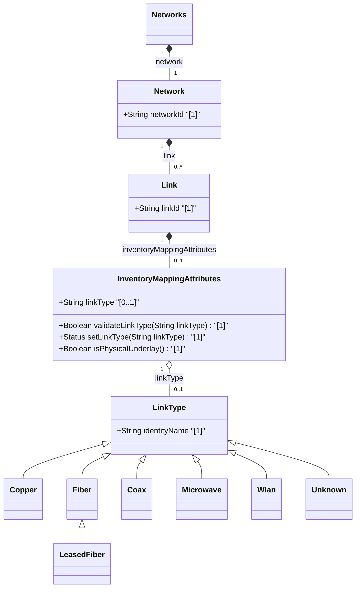

# Feature: [ietf-network-inventory-topology: Link Inventory Mapping Augment]

## Parent Epic
- [ ] #64 - [[ietf-network-inventory-topology]: Network Inventory Topology Mapping](https://github.com/gintatkinson/3dgs-037/blob/main/docs/epics/epic-05-ietf-network-inventory-topology.md)

## Description
This feature specifies the `inventory-mapping-attributes` presence container augmenting the network topology `link` structure (`/nw:networks/nw:network/nt:link`) defined in the `ietf-network-inventory-topology` YANG module. The presence of this container designates a physical link operating at the lowest underlay abstraction level in the network hierarchy.

The `inventory-mapping-attributes` container provides lightweight media classification through the `link-type` leaf, which references identity base `link-type`. It serves as a discriminator linking logical topology links to specialized physical inventory models:
1. **Wired Media**: Classified using identities such as `copper`, `fiber`, `coax`, or specialized derived identities like `leased-fiber` (third-party operator fiber), linking to passive network inventory models.
2. **Wireless Media**: Classified using identities such as `microwave` or `wlan`, linking to wireless-specific inventory models (e.g. RFC 9656 for microwave topology).
3. **Unknown/Fallback Medium**: Classified using the `unknown` identity when discovery systems cannot determine the physical medium.

## UML Class Diagram


## Interface Requirements

### 1. Test Data Shape
```json
{
  "ietf-network-inventory-topology:inventory-mapping-attributes": {
    "link-type": "ietf-network-inventory-topology:fiber"
  }
}
```

### 2. Validation & Constraints
- **inventory-mapping-attributes**:
  - Node Type: Presence Container.
  - Semantic Rule: Presence indicates a physical link at the lowest underlay abstraction level. Absence implies a virtual or higher-layer logical link.
  - Path: `/nw:networks/nw:network/nt:link/nwit:inventory-mapping-attributes`.
- **link-type**:
  - Type: `identityref` referencing base identity `link-type`.
  - Multiplicity: `[0..1]`.
  - Allowed Values: Derived identities extending `link-type`:
    - `ietf-network-inventory-topology:copper`
    - `ietf-network-inventory-topology:fiber`
    - `ietf-network-inventory-topology:coax`
    - `ietf-network-inventory-topology:microwave`
    - `ietf-network-inventory-topology:wlan`
    - `ietf-network-inventory-topology:unknown`
    - `ietf-network-inventory-topology:leased-fiber` (extends `fiber`)
  - Fallback Semantics: When discovery cannot classify the medium, `link-type` MUST be set to `unknown` rather than left unset. An unset leaf indicates the medium has not been assessed.

### 3. Visual Layout & Arrangement
- **CSS Modules & BEM Scoping**:
  - Component reset using `box-sizing: border-box`.
  - Scoped naming convention following BEM patterns (`.inventory-mapping-attributes`, `.inventory-mapping-attributes__link-type`, `.inventory-mapping-attributes__badge`, `.inventory-mapping-attributes__status`).
- **Layout Containment Rules**:
  - Layout containment MUST be restricted to outer layout splitters (`properties_view`).
  - Strict prohibition on CSS containment parameters (`contain: content` or `contain: strict`) on scrollable child panels to preserve dynamic list virtualization.
- **PropertyGrid Integration**:
  - Rendered inside `properties_view` as a dedicated PropertyGrid section titled "Link Inventory Mapping".
  - `link-type` rendered with media classification badges (e.g. optical icon for `fiber`/`leased-fiber`, radio icon for `microwave`/`wlan`, metal icon for `copper`/`coax`).
  - Valid DOM nesting enforcing tree structures (lists nested within parent list-items).

### 4. Interactive Flow & States
- **Read-Only State**:
  - Displays the assigned link media type with styled badge (e.g. `"Fiber (Leased)"` or `"Microwave Wireless"`).
- **Edit State**:
  - Dropdown selector for `link-type` populated with supported identities (`copper`, `fiber`, `coax`, `microwave`, `wlan`, `unknown`, `leased-fiber`).
- **Empty State**:
  - When `inventory-mapping-attributes` container is absent, displays `"Logical / Upper-Layer Link (No Physical Inventory Mapping)"` with a button to toggle underlay physical mapping presence.
- **Loading State**:
  - Animated skeleton placeholder inside `properties_view` while fetching link attributes.
- **Error State**:
  - Red border highlight (`var(--color-error-border)`) and warning message if an invalid or unresolvable identity prefix is supplied in `link-type`.
  - Computed-style assertions in unit test guidelines MUST verify border highlight colors and element dimensions.

## Given-When-Then Acceptance Criteria

### Scenario 1: Media type assignment for fiber physical link
- **Given** a physical underlay link in the network topology,
- **When** the administrator configures `inventory-mapping-attributes/link-type` to `"fiber"`,
- **Then** the PropertyGrid MUST display `fiber` media classification and indicate physical underlay status.

### Scenario 2: Derived leased-fiber identity inheritance
- **Given** a link provided by a third-party operator,
- **When** `link-type` is set to `"leased-fiber"`,
- **Then** the system MUST recognize `leased-fiber` as a specialization of `fiber` and render the leased fiber indicator.

### Scenario 3: Discovery fallback to unknown identity
- **Given** an automated discovery system inspecting a physical link with unidentified medium,
- **When** the discovery engine sets `link-type` to `"unknown"`,
- **Then** the system MUST distinguish this state from an un-assessed link (unset leaf) and present an explicitly unclassified medium indicator.

### Scenario 4: Underlay link presence container lifecycle
- **Given** a logical network link,
- **When** `inventory-mapping-attributes` is instantiated on the link,
- **Then** the system MUST classify the link as a lowest underlay physical link and bind the PropertyGrid controls in `properties_view`.

## Specification Context (Verbatim)

```text
augment "/nw:networks/nw:network/nt:link" {
  when '../nw:network-types/nwit:inventory-topology';
  description
    "Augments the network topology link with inventory-related
     attributes.";
  container inventory-mapping-attributes {
    presence "Indicates a physical link, at the lowest underlay
              abstraction level.";
    description
      "Container for inventory-related attributes of a link.

       This container provides lightweight media classification.
       The link-type indicates which specialized inventory model
       contains detailed resource information:

       - Wired media (fiber, copper): passive network inventory
       - Wireless media (microwave, Wi-Fi): wireless-specific
         inventory

         Detailed inventory references may be added in future
         modules.";
    leaf link-type {
      type identityref {
        base link-type;
      }
      description
        "Classification of the link media type at the topology
         layer.

         The base identity 'link-type' is extensible. Examples
         of derived identities include 'copper', 'fiber',
         'coax', 'microwave', and 'wlan'.

         This leaf serves as a lightweight discriminator.  When
         the value is 'microwave', detailed microwave link
         attributes are defined in the microwave topology data
         model. Wired media (e.g., fiber, copper, or coax) may
         be detailed in a passive network inventory data
         model.";
    }
  }
}
```

## Source References
Structural Schema: https://github.com/ietf-ivy-wg/network-inventory-topology/blob/main/yang/ietf-network-inventory-topology.yang (Clause: Section 5 / line 179-220)
Normative Specification: https://datatracker.ietf.org/doc/html/draft-ietf-ivy-network-inventory-topology (Clause: Section 4.3)

## Logical UI & Layout Bindings
- **Target LUI Component:** PropertyGrid
- **Target Layout Container ID:** properties_view
- **Data Source Bindings:** /nw:networks/nw:network/nt:link/nwit:inventory-mapping-attributes
