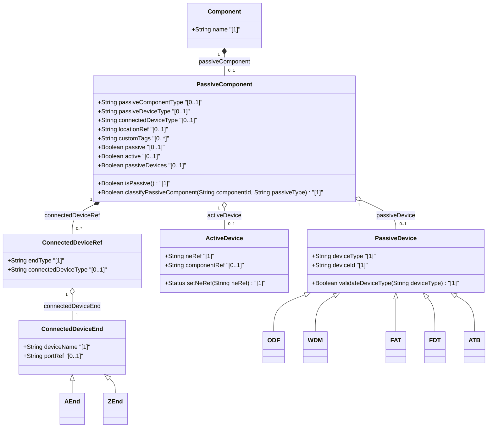

# Feature: [ietf-nwi-passive-inventory: Passive Component Classification & Extension Augment]

## Parent Epic
- [ ] #77 - [[ietf-nwi-passive-inventory]: Passive Network Inventory Management](https://github.com/gintatkinson/3dgs-037/blob/main/docs/epics/epic-06-ietf-nwi-passive-inventory.md)

## Description
This feature specifies the `passive-component` presence container augmenting the network equipment `component` structure (`/nwi:equipment/nwi:component`) defined in the `ietf-nwi-passive-inventory` YANG module. The presence of this container classifies an equipment component as a passive network entity or provides passive inventory extension attributes for active components.

The `passive-component` container models non-powered physical components across optical and copper access networks, including distribution frames, multiplexers, and termination boxes:
1. **Passive Device Classification**: Categorizes passive devices into standardized optical and copper distribution types via identity references (`passive-component-type`):
   - **ODF (Optical Distribution Frame)**: Central office or hub optical fiber patch panel and distribution frame.
   - **WDM (Wavelength Division Multiplexer)**: Passive optical multiplexer / demultiplexer unit (CWDM/DWDM filter tray).
   - **FAT (Fiber Access Terminal)**: Outdoor or pole-mounted fiber terminal box serving subscriber drop cables.
   - **FDT (Fiber Distribution Terminal)**: Sub-feeder distribution node interconnecting feeder and distribution cables.
   - **ATB (Access Terminal Box)**: Indoor customer premises optical socket or wall outlet.
2. **Device Reference Association**:
   - **Passive Device (`passive-device`)**: Represents standalone unpowered hardware specifying `device-type` (e.g. ODF, WDM, FAT, FDT, ATB).
   - **Active Device (`active-device`)**: Connects passive components embedded within active network elements via network element reference (`ne-ref`) and component reference (`component-ref`).
3. **Connected Device End Reference (`connected-device-ref`)**: Maps the endpoint topology association for passive components, distinguishing between origin/source endpoints (`a-end`) and destination/termination endpoints (`z-end`) with associated port references.
4. **Location and Metadata Annotations**: Supports location reference linking (`location-ref`) to spatial inventory records and arbitrary string tags (`custom-tags`) for operational cataloging.

## UML Class Diagram


## Interface Requirements

### 1. Test Data Shape
```json
{
  "ietf-nwi-passive-inventory:passive-component": {
    "passive-component-type": "ietf-nwi-passive-inventory:odf",
    "location-ref": "/ietf-network-inventory-location:locations/location[location-id='LOC-CO-01']",
    "custom-tags": ["optical-patch", "feeder-bay-4", "high-density"],
    "passive-device": {
      "device-type": "ietf-nwi-passive-inventory:odf"
    },
    "connected-device-ref": [
      {
        "a-end": {
          "device-name": "NE-OLT-01",
          "port-ref": "port-1/1/1"
        }
      },
      {
        "z-end": {
          "device-name": "FDT-NORTH-02",
          "port-ref": "tray-2/port-12"
        }
      }
    ]
  }
}
```

### 2. Validation & Constraints
- **passive-component**:
  - Node Type: Presence Container.
  - Semantic Rule: Presence indicates an unpowered passive network component or a passive extension on an active network element component.
  - Path: `/nwi:equipment/nwi:component/nwi-passive:passive-component`.
- **passive-component-type**:
  - Type: `identityref` referencing base identity `passive-component-type`.
  - Multiplicity: `[0..1]`.
  - Allowed Values: Identity derivations including `odf`, `wdm`, `fat`, `fdt`, `atb`.
- **passive-device / device-type**:
  - Choice Branch: `passive-device`.
  - Leaf `device-type`: `identityref` base `passive-component-type`.
  - Mandatory when `passive-device` choice branch is selected.
- **active-device**:
  - Choice Branch: `active-device`.
  - Leaf `ne-ref`: `leafref` pointing to `/nwi:equipment/nwi:network-elements/nwi:network-element/nwi:ne-id`. Mandatory `[1]`.
  - Leaf `component-ref`: `leafref` pointing to `/nwi:equipment/nwi:component/nwi:component-id`. Optional `[0..1]`.
- **location-ref**:
  - Type: `leafref` or absolute URI string pointing to location inventory node. Multiplicity `[0..1]`.
- **custom-tags**:
  - Type: Leaf-list of `String`. Multiplicity `[0..*]`.
- **connected-device-ref**:
  - Choice Container: Choice between `a-end` and `z-end` connected endpoints.
  - Leaf `device-name`: `String` mandatory `[1]`.
  - Leaf `port-ref`: `String` optional `[0..1]`.

### 3. Visual Layout & Arrangement
- **CSS Modules & BEM Scoping**:
  - Component reset using `box-sizing: border-box`.
  - Scoped naming convention following BEM patterns (`.passive-component`, `.passive-component__type-badge`, `.passive-component__endpoint-row`, `.passive-component__tag-pill`).
- **Layout Containment Rules**:
  - Layout containment MUST be restricted to outer layout splitters (`properties_view`).
  - Strict prohibition on CSS containment parameters (`contain: content` or `contain: strict`) on scrollable child panels to preserve dynamic list virtualization.
- **PropertyGrid Integration**:
  - Rendered inside `properties_view` as a dedicated PropertyGrid section titled "Passive Component Attributes".
  - Displays device type icons (ODF optical frame, WDM prism/mux icon, FAT terminal box icon, FDT feeder cabinet icon, ATB outlet icon).
  - Valid DOM nesting enforcing tree structures (connected endpoint lists nested inside parent endpoint list-items).

### 4. Interactive Flow & States
- **Read-Only State**:
  - Displays classified `passive-component-type`, location reference link, custom tags as styled pills, and endpoint references (`a-end` / `z-end`).
- **Edit State**:
  - Dropdown selectors for `passive-component-type` (`ODF`, `WDM`, `FAT`, `FDT`, `ATB`), text inputs for `location-ref`, tag management widget for `custom-tags`, and dynamic list editor for `connected-device-ref`.
- **Empty State**:
  - When `passive-component` container is absent, displays `"Active Component (No Passive Extension Attributes)"` with a button to attach passive classification.
- **Loading State**:
  - Animated skeleton placeholder inside `properties_view` while fetching component details.
- **Error State**:
  - Red border highlight (`var(--color-error-border)`) and error message if `ne-ref` does not resolve to an active network element or if invalid device type identities are supplied.
  - Computed-style assertions in unit test guidelines MUST verify border highlight colors and element dimensions.

## Given-When-Then Acceptance Criteria

### Scenario 1: Classification of a passive device component (ODF/FAT)
- **Given** an unpowered passive network component in the equipment inventory,
- **When** the administrator configures `passive-component/passive-component-type` to `"odf"` and sets `passive-device/device-type` to `"odf"`,
- **Then** the PropertyGrid MUST display `ODF` classification badge and present passive distribution frame properties in `properties_view`.

### Scenario 2: Active device reference binding
- **Given** a passive component attached to an active chassis network element,
- **When** the user selects the `active-device` branch and sets `ne-ref` to `"NE-OLT-01"` and `component-ref` to `"SLOT-2"`,
- **Then** the system MUST validate the reference against active equipment inventory and establish cross-element linkage.

### Scenario 3: Connected device end reference association
- **Given** a passive component routing optical signals between OLT and FDT,
- **When** `connected-device-ref` entries are defined for `a-end` (`device-name: "NE-OLT-01"`, `port-ref: "port-1/1/1"`) and `z-end` (`device-name: "FDT-NORTH-02"`, `port-ref: "tray-2/port-12"`),
- **Then** the PropertyGrid MUST render connected endpoint topology links for both A-end and Z-end connections.

### Scenario 4: Custom tags and location reference validation
- **Given** a passive access terminal box (ATB) component,
- **When** the user adds custom tags `"customer-premise"`, `"ftth-drop"` and sets `location-ref` to `"LOC-SUB-88"`,
- **Then** the system MUST persist the tag list and render interactive location link badges in the visual interface.

## Specification Context (Verbatim)

```text
augment "/nwi:equipment/nwi:component" {
  description
    "Augments network equipment component with passive component
     classification and connected device reference attributes.";

  container passive-component {
    presence "Indicates that this component is a passive network entity
              or possesses passive extension attributes.";
    description
      "Container for passive network component attributes, including
       device type classification (ODF, WDM, FAT, FDT, ATB), active/passive
       device reference, connected device end mappings (A-end, Z-end),
       location references, and custom tags.";

    leaf passive-component-type {
      type identityref {
        base passive-component-type;
      }
      description
        "Identity reference classifying the passive component type
         (e.g., odf, wdm, fat, fdt, atb).";
    }

    leaf location-ref {
      type string;
      description
        "Reference link to spatial or location inventory record.";
    }

    leaf-list custom-tags {
      type string;
      description
        "Arbitrary operational classification tags.";
    }

    choice device-ref {
      description
        "Choice between standalone passive device classification and
         active network element component extension.";
      case passive-device {
        container passive-device {
          leaf device-type {
            type identityref {
              base passive-component-type;
            }
            mandatory true;
            description
              "Device classification type for standalone passive device.";
          }
        }
      }
      case active-device {
        container active-device {
          leaf ne-ref {
            type string;
            mandatory true;
            description
              "Network element reference ID for active host device.";
          }
          leaf component-ref {
            type string;
            description
              "Component reference ID within the active network element.";
          }
        }
      }
    }

    list connected-device-ref {
      key "index";
      description
        "List of connected device endpoint references for passive signal routing.";
      leaf index {
        type uint32;
      }
      choice end-type {
        case a-end {
          container a-end {
            leaf device-name {
              type string;
              mandatory true;
            }
            leaf port-ref {
              type string;
            }
          }
        }
        case z-end {
          container z-end {
            leaf device-name {
              type string;
              mandatory true;
            }
            leaf port-ref {
              type string;
            }
          }
        }
      }
    }
  }
}
```

## Source References
Structural Schema: https://github.com/aguoietf/draft-ygb-ivy-passive-network-inventory/blob/main/yang/ietf-nwi-passive-inventory.yang (Clause: Section 5 / line 246-347, 478-512)
Normative Specification: https://datatracker.ietf.org/doc/draft-ygb-ivy-passive-network-inventory/ (Clause: Section 6.1)

## Logical UI & Layout Bindings
- **Target LUI Component:** PropertyGrid
- **Target Layout Container ID:** properties_view
- **Data Source Bindings:** /nwi:equipment/nwi:component/nwi-passive:passive-component
