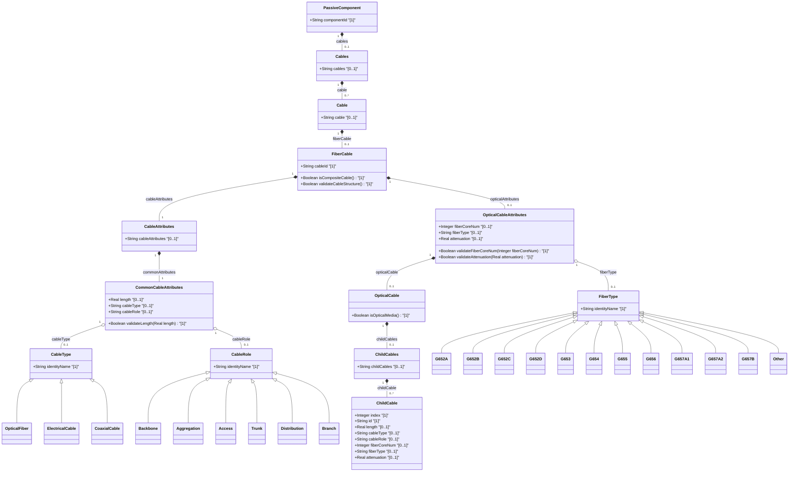

# Feature: [ietf-nwi-passive-inventory: Fiber Cable & Strand Inventory Augment]

## Parent Epic
- [ ] #77 - [[ietf-nwi-passive-inventory]: Passive Network Inventory Management](https://github.com/gintatkinson/3dgs-037/blob/main/docs/epics/epic-06-ietf-nwi-passive-inventory.md)

## Description
This feature specifies the `fiber-cable` container augmenting `passive-component` within the `ietf-nwi-passive-inventory` module (`/nwi:equipment/nwi:component/nwi-passive:passive-component/nwi-passive:fiber-cable`). The `fiber-cable` container defines physical optical transmission media, strand allocations, color-coding standards, physical lengths, cable roles, and optical transmission parameters.

The feature models both single-tube and complex multi-tube/sub-cable assemblies:
1. **Common Cable Attributes**: Base physical properties defined via `common-cable-attributes` grouping, including:
   - `cable-type`: Classification of the underlying transmission medium using identity base `cable-type` (`optical-fiber`, `electrical-cable`, `coaxial-cable`).
   - `cable-role`: Operational network role using identity base `cable-role` (`backbone`, `aggregation`, `access`, `trunk`, `distribution`, `branch`).
   - `length`: Physical length of the cable segment in meters (Real value).
2. **Optical Cable Attributes**: Optical-specific attributes defined via `optical-cable-attributes` grouping:
   - `fiber-core-num`: Total count of active optical fiber cores/strands within the cable assembly (Integer).
   - `fiber-type`: international optical standard optical fiber standard identity derived from base identity `fiber-type`: `G652A`, `G652B`, `G652C`, `G652D` (Standard Single-Mode Fiber / NDSF), `G653` (Dispersion-Shifted Fiber), `G654` (Cut-off Shifted Fiber for submarine/long-haul), `G655` (Non-Zero Dispersion-Shifted Fiber / NZDSF), `G656` (Wideband NZDSF), `G657A1`, `G657A2`, `G657B` (Bend-Insensitive Single-Mode Fiber), or `other`.
   - `attenuation`: Optical loss coefficient per kilometer measured in dB/km (Real value).
3. **Child Cable Structure**: Multi-element composite cables modeled via the `child-cables` container and `child-cable` list:
   - `child-cable`: List of constituent sub-cables or tubes within a composite bundle (minimum 2 child cable elements when instantiated).
   - `index`: Numeric position or tube sequence index (Integer key).
   - `id`: Unique identifier string for the sub-cable strand or tube.
   - Inheritance of `common-cable-attributes` and `optical-cable-attributes` per sub-cable.

## UML Class Diagram


## Interface Requirements

### 1. Test Data Shape
```json
{
  "ietf-nwi-passive-inventory:fiber-cable": {
    "length": 1500.5,
    "cable-type": "ietf-nwi-passive-inventory:optical-fiber",
    "cable-role": "ietf-nwi-passive-inventory:backbone",
    "fiber-core-num": 144,
    "fiber-type": "ietf-nwi-passive-inventory:G652D",
    "attenuation": 0.22,
    "child-cables": {
      "child-cable": [
        {
          "index": 1,
          "id": "tube-blue-01",
          "length": 1500.5,
          "cable-type": "ietf-nwi-passive-inventory:optical-fiber",
          "cable-role": "ietf-nwi-passive-inventory:backbone",
          "fiber-core-num": 12,
          "fiber-type": "ietf-nwi-passive-inventory:G652D",
          "attenuation": 0.21
        },
        {
          "index": 2,
          "id": "tube-orange-02",
          "length": 1500.5,
          "cable-type": "ietf-nwi-passive-inventory:optical-fiber",
          "cable-role": "ietf-nwi-passive-inventory:backbone",
          "fiber-core-num": 12,
          "fiber-type": "ietf-nwi-passive-inventory:G652D",
          "attenuation": 0.22
        }
      ]
    }
  }
}
```

### 2. Validation & Constraints
- **fiber-cable**:
  - Node Type: Container under `passive-component`.
  - Path: `/nwi:equipment/nwi:component/nwi-passive:passive-component/nwi-passive:fiber-cable`.
- **common-cable-attributes**:
  - `length`: Type `decimal64` / Real. Multiplicity `[0..1]`. Range: `>= 0.0`. Unit: meters. Must be non-negative.
  - `cable-type`: Type `identityref` referencing base identity `cable-type`. Multiplicity `[0..1]`. Allowed values: `optical-fiber`, `electrical-cable`, `coaxial-cable`.
  - `cable-role`: Type `identityref` referencing base identity `cable-role`. Multiplicity `[0..1]`. Allowed values: `backbone`, `aggregation`, `access`, `trunk`, `distribution`, `branch`.
- **optical-cable-attributes**:
  - `fiber-core-num`: Type `uint32` / Integer. Multiplicity `[0..1]`. Constraint: `fiber-core-num >= 1`.
  - `fiber-type`: Type `identityref` referencing base identity `fiber-type`. Multiplicity `[0..1]`. Allowed values: `G652A`, `G652B`, `G652C`, `G652D`, `G653`, `G654`, `G655`, `G656`, `G657A1`, `G657A2`, `G657B`, `other`.
  - `attenuation`: Type `decimal64` / Real. Multiplicity `[0..1]`. Range: `>= 0.0`. Unit: dB/km.
- **child-cables / child-cable**:
  - Node Type: List under `child-cables`.
  - Key: `index`.
  - Min-Elements Constraint: When `child-cables` container is present, `child-cable` list MUST contain at least 2 elements (`min-elements 2`). An inventory payload with 1 child cable is invalid and MUST be rejected.
  - `index`: Type `uint32` / Integer. Key element.
  - `id`: Type `string` / String. Mandatory string identifier for tube/sub-cable.

### 3. Visual Layout & Arrangement
- **CSS Modules & BEM Scoping**:
  - Component reset using `box-sizing: border-box`.
  - Scoped naming convention following BEM patterns (`.fiber-cable`, `.fiber-cable__header`, `.fiber-cable__badge`, `.child-cables-table`, `.child-cables-table__row`).
- **Layout Containment Rules**:
  - Layout containment MUST be restricted to outer layout splitters (`elements_view`).
  - Strict prohibition on CSS containment parameters (`contain: content` or `contain: strict`) on scrollable child panels to preserve dynamic list virtualization.
- **TableView Integration**:
  - Rendered inside `elements_view` container as a multi-level table view for cable components and child cable tubes.
  - `fiber-type` displayed with international optical standard standardization badges (e.g., green badge for `G652D`, blue badge for `G657A1` bend-insensitive).
  - Multi-strand sub-cable breakdown rendered as expandable nested rows under parent cable row.
  - Valid DOM tree nesting enforcing recursive table rows and lists nested inside parent container elements.

### 4. Interactive Flow & States
- **Read-Only State**:
  - Displays cable summary including core count (`"144 Cores"`), fiber specification (`"international optical standard G.652.D"`), attenuation (`"0.22 dB/km"`), role (`"Backbone"`), and expandable child sub-cable table.
- **Edit State**:
  - Input fields for `length`, `attenuation`, `fiber-core-num`.
  - Dropdown selectors for `cable-type`, `cable-role`, and `fiber-type`.
  - Dynamic table editor for adding/removing `child-cable` elements with strict minimum requirement enforcement (disabling delete button when child element count equals 2).
- **Empty State**:
  - Displays `"No Fiber Cable Attributes Configured"` inside `elements_view` with an action button to initialize cable attributes.
- **Loading State**:
  - Skeleton table rows rendered inside `elements_view` during data fetching.
- **Error State**:
  - Red border highlight (`var(--color-error-border)`) and error text when `child-cable` count is under 2, or when `attenuation` / `length` is negative.
  - Unit test guidelines MUST execute computed-style assertions verifying highlight colors, border widths, and scroll dimensions.

## Given-When-Then Acceptance Criteria

### Scenario 1: Standard 144-core G652D backbone cable inventory configuration
- **Given** a passive network inventory equipment component,
- **When** the administrator configures a `fiber-cable` with `fiber-core-num` set to `144`, `fiber-type` set to `"G652D"`, `cable-role` set to `"backbone"`, and `attenuation` set to `0.22`,
- **Then** the TableView component in `elements_view` MUST render the cable attributes and display the international optical standard G.652.D classification badge.

### Scenario 2: Multi-tube child cable composite validation
- **Given** a composite fiber cable containing sub-tubes,
- **When** `child-cables` is created with 2 child sub-cable entries (`index` 1 and `index` 2),
- **Then** the system MUST accept the configuration, validate `min-elements 2`, and render expandable sub-tube detail rows in `elements_view`.

### Scenario 3: Single child cable min-elements constraint rejection
- **Given** a user creating a composite child cable entry,
- **When** the user attempts to save `child-cables` with only 1 `child-cable` item,
- **Then** the validation engine MUST reject the payload, trigger an error state highlight on `elements_view`, and display `"child-cables list requires at least 2 child-cable elements"`.

### Scenario 4: international optical standard G657A1 bend-insensitive optical parameter assignment
- **Given** an access network fiber deployment,
- **When** `fiber-type` is set to `"G657A1"` and `cable-role` is set to `"access"`,
- **Then** the system MUST register the bend-insensitive fiber profile, update `optical-cable-attributes`, and reflect the access role styling in the UI.

## Specification Context (Verbatim)

```text
  grouping common-cable-attributes {
    description
      "Attributes common to all cable types.";
    leaf length {
      type decimal64 {
        fraction-digits 2;
      }
      units "meters";
      description
        "Physical length of the cable segment.";
    }
    leaf cable-type {
      type identityref {
        base cable-type;
      }
      description
        "Classification of the cable media type (e.g., optical-fiber,
         electrical-cable, coaxial-cable).";
    }
    leaf cable-role {
      type identityref {
        base cable-role;
      }
      description
        "Operational role of the cable in the network (e.g., backbone,
         aggregation, access, trunk, distribution, branch).";
    }
  }

  grouping optical-cable-attributes {
    description
      "Attributes specific to optical cables.";
    leaf fiber-core-num {
      type uint32;
      description
        "Number of optical fiber cores/strands contained within the cable.";
    }
    leaf fiber-type {
      type identityref {
        base fiber-type;
      }
      description
        "international-standard optical fiber identity (e.g., G652A, G652B, G652C, G652D,
         G653, G654, G655, G656, G657A1, G657A2, G657B, other).";
    }
    leaf attenuation {
      type decimal64 {
        fraction-digits 3;
      }
      units "dB/km";
      description
        "Optical attenuation coefficient per kilometer.";
    }
  }

  container fiber-cable {
    description
      "Fiber cable equipment component inventory attributes.";
    uses common-cable-attributes;
    uses optical-cable-attributes;
    container child-cables {
      description
        "Container for composite sub-cables or fiber tubes.";
      list child-cable {
        key "index";
        min-elements 2;
        description
          "List of constituent child cables within a multi-tube assembly.";
        leaf index {
          type uint32;
          description
            "Sub-cable tube sequence index.";
        }
        leaf id {
          type string;
          description
            "Unique identifier string for the sub-cable strand or tube.";
        }
        uses common-cable-attributes;
        uses optical-cable-attributes;
      }
    }
  }
```

## Source References
Structural Schema: https://github.com/aguoietf/draft-ygb-ivy-passive-network-inventory/blob/main/yang/ietf-nwi-passive-inventory.yang (Clause: Section 5 / line 59-203, 348-449)
Normative Specification: https://datatracker.ietf.org/doc/draft-ygb-ivy-passive-network-inventory/ (Clause: Section 6.1)

## Logical UI & Layout Bindings
- **Target LUI Component:** TableView
- **Target Layout Container ID:** elements_view
- **Data Source Bindings:** /nwi:equipment/nwi:component/nwi-passive:passive-component/nwi-passive:fiber-cable
