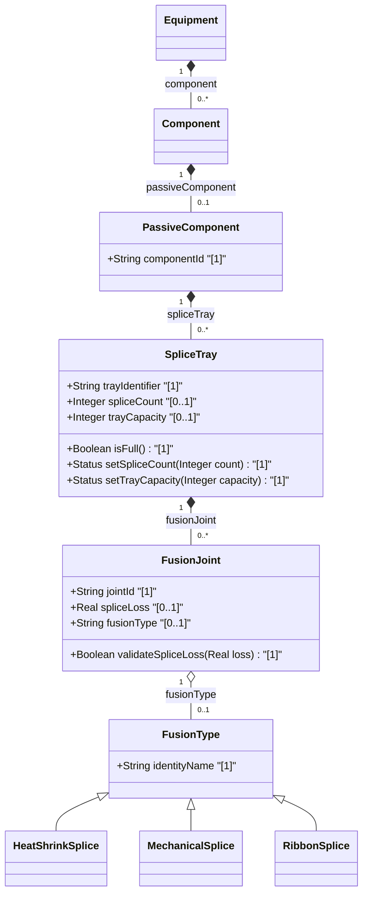

# Feature: [ietf-nwi-passive-inventory: Splice Tray & Fusion Joint Connection Augment]

## Parent Epic
- [ ] #77 - [[ietf-nwi-passive-inventory]: Passive Network Inventory Management](https://github.com/gintatkinson/3dgs-037/blob/main/docs/epics/epic-06-ietf-nwi-passive-inventory.md)

## Description
This feature specifies the `splice-tray` container augmenting passive optical components (`passive-component`) defined in the `ietf-nwi-passive-inventory` YANG module. The `splice-tray` container organizes optical fiber splice management structures, tray capacity metrics, active splice counts, and individual fusion joint connection parameters (`fusion-joint`).

The `splice-tray` container comprises the following core attributes and child lists:
1. **tray-identifier**: A mandatory string leaf providing a unique identifier for the optical splice tray within the passive component enclosure.
2. **splice-count**: An optional 16-bit unsigned integer (`uint16`) tracking the total number of active optical fiber splices housed within the tray.
3. **tray-capacity**: An optional 16-bit unsigned integer (`uint16`) specifying the maximum splice capacity of the tray (e.g. 12, 24, 48, 96, 144 splices).
4. **fusion-joint**: A list of individual optical fusion joints housed within the tray, keyed by `joint-id`. Each joint captures optical loss (`splice-loss`) and technological fusion classification (`fusion-type`).

## UML Class Diagram


## Interface Requirements

### 1. Test Data Shape
```json
{
  "ietf-nwi-passive-inventory:splice-tray": {
    "tray-identifier": "ST-FAC-01-A",
    "splice-count": 12,
    "tray-capacity": 24,
    "fusion-joint": [
      {
        "joint-id": "FJ-001",
        "splice-loss": 0.02,
        "fusion-type": "ietf-nwi-passive-inventory:heat-shrink-splice"
      },
      {
        "joint-id": "FJ-002",
        "splice-loss": 0.04,
        "fusion-type": "ietf-nwi-passive-inventory:mechanical-splice"
      }
    ]
  }
}
```

### 2. Validation & Constraints
- **tray-identifier**:
  - Type: `String` (YANG string).
  - Constraints: Mandatory key leaf (`[1]`). Length `1` to `64` characters. Pattern: alphanumeric with hyphens and underscores (`^[a-zA-Z0-9_-]+$`).
- **splice-count**:
  - Type: `Integer` (YANG `uint16`).
  - Constraints: `[0..1]`. Range `0` to `65535`. Value MUST NOT exceed `tray-capacity`.
- **tray-capacity**:
  - Type: `Integer` (YANG `uint16`).
  - Constraints: `[0..1]`. Range `1` to `65535`. Standard industry tray capacities include `12`, `24`, `48`, `96`, `144`.
- **fusion-joint**:
  - Node Type: List (`[0..*]`).
  - Key: `joint-id`.
- **joint-id**:
  - Type: `String` (YANG string).
  - Constraints: Mandatory key leaf (`[1]`). Unique identifier per fusion joint within the splice tray.
- **splice-loss**:
  - Type: `Real` (YANG `decimal64` with fraction-digits 3).
  - Constraints: `[0..1]`. Unit: `dB` (decibels). Value range `0.000` to `5.000` dB. Measured values exceeding `0.500` dB trigger attenuation warning indicators.
- **fusion-type**:
  - Type: `identityref` referencing base identity `fusion-type`.
  - Constraints: `[0..1]`. Derived identities include `heat-shrink-splice`, `mechanical-splice`, `ribbon-splice`.
- **Path Resolution**:
  - Target Path: `/nwi:equipment/nwi:component/nwi-passive:passive-component/nwi-passive:splice-tray`.

### 3. Visual Layout & Arrangement
- **CSS Modules & BEM Scoping**:
  - Component reset using `box-sizing: border-box`.
  - Scoped naming convention following BEM patterns (`.splice-tray`, `.splice-tray__header`, `.splice-tray__capacity-bar`, `.splice-tray__joint-table`).
- **Layout Containment Rules**:
  - Layout containment MUST be restricted to outer layout splitters (`properties_view` and `components_table`).
  - Strict prohibition on CSS containment parameters (`contain: content` or `contain: strict`) on scrollable child panels to preserve dynamic list virtualization and table rendering.
- **PropertyGrid & TableView Integration**:
  - Tray metadata (`tray-identifier`, `splice-count`, `tray-capacity`) rendered inside `properties_view` using PropertyGrid.
  - Fusion joint lists (`fusion-joint`) rendered in `components_table` using TableView.
  - Valid DOM nesting enforcing tree structures (table rows nested inside tbody / container elements).

### 4. Interactive Flow & States
- **Read-Only State**:
  - Displays tray header with identifier (`ST-FAC-01-A`), formatted capacity bar (`12 / 24 splices (50%)`), and TableView listing fusion joints with loss values (`0.02 dB`) and fusion type badges (`Heat Shrink`).
- **Edit State**:
  - Inline numeric steppers for `splice-count` and `tray-capacity`.
  - Joint list row editor with dropdown select for `fusion-type` (`Heat Shrink`, `Mechanical`, `Ribbon`) and decimal input for `splice-loss`.
- **Empty State**:
  - Displays `"No Splice Trays Configured"` placeholder with a primary action button to initialize a new splice tray.
- **Loading State**:
  - Animated skeleton placeholder rows inside `properties_view` and `components_table` while fetching tray data.
- **Error State**:
  - Red border highlight (`var(--color-error-border)`) and error text when `splice-count` exceeds `tray-capacity` or when `splice-loss` exceeds `5.000` dB.
  - Computed-style assertions in unit test guidelines MUST verify border highlight colors and element dimensions.

## Given-When-Then Acceptance Criteria

### Scenario 1: Valid splice count and tray capacity configuration
- **Given** a passive component enclosure with a splice tray,
- **When** an administrator sets `tray-identifier` to `"ST-FAC-01-A"`, `splice-count` to `12`, and `tray-capacity` to `24`,
- **Then** the PropertyGrid MUST accept the configuration, validate that `splice-count <= tray-capacity`, and render a 50% capacity indicator bar.

### Scenario 2: Validation failure when splice count exceeds tray capacity
- **Given** a splice tray with `tray-capacity` set to `24`,
- **When** an administrator inputs `splice-count` as `28`,
- **Then** the system MUST reject the update, highlight the input field with error border `var(--color-error-border)`, and display an inline error message: `"Splice count cannot exceed tray capacity (24)"`.

### Scenario 3: Splice loss attenuation validation for fusion joint
- **Given** a fusion joint in a splice tray,
- **When** a technician inputs measured `splice-loss` as `0.750` dB,
- **Then** the system MUST flag the joint with an optical attenuation warning badge (`splice-loss > 0.500 dB`) while retaining the recorded measurement.

### Scenario 4: Fusion type identity assignment and visual rendering
- **Given** a fusion joint entry with `joint-id` `"FJ-001"`,
- **When** `fusion-type` is assigned to `heat-shrink-splice`,
- **Then** the TableView component MUST render the corresponding fusion type badge (`"Heat Shrink"`) and serialize the fully qualified identity string in payload output.

## Specification Context (Verbatim)

```text
container splice-tray {
  description
    "Defines the optical fiber splice tray and fusion joint connection
     attributes within a passive optical component.";
  leaf tray-identifier {
    type string;
    description
      "Unique identifier for the optical splice tray within the passive component.";
  }
  leaf splice-count {
    type uint16;
    description
      "The current number of active splices contained in the tray.";
  }
  leaf tray-capacity {
    type uint16;
    description
      "The maximum splice capacity of the tray (e.g. 12, 24, 48, 96).";
  }
  list fusion-joint {
    key "joint-id";
    description
      "List of individual optical fusion joints inside the splice tray.";
    leaf joint-id {
      type string;
      description
        "Unique identifier for the fusion joint.";
    }
    leaf splice-loss {
      type decimal64 {
        fraction-digits 3;
      }
      units "dB";
      description
        "Measured optical insertion loss across the fusion joint in decibels.";
    }
    leaf fusion-type {
      type identityref {
        base fusion-type;
      }
      description
        "The technological classification of the optical fusion joint (e.g., heat-shrink, mechanical, ribbon).";
    }
  }
}
```

## Source References
Structural Schema: https://github.com/aguoietf/draft-ygb-ivy-passive-network-inventory/blob/main/yang/ietf-nwi-passive-inventory.yang (Clause: Section 5)
Normative Specification: https://datatracker.ietf.org/doc/draft-ygb-ivy-passive-network-inventory/ (Clause: Section 6.1)

## Logical UI & Layout Bindings
- **Target LUI Component:** PropertyGrid
- **Target Layout Container ID:** properties_view
- **Data Source Bindings:** /nwi:equipment/nwi:component/nwi-passive:passive-component/nwi-passive:splice-tray
