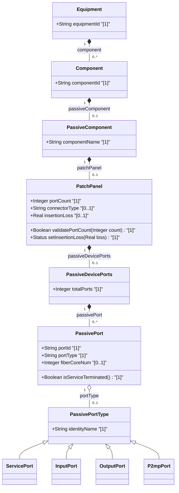

# Feature: [ietf-nwi-passive-inventory: Connector & Patch Panel Inventory Augment]

## Parent Epic
- [ ] #77 - [[ietf-nwi-passive-inventory]: Passive Network Inventory Management](https://github.com/gintatkinson/3dgs-037/blob/main/docs/epics/epic-06-ietf-nwi-passive-inventory.md)

## Description
This feature specifies the `patch-panel` structural container augmenting the `passive-component` choice branch within physical network equipment (`/nwi:equipment/nwi:component/nwi-passive:passive-component/nwi-passive:patch-panel`) defined in the `ietf-nwi-passive-inventory` YANG module. It provides full inventory tracking for optical connector interfaces, patch panel bays, insertion loss metrics, and passive port allocations.

The `patch-panel` container models optical interconnect infrastructure by capturing total port capacities, connector standards, signal attenuation properties, and individual port configurations:
1. **Patch Panel Physical Attributes**: Modeled by `port-count` (total physical ports), `connector-type` (identityref derived from `connector-type` base, such as LC, SC, FC, ST, MPO, LC-APC, or SC-APC), and `insertion-loss` (optical power loss across connections in dB).
2. **Passive Device Port Inventory**: Enclosed within `passive-device-ports`, holding a list of `passive-port` entries keyed by `port-id`. Each port specifies its functional classification via `port-type` (`identityref` to base `passive-port-type`) and total optical fiber count via `fiber-core-num`.
3. **Passive Port Identities**: Supports standard functional port roles including customer service terminations (`service-port`), ingress optical ports (`input-port`), egress optical ports (`output-port`), and point-to-multipoint optical splitter/coupler ports (`p2mp-port`).

## UML Class Diagram


## Interface Requirements

### 1. Test Data Shape
```json
{
  "ietf-nwi-passive-inventory:patch-panel": {
    "port-count": 24,
    "connector-type": "ietf-nwi-passive-inventory:lc-apc",
    "insertion-loss": 0.35,
    "passive-device-ports": {
      "passive-port": [
        {
          "port-id": "port-01",
          "port-type": "ietf-nwi-passive-inventory:service-port",
          "fiber-core-num": 2
        },
        {
          "port-id": "port-02",
          "port-type": "ietf-nwi-passive-inventory:input-port",
          "fiber-core-num": 1
        }
      ]
    }
  }
}
```

### 2. Validation & Constraints
- **patch-panel**:
  - Node Type: Container (augmented under `passive-component`).
  - Path: `/nwi:equipment/nwi:component/nwi-passive:passive-component/nwi-passive:patch-panel`.
- **port-count**:
  - Type: `uint16` (mapped to `Integer`).
  - Range: `1 .. 65535`.
  - Multiplicity: `[1]` (mandatory leaf in patch panel inventory).
- **connector-type**:
  - Type: `identityref` referencing base identity `connector-type`.
  - Multiplicity: `[0..1]`.
  - Allowed Values: Extensible connector identities including `lc`, `sc`, `fc`, `st`, `mpo`, `lc-apc`, `sc-apc`.
- **insertion-loss**:
  - Type: `decimal64` with 2 fraction digits (mapped to `Real`).
  - Range: `0.0 .. 10.0` (units: dB).
  - Multiplicity: `[0..1]`.
- **passive-device-ports**:
  - Node Type: Container enclosing `passive-port` list.
- **passive-port**:
  - Node Type: List keyed by `port-id`.
  - Multiplicity: `[0..*]`.
- **port-id**:
  - Type: `string` (1..64 characters).
  - Multiplicity: `[1]` (list key).
- **port-type**:
  - Type: `identityref` referencing base identity `passive-port-type`.
  - Multiplicity: `[1]`.
  - Allowed Values: Derived identities `service-port`, `input-port`, `output-port`, `p2mp-port`.
- **fiber-core-num**:
  - Type: `uint16` (mapped to `Integer`).
  - Range: `1 .. 144`.
  - Multiplicity: `[0..1]`.

### 3. Visual Layout & Arrangement
- **CSS Modules & BEM Scoping**:
  - Component reset using `box-sizing: border-box`.
  - Scoped naming convention following BEM patterns (`.patch-panel`, `.patch-panel__header`, `.patch-panel__port-count`, `.patch-panel__ports-table`, `.patch-panel__badge`).
- **Layout Containment Rules**:
  - Layout containment MUST be restricted to outer layout splitters (`properties_view` and `elements_view`).
  - Strict prohibition on CSS containment parameters (`contain: content` or `contain: strict`) on scrollable child panels to preserve dynamic list virtualization.
- **PropertyGrid & TableView Integration**:
  - Detailed patch panel parameters (`port-count`, `connector-type`, `insertion-loss`) rendered inside `properties_view` using a PropertyGrid component.
  - The `passive-port` list rendered as a dynamic TableView component inside `elements_view` with sortable columns for Port ID, Port Type, and Fiber Core Count.
  - Valid DOM nesting enforcing tree structures (table rows and list items nested inside parent container elements).

### 4. Interactive Flow & States
- **Read-Only State**:
  - Displays patch panel summary details in PropertyGrid and port inventory table in TableView with styled type badges (e.g. green for `service-port`, blue for `input-port`, orange for `output-port`).
- **Edit State**:
  - Form fields for `port-count`, `connector-type` dropdown selector, and `insertion-loss` numerical input with validation range checks.
- **Empty State**:
  - When `passive-device-ports` contains no ports, displays `"No Passive Ports Configured"` placeholder with an action button to initialize port records.
- **Loading State**:
  - Skeleton rows displayed in TableView during asynchronous inventory queries.
- **Error State**:
  - Red border highlight (`var(--color-error-border)`) and error text when `insertion-loss` exceeds 10.0 dB or duplicate `port-id` values are submitted.
  - Computed-style assertions in unit test guidelines MUST verify border highlight colors and table row dimensions.

## Given-When-Then Acceptance Criteria

### Scenario 1: Patch panel inventory initialization
- **Given** a physical optical equipment chassis with a installed patch panel bay,
- **When** the administrator configures a `patch-panel` container with `port-count` of `24`, `connector-type` `"lc-apc"`, and `insertion-loss` `0.35`,
- **Then** the PropertyGrid in `properties_view` MUST display the patch panel attributes and set the connector classification.

### Scenario 2: Service port classification and fiber core assignment
- **Given** a patch panel instance with active port records,
- **When** port `"port-01"` is configured with `port-type` `"service-port"` and `fiber-core-num` of `2`,
- **Then** the TableView in `elements_view` MUST render `"port-01"` with the service-port badge and display `2` terminated fiber cores.

### Scenario 3: Insertion loss boundary validation
- **Given** an administrator editing patch panel optical performance parameters,
- **When** an insertion loss value of `12.5` dB (exceeding the `10.0` dB limit) is submitted,
- **Then** the system MUST reject the update, highlight the input field with `var(--color-error-border)`, and display an out-of-range validation error.

### Scenario 4: TableView and PropertyGrid layout binding synchronization
- **Given** a selected passive patch panel component in the inventory view,
- **When** the user opens the component details view,
- **Then** the patch panel summary MUST populate `properties_view` and the passive ports list MUST render in `elements_view` using TableView.

## Specification Context (Verbatim)

```text
augment "/nwi:equipment/nwi:component/nwi-passive:passive-component" {
  description
    "Augments passive component with patch panel inventory attributes.";
  container patch-panel {
    description
      "Attributes specific to optical patch panels and interconnect bays.";
    leaf port-count {
      type uint16;
      description
        "Total number of physical optical ports on the patch panel.";
    }
    leaf connector-type {
      type identityref {
        base connector-type;
      }
      description
        "Standard optical connector interface identity (e.g., LC, SC, MPO).";
    }
    leaf insertion-loss {
      type decimal64 {
        fraction-digits 2;
        range "0.0 .. 10.0";
      }
      units "dB";
      description
        "Maximum insertion loss per connection across the patch panel in decibels.";
    }
    container passive-device-ports {
      description
        "Enclosing container for passive device port instances.";
      list passive-port {
        key "port-id";
        description
          "List of passive ports residing on the patch panel.";
        leaf port-id {
          type string;
          description
            "Unique identifier for the passive port.";
        }
        leaf port-type {
          type identityref {
            base passive-port-type;
          }
          description
            "Functional port type identity (service-port, input-port, output-port, p2mp-port).";
        }
        leaf fiber-core-num {
          type uint16;
          description
            "Number of optical fiber cores terminated or routed through this port.";
        }
      }
    }
  }
}

identity passive-port-type {
  description
    "Base identity for passive device port classifications.";
}

identity service-port {
  base passive-port-type;
  description
    "Port serving customer or network service terminations.";
}

identity input-port {
  base passive-port-type;
  description
    "Ingress optical port on a passive device or patch panel.";
}

identity output-port {
  base passive-port-type;
  description
    "Egress optical port on a passive device or patch panel.";
}

identity p2mp-port {
  base passive-port-type;
  description
    "Point-to-multipoint passive optical splitter or coupler port.";
}
```

## Source References
Structural Schema: https://github.com/aguoietf/draft-ygb-ivy-passive-network-inventory/blob/main/yang/ietf-nwi-passive-inventory.yang (Clause: Section 5 / line 200-228, 451-477)
Normative Specification: https://datatracker.ietf.org/doc/draft-ygb-ivy-passive-network-inventory/ (Clause: Section 6.1)

## Logical UI & Layout Bindings
- **Target LUI Component:** TableView
- **Target Layout Container ID:** elements_view
- **Data Source Bindings:** /nwi:equipment/nwi:component/nwi-passive:passive-component/nwi-passive:patch-panel
