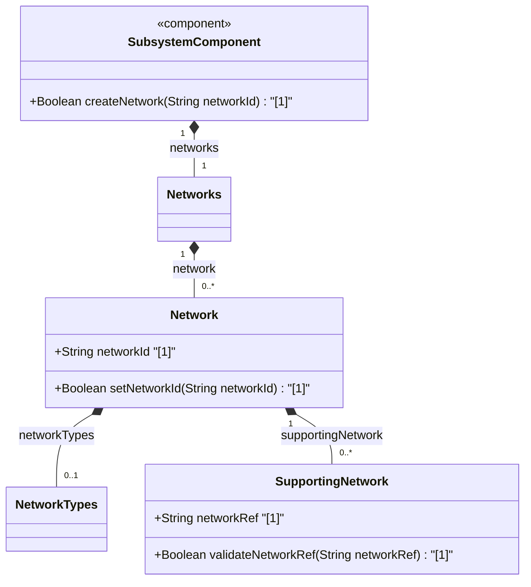

# Feature: [ietf-network: Base Networks and Network Data Model]

## Parent Epic
- [ ] #90 - [[ietf-network-and-topology]: Network and Topology Base Models](https://github.com/gintatkinson/3dgs-037/blob/main/docs/epics/epic-07-ietf-network-and-topology.md)

## Description
This feature specifies the base network data model container `networks` and its constituent list `network` defined in the `ietf-network` YANG module. It defines the foundational structural entity for representing logical or physical networks, their classifications, and layered supporting network relationships.

The `networks` container contains a list of `network` instances, each representing a distinct network graph:
1. **Network Identity (`network-id`)**: A mandatory key leaf of type `network-id` (derived from `inet:uri`) that uniquely identifies the network instance within the data store.
2. **Network Types (`network-types`)**: An extensible presence container that serves as a point of extension for specific network types (e.g., TE, L3 Unicast, L2 Topology, or Optical Transport Networks). When present, child presence containers within `network-types` declare the specific technology variant of the network.
3. **Supporting Networks (`supporting-network`)**: A list of supporting networks keyed by `network-ref`. This structure models layered network hierarchies, overlay/underlay dependencies, and virtualization abstractions where a top-level virtual or logical network maps to underlying supporting network infrastructure.

## UML Class Diagram


## Interface Requirements

### 1. Test Data Shape
```json
{
  "networks": {
    "network": [
      {
        "network-id": "urn:ietf:params:xml:ns:yang:ietf-network?net=core-nw-01",
        "network-types": {},
        "supporting-network": [
          {
            "network-ref": "urn:ietf:params:xml:ns:yang:ietf-network?net=underlay-optical-01"
          }
        ]
      }
    ]
  }
}
```

### 2. Validation & Constraints
- `network-id`: Mandatory key leaf (`type inet:uri`). Must be a non-empty, syntactically valid URI string uniquely identifying the network within the data store.
- `network-types`: Optional presence container. Must act as a structural container holding identity/presence extensions for specialized network types.
- `supporting-network`: Optional list keyed by `network-ref`. `network-ref` (`leafref`) MUST resolve to a valid existing `network-id` in `/networks/network/network-id`. Direct self-referential cycles (where a network lists itself as its own supporting network) are prohibited.

### 3. Visual Layout & Arrangement
- **Target Component:** `PropertyGrid` bound within container `properties_view`.
- **Layout & Structure:** Network inventory attributes must be organized into clear hierarchical fieldsets (Network Identifiers, Type Classifications, Layered Supporting Networks).
- **CSS & Containment:** Enforce CSS resets (`box-sizing: border-box`), scoped CSS modules/BEM class naming to avoid specificity conflicts, and restrict layout containment to outer splitter panels. For list nodes, ensure valid recursive DOM tree nesting.

### 4. Interactive Flow & States
- **Read-Only View:** Display network attributes, active type presence flags, and clickable links to supporting underlay networks.
- **Edit Mode:** Provide inline form inputs for `network-id`, toggle controls for `network-types` extensions, and multi-select/reference lookup controls for `supporting-network`.
- **Empty State:** Display clear placeholder indicator when no networks exist in the inventory.
- **Validation Error Highlighting:** Highlight missing or invalid URI `network-id` fields and flag unresolvable `supporting-network` references with error tooltips.

## Given-When-Then Acceptance Criteria

### Scenario 1: Successful Base Network Instantiation
- **Given** an empty network data store,
- **When** a new network instance is submitted with `network-id` set to `"urn:ietf:params:xml:ns:yang:ietf-network?net=packet-core-01"`,
- **Then** the system validates the URI format, creates the `network` entry under `/networks/network`, and renders the network in the `PropertyGrid` view within `properties_view`.

### Scenario 2: Network Types Presence Container Configuration
- **Given** an existing base network instance `"urn:ietf:params:xml:ns:yang:ietf-network?net=packet-core-01"`,
- **When** the `network-types` presence container is enabled on the network,
- **Then** the system registers the presence container and allows specialized network type extensions to be attached.

### Scenario 3: Layered Supporting Network Mapping
- **Given** an existing underlay network `"urn:ietf:params:xml:ns:yang:ietf-network?net=optical-underlay-01"`,
- **When** an overlay network `"urn:ietf:params:xml:ns:yang:ietf-network?net=ip-overlay-01"` is configured with a `supporting-network` entry referencing `network-ref` = `"urn:ietf:params:xml:ns:yang:ietf-network?net=optical-underlay-01"`,
- **Then** the leafref reference is successfully validated and the layered dependency relationship between overlay and underlay networks is established.

### Scenario 4: Rejection of Missing Mandatory Network ID
- **Given** a network creation request,
- **When** the request payload omits the mandatory `network-id` key leaf,
- **Then** the data store rejects the transaction with a validation failure indicating that `network-id` is a required key.

### Scenario 5: Rejection of Invalid Supporting Network Reference
- **Given** a network creation request for network `"urn:ietf:params:xml:ns:yang:ietf-network?net=overlay-02"`,
- **When** the request includes a `supporting-network` entry referencing a non-existent `network-ref` `"urn:ietf:params:xml:ns:yang:ietf-network?net=non-existent"`,
- **Then** the system rejects the configuration due to a broken leafref target constraint.

## Specification Context (Verbatim)

```text
Section 4.1. Base Network Model

The base network model is defined by the "ietf-network" YANG module. It defines networks and their components at a high level of abstraction.

The data model for a network is represented by a container "networks" holding a list of "network" entries. Each network is identified by a "network-id".

A network can contain:
- network-types: This container acts as an extension point for specific types of networks. Presence of specific containers inside network-types indicates that the network is of that specific type.
- supporting-network: A network can be supported by one or more other networks (underlay networks). A supporting network is identified by its network-ref.

YANG Module ietf-network@2018-02-26.yang:

container networks {
  description
    "Serves as top-level container for a list of networks.";
  list network {
    key "network-id";
    description
      "Describes a network.
       A network instance is provided by an administrative domain.";
    leaf network-id {
      type network-id;
      description
        "Identifies a network.";
    }
    container network-types {
      description
        "Serves as an extension point for new network types.";
    }
    list supporting-network {
      key "network-ref";
      description
        "An underlay network, used to represent network topologies
         composing the network.";
      leaf network-ref {
        type leafref {
          path "/networks/network/network-id";
          require-instance false;
        }
        description
          "References the underlay network.";
      }
    }
  }
}
```

## User Stories
- [ ] #91 - [ietf-network: Base Network Instance Onboarding, Network-ID String Syntax Checking, and Supporting Network Multi-Layer Overlay Hierarchy Resolution](https://github.com/gintatkinson/3dgs-037/blob/main/docs/user-stories/us-32-network-instance-lifecycle.md)

## Source References
Structural Schema: https://github.com/YangModels/yang/blob/main/standard/ietf/RFC/ietf-network%402018-02-26.yang (Clause: Section 4.1)
Normative Specification: https://datatracker.ietf.org/doc/rfc8345/ (Clause: Section 4.1)

## Logical UI & Layout Bindings
- **Target LUI Component:** PropertyGrid
- **Target Layout Container ID:** properties_view
- **Data Source Bindings:** /nw:networks/nw:network
