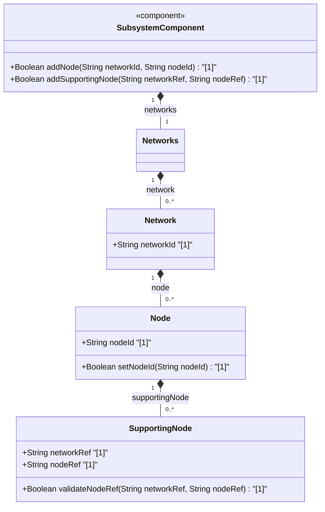

# Feature: [ietf-network: Node Data Model and Supporting Nodes]

## Parent Epic
- [ ] #90 - [[ietf-network-and-topology]: Network and Topology Base Models](https://github.com/gintatkinson/3dgs-037/blob/main/docs/epics/epic-07-ietf-network-and-topology.md)

## Description
This feature specifies the Node Data Model defined by the `ietf-network` YANG module (RFC-8345 Section 4.2). It models topological nodes contained within a network. Each node represents a network device or logical entity identified uniquely by `node-id` within its containing network. A node can be supported by lower-layer underlay nodes via `supporting-node` references.

## UML Class Diagram


## Interface Requirements

### 1. Test Data Shape
```json
{
  "node": [
    {
      "node-id": "node-101",
      "supporting-node": [
        {
          "network-ref": "underlay-nw-01",
          "node-ref": "physical-router-01"
        }
      ]
    }
  ]
}
```

### 2. Validation & Constraints
- **node-id**: Mandatory key string identifying the node uniquely within the containing network.
- **supporting-node / network-ref**: Mandatory key leafref pointing to `/nw:networks/nw:network/nw:network-id` of a supporting underlay network (`require-instance false`).
- **supporting-node / node-ref**: Mandatory key leafref pointing to `/nw:networks/nw:network[nw:network-id=current()/../network-ref]/nw:node/nw:node-id` of a supporting underlay node (`require-instance false`).

### 3. Visual Layout & Arrangement
- **Component Mapping**: Rendered in tabular format (`TableView`) within layout container `elements_view`.
- **Layout Reset & Scoping**: Implements CSS box-sizing resets (`box-sizing: border-box`) and scoped class names (`.node-table-view`, `.node-table-row`) to prevent style leaks.
- **Layout Containment**: Restricts layout containment to outer splitter panes; scrollable table view container avoids CSS layout containment flags that disrupt scroll geometry.
- **DOM Hierarchy**: Semantic HTML `<table>` or structured grid (`<div role="grid">`) with clear row definitions representing each `node` element, nested expandable detail sub-rows for `supporting-node` lists.

### 4. Interactive Flow & States
- **Read-Only Mode**: Displays the network node list with node IDs and associated supporting node counts.
- **Active / Selection State**: Selecting a node row highlights the row and displays supporting node details.
- **Empty State**: Displays an informational message when no nodes exist in the selected network topology.
- **Error Highlighting**: Invalid or broken leafref references (e.g. unresolvable supporting-node references) are highlighted with error badges and tooltips. Computed-style assertions verify border color and background highlight during error states.

## Given-When-Then Acceptance Criteria

### Scenario 1: Successful Validation of Network Node Data Model
- **Given** a network instance with ID `overlay-nw-1`
- **When** a new node entry is added with `node-id` = `"router-alpha"`
- **Then** the node configuration is successfully validated and stored under `/nw:networks/nw:network[network-id='overlay-nw-1']/nw:node[node-id='router-alpha']`.

### Scenario 2: Validation of Supporting Node Underlay References
- **Given** an existing node `"router-alpha"` in overlay network `"overlay-nw-1"`
- **When** a supporting-node entry is added with `network-ref` = `"underlay-nw-01"` and `node-ref` = `"phys-switch-01"`
- **Then** the supporting node reference is accepted and associated with `"router-alpha"`.

### Scenario 3: Rendering Node Information in TableView Component
- **Given** a TableView component bound to `/nw:networks/nw:network/nw:node` in container `elements_view`
- **When** network topology data containing nodes is loaded
- **Then** each node is displayed with columns for `node-id` and supporting node counts.

## Specification Context (Verbatim)

### RFC-8345 Section 4.2: Node Data Model
> The node data model is defined by the "ietf-network" YANG module.
> A node is identified by a node-id, which is unique within the containing network.
> A node can be supported by lower-layer nodes. A supporting node is defined by a network-ref (which refers to the supporting network) and a node-ref (which refers to the supporting node in that network).

### ietf-network@2018-02-26.yang (node container definition)
> list node {
>   key "node-id";
>   description
>     "The nodes that the network contains.";
>   leaf node-id {
>     type node-id;
>     description
>       "The identifier of a node in the container network.";
>   }
>   list supporting-node {
>     key "network-ref node-ref";
>     description
>       "Identifies the node, or nodes, that support this node.";
>     leaf network-ref {
>       type leafref {
>         path "/nw:networks/nw:network/nw:network-id";
>         require-instance false;
>       }
>       description
>         "This leaf identifies the network that supports the node.";
>     }
>     leaf node-ref {
>       type leafref {
>         path "/nw:networks/nw:network[nw:network-id=current()/../network-ref]/nw:node/nw:node-id";
>         require-instance false;
>       }
>       description
>         "This leaf identifies the node that supports the node.";
>     }
>   }
> }

## User Stories
- [ ] #92 - [ietf-network: Abstract and Physical Node Creation, Node-ID Uniqueness Verification, and Underlay Supporting Node Traversal](https://github.com/gintatkinson/3dgs-037/blob/main/docs/user-stories/us-33-node-creation-and-supporting-node-mapping.md)

## Source References
Structural Schema: https://github.com/YangModels/yang/blob/main/standard/ietf/RFC/ietf-network%402018-02-26.yang (Clause: Section 4.2)
Normative Specification: https://datatracker.ietf.org/doc/rfc8345/ (Clause: Section 4.2)

## Logical UI & Layout Bindings
- **Target LUI Component:** TableView
- **Target Layout Container ID:** elements_view
- **Data Source Bindings:** /nw:networks/nw:network/nw:node
