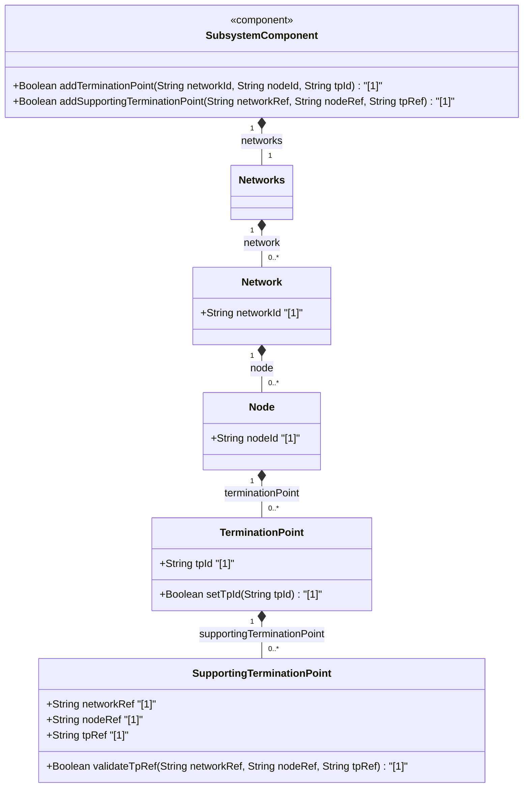

# Feature: [ietf-network-topology: Termination Point Data Model]

## Parent Epic
- [ ] #90 - [[ietf-network-and-topology]: Network and Topology Base Models](https://github.com/gintatkinson/3dgs-037/blob/main/docs/epics/epic-07-ietf-network-and-topology.md)

## Description
This feature specifies the data model for termination points within the `ietf-network-topology` YANG module. A termination point terminates a network link on a node and can ultimately map to a physical port or logical interface. It includes support for identifying underlay supporting termination points, enabling multi-layer network mapping and cross-layer topology dependencies.

## UML Class Diagram


## Interface Requirements

### 1. Test Data Shape
```json
{
  "tp-id": "urn:ietf:params:xml:ns:yang:ietf-network-topology?tp=tp-1",
  "supporting-termination-point": [
    {
      "network-ref": "underlay-network-01",
      "node-ref": "underlay-node-01",
      "tp-ref": "urn:ietf:params:xml:ns:yang:ietf-network-topology?tp=tp-eth0"
    }
  ]
}
```

### 2. Validation & Constraints
- **`tp-id`**: Mandatory key leaf of type `inet:uri` (`String`). Uniquely identifies a termination point within the enclosing node.
- **`supporting-termination-point`**: Optional list element with compound key `(network-ref, node-ref, tp-ref)`. Identifies underlay termination points on which this termination point depends.
- **`network-ref`**: Leafref pointing to `/nw:networks/nw:network/nw:node/nw:supporting-node/nw:network-ref` (`require-instance false`). Identifies the underlay network topology.
- **`node-ref`**: Leafref pointing to `/nw:networks/nw:network/nw:node/nw:supporting-node/nw:node-ref` (`require-instance false`). Identifies the supporting underlay node.
- **`tp-ref`**: Leafref pointing to `/nw:networks/nw:network[nw:network-id=current()/../network-ref]/nw:node[nw:node-id=current()/../node-ref]/nt:termination-point/nt:tp-id` (`require-instance false`). Identifies the specific underlay termination point.

### 3. Visual Layout & Arrangement
- **Component Binding**: Rendered as a tabular dataset in a `TableView` component.
- **Container ID**: Placed inside layout container `elements_view`.
- **Styling Scoping**: Scoped via CSS modules (`.terminationPointTableView`) with universal `box-sizing: border-box` resets.
- **Layout Containment**: Containment restricted to outer layout splitters; forbidden on scrollable viewport panels.
- **DOM Hierarchy**: Rendered using standard semantic HTML table structures (`table > thead / tbody > tr > td`).

### 4. Interactive Flow & States
- **Read-Only State**: Supporting termination point linkages are system-provided/inferred from link dependencies and displayed in read-only format.
- **Selection State**: Active row selection highlights termination point details and reveals parent node association.
- **Error State**: Non-resolvable `tp-ref` or missing key leaves trigger visual error highlighting and validation diagnostics.

## Given-When-Then Acceptance Criteria

### Scenario 1: Termination Point Instantiation with Valid Identifiers
- **Given** an existing node within a network topology datastore
- **When** a new `termination-point` is created with `tp-id` set to `"urn:ietf:params:xml:ns:yang:ietf-network-topology?tp=tp-1"`
- **Then** the system MUST persist the termination point under the target node and expose it in the `elements_view` TableView widget.

### Scenario 2: Supporting Termination Point Dependency Mapping
- **Given** an active termination point `tp-1` on node `node-01` in overlay network `overlay-net`
- **When** a `supporting-termination-point` entry is added with `network-ref` set to `"underlay-net"`, `node-ref` set to `"underlay-node"`, and `tp-ref` set to `"urn:ietf:params:xml:ns:yang:ietf-network-topology?tp=eth-0"`
- **Then** the system MUST validate the leafref paths and bind the overlay termination point to the specified underlay termination point.

### Scenario 3: Missing Mandatory Key Rejection
- **Given** a request to create a `termination-point` entry
- **When** the payload is missing the mandatory `tp-id` key leaf
- **Then** the system MUST reject the creation request with a schema validation error.

## Specification Context (Verbatim)

> **Normative Specification Section 4.4 - Termination Points:**
> "A termination point can terminate a link. Depending on the type of topology, a termination point could, for example, refer to a port or an interface."
>
> **ietf-network-topology@2018-02-26.yang:**
> ```yang
> typedef tp-id {
>   type inet:uri;
>   description
>     "An identifier for termination points on a node. The precise
>      structure of the tp-id will be up to the implementation.
>      The identifier SHOULD be chosen such that the same termination
>      point in a real network topology will always be identified
>      through the same identifier, even if the data model is
>      instantiated in separate datastores.";
> }
>
> augment "/nw:networks/nw:network/nw:node" {
>   description
>     "Augments termination points that terminate links.
>      Termination points can ultimately be mapped to interfaces.";
>   list termination-point {
>     key "tp-id";
>     description
>       "A termination point can terminate a link.
>        Depending on the type of topology, a termination point
>        could, for example, refer to a port or an interface.";
>     leaf tp-id {
>       type tp-id;
>     }
>     list supporting-termination-point {
>       key "network-ref node-ref tp-ref";
>       description
>         "This list identifies any termination points on which a
>          given termination point depends or onto which it maps.";
>       leaf network-ref {
>         type leafref {
>           path "../../../nw:supporting-node/nw:network-ref";
>           require-instance false;
>         }
>       }
>       leaf node-ref {
>         type leafref {
>           path "../../../nw:supporting-node/nw:node-ref";
>           require-instance false;
>         }
>       }
>       leaf tp-ref {
>         type leafref {
>           path "/nw:networks/nw:network[nw:network-id=current()/" +
>             "../network-ref]/nw:node[nw:node-id=current()/../" +
>             "node-ref]/termination-point/tp-id";
>           require-instance false;
>         }
>       }
>     }
>   }
> }
> ```

## User Stories
- [ ] #93 - [ietf-network-topology: Directional Termination Point Provisioning, TP-ID Alignment, and Supporting Termination Point Cross-Layer Resolution](https://github.com/gintatkinson/3dgs-037/blob/main/docs/user-stories/us-34-termination-point-binding.md)

## Source References
Structural Schema: https://github.com/YangModels/yang/blob/main/standard/ietf/RFC/ietf-network-topology%402018-02-26.yang (Clause: Section 4.4)
Normative Specification: https://datatracker.ietf.org/doc/rfc8345/ (Clause: Section 4.4)

## Logical UI & Layout Bindings
- **Target LUI Component:** TableView
- **Target Layout Container ID:** elements_view
- **Data Source Bindings:** /nw:networks/nw:network/nw:node/nt:termination-point
